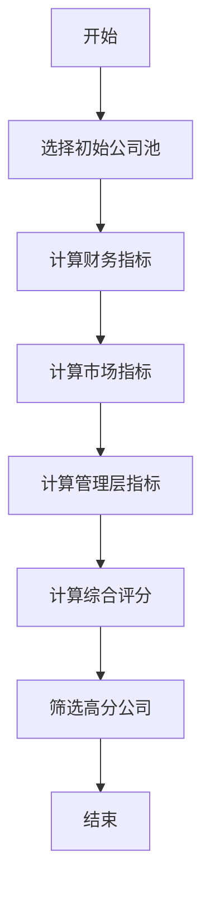
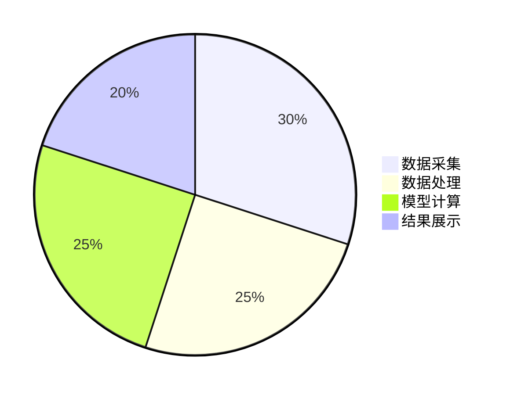

                 


# 费雪的创新型公司识别方法

> 关键词：费雪投资方法，创新型公司，财务指标分析，市场指标分析，管理层评估，数学模型，系统架构设计

> 摘要：本文详细介绍了费雪识别创新型公司的方法，从核心概念、核心指标到算法原理、系统架构设计和项目实战，全面解析了如何有效识别创新型公司。通过实际案例和数学模型，深入剖析了费雪方法的应用和实现。

---

## 第一部分：费雪投资方法的背景与核心概念

### 第1章：费雪投资方法的背景与发展

#### 1.1 费雪投资方法的起源
- 费雪投资方法的起源与发展
- 费雪方法在现代投资中的应用

#### 1.2 创新型公司的定义与特征
- 创新型公司的定义
- 创新型公司的核心特征
- 创新型公司与传统公司的对比

#### 1.3 费雪方法的核心概念与联系
- 费雪方法的核心思想
- 费雪方法的实体关系图（ER图）

### 第2章：费雪创新型公司识别的核心指标

#### 2.1 财务指标分析
- 营业利润率
- 净利润率
- 资产回报率
- 负债与资本结构

#### 2.2 市场指标分析
- 市场增长率
- 市场份额
- 行业地位

#### 2.3 管理层评估
- 管理层能力
- 管理层诚信
- 管理层战略

#### 2.4 核心竞争力分析
- 技术创新
- 品牌优势
- 成本优势

### 第3章：费雪创新型公司识别的算法原理

#### 3.1 费雪筛选模型
- 多因子筛选模型
- 加权评分系统

#### 3.2 费雪模型的数学公式
- 综合评分公式
$$ \text{综合评分} = \sum (\text{指标权重} \times \text{指标得分}) $$

#### 3.3 算法流程图


### 第4章：费雪创新型公司识别的系统架构设计

#### 4.1 系统功能设计
- 数据采集模块
- 数据处理模块
- 模型计算模块
- 结果展示模块

#### 4.2 系统架构图


#### 4.3 系统接口设计
- 数据接口
- 计算接口
- 展示接口

#### 4.4 系统交互流程图
```mermaid
sequenceDiagram
    participant 用户
    participant 数据采集模块
    participant 数据处理模块
    par

---

## 第二部分：项目实战与最佳实践

### 第5章：项目实战

#### 5.1 环境安装与数据收集
- 数据源选择
- 数据预处理
- 数据清洗

#### 5.2 特征工程
- 特征选择
- 特征转换
- 特征标准化

#### 5.3 模型实现
- 代码实现
- 模型训练
- 模型调优

#### 5.4 结果分析
- 可视化分析
- 结果解读
- 案例分析

### 第6章：最佳实践

#### 6.1 小结
- 费雪方法的核心要点
- 实战中的关键经验

#### 6.2 注意事项
- 数据质量的重要性
- 模型选择的合理性
- 实施中的常见问题

#### 6.3 拓展阅读
- 相关书籍推荐
- 进一步学习资源

---

## 作者：AI天才研究院/AI Genius Institute & 禅与计算机程序设计艺术 /Zen And The Art of Computer Programming

---

以上是《费雪的创新型公司识别方法》的详细目录大纲，涵盖了从理论到实践的各个方面，确保读者能够全面理解和掌握费雪的方法。

