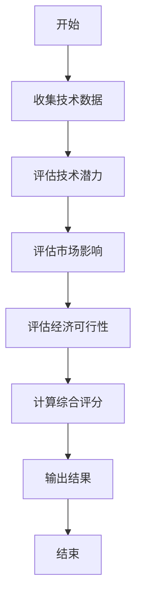
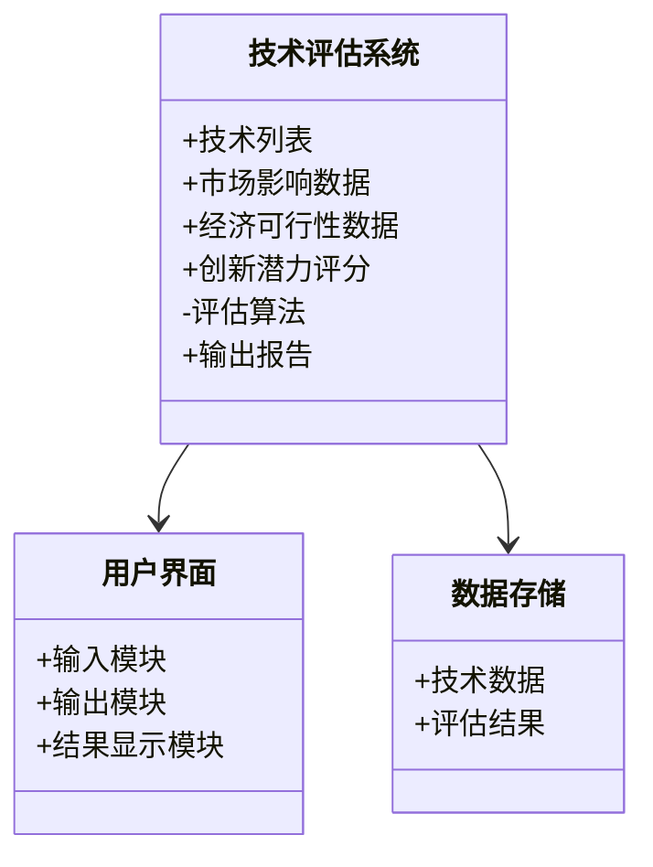
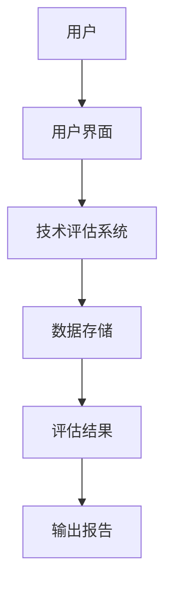

                 


# 费雪的创新评估体系：应对颠覆性技术的影响

---

## 关键词：
- 费雪创新评估体系
- 颠覆性技术
- 技术评估
- 创新潜力
- 系统架构

---

## 摘要：
本文探讨了费雪创新评估体系在应对颠覆性技术影响中的应用。通过分析创新评估的核心概念、算法原理、系统架构和实际案例，展示了如何利用费雪体系识别和评估颠覆性技术，从而为企业制定有效的创新策略提供支持。文章结合理论与实践，详细阐述了体系的数学模型、流程图和项目实战，帮助读者全面理解和应用这一创新方法。

---

## 第1章: 费雪创新评估体系的背景与问题背景

### 1.1 费雪创新评估体系的背景
#### 1.1.1 创新评估的定义与重要性
创新评估是指对新技术或创新方案的潜力、可行性和市场影响进行系统性分析的过程。它是企业制定创新战略和应对技术变革的重要工具。

#### 1.1.2 费雪创新评估体系的提出背景
随着技术的快速发展，颠覆性技术（如人工智能、区块链、5G等）对企业的影响日益显著。传统评估方法往往忽视了这些技术的潜在颠覆性，导致企业在技术选择和投资上面临风险。

#### 1.1.3 颠覆性技术对企业的影响
颠覆性技术能够彻底改变行业格局，重构商业模式。例如，人工智能的崛起可能颠覆传统的人力密集型行业，而区块链技术则可能改变金融系统的运行方式。

### 1.2 创新评估的核心问题
#### 1.2.1 颠覆性技术的定义与特征
颠覆性技术是指能够从根本上改变现有市场或行业规则的技术。其特征包括：低成本、高效率、替代性强等。

#### 1.2.2 传统创新评估方法的局限性
传统评估方法通常基于技术和经济指标，难以全面评估颠覆性技术的潜在影响。例如，某些技术在短期内看似可行，但长期来看可能不具备可持续性。

#### 1.2.3 费雪创新评估体系的目标与意义
费雪创新评估体系的目标是通过综合分析技术的潜力、市场影响和可行性，帮助企业识别和应对颠覆性技术的挑战。其意义在于提供一种系统化的评估方法，帮助企业制定更具前瞻性的创新策略。

---

## 第2章: 费雪创新评估体系的核心概念与联系

### 2.1 费雪创新评估体系的核心概念
#### 2.1.1 创新评估的维度与指标
- **技术潜力**：技术的创新性和可行性。
- **市场影响**：技术对市场的潜在影响。
- **经济可行性**：技术的经济成本和收益。

#### 2.1.2 颠覆性技术的识别与分类
- **潜在颠覆性技术**：可能对现有市场产生重大影响的技术。
- **实际颠覆性技术**：已经对企业或行业产生重大影响的技术。

#### 2.1.3 创新潜力与市场影响的关系
创新潜力高的技术通常具有较大的市场影响，但并非所有高潜力技术都能成功。

### 2.2 核心概念的联系与对比
#### 2.2.1 创新评估维度的对比分析

| 创新维度   | 技术潜力 | 市场影响 | 经济可行性 |
|------------|----------|----------|------------|
| 评分标准   | 1-5分    | 1-5分    | 1-5分      |

#### 2.2.2 颠覆性技术与传统技术的对比

| 技术类型     | 颠覆性技术 | 传统技术 |
|--------------|------------|----------|
| 影响程度     | 高         | 低       |
| 变现能力     | 高         | 中       |
| 技术门槛     | 高         | 中       |

#### 2.2.3 费雪评估体系与传统评估方法的对比

| 评估方法     | 费雪评估体系 | 传统评估方法 |
|--------------|--------------|--------------|
| 评估维度     | 技术潜力、市场影响、经济可行性 | 技术可行性、经济成本 |
| 评估结果     | 综合评分 | 单项评分 |

---

## 第3章: 费雪创新评估体系的算法原理

### 3.1 创新评估的数学模型
费雪创新评估体系的核心是通过加权评分的方式，对技术的潜力、市场影响和经济可行性进行综合评估。其数学模型如下：

$$ 创新潜力 = w_t \cdot t + w_m \cdot m + w_e \cdot e $$

其中：
- $w_t$、$w_m$、$w_e$ 是技术潜力、市场影响和经济可行性三个维度的权重。
- $t$、$m$、$e$ 是各维度的评分（1-5分）。

#### 3.1.1 评分模型的实现
以下是评分模型的Python代码示例：

```python
def fisher_innovation_score(tech_potential, market_impact, economic_feasibility):
    # 权重系数，可根据实际情况调整
    weight_t = 0.4
    weight_m = 0.3
    weight_e = 0.3

    # 计算创新潜力
    score = weight_t * tech_potential + weight_m * market_impact + weight_e * economic_feasibility
    return score

# 示例数据
tech_potential = 4  # 技术潜力评分
market_impact = 3    # 市场影响评分
economic_feasibility = 5  # 经济可行性评分

score = fisher_innovation_score(tech_potential, market_impact, economic_feasibility)
print(f"创新潜力评分：{score}")
```

#### 3.1.2 算法流程图



---

## 第4章: 费雪创新评估体系的系统分析与架构设计

### 4.1 系统功能设计
#### 4.1.1 领域模型类图



### 4.2 系统架构设计
#### 4.2.1 系统架构图



---

## 第5章: 费雪创新评估体系的项目实战

### 5.1 环境安装与依赖管理
#### 5.1.1 安装Python环境
使用Python 3.8及以上版本。

#### 5.1.2 安装依赖库
```bash
pip install numpy pandas matplotlib
```

### 5.2 核心代码实现
#### 5.2.1 创新评估函数

```python
import numpy as np
import pandas as pd

def fisher_innovation_assessment(tech_potential, market_impact, economic_feasibility):
    # 定义权重系数
    weight_t = 0.4
    weight_m = 0.3
    weight_e = 0.3

    # 计算创新潜力
    innovation_score = weight_t * tech_potential + weight_m * market_impact + weight_e * economic_feasibility
    return innovation_score

# 示例数据
tech_potential = [4, 5, 3]
market_impact = [3, 4, 2]
economic_feasibility = [5, 4, 5]

# 计算创新潜力
scores = []
for i in range(len(tech_potential)):
    scores.append(fisher_innovation_assessment(tech_potential[i], market_impact[i], economic_feasibility[i]))

# 输出结果
print("创新潜力评分：", scores)
```

### 5.3 案例分析
假设某企业正在评估一项人工智能技术的创新潜力：

- 技术潜力：5（高）
- 市场影响：4（较高）
- 经济可行性：3（中等）

创新潜力评分：
$$ 创新潜力 = 0.4 \times 5 + 0.3 \times 4 + 0.3 \times 3 = 2 + 1.2 + 0.9 = 4.1 $$

评分结果为4.1，表明该技术具有较高的创新潜力。

---

## 第6章: 费雪创新评估体系的最佳实践与小结

### 6.1 最佳实践
1. **数据准确性**：确保输入数据的准确性和完整性。
2. **权重调整**：根据实际需求调整各维度的权重。
3. **定期更新**：根据市场变化和技术发展，定期更新评估模型。

### 6.2 小结
费雪创新评估体系通过综合分析技术的潜力、市场影响和经济可行性，为企业提供了应对颠覆性技术的有效工具。通过系统化的评估方法，帮助企业制定更具前瞻性的创新策略。

---

## 第7章: 注意事项与拓展阅读

### 7.1 注意事项
- 创新评估需要结合实际情况，避免过于理论化。
- 数据收集和分析是评估的关键，需谨慎处理。

### 7.2 拓展阅读
- 《创新者的窘境》——颠覆性技术的经典研究。
- 《技术评估方法论》——系统化的技术评估框架。

---

## 作者：AI天才研究院 & 禅与计算机程序设计艺术

---

通过以上结构和内容，文章详细阐述了费雪创新评估体系的背景、核心概念、算法原理、系统设计和实际应用，帮助读者全面理解和应用这一创新评估方法。

