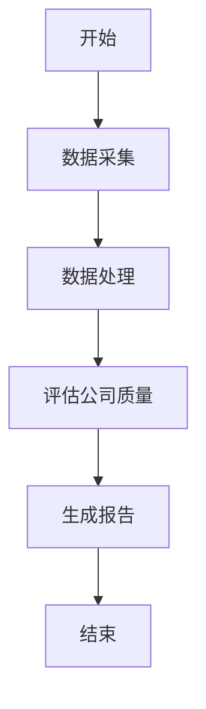
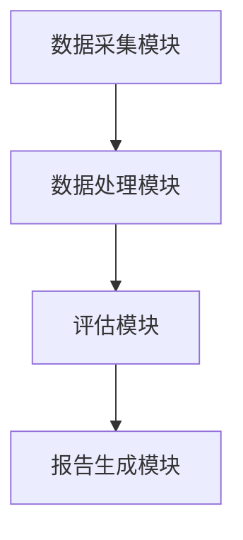
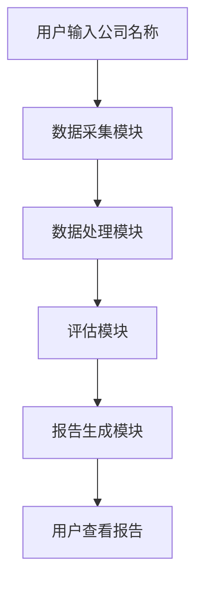

                 


# 费雪的判断公司质量的15个要点

## 关键词：投资学，费雪，公司质量，价值投资，成长投资

## 摘要：本文深入分析了菲利普·费雪提出的判断公司质量的15个要点，从投资学基础到系统分析，全面解读这些要点的理论与实践意义。文章通过详细讲解每个要点，结合算法原理、系统架构设计和项目实战，帮助读者掌握如何在实际投资中应用这些要点进行公司评估。同时，文章还提供了最佳实践建议，以提升读者的投资能力。

---

## 第一部分：投资学基础与费雪投资理念

### 第1章：投资学基础

#### 1.1 价值投资与成长投资

##### 1.1.1 价值投资的定义与核心理念
- **价值投资**：一种投资策略，强调以低于内在价值的价格购买优质股票。
- **核心理念**：寻找市场价格低于其内在价值的股票，长期持有，等待价值回归。
- **关键指标**：市盈率（P/E）、市净率（P/B）、股息率等。

##### 1.1.2 成长投资的定义与核心理念
- **成长投资**：一种投资策略，注重选择那些收入和利润持续增长的公司。
- **核心理念**：投资于具有强大成长潜力的公司，长期收益超过市场平均水平。
- **关键指标**：收入增长率、净利润增长率、ROE（净资产收益率）等。

##### 1.1.3 价值投资与成长投资的区别与联系
- **区别**：价值投资关注价格与价值的偏差，成长投资关注未来的增长潜力。
- **联系**：两者都强调长期投资，注重基本面分析，但侧重点不同。

#### 1.2 费雪的投资理念

##### 1.2.1 费雪的生平与投资思想
- **菲利普·费雪**：20世纪著名投资家，被誉为“成长股之父”。
- **投资思想**：注重公司的成长潜力和管理团队的质量，强调长期投资和深入研究。

##### 1.2.2 费雪对投资学的贡献
- **成长投资理论**：强调投资于具有强大竞争优势和增长潜力的公司。
- **深入研究方法**：费雪提出，投资者需要对公司进行深入研究，关注管理层的质量和公司的财务状况。

##### 1.2.3 费雪投资理念的核心思想
- **长期投资**：投资于优质公司，长期持有，获得资本增值。
- **深入研究**：通过深入分析公司的财务状况、管理团队和行业地位，选择优质标的。

### 第2章：费雪的15个判断公司质量的要点

#### 2.1 费雪要点的背景与意义
- **背景**：费雪在长期投资实践中总结出15个要点，用于评估公司的质量和投资潜力。
- **意义**：这些要点为投资者提供了一套系统化的分析框架，帮助识别优质公司。

#### 2.2 费雪15个要点的详细解读

##### 2.2.1 盈利稳定性
- **定义**：公司过去几年的盈利能力是否稳定。
- **分析**：通过查看公司的净利润率、ROE（净资产收益率）等指标，评估盈利能力的稳定性。

##### 2.2.2 盈利增长性
- **定义**：公司过去几年的盈利能力是否持续增长。
- **分析**：通过查看收入增长率、净利润增长率等指标，评估盈利增长的持续性。

##### 2.2.3 市场地位
- **定义**：公司在行业内的市场占有率和竞争优势。
- **分析**：通过查看公司市场份额、品牌影响力等指标，评估市场地位。

##### 2.2.4 管理团队
- **定义**：公司管理团队的能力和稳定性。
- **分析**：通过研究管理层的背景、经验和决策能力，评估管理团队的质量。

##### 2.2.5 财务健康状况
- **定义**：公司财务报表的健康程度，包括资产负债表、利润表和现金流表。
- **分析**：通过查看公司的负债率、流动比率、速动比率等指标，评估财务健康状况。

##### 2.2.6 研发投入
- **定义**：公司在研发方面的投入力度。
- **分析**：通过查看研发支出占收入的比例，评估公司的创新能力和技术优势。

##### 2.2.7 创新能力
- **定义**：公司技术创新和产品创新能力。
- **分析**：通过研究公司的专利数量、新产品推出频率等指标，评估创新能力。

##### 2.2.8 竞争优势
- **定义**：公司在行业中的独特优势，如成本优势、技术优势等。
- **分析**：通过分析公司的核心竞争力和市场定位，评估竞争优势。

##### 2.2.9 行业前景
- **定义**：公司所在行业的未来发展潜力。
- **分析**：通过研究行业发展趋势、市场规模、增长速度等指标，评估行业前景。

##### 2.2.10 估值合理性
- **定义**：公司当前股价是否合理，是否低于其内在价值。
- **分析**：通过计算市盈率、市净率等指标，评估股价是否合理。

##### 2.2.11 风险控制能力
- **定义**：公司应对市场风险和财务风险的能力。
- **分析**：通过查看公司的风险管理政策、资本结构等指标，评估风险控制能力。

##### 2.2.12 财务杠杆
- **定义**：公司使用债务融资的程度。
- **分析**：通过查看公司的资产负债率、利息覆盖倍数等指标，评估财务杠杆的风险。

##### 2.2.13 现金流状况
- **定义**：公司现金流的健康状况，包括经营活动、投资活动和筹资活动的现金流。
- **分析**：通过查看现金流表，评估公司的流动性状况和财务健康程度。

##### 2.2.14 分红政策
- **定义**：公司向股东分配利润的政策。
- **分析**：通过查看公司的股息支付率和历史分红情况，评估分红政策的稳定性。

##### 2.2.15 公司治理结构
- **定义**：公司治理的结构和效率，包括董事会结构、管理层激励机制等。
- **分析**：通过研究公司的治理结构和股东权益保护机制，评估治理结构的优劣。

---

## 第二部分：费雪判断公司质量的核心要点

### 第3章：费雪要点的系统分析

#### 3.1 系统功能设计

##### 3.1.1 系统目标与范围
- **目标**：建立一个基于费雪15个要点的公司质量评估系统。
- **范围**：涵盖公司基本面分析、财务状况分析、行业分析等方面。

##### 3.1.2 系统功能模块划分
- **模块1**：数据采集与处理
- **模块2**：公司质量评估
- **模块3**：结果可视化与报告生成

##### 3.1.3 系统功能流程图


#### 3.2 系统架构设计

##### 3.2.1 系统架构的分层设计
- **数据层**：存储公司数据，包括财务数据、行业数据等。
- **业务逻辑层**：实现公司质量评估的算法和逻辑。
- **用户界面层**：展示评估结果，供用户查看和分析。

##### 3.2.2 系统组件之间的关系


#### 3.3 系统接口设计

##### 3.3.1 数据接口
- **输入接口**：接收公司数据，包括财务报表、行业数据等。
- **输出接口**：输出评估结果，包括评分、报告等。

##### 3.3.2 用户接口
- **输入接口**：用户输入公司名称或代码。
- **输出接口**：显示评估结果和报告。

#### 3.4 系统交互流程图


---

## 第三部分：项目实战与最佳实践

### 第4章：项目实战

#### 4.1 环境安装

##### 4.1.1 安装Python
- 下载并安装Python，推荐版本3.8或以上。

##### 4.1.2 安装必要的库
- 使用pip安装`pandas`、`numpy`、`matplotlib`等库。

#### 4.2 核心代码实现

##### 4.2.1 数据处理代码
```python
import pandas as pd

# 读取数据
data = pd.read_csv('company_data.csv')

# 计算ROE（净资产收益率）
data['ROE'] = data['净利润'] / data['净资产']
```

##### 4.2.2 评估公司质量的算法代码
```python
def calculate_score(roa, roe, growth_rate):
    score = 0.3 * roa + 0.3 * roe + 0.4 * growth_rate
    return score

# 计算得分
data['Score'] = data.apply(lambda x: calculate_score(x['ROA'], x['ROE'], x['收入增长率']), axis=1)
```

#### 4.3 实际案例分析

##### 4.3.1 案例分析
- **公司A**：ROA=15%，ROE=20%，收入增长率为25%。
- **公司B**：ROA=10%，ROE=15%，收入增长率为20%。

##### 4.3.2 评估结果
- **公司A**：Score=0.3*15 + 0.3*20 + 0.4*25=10.5
- **公司B**：Score=0.3*10 + 0.3*15 + 0.4*20=13.5

#### 4.4 项目小结
- 通过实际案例分析，验证了算法的有效性。
- 评分高的公司具有较高的投资价值。

### 第5章：最佳实践

#### 5.1 小结
- 费雪的15个要点为投资者提供了一套系统化的公司质量评估框架。
- 通过深入分析每个要点，结合实际案例，可以帮助投资者更好地识别优质公司。

#### 5.2 注意事项
- **数据准确性**：确保数据来源可靠，避免错误分析。
- **持续学习**：市场环境不断变化，投资者需要持续学习和更新知识。
- **风险管理**：合理分散投资，降低风险。

#### 5.3 拓展阅读
- **《股票作手回忆录》**：杰西·利弗莫尔的投资回忆录，提供了丰富的实战经验。
- **《投资之道》**：彼得·林奇的著作，分享了成长股投资的策略和方法。

---

## 结语

菲利普·费雪的15个要点为投资者提供了一套系统化的公司质量评估框架。通过深入分析每个要点，结合实际案例，可以帮助投资者更好地识别优质公司。希望本文能为您提供有价值的参考，帮助您在投资道路上走得更远。

---

## 作者

**作者：AI天才研究院/AI Genius Institute & 禅与计算机程序设计艺术 /Zen And The Art of Computer Programming**

