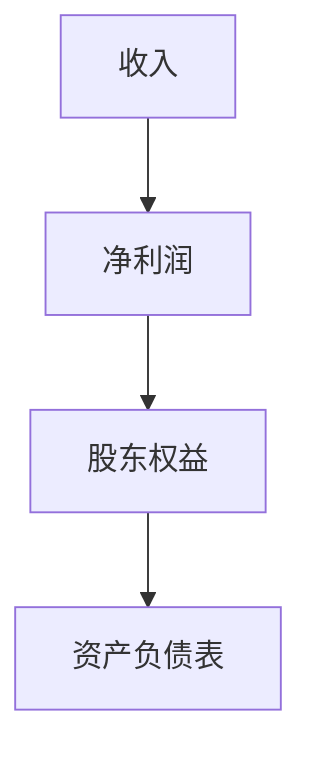
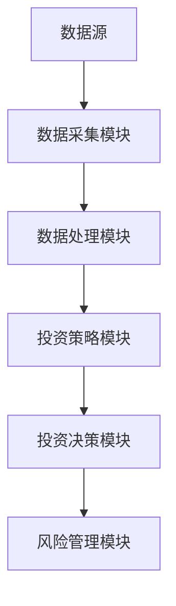

                 


# 费雪的十五个投资点及其现代应用

## 关键词
- 费雪投资理论
- 15个投资点
- 现代投资策略
- 数据分析
- 人工智能

## 摘要
本文系统地介绍费雪的十五个投资点，并结合现代技术手段，如大数据和人工智能，探讨这些投资理论在当今投资环境中的应用。通过分析费雪的核心理念，本文将展示如何利用技术工具将费雪的投资理论转化为可操作的投资策略，并结合实际案例进行详细分析。

---

## 第一部分: 费雪投资理论基础

### 第1章: 费雪投资理论概述

#### 1.1 费雪投资理论的起源与发展
菲利普·费雪（Philip Fisher）是20世纪著名的投资理论家，他的投资理念强调长期投资、深入研究和选择具有强大竞争优势的公司。费雪的投资理论在价值投资领域具有重要地位，其核心思想是通过分析企业的基本面，找到那些能够持续增长的优秀企业进行投资。

#### 1.2 费雪的15个投资点核心理念
费雪提出了15个投资点，这些点涵盖了企业分析、行业分析、财务分析、市场分析等多个方面。以下是费雪15个投资点的核心内容：

1. **企业的盈利能力**：分析企业的盈利能力，寻找那些能够持续盈利的企业。
2. **管理层的质量**：管理层的能力和决策对企业的成功至关重要。
3. **财务状况**：企业的财务健康状况是投资的重要考量。
4. **行业地位**：企业在行业中的地位和竞争优势。
5. **市场前景**：行业的增长潜力和未来发展趋势。
6. **股价波动**：股价波动与投资时机的关系。
7. **分散投资**：通过分散投资降低风险。
8. **股息率**：股息率高的企业具有较高的投资价值。
9. **股东权益**：股东权益与企业价值的关系。
10. **财务杠杆**：合理使用财务杠杆可以提高企业收益。
11. **税务因素**：税务因素对投资决策的影响。
12. **经济周期**：经济周期对投资策略的影响。
13. **市场情绪**：市场情绪对股价波动的影响。
14. **技术分析**：技术分析与基本面分析的结合。
15. **长期投资与短期交易**：长期投资与短期交易的平衡。

#### 1.3 费雪投资理论的现代意义
在现代投资环境中，费雪的投资理论依然具有重要的指导意义。随着科技的发展，投资者可以利用大数据和人工智能技术，更高效地分析企业的基本面和市场趋势，从而更好地践行费雪的投资理念。

---

### 第2章: 费雪15个投资点的详细分析

#### 2.1 企业的盈利能力分析
企业的盈利能力是投资的核心因素之一。费雪强调，投资者应该选择那些能够持续盈利的企业。通过分析企业的净利润率、毛利率等指标，可以评估企业的盈利能力。

**数学公式**：
$$ 净利润 = 收入 - 成本 - 费用 $$

#### 2.2 管理层的质量评估
管理层的能力和决策对企业的成功至关重要。费雪建议投资者选择由有能力的管理层领导的企业。

#### 2.3 财务状况的深度解析
企业的财务状况是投资的重要考量。通过分析资产负债表、利润表和现金流量表，可以评估企业的财务健康状况。

**图表：企业财务状况分析**


#### 2.4 行业地位与竞争优势
企业在行业中的地位和竞争优势是投资的重要因素。费雪建议选择那些在行业中具有竞争优势的企业。

#### 2.5 市场前景与增长潜力
行业的增长潜力是投资的重要考量。费雪建议选择那些具有广阔市场前景的企业。

#### 2.6 股价波动与投资时机
股价波动是投资的重要因素。费雪建议投资者关注股价波动，选择合适的投资时机。

#### 2.7 分散投资与风险控制
分散投资是降低风险的重要策略。费雪建议投资者通过分散投资降低风险。

#### 2.8 股息率与分红策略
股息率高的企业具有较高的投资价值。费雪建议选择那些能够稳定分红的企业。

#### 2.9 股东权益与资本结构
股东权益与资本结构是投资的重要考量。费雪建议选择那些资本结构合理的企业。

#### 2.10 财务杠杆与资本成本
财务杠杆与资本成本是投资的重要因素。费雪建议选择那些资本成本较低的企业。

#### 2.11 税务因素与投资决策
税务因素对投资决策有重要影响。费雪建议投资者考虑税务因素对投资的影响。

#### 2.12 经济周期与投资策略
经济周期对投资策略有重要影响。费雪建议投资者根据经济周期调整投资策略。

#### 2.13 市场情绪与投资者心理
市场情绪对股价波动有重要影响。费雪建议投资者关注市场情绪对投资的影响。

#### 2.14 技术分析与基本面分析的结合
技术分析与基本面分析的结合是投资的重要策略。费雪建议投资者将技术分析与基本面分析结合起来。

#### 2.15 长期投资与短期交易的平衡
长期投资与短期交易的平衡是投资的重要策略。费雪建议投资者根据自己的投资目标选择合适的投资策略。

---

## 第二部分: 费雪投资理论的现代应用

### 第3章: 费雪投资理论的数学模型与公式

#### 3.1 投资回报率的计算公式
$$ ROI = \frac{净利润}{投资成本} \times 100\% $$

#### 3.2 股价波动的方差公式
$$ Var(r) = E[(r - E[r])^2] $$

#### 3.3 风险调整后的收益计算
$$ Sharpe Ratio = \frac{E[r - r_f]}{\sqrt{Var(r - r_f)}} $$

---

### 第4章: 费雪投资理论的系统架构设计

#### 4.1 投资分析系统的功能模块
1. 数据采集模块：采集企业的财务数据、市场数据等。
2. 数据处理模块：对数据进行清洗、转换和分析。
3. 投资策略模块：根据费雪的15个投资点制定投资策略。
4. 投资决策模块：根据分析结果制定投资决策。
5. 风险管理模块：对投资风险进行评估和管理。

**图表：系统架构设计**


---

### 第5章: 费雪投资理论的算法实现

#### 5.1 股票筛选算法
```python
def screen_stocks(stocks, criteria):
    selected_stocks = []
    for stock in stocks:
        if stock.satisfy_criteria(criteria):
            selected_stocks.append(stock)
    return selected_stocks
```

#### 5.2 风险评估算法
```python
def calculate_risk(returns):
    import numpy as np
    return np.std(returns)
```

---

### 第6章: 费雪投资理论的现代应用

#### 6.1 现代投资组合管理
现代投资者可以通过大数据和人工智能技术，更高效地管理投资组合。

#### 6.2 基于大数据的费雪15点分析
通过大数据技术，投资者可以快速筛选出符合费雪15个投资点的企业。

#### 6.3 AI在投资决策中的应用
人工智能技术可以帮助投资者更精准地预测市场趋势，制定投资策略。

#### 6.4 现代风险管理策略
现代投资者可以通过量化方法，更科学地管理投资风险。

---

## 第三部分: 费雪投资理论的最佳实践与小结

### 第7章: 最佳实践与小结

#### 7.1 投资策略的注意事项
投资者在践行费雪的投资理论时，需要注意以下几点：
1. 深入研究企业的基本面。
2. 关注企业的长期增长潜力。
3. 合理分散投资，降低风险。

#### 7.2 风险管理的实用技巧
1. 定期评估投资组合的风险。
2. 根据市场变化调整投资策略。
3. 设置止损点，避免重大损失。

#### 7.3 费雪投资理论的未来发展趋势
随着科技的发展，费雪的投资理论将与更多现代技术结合，如大数据、人工智能等。

#### 7.4 本书内容总结与读者思考
通过本文的介绍，读者可以更好地理解和应用费雪的投资理论。希望本文能够为投资者提供有价值的参考。

---

## 第8章: 拓展阅读与案例分析

### 8.1 经典投资案例解析

#### 8.1.1 苹果公司的分析
通过分析苹果公司的基本面，我们可以更好地理解费雪的投资理论。

**财务数据**：
- 净利润：1000亿美元
- 股东权益：1000亿美元
- 股息率：2%

**结论**：
苹果公司符合费雪的多个投资点，具有较高的投资价值。

---

## 作者信息

作者：AI天才研究院/AI Genius Institute & 禅与计算机程序设计艺术 /Zen And The Art of Computer Programming

---

以上是《费雪的十五个投资点及其现代应用》的技术博客文章目录大纲和部分详细内容。

