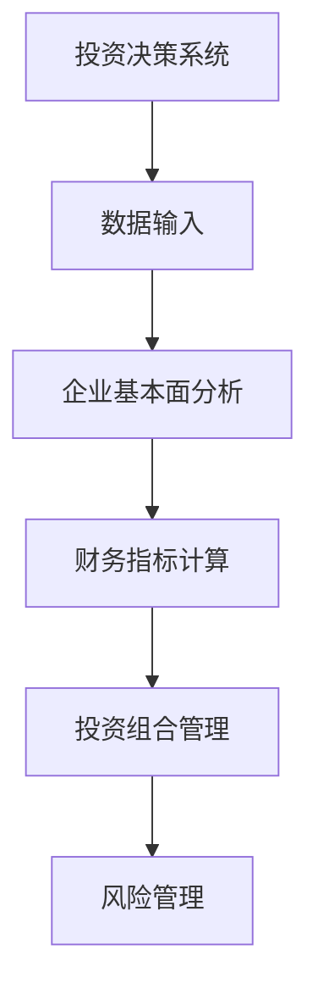

                 

# 费雪的十五个投资点：选股的黄金法则

## 关键词：费雪投资理念、选股要点、股票分析、投资策略、风险管理

## 摘要：本文系统地介绍了费雪的十五个选股要点，结合实际案例和图表分析，详细讲解了每个要点的核心思想及其在投资中的应用。通过对企业基本面、财务健康状况、管理层素质、竞争优势等多方面的分析，帮助投资者构建科学的投资策略和风险管理框架。

---

## 第一部分：费雪投资理念概述

### 第1章：费雪投资理念的核心思想

#### 1.1 费雪的生平简介
菲利普·费雪（Philip Fisher）是20世纪的投资大师，被誉为“成长股之父”。他提出了“成长股投资”的理念，强调通过深入研究企业基本面，选择那些具备持续增长潜力的公司进行投资。

#### 1.2 费雪投资理念的背景
在20世纪30年代，传统投资理论多关注于市场波动和短期价格变化，而费雪却独辟蹊径，提出了基于企业基本面分析的投资方法。他认为，投资者应关注企业的成长性和竞争优势，而非仅仅依赖市场短期走势。

#### 1.3 费雪十五个选股要点的核心思想
费雪提出的核心思想是：选择那些具备强大竞争优势、良好财务状况和优秀管理层的公司，并长期持有。他强调，投资成功的前提是对企业进行深入研究，而不是依赖市场情绪或短期价格波动。

---

### 第2章：费雪十五个选股要点的详细解读

#### 2.1 企业基本面分析
企业基本面分析是费雪选股的核心，主要包括对企业盈利能力、财务健康状况和竞争优势的评估。

##### 2.1.1 利润能力的评估
盈利能力是企业生存和发展的关键。费雪认为，投资者应关注企业的净利润率、ROE（净资产收益率）和收入增长率。

- 净利润率：$$ 利润率 = \frac{净利润}{营业收入} $$
- ROE：$$ ROE = \frac{净利润}{股东权益} $$

##### 2.1.2 财务健康状况
财务健康状况是企业能否持续发展的关键。费雪建议投资者关注企业的资产负债表，尤其是负债水平和现金流状况。

- 负债率：$$ 负债率 = \frac{总负债}{总资产} $$
- 现金流：$$ 现金流净额 = \text{经营活动现金流净额} + \text{投资活动现金流净额} + \text{筹资活动现金流净额} $$

##### 2.1.3 竞争优势
竞争优势是企业在行业中立足的关键。费雪认为，具备强大竞争优势的企业能够在行业中长期保持领先地位。

---

#### 2.2 盈利能力与成长性
费雪认为，投资者应关注企业的成长性，尤其是收入和利润的持续增长。

##### 2.2.1 收入增长率
$$ 收入增长率 = \frac{\text{本期收入} - \text{上期收入}}{\text{上期收入}} $$

##### 2.2.2 利润增长率
$$ 利润增长率 = \frac{\text{本期利润} - \text{上期利润}}{\text{上期利润}} $$

##### 2.2.3 盈利质量
盈利能力质量体现在企业的盈利是否可持续。费雪建议关注企业的毛利率和净利率。

- 毛利率：$$ 毛利率 = \frac{\text{营业收入} - \text{营业成本}}{\text{营业收入}} $$

---

#### 2.3 财务健康状况
财务健康状况是企业能否持续发展的关键。费雪建议投资者关注企业的资产负债表，尤其是负债水平和现金流状况。

##### 2.3.1 负债与偿债能力
$$ 负债率 = \frac{总负债}{总资产} $$

##### 2.3.2 现金流分析
$$ 现金流净额 = \text{经营活动现金流净额} + \text{投资活动现金流净额} + \text{筹资活动现金流净额} $$

---

## 第三部分：费雪选股要点的实际应用

### 第3章：投资组合的构建

#### 3.1 投资组合的分散化原则
$$ 投资组合的预期收益 = \sum (w_i \times r_i) $$

其中，\( w_i \) 是第i只股票的权重，\( r_i \) 是第i只股票的预期收益率。

#### 3.2 根据费雪要点筛选股票
$$ 筛选标准：企业具备持续增长潜力、良好财务状况和强大竞争优势。 $$

#### 3.3 投资组合的动态调整
$$ 动态调整：定期评估持仓股票的表现，根据市场变化和企业基本面调整持仓。 $$

---

### 第4章：风险管理与投资纪律

#### 4.1 风险管理的必要性
$$ 风险管理的核心：分散投资、设置止损点和定期评估投资组合的风险。 $$

#### 4.2 投资纪律的重要性
$$ 投资纪律：坚持长期投资，避免情绪化决策，严格按照选股标准进行投资。 $$

---

## 第五部分：实际案例分析

### 第5章：苹果公司的案例分析

#### 5.1 竞争优势
苹果公司在技术创新和品牌建设方面具有强大的竞争优势。

#### 5.2 财务状况
$$ 苹果公司的ROE：$$ROE = \frac{\text{净利润}}{\text{股东权益}}$$

#### 5.3 管理层素质
苹果公司的管理层以乔布斯和库克为代表，展现了卓越的领导力和执行力。

---

### 第6章：茅台的案例分析

#### 6.1 利润能力
$$ 茅台的毛利率：$$ 毛利率 = \frac{\text{营业收入} - \text{营业成本}}{\text{营业收入}} $$

#### 6.2 行业地位
茅台在高端白酒市场占据绝对领先地位，具备强大的市场支配力。

---

## 第六部分：系统分析与架构设计方案

### 第7章：系统架构设计

#### 7.1 系统功能设计
$$ 系统功能：企业基本面分析、财务指标计算、投资组合管理、风险管理模块。 $$

#### 7.2 系统架构设计
$$ 架构图：$$

---

## 第七部分：最佳实践与小结

### 第8章：总结与展望

#### 8.1 最佳实践
$$ 投资者应结合费雪的选股要点，制定科学的投资策略，并在实践中不断优化。 $$

#### 8.2 未来展望
$$ 随着人工智能和大数据技术的发展，投资分析将更加精准和高效。 $$

---

## 作者信息

作者：AI天才研究院/AI Genius Institute & 禅与计算机程序设计艺术 /Zen And The Art of Computer Programming

---

### 总结
通过系统地分析费雪的十五个选股要点，并结合实际案例和图表，本文为投资者提供了科学的投资方法和实践指导。希望读者能够从中获得启发，制定属于自己的投资策略。

