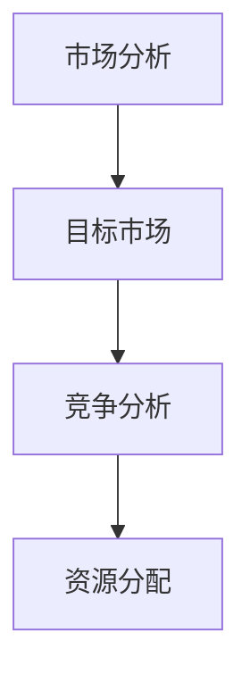
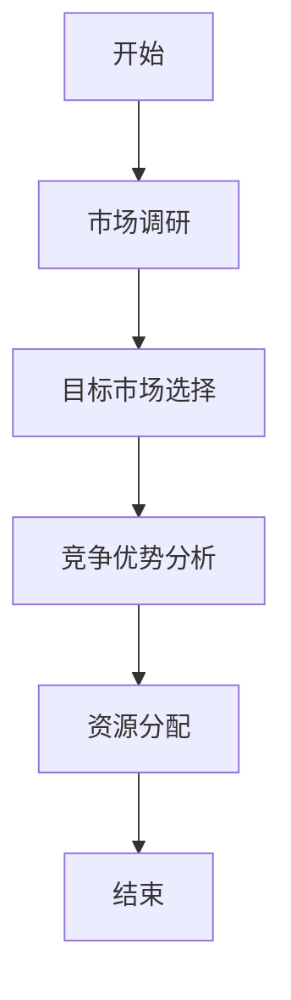
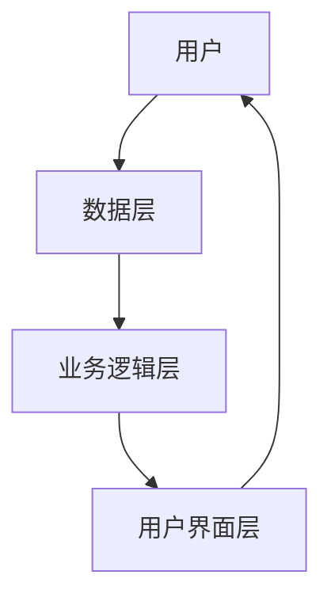

                 


# 费雪的国际化战略评估：全球扩张的潜力

> 关键词：国际化战略，全球化扩张，市场分析，竞争优势，资源分配，费雪品牌

> 摘要：本文深入分析了费雪（假设为一家企业或品牌）在国际化战略中的潜力，探讨了全球扩张的必要性、核心要素和实施路径。通过市场分析、竞争优势评估、资源分配策略等多维度的探讨，结合算法模型和实际案例，为费雪的国际化战略提供理论支持和实践指导。

---

# 第1章: 费雪国际化战略评估的背景与问题描述

## 1.1 费雪国际化战略的背景

### 1.1.1 费雪企业的发展历程

费雪（假设为一家科技公司）是一家专注于创新技术的企业，经过多年的发展，已在全球市场占据了一席之地。随着市场竞争的加剧，费雪意识到进一步扩展国际市场的重要性，以保持其竞争优势并实现持续增长。

### 1.1.2 全球化战略的必要性

在全球化背景下，单一市场的局限性逐渐显现，企业需要通过国际化战略来拓展市场、降低成本、提升品牌影响力。费雪作为一家技术领先的企业，必须抓住全球化的机会，扩大市场份额。

### 1.1.3 当前国际市场的竞争格局

当前，国际市场呈现出多样化的竞争格局。不同国家和地区有不同的市场特点、消费者需求和竞争环境。费雪需要针对这些差异制定相应的战略。

## 1.2 费雪国际化战略的核心问题

### 1.2.1 全球扩张的潜力分析

费雪在全球市场的潜力主要体现在新兴市场的快速崛起和技术创新的广泛应用。通过潜力分析，可以确定哪些市场具有更高的增长空间。

### 1.2.2 跨文化管理的挑战

国际化战略不仅涉及市场拓展，还包括跨文化管理。不同国家的文化差异可能会影响企业的运营方式和市场策略。

### 1.2.3 费雪品牌在国际市场的定位

品牌定位是国际化战略的关键。费雪需要明确其在国际市场的品牌形象，与竞争对手形成差异化。

## 1.3 费雪国际化战略的目标与边界

### 1.3.1 战略目标的设定

费雪的国际化战略目标可能包括扩大市场份额、提升品牌知名度、实现全球化运营等。

### 1.3.2 战略实施的边界

国际化战略的边界需要明确，包括资源投入的上限、市场拓展的范围、时间规划等。

### 1.3.3 战略评估的指标

为了评估国际化战略的成效，需要设定明确的评估指标，如市场占有率、品牌影响力、利润率等。

---

# 第2章: 国际化战略的核心概念与联系

## 2.1 国际化战略的核心要素

### 2.1.1 市场分析与选择

市场分析是国际化战略的基础。通过分析不同市场的规模、增长潜力、竞争环境等，选择最适合的目标市场。

### 2.1.2 竞争优势分析

竞争优势分析是确定费雪在全球市场中优势所在，如技术优势、成本优势、品牌优势等。

### 2.1.3 资源分配与管理

资源分配是国际化战略的关键。费雪需要根据目标市场的特点，合理分配资金、人力、技术等资源。

## 2.2 核心概念的对比分析

### 2.2.1 费雪与竞争对手的对比

通过对比分析，可以发现费雪在国际市场上的优劣势，制定针对性的战略。

### 2.2.2 不同市场的文化差异

文化差异是影响国际化战略的重要因素。费雪需要根据不同市场的文化特点，调整其市场策略。

### 2.2.3 费雪品牌的核心竞争力

品牌的核心竞争力是费雪在国际市场上的制胜法宝。通过品牌定位和推广，提升品牌知名度和忠诚度。

## 2.3 实体关系图与流程图

### 2.3.1 ER实体关系图



### 2.3.2 流程图



---

# 第3章: 费雪国际化战略的算法与数学模型

## 3.1 国际化战略评估的算法原理

### 3.1.1 数据分析方法

数据分析是评估国际化战略的重要手段。通过收集和分析市场数据，帮助企业制定科学的决策。

### 3.1.2 算法选择与实现

使用聚类分析算法，将市场分为不同的群体，找出具有潜力的目标市场。

```python
import pandas as pd
from sklearn.cluster import KMeans

# 示例数据
data = pd.DataFrame({
    '市场': ['A', 'B', 'C'],
    '潜力': [0.8, 0.6, 0.9]
})

# 模型训练
model = KMeans(n_clusters=2)
model.fit(data[['潜力']])

# 预测结果
clusters = model.predict(data[['潜力]])
print(clusters)
```

### 3.1.3 数学模型与公式

$$ 聚类分析模型：KMeans $$

---

# 第4章: 费雪国际化战略的系统分析与架构设计

## 4.1 系统分析

### 4.1.1 问题场景介绍

国际化战略评估需要一个高效的系统来支持数据分析和决策。

### 4.1.2 系统功能设计

设计一个能够支持市场分析、竞争分析、资源分配等功能的系统。

### 4.1.3 系统架构设计

采用分层架构，包括数据层、业务逻辑层和用户界面层。

### 4.1.4 系统接口设计

定义系统接口，确保不同模块之间的数据交互顺畅。

### 4.1.5 系统交互序列图



---

# 第5章: 费雪国际化战略的项目实战

## 5.1 环境安装

安装必要的软件和工具，如Python、数据可视化工具等。

## 5.2 核心实现

通过Python代码实现市场分析和潜力评估。

## 5.3 应用解读

解读代码实现的结果，分析目标市场的潜力。

## 5.4 案例分析

通过实际案例分析，验证费雪的国际化战略的有效性。

---

# 第6章: 费雪国际化战略的最佳实践与小结

## 6.1 最佳实践

### 6.1.1 跨文化管理的技巧

### 6.1.2 品牌定位的策略

### 6.1.3 资源分配的优化

## 6.2 项目小结

总结费雪国际化战略评估的核心内容，强调其在全球扩张中的潜力和挑战。

---

# 作者：AI天才研究院 & 禅与计算机程序设计艺术

---

本文通过系统性地分析费雪的国际化战略，结合实际案例和算法模型，为企业的全球化扩张提供了宝贵的参考。希望本文能为读者在国际化战略的制定和实施中提供启发和指导。

