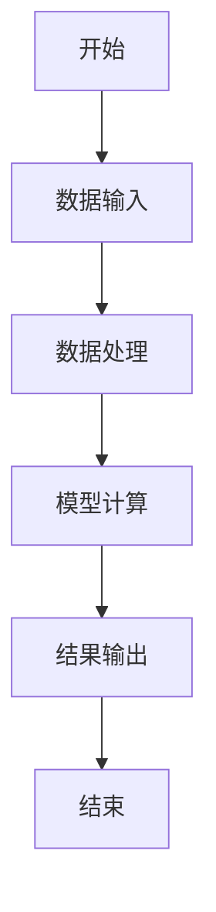
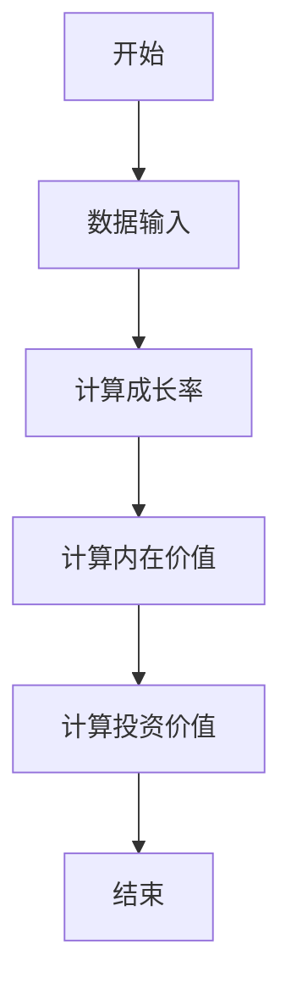

                 


# 费雪的增长型价值投资：平衡当前价值和未来潜力

> 关键词：费雪投资理念，增长型价值投资，成长股，Margin of Safety，投资模型

> 摘要：本文深入探讨了菲利普·费雪（Philip Fisher）的增长型价值投资理念，分析其核心概念、数学模型、系统架构以及在实际投资中的应用。通过详细讲解，帮助读者理解如何平衡当前价值与未来潜力，构建稳健的投资策略。

---

# 第一部分：费雪投资理念的背景与发展

## 第1章：价值投资的起源与发展

### 1.1 价值投资的定义与核心理念

价值投资是一种以内在价值为导向的投资策略，强调以低于内在价值的价格买入优质资产。其核心理念包括：

- **内在价值**：资产在未来现金流的现值，反映了其真实价值。
- **安全边际**：买入价格低于内在价值，以降低投资风险。

### 1.2 费雪在投资史上的地位与贡献

菲利普·费雪是价值投资的重要倡导者之一，其贡献包括：

- 提出**成长股投资**概念，强调企业未来增长潜力。
- 强调企业的管理团队和企业文化在投资决策中的重要性。
- 创立**费雪模型**，为成长股评估提供了科学方法。

### 1.3 费雪投资理念的演变与影响

费雪的投资理念在价值投资领域具有深远影响，尤其是在成长股投资方面，其思想至今仍被广泛引用和应用。

---

## 第2章：费雪投资理念的核心要素

### 2.1 成长股的定义与特征

成长股是指那些未来净利润增长率较高的股票，其核心特征包括：

- 高增长潜力。
- 较高的市盈率（P/E ratio）。
- 强大的管理团队和企业文化。

### 2.2 费雪的成长股筛选标准

费雪提出了多个筛选标准，包括：

1. **管理团队的质量**：优秀的管理团队能够带领企业持续增长。
2. **企业文化的凝聚力**：企业文化决定企业是否能够长期发展。
3. **财务健康状况**：包括低债务、高利润率等。
4. **市场地位**：企业在市场中是否具有竞争优势。

### 2.3 费雪的投资模型

费雪的成长股评估模型如下：

$$ \text{投资价值} = \text{内在价值} \times \text{成长潜力} $$

其中，内在价值基于企业的财务数据和行业地位，成长潜力则通过净利润增长率和市盈率等指标评估。

---

# 第二部分：费雪投资理念的系统分析与架构设计

## 第3章：投资系统的架构设计

### 3.1 系统架构的层次划分

投资系统的架构可以分为以下几个层次：

1. **数据输入层**：获取企业财务数据和市场数据。
2. **数据处理层**：对数据进行清洗和转换。
3. **模型计算层**：应用费雪模型进行评估。
4. **结果输出层**：生成投资建议和风险提示。

### 3.2 系统功能流程

以下是系统的功能流程图：



### 3.3 系统接口设计

系统需要以下接口：

1. **数据输入接口**：用于接收企业的财务数据和市场数据。
2. **数据处理接口**：对输入数据进行清洗和转换。
3. **结果输出接口**：生成投资建议和风险提示。

---

## 第4章：费雪投资理念的算法实现

### 4.1 算法流程图

以下是费雪投资模型的算法流程图：



### 4.2 费雪投资模型的Python实现

以下是Python代码实现：

```python
def fisher_growth_model(ticker):
    # 数据获取与处理
    data = get_data(ticker)
    # 成长率计算
    growth_rate = calculate_growth_rate(data)
    # 投资价值评估
    investment_value = calculate_investment_value(growth_rate)
    return investment_value

def get_data(ticker):
    # 获取并返回企业的财务数据和市场数据
    pass

def calculate_growth_rate(data):
    # 计算企业的净利润增长率
    pass

def calculate_investment_value(growth_rate):
    # 计算投资价值
    pass
```

### 4.3 算法的数学公式

费雪投资模型的数学公式如下：

$$ \text{投资价值} = \text{内在价值} \times \text{安全边际} $$

其中，内在价值基于企业的财务数据和行业地位，安全边际则通过市场价格与内在价值的差异确定。

---

# 第三部分：费雪投资理念的应用与实践

## 第5章：实际案例分析

### 5.1 案例背景

以一家科技公司为例，假设其财务数据如下：

- 净利润增长率：20%
- 市盈率：30
- 市净率：2.5

### 5.2 案例分析

根据费雪模型，计算其投资价值：

$$ \text{投资价值} = \text{内在价值} \times \text{安全边际} $$

假设内在价值为50元，市场价格为40元，安全边际为20%。

$$ \text{投资价值} = 50 \times 1.2 = 60 \text{元} $$

由于市场价格低于投资价值，建议买入。

### 5.3 投资策略调整

根据分析结果，建议投资者：

1. 保持长期投资，关注企业的成长潜力。
2. 定期评估企业的财务状况和市场地位。

---

## 第6章：最佳实践与投资策略

### 6.1 投资策略

1. **长期投资**：避免短期市场波动，关注企业的长期增长。
2. **分散投资**：通过分散投资降低风险。
3. **定期评估**：定期重新评估企业的财务状况和市场地位。

### 6.2 注意事项

1. **数据质量**：确保数据的准确性和完整性。
2. **模型局限性**：费雪模型仅适用于成长股投资，需结合其他模型进行综合评估。
3. **市场环境**：关注宏观经济环境和行业趋势。

### 6.3 拓展阅读

推荐阅读菲利普·费雪的经典著作《共同致富》和《投资成功》。

---

# 小结

菲利普·费雪的增长型价值投资理念强调平衡当前价值与未来潜力，通过精选成长股实现长期收益。本文从背景、核心概念、系统架构、算法实现和实际案例等多个方面进行了详细分析，为投资者提供了科学的投资方法和实践指导。

---

作者：AI天才研究院/AI Genius Institute & 禅与计算机程序设计艺术 /Zen And The Art of Computer Programming

