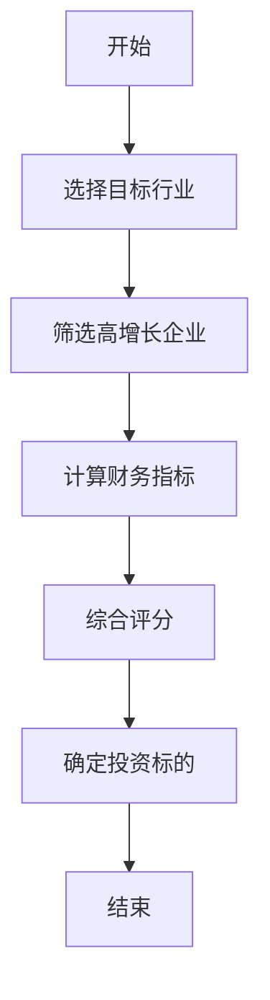
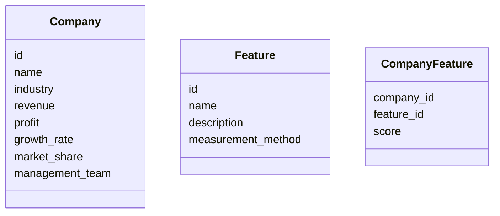

                 


```markdown
# 费雪的增长型公司特征分析

> 关键词：增长型公司，费雪投资理论，企业特征分析，投资策略，选股模型，财务指标分析

> 摘要：本文系统地分析了费雪增长型公司的特征，从理论基础、核心概念、算法原理、系统设计到实际案例，全面解读了如何识别和分析增长型公司。通过详细的特征分析和实战案例，为投资者提供了科学的投资决策依据。

---

## 第1章: 费雪投资理论的背景与发展

### 1.1 费雪投资理论的起源

#### 1.1.1 投资理论的演变历程
投资理论的发展经历了从基本面分析到量化分析的演变。费雪的投资理论基于基本面分析，强调企业的成长性和管理团队的质量。

#### 1.1.2 费雪理论的核心思想
费雪认为，投资成功的关键在于选择那些能够持续增长的企业，并长期持有。他提出了“成长股”的概念，即那些收入和利润能够持续增长的企业。

#### 1.1.3 现代意义
在当今市场环境下，费雪的理论依然具有重要的指导意义。特别是在技术驱动和创新驱动的行业中，增长型企业的识别尤为重要。

### 1.2 增长型公司的定义

#### 1.2.1 核心定义
增长型公司是指那些收入和利润能够持续以高于行业平均水平的速度增长的企业。这些企业通常处于高增长行业，具有较强的市场竞争力和创新能力强。

#### 1.2.2 与价值型公司的区别
增长型公司与价值型公司的区别在于，前者更注重未来的增长潜力，而后者更注重当前的低估值和高分红。

---

## 第2章: 增长型公司的核心特征分析

### 2.1 财务指标分析

#### 2.1.1 收益增长性分析
- 净利润增长率：净利润增长率是衡量企业盈利能力增长的重要指标。通常，增长型企业的净利润增长率应高于行业平均水平。
- 营收增长率：营收增长率是衡量企业收入增长能力的重要指标。增长型企业通常具有较高的营收增长率。

#### 2.1.2 市场扩张性分析
- 市场份额：市场份额是衡量企业市场地位的重要指标。增长型企业通常具有较高的市场份额或能够持续扩大市场份额。
- 行业增长率：行业增长率是衡量企业所处行业增长潜力的重要指标。增长型企业通常处于高增长行业。

#### 2.1.3 管理团队稳定性分析
- 管理团队的稳定性：管理团队的稳定性和凝聚力是衡量企业未来发展潜力的重要因素。增长型企业通常具有稳定的管理团队。

### 2.2 增长型公司特征对比分析

#### 2.2.1 不同类型增长型公司的特征对比
- 行业增长型：企业所处行业具有较高的增长潜力，但企业自身的增长能力一般。
- 产品增长型：企业具有创新能力强，产品具有较高的市场竞争力。
- 管理增长型：企业具有较强的管理能力，能够通过管理优化实现持续增长。

#### 2.2.2 增长型公司与价值型公司的区别
- 价值型公司通常具有较低的市盈率和市净率，而增长型公司通常具有较高的市盈率和市净率。
- 价值型公司更注重当前的低估值和高分红，而增长型公司更注重未来的增长潜力。

#### 2.2.3 增长型公司与周期性公司的差异
- 增长型公司具有较高的增长稳定性，而周期性公司通常受经济周期的影响较大。
- 增长型公司具有较高的成长性，而周期性公司通常具有较低的成长性。

### 2.3 费雪增长型公司特征的ER实体关系图

```mermaid
erDiagram
    company {
        id
        name
        industry
        revenue
        profit
        growth_rate
        market_share
        management_team
    }
    feature {
        id
        name
        description
        measurement_method
    }
    company_feature {
        company_id
        feature_id
        score
    }
```

---

## 第3章: 费雪增长型公司的算法原理

### 3.1 选股模型的数学公式

#### 3.1.1 净利润增长率公式
$$
\text{净利润增长率} = \frac{\text{当年净利润} - \text{上年净利润}}{\text{上年净利润}} \times 100\%
$$

#### 3.1.2 营收增长率公式
$$
\text{营收增长率} = \frac{\text{当年营收} - \text{上年营收}}{\text{上年营收}} \times 100\%
$$

#### 3.1.3 综合评分公式
$$
\text{综合评分} = 0.4 \times \text{净利润增长率} + 0.3 \times \text{营收增长率} + 0.3 \times \text{市场份额增长率}
$$

### 3.2 选股模型的算法流程



### 3.3 选股模型的Python实现

```python
import pandas as pd

def calculate_growth_rate(data, current_year, previous_year):
    return ((data[current_year] - data[previous_year]) / data[previous_year]) * 100

def fisher_growth_analysis(finance_data):
    # 计算净利润增长率
    net_profit_growth = calculate_growth_rate(finance_data['net_profit'], '2022', '2021')
    # 计算营收增长率
    revenue_growth = calculate_growth_rate(finance_data['revenue'], '2022', '2021')
    # 计算市场份额增长率
    market_share_growth = calculate_growth_rate(finance_data['market_share'], '2022', '2021')
    # 综合评分
    total_score = 0.4 * net_profit_growth + 0.3 * revenue_growth + 0.3 * market_share_growth
    return total_score

# 示例数据
data = {
    'net_profit': {'2021': 100, '2022': 120},
    'revenue': {'2021': 500, '2022': 600},
    'market_share': {'2021': 20, '2022': 25}
}

print(fisher_growth_analysis(data))
```

---

## 第4章: 系统分析与架构设计

### 4.1 系统功能设计

#### 4.1.1 功能模块
- 数据采集模块：负责采集企业的财务数据和行业数据。
- 数据分析模块：负责计算各项财务指标和综合评分。
- 投资决策模块：根据评分结果生成投资建议。

#### 4.1.2 领域模型类图



### 4.2 系统架构设计

#### 4.2.1 系统架构图

```mermaid
architecturalDiagram
    layer API {
        API Gateway
    }
    layer Service {
        CompanyService
        FeatureService
    }
    layer Database {
        CompanyDB
        FeatureDB
    }
    API Gateway --> CompanyService
    CompanyService --> CompanyDB
    API Gateway --> FeatureService
    FeatureService --> FeatureDB
```

### 4.3 系统接口设计

#### 4.3.1 API接口

```http
POST /api/growth-analysis
Content-Type: application/json

{
    "company_id": "123",
    "financial_data": {
        "revenue": { "2021": 500, "2022": 600 },
        "profit": { "2021": 100, "2022": 120 },
        "market_share": { "2021": 20, "2022": 25 }
    }
}
```

---

## 第5章: 项目实战

### 5.1 环境安装

#### 5.1.1 安装Python和相关库
```bash
pip install pandas
pip install numpy
pip install matplotlib
```

### 5.2 核心代码实现

#### 5.2.1 数据采集与处理
```python
import pandas as pd

# 数据采集
data = pd.read_csv('companies.csv')

# 数据处理
data['revenue_growth'] = (data['revenue_2022'] - data['revenue_2021']) / data['revenue_2021']
data['profit_growth'] = (data['profit_2022'] - data['profit_2021']) / data['profit_2021']
data['total_score'] = 0.4 * data['profit_growth'] + 0.3 * data['revenue_growth'] + 0.3 * data['market_share_growth']
```

### 5.3 案例分析

#### 5.3.1 案例背景
分析一家科技公司过去两年的财务数据，判断其是否为增长型企业。

#### 5.3.2 数据分析
```python
# 数据分析
selected_company = data[data['company_id'] == '123']
selected_company[['revenue_growth', 'profit_growth', 'total_score']]
```

#### 5.3.3 结果解读
根据计算结果，该公司具备较高的增长潜力，符合增长型公司的特征。

---

## 第6章: 总结与展望

### 6.1 核心观点总结
增长型企业具有较高的净利润增长率、营收增长率和市场份额增长率，且管理团队稳定。通过综合评分模型，可以有效识别增长型企业。

### 6.2 投资策略建议
投资者应结合市场环境和企业基本面，选择那些具有持续增长潜力的企业进行投资。

### 6.3 未来研究方向
未来可以进一步研究技术驱动型增长和创新驱动型增长的特征，以及如何在不同行业和市场环境下应用增长型公司的特征分析。

---

## 作者

作者：AI天才研究院/AI Genius Institute & 禅与计算机程序设计艺术 /Zen And The Art of Computer Programming
```

