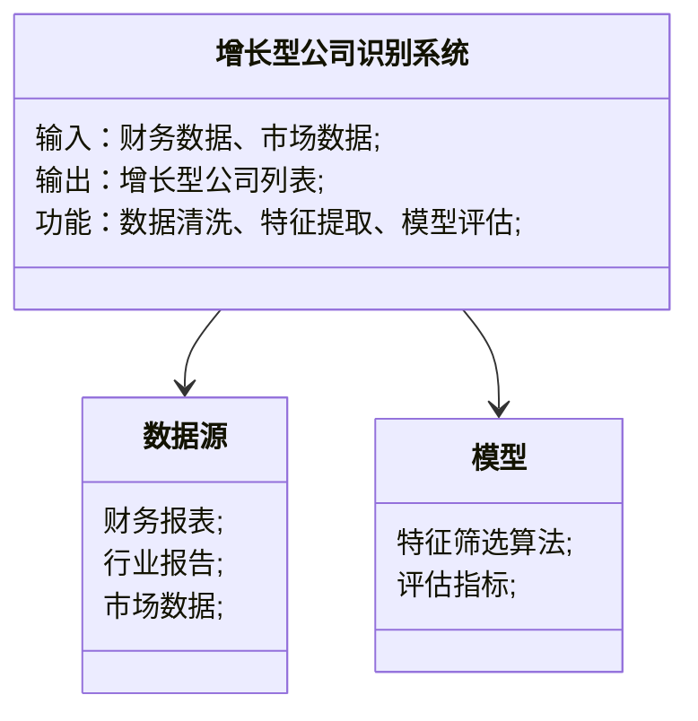
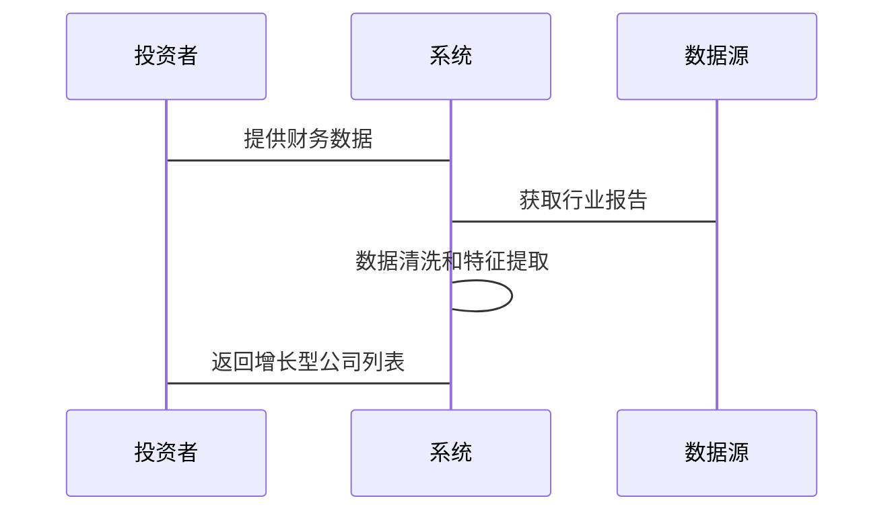

                 


# 《费雪的增长型公司特征：识别未来赢家》

---

## 关键词：
- 费雪投资理念
- 增长型公司特征
- 投资策略
- 股票分析
- 财务指标

---

## 摘要：
本书深入探讨了菲德勒·费雪（Philip Fisher）的增长型投资理念，详细分析了增长型公司的核心特征和识别方法。通过系统化的分析框架，结合实际案例和数学模型，本书为投资者提供了从理论到实践的全面指导，帮助识别具有长期增长潜力的公司，构建稳健的投资组合。

---

# 目录大纲

## 第一部分：费雪的增长型公司特征概述

### 第1章：费雪的投资理念与增长型公司背景

#### 1.1 费雪的投资哲学
- 1.1.1 费雪的生平与投资贡献
- 1.1.2 费雪对投资学的核心贡献
- 1.1.3 费雪增长型投资的基本理念

#### 1.2 增长型公司的定义与背景
- 1.2.1 增长型公司的定义
- 1.2.2 增长型公司与价值型公司的区别
- 1.2.3 增长型投资的适用场景与边界

### 第2章：增长型公司的核心特征

#### 2.1 增长型公司的关键特征
- 2.1.1 收入增长率
- 2.1.2 利润率与盈利能力
- 2.1.3 股东权益回报率（ROE）
- 2.1.4 市场领导地位
- 2.1.5 可持续竞争优势

#### 2.2 增长型公司的特征对比分析
- 2.2.1 增长型公司与周期性公司的对比
- 2.2.2 增长型公司与防御型公司的对比

#### 2.3 增长型公司特征的数学模型
- 2.3.1 收入增长率公式
  $$ 收入增长率 = \frac{本期收入 - 上期收入}{上期收入} \times 100\% $$
- 2.3.2 净利润率公式
  $$ 净利润率 = \frac{净利润}{营业收入} \times 100\% $$
- 2.3.3 ROE计算公式
  $$ ROE = \frac{净利润}{股东权益} \times 100\% $$

---

## 第二部分：增长型公司的识别方法

### 第3章：增长型公司的识别方法

#### 3.1 费雪的检查清单法
- 3.1.1 费雪检查清单的核心要素
- 3.1.2 如何使用检查清单筛选增长型公司
- 3.1.3 案例分析：苹果公司的增长型特征

#### 3.2 增长型公司的定量分析
- 3.2.1 财务指标的筛选标准
- 3.2.2 市盈率与增长率的匹配分析
- 3.2.3 市场资本化率与增长率的关系

#### 3.3 增长型公司的定性分析
- 3.3.1 公司治理结构评估
- 3.3.2 管理层能力评估
- 3.3.3 行业前景与竞争环境分析

### 第4章：增长型公司的投资策略

#### 4.1 增长型公司的投资组合构建
- 4.1.1 投资组合的分散化原则
- 4.1.2 增长型公司权重的合理分配
- 4.1.3 定期再平衡的重要性

#### 4.2 增长型投资的风险管理
- 4.2.1 市场波动对增长型公司的影响
- 4.2.2 如何应对市场波动

---

## 第三部分：增长型公司的系统架构与项目实战

### 第5章：增长型公司的系统架构设计

#### 5.1 问题场景介绍
- 5.1.1 投资者如何在复杂的市场环境中识别增长型公司
- 5.1.2 如何构建一个自动化识别增长型公司的系统

#### 5.2 系统功能设计（领域模型）


#### 5.3 系统架构设计


#### 5.4 系统接口设计
- 5.4.1 数据输入接口
- 5.4.2 模型调用接口
- 5.4.3 结果输出接口

#### 5.5 系统交互设计


### 第6章：项目实战——基于Python的增长型公司识别系统

#### 6.1 环境安装
- 6.1.1 安装Python
- 6.1.2 安装必要的库（pandas、numpy、scikit-learn）

#### 6.2 核心实现
```python
import pandas as pd
import numpy as np

def calculate_growth_rate(revenue):
    return ((revenue['current'] - revenue['previous']) / revenue['previous']) * 100

data = pd.DataFrame({
    'year': [2018, 2019, 2020, 2021, 2022],
    'revenue': [100, 120, 150, 180, 200]
})

growth_rate = calculate_growth_rate(data['revenue'])
print(f"收入增长率：{growth_rate}%")
```

#### 6.3 实际案例分析
- 6.3.1 案例选择：科技公司分析
- 6.3.2 数据分析与特征提取
- 6.3.3 模型评估与结果解读

#### 6.4 项目小结
- 6.4.1 项目总结
- 6.4.2 经验与教训
- 6.4.3 可能的改进方向

### 第7章：最佳实践与注意事项

#### 7.1 最佳实践
- 7.1.1 定期回顾投资组合
- 7.1.2 保持对市场的敏感性
- 7.1.3 分散投资风险

#### 7.2 小结
- 7.2.1 识别增长型公司的关键点
- 7.2.2 投资过程中的注意事项

#### 7.3 注意事项
- 7.3.1 财务造假的风险
- 7.3.2 市场波动的影响
- 7.3.3 宏观经济环境的变化

#### 7.4 拓展阅读
- 7.4.1 推荐书籍
- 7.4.2 进一步学习资源

---

## 作者：AI天才研究院 & 禅与计算机程序设计艺术

---

通过以上目录大纲，我们能够系统地从费雪的增长型公司特征出发，逐步分析识别方法，并通过实际项目实战来巩固所学知识。希望这本书能够为投资者提供有价值的指导，帮助他们在复杂多变的市场中识别出真正的增长型公司。

