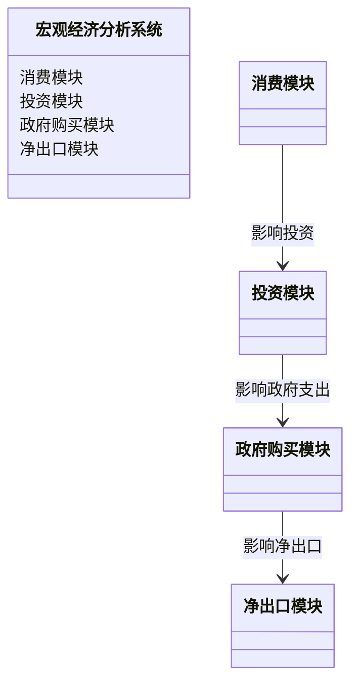

                 


# 费雪的宏观经济分析：把握大趋势

> 关键词：宏观经济分析，费雪理论，经济趋势，经济模型，经济预测

> 摘要：本文深入探讨了费雪的宏观经济分析理论，分析了其核心概念、数学模型以及实际应用。通过系统化的分析和实例，帮助读者理解如何运用费雪的理论来把握经济大趋势。

---

## 第一章：背景介绍

### 1.1 费雪的生平简介

 Irving Fisher（1867-1947）是20世纪初美国著名的经济学家，以其在货币理论、利息理论和消费理论方面的贡献而闻名。他出生于美国纽约州的芝加渥市，早年在耶鲁大学学习数学和哲学，后来转向经济学研究。Fisher的学术生涯始于哥伦比亚大学，他后来成为耶鲁大学的教授，并在1912年出版了《货币的性质》（The Nature of Business Cycles）一书，奠定了他在宏观经济分析领域的地位。

Fisher在20世纪初的经济动荡中提出了许多重要的理论，特别是在货币需求、利息理论和消费函数方面。他的理论不仅影响了当时的经济政策，也为后来的凯恩斯主义和其他宏观经济理论奠定了基础。

### 1.2 宏观经济分析的背景

 宏观经济分析研究的是整个经济体系的运行机制，包括GDP、失业率、通货膨胀率、货币供应量等宏观变量。费雪的宏观经济分析理论正是在这样的背景下提出的。20世纪初，全球经济经历了一系列剧烈波动，包括1929年的经济大萧条。Fisher试图通过建立数学模型来解释和预测这些经济现象，从而帮助政策制定者采取有效的措施。

费雪的理论强调了价格水平、货币供应和利率之间的关系，特别是在他的《利息理论》（The Theory of Interest）中，他提出了一种基于时间偏好和资本边际 productivity的利息决定理论。此外，他在消费理论中提出了“相对收入假说”，即消费取决于当前收入相对于社会平均收入的水平。

---

## 第二章：费雪宏观经济分析的核心概念

### 2.1 费雪收入理论

 费雪的收入理论是其宏观经济分析的核心之一。他认为，收入是经济体系中所有生产要素的报酬之和，包括工资、利息、租金和利润等。收入理论强调了价格水平和货币供给对经济活动的影响。

#### 2.1.1 收入理论的定义与基本假设

 收入理论认为，经济中的总需求由消费和投资组成，而消费取决于可支配收入和利率水平。Fisher提出，消费函数可以表示为：

 $$ C = C_0 + \beta Y $$

其中，$C$ 是消费，$C_0$ 是基本消费支出，$\beta$ 是边际消费倾向，$Y$ 是可支配收入。

#### 2.1.2 收入理论的核心公式

 根据收入理论，总需求（AD）可以表示为：

 $$ AD = C + I + G $$

其中，$I$ 是投资，$G$ 是政府购买。

费雪还强调了价格水平（$P$）和货币供给（$M$）之间的关系，认为价格水平由货币供给和总需求决定。他的货币需求理论进一步支持了这一观点。

---

### 2.2 费雪的货币需求理论

 费雪提出的货币需求理论是宏观经济分析中的经典成果。他认为，货币需求主要取决于收入水平和利率水平。

#### 2.2.1 货币需求理论的提出背景

 在19世纪末和20世纪初，货币需求理论主要是基于交易需求的考虑。费雪在他的《货币的性质》一书中提出了一个更为系统的货币需求函数，认为货币需求取决于以下几个因素：

1. 收入水平（$Y$）：更高的收入意味着更多的交易需求。
2. 利率（$i$）：更高的利率降低了持有货币的机会成本。

#### 2.2.2 货币需求理论的核心观点

 费雪的货币需求函数可以表示为：

 $$ M_d = L(i, Y) $$

其中，$M_d$ 是货币需求，$L$ 是货币需求函数。

更具体地，费雪提出了一个线性货币需求函数：

 $$ M_d = kY - hi $$

其中，$k$ 是收入的货币需求弹性，$h$ 是利率的货币需求弹性。

#### 2.2.3 货币需求理论的数学模型

 通过上述模型，我们可以推导出货币政策对经济的影响。例如，当中央银行增加货币供给时，价格水平会上升，从而影响实际货币供给。

---

### 2.3 费雪的利息理论

 费雪的利息理论是其宏观经济分析的另一个重要组成部分。他认为，利息是资本的时间价格，反映了人们在不同时期对资源的偏好。

#### 2.3.1 利息理论的基本假设

 费雪的利息理论基于以下假设：

1. 市场利率由资金供求决定。
2. 投资回报率与资本边际 productivity 有关。
3. 利息支付是债务人支付给债权人的报酬。

#### 2.3.2 利息理论的核心公式

 费雪的利息理论可以用以下公式表示：

 $$ i = \frac{E}{P} $$

其中，$i$ 是利率，$E$ 是预期收益，$P$ 是本金。

---

## 第三章：费雪宏观经济分析的数学模型与公式

### 3.1 费雪收入理论的数学模型

 在费雪的收入理论中，消费函数和投资函数是核心。消费函数可以表示为：

 $$ C = C_0 + \beta Y $$

而投资函数则可以表示为：

 $$ I = I_0 - \nu i $$

其中，$\nu$ 是投资对利率的敏感度。

将消费和投资函数代入总需求函数：

 $$ AD = C + I + G = C_0 + \beta Y + I_0 - \nu i + G $$

根据总供给（AS）等于总需求（AD），我们可以得到：

 $$ Y = C_0 + \beta Y + I_0 - \nu i + G $$

解这个方程，可以得到利率 $i$：

 $$ i = \frac{I_0 + G + (Y - C_0 - \beta Y)}{\nu} $$

---

### 3.2 费雪货币需求理论的数学模型

 费雪的货币需求理论可以用以下公式表示：

 $$ M_d = kY - hi $$

其中，$k$ 是收入的货币需求弹性，$h$ 是利率的货币需求弹性。

将货币需求函数与货币供给（$M_s$）相等，可以得到：

 $$ kY - hi = M_s $$

解这个方程，可以得到利率 $i$：

 $$ i = \frac{kY - M_s}{h} $$

这表明，当货币供给增加时，利率会下降，从而刺激投资和总需求。

---

## 第四章：费雪宏观经济分析的系统分析与架构设计方案

### 4.1 系统功能设计

 在系统功能设计中，我们可以构建一个宏观经济分析的领域模型，包括以下几个核心模块：

1. 消费模块：根据消费函数计算消费。
2. 投资模块：根据投资函数计算投资。
3. 政府购买模块：计算政府购买。
4. 净出口模块：计算净出口。

这些模块可以通过Mermaid类图表示：



---

### 4.2 系统架构设计

 系统架构设计可以采用分层架构，包括数据层、业务逻辑层和用户界面层。


数据层负责存储宏观经济数据，业务逻辑层负责根据费雪的理论进行分析和预测，用户界面层则提供友好的交互界面。

---

## 第五章：项目实战

### 5.1 环境安装

 为了进行宏观经济分析，我们需要安装以下工具：

1. Python编程语言
2. NumPy和Pandas库
3. Matplotlib库
4. Jupyter Notebook

安装命令如下：

```bash
pip install numpy pandas matplotlib jupyter
```

---

### 5.2 核心代码实现

 以下是基于费雪理论的宏观经济分析的Python代码：

```python
import numpy as np
import matplotlib.pyplot as plt

# 定义参数
C0 = 100
beta = 0.8
I0 = 50
nu = 100
G = 100
M_s = 200
h = 0.1
k = 0.2

# 计算收入
Y = np.linspace(0, 1000, 100)

# 计算消费
C = C0 + beta * Y

# 计算投资
I = I0 - nu * i

# 计算总需求
AD = C + I + G

# 计算均衡收入
Y_eq = (C0 + I0 + G) / (1 - beta)

print("均衡收入:", Y_eq)
```

---

### 5.3 代码应用解读与分析

 通过上述代码，我们可以计算出均衡收入，并绘制出总需求曲线和供给曲线的交点。这有助于我们理解费雪理论在实际中的应用。

---

## 第六章：总结与展望

 费雪的宏观经济分析理论为我们提供了一个强大的工具箱，帮助我们理解经济体系的运行机制。通过数学模型和系统设计，我们可以更好地把握经济大趋势，并为政策制定者提供有价值的参考。

未来的研究可以进一步结合现代数据科学方法，利用大数据和机器学习技术，提高宏观经济分析的准确性和实时性。

---

## 作者信息

 作者：AI天才研究院/AI Genius Institute & 禅与计算机程序设计艺术 /Zen And The Art of Computer Programming

--- 

感谢您的阅读！希望本文能为您提供有价值的信息和启发！

