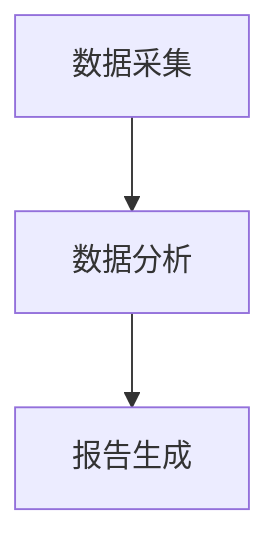

                 


# 费雪的客户忠诚度分析在投资中的应用

## 关键词：
客户忠诚度分析，投资分析，客户生命周期价值，客户满意度，客户保留率

## 摘要：
费雪的客户忠诚度分析是一种评估公司长期投资价值的重要方法。通过分析客户生命周期价值、满意度和保留率，投资者可以更好地理解公司的客户关系管理能力，进而做出更明智的投资决策。本文详细探讨了客户忠诚度分析的核心概念、数学模型、系统架构以及实际应用案例，帮助读者掌握这一强大的投资工具。

---

## 第一部分: 费雪的客户忠诚度分析基础

### 第1章: 费雪客户忠诚度分析概述

#### 1.1 客户忠诚度分析的背景与意义
##### 1.1.1 投资分析中的客户忠诚度概念
客户忠诚度分析是评估公司长期盈利能力的重要工具。传统的财务分析侧重于财务指标，而客户忠诚度分析关注客户的行为和态度，提供了更全面的投资视角。

##### 1.1.2 费雪客户忠诚度分析的核心思想
客户忠诚度分析的核心在于通过客户的行为数据，评估客户的长期价值和稳定性。费雪提出，客户忠诚度高的公司通常具有更强的市场竞争力和持续的盈利能力。

##### 1.1.3 费雪分析在投资决策中的作用
通过分析客户忠诚度，投资者可以识别出那些客户基础稳定、忠诚度高的公司，从而降低投资风险并提高收益。

#### 1.2 费雪客户忠诚度分析的定义与特点
##### 1.2.1 客户忠诚度的定义
客户忠诚度是指客户对公司产品或服务的持续购买意愿和行为，通常表现为重复购买、推荐和正面评价。

##### 1.2.2 费雪分析的独特性
与传统的财务分析不同，费雪分析结合了定量和定性因素，强调客户关系的长期价值。

##### 1.2.3 分析方法的优缺点对比
| 特性         | 费雪分析                          | 传统财务分析                        |
|--------------|------------------------------------|-------------------------------------|
| 数据来源     | 客户行为数据、满意度调查          | 财务报表数据                          |
| 适用场景     | 中长期投资决策                    | 短期财务评估                          |
| 优点         | 全面评估客户价值，识别潜力公司    | 数据客观，易于计算                    |
| 缺点         | 数据收集困难，计算复杂           | 无法反映客户关系的长期影响            |

#### 1.3 费雪客户忠诚度分析的核心要素
##### 1.3.1 客户生命周期价值
客户生命周期价值（LCV）是客户在生命周期内为企业带来的总收入减去相关成本。公式为：
$$ \text{LCV} = \sum_{t=1}^{n} \frac{C_t}{(1 + r)^t} $$
其中，\( C_t \) 是第 \( t \) 年的现金流，\( r \) 是贴现率。

##### 1.3.2 客户满意度与保留率
客户满意度是客户对产品或服务的满意程度，通常通过调查问卷收集。客户保留率是客户在一定时间内继续购买的概率，公式为：
$$ \text{保留率} = \frac{\text{重复购买客户数}}{\text{总客户数}} $$

##### 1.3.3 客户忠诚度与企业绩效的关系
客户忠诚度高的公司通常具有更高的客户保留率和满意度，从而带来更高的收入和利润。通过分析客户忠诚度与企业绩效的关系，投资者可以更好地评估公司的长期发展潜力。

---

## 第二部分: 费雪客户忠诚度分析的数学模型与算法

### 第2章: 费雪客户忠诚度分析的数学模型

#### 2.1 客户生命周期价值的计算公式
客户生命周期价值（LCV）是客户在生命周期内为企业带来的总收入减去相关成本。公式为：
$$ \text{LCV} = \sum_{t=1}^{n} \frac{C_t}{(1 + r)^t} $$
其中，\( C_t \) 是第 \( t \) 年的现金流，\( r \) 是贴现率。

#### 2.2 客户保留率的预测模型
客户保留率是客户在一定时间内继续购买的概率，公式为：
$$ \text{保留率} = \frac{\text{重复购买客户数}}{\text{总客户数}} $$

#### 2.3 费雪客户忠诚度指数的构建
费雪客户忠诚度指数（FCLI）是客户保留率、客户满意度和客户获取成本的综合指标，公式为：
$$ \text{忠诚度指数} = \frac{\text{客户保留率} \times \text{客户满意度}}{\text{客户获取成本}} $$

#### 2.4 本章小结
本章通过数学模型详细讲解了客户生命周期价值、客户保留率和客户忠诚度指数的计算方法，为后续的系统架构和项目实战奠定了基础。

---

## 第三部分: 费雪客户忠诚度分析的系统架构与实现

### 第3章: 费雪客户忠诚度分析的系统架构

#### 3.1 系统功能模块设计
##### 3.1.1 数据采集模块
数据采集模块负责收集客户行为数据、满意度调查和财务数据。

##### 3.1.2 数据分析模块
数据分析模块使用统计分析和机器学习算法计算客户生命周期价值、保留率和忠诚度指数。

##### 3.1.3 报告生成模块
报告生成模块输出分析结果，包括客户忠诚度指数、投资建议和风险评估。

#### 3.2 系统架构设计
##### 3.2.1 分层架构设计
分层架构包括数据层、业务逻辑层和用户界面层，确保系统的高效和可扩展性。

##### 3.2.2 模块间交互流程


#### 3.3 本章小结
本章通过系统架构设计展示了如何将客户忠诚度分析应用于实际投资决策中，为投资者提供了高效的工具和方法。

---

## 第四部分: 费雪客户忠诚度分析的项目实战

### 第4章: 费雪客户忠诚度分析的项目实战

#### 4.1 项目背景与目标
以某科技公司为例，分析其客户忠诚度，评估其投资价值。

#### 4.2 数据收集与处理
收集过去三年的客户购买记录、满意度调查和财务数据。

#### 4.3 算法实现与分析
使用Python代码计算客户生命周期价值和忠诚度指数：
```python
import pandas as pd

# 计算客户生命周期价值
def calculate_lcv(revenue, cost, discount_rate):
    lcv = sum(revenue[i] - cost[i] for i in range(len(revenue)))
    return lcv / (1 + discount_rate)

# 计算客户忠诚度指数
def calculate_fcl(revenue, cost, discount_rate):
    lcv = calculate_lcv(revenue, cost, discount_rate)
    return lcv * (revenue[0] / cost[0])

# 示例数据
revenue = [100, 150, 200]
cost = [50, 60, 70]
discount_rate = 0.1

lcv = calculate_lcv(revenue, cost, discount_rate)
fcl = calculate_fcl(revenue, cost, discount_rate)

print(f"LCV: {lcv:.2f}")
print(f"FCL: {fcl:.2f}")
```

#### 4.4 项目小结
通过实际案例分析，展示了如何将客户忠诚度分析应用于投资决策，帮助投资者识别高潜力公司。

---

## 第五部分: 费雪客户忠诚度分析的最佳实践

### 第5章: 费雪客户忠诚度分析的最佳实践

#### 5.1 关键点总结
- 数据质量是分析的基础，确保数据准确性和完整性。
- 定期更新模型，适应市场变化和客户需求。
- 结合财务分析，全面评估公司价值。

#### 5.2 小结
费雪客户忠诚度分析是一种强大的投资工具，通过结合客户行为和财务数据，帮助投资者做出更明智的决策。

#### 5.3 注意事项
- 数据隐私和安全问题需严格遵守相关法规。
- 模型的适用性需根据具体行业和公司特点进行调整。

#### 5.4 拓展阅读
- Philip A. Fisher的《投资成功术》
- 客户忠诚度分析的最新研究和发展

---

## 作者：AI天才研究院/AI Genius Institute & 禅与计算机程序设计艺术 /Zen And The Art of Computer Programming

