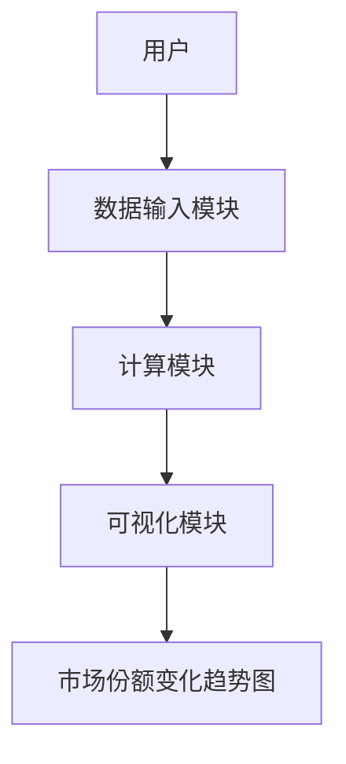
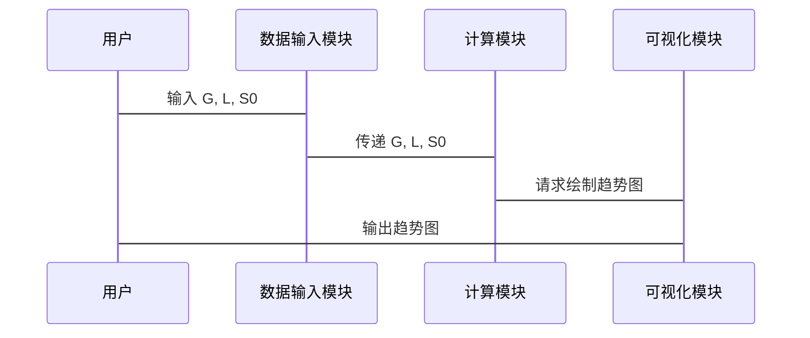

                 


# 费雪的市场份额增长分析方法

## 关键词：市场份额增长，费雪模型，企业战略，竞争分析，股东价值

## 摘要：  
费雪的市场份额增长分析方法是一种经典的企业战略分析工具，旨在通过分析市场份额的变化趋势，帮助企业预测未来市场动态并制定有效的竞争策略。本文详细阐述了费雪模型的核心原理、算法实现、系统架构设计以及实际应用案例，帮助读者全面理解并掌握这一方法。

---

## 第一部分：背景介绍

### 第1章：市场份额增长分析的背景与意义

#### 1.1 问题背景  
在现代商业环境中，市场竞争日益激烈，企业需要不断优化自身战略以应对市场变化。市场份额的增长不仅关系到企业的生存，更是实现股东价值最大化的重要途径。费雪的市场份额增长分析方法正是基于这一需求而提出的。

#### 1.2 问题描述  
- **市场份额的定义**：市场份额是指企业在某一市场中的销售量占整个市场总销售量的比例。  
- **市场份额变化的影响**：市场份额的变化直接影响企业的收入、利润以及市场地位。  
- **费雪模型的应用场景**：适用于企业战略规划、投资决策以及竞争对手分析等领域。  

#### 1.3 问题解决  
- **费雪模型的核心思想**：通过分析市场份额的变化趋势，预测未来市场动态并制定有效的竞争策略。  
- **市场份额增长的驱动因素**：包括市场增长率、竞争对手行为、客户忠诚度等。  
- **股东价值的实现路径**：通过优化市场份额，提升企业收入和利润，从而实现股东价值的最大化。  

#### 1.4 边界与外延  
- **费雪模型的适用范围**：适用于竞争性市场，且企业能够对市场数据进行准确测量和分析的场景。  
- **与其他分析方法的对比**：与波斯顿矩阵、波特五力模型等方法相比，费雪模型更注重市场份额的变化趋势和企业增长潜力。  
- **模型的局限性**：费雪模型假设市场数据可测量且市场行为可预测，但在实际操作中可能存在一定的局限性。  

#### 1.5 概念结构与核心要素  
- **核心要素**：  
  1. 市场增长率：市场的整体增长速度。  
  2. 竞争对手分析：竞争对手的市场份额和行为。  
  3. 客户忠诚度：客户对企业产品或服务的忠诚程度。  
- **模型的逻辑框架**：通过分析市场增长率和竞争对手行为，预测企业未来的市场份额变化趋势，并结合客户忠诚度制定相应的战略。

---

## 第二部分：核心概念与联系

### 第2章：费雪模型的核心概念

#### 2.1 费雪模型的原理  
费雪模型的核心在于通过分析市场份额的变化趋势，预测企业的未来增长潜力。其基本假设是，市场份额的增长与市场整体增长成正比，同时受到竞争对手行为的影响。  

#### 2.2 费雪模型的核心要素  
- **市场增长率**：$G$，表示市场的年增长率，通常通过历史数据或市场研究预测得出。  
- **竞争对手分析**：$C$，表示竞争对手的市场份额和行为。  
- **客户忠诚度**：$L$，表示客户对企业产品或服务的忠诚程度，通常通过调查或数据分析得出。  

#### 2.3 费雪模型的数学表达  
费雪模型的市场份额增长公式为：  
$$ S_i = S_{i-1} + G \times S_{i-1} + L \times (1 - S_{i-1}) $$  
其中：  
- $S_i$ 表示第 $i$ 年的市场份额。  
- $S_{i-1}$ 表示第 $i-1$ 年的市场份额。  
- $G$ 表示市场增长率。  
- $L$ 表示客户忠诚度。  

#### 2.4 费雪模型与其他分析方法的对比  
以下是费雪模型与波斯顿矩阵的对比表格：

| 对比维度       | 费雪模型                               | 波斯顿矩阵                               |
|----------------|--------------------------------------|-----------------------------------------|
| 分析对象       | 市场份额增长                           | 市场增长率和市场份额                     |
| 核心假设       | 市场份额与企业增长成正比               | 产品市场增长率和市场份额                |
| 应用场景       | 企业战略规划、投资决策               | 市场定位、产品组合决策                  |
| 输出结果       | 预测市场份额变化趋势                 | 四种业务类型（明星、问题、奶牛、瘦狗） |

---

## 第三部分：算法原理

### 第3章：费雪模型的算法实现

#### 3.1 费雪模型的数学模型  
费雪模型的核心公式为：  
$$ S_i = S_{i-1} \times (1 + G) + L \times (1 - S_{i-1}) $$  
其中，$S_i$ 表示第 $i$ 年的市场份额，$S_{i-1}$ 表示第 $i-1$ 年的市场份额，$G$ 表示市场增长率，$L$ 表示客户忠诚度。  

#### 3.2 算法步骤  
以下是费雪模型的实现步骤：  
1. **输入参数**：市场增长率 $G$，客户忠诚度 $L$，初始市场份额 $S_0$。  
2. **计算未来市场份额**：根据公式 $S_i = S_{i-1} \times (1 + G) + L \times (1 - S_{i-1})$，计算未来各年的市场份额。  
3. **输出结果**：绘制市场份额变化趋势图，分析企业的增长潜力。  

#### 3.3 Python 实现  
以下是费雪模型的 Python 实现代码：

```python
def fisher_model(S0, G, L, years):
    S = [S0]
    for year in range(1, years + 1):
        Si = S[-1] * (1 + G) + L * (1 - S[-1])
        S.append(Si)
    return S

# 示例：假设初始市场份额 S0 = 0.3，市场增长率 G = 0.1，客户忠诚度 L = 0.8，预测 5 年
S = fisher_model(0.3, 0.1, 0.8, 5)
print("各年的市场份额变化：", S)
```

#### 3.4 算法的适用性分析  
费雪模型适用于竞争性市场，且市场数据可测量的场景。其假设条件包括：  
1. 市场增长率 $G$ 是已知的且稳定的。  
2. 客户忠诚度 $L$ 是稳定的。  
3. 企业的市场份额变化仅受市场增长率和客户忠诚度的影响。  

---

## 第四部分：系统分析与架构设计

### 第4章：系统架构设计

#### 4.1 问题场景介绍  
假设某企业希望利用费雪模型分析其在某个市场的市场份额变化趋势，以便制定竞争策略。  

#### 4.2 系统功能设计  
- **功能模块**：  
  1. 数据输入模块：输入市场增长率 $G$，客户忠诚度 $L$，初始市场份额 $S_0$。  
  2. 计算模块：根据费雪模型公式计算未来各年的市场份额。  
  3. 可视化模块：绘制市场份额变化趋势图。  

- **领域模型（Mermaid 类图）**：

```mermaid
classDiagram
    class Market {
        G: 市场增长率
        L: 客户忠诚度
    }
    class Shareholder {
        S0: 初始市场份额
    }
    class Model {
        calculate_future_share(): 市场份额变化趋势
    }
    Market --> Model
    Shareholder --> Model
    Model --> calculate_future_share()
```

#### 4.3 系统架构设计  
- **架构选择**：采用模块化设计，分为数据输入、计算和可视化三个模块。  
- **系统架构图（Mermaid）**：



#### 4.4 接口设计  
- **输入接口**：用户提供市场增长率 $G$，客户忠诚度 $L$，初始市场份额 $S_0$。  
- **输出接口**：输出未来各年的市场份额变化趋势图。  

#### 4.5 交互流程（Mermaid 序列图）：



---

## 第五部分：项目实战

### 第5章：项目实战

#### 5.1 环境安装  
- **工具选择**：使用 Python 和 Matplotlib 进行实现。  
- **依赖安装**：安装 Python 和必要的库（如 matplotlib）。  

#### 5.2 核心实现  
以下是费雪模型的完整 Python 实现：

```python
import matplotlib.pyplot as plt

def fisher_model(S0, G, L, years):
    S = [S0]
    for year in range(1, years + 1):
        Si = S[-1] * (1 + G) + L * (1 - S[-1])
        S.append(Si)
    return S

# 示例：预测未来 5 年的市场份额变化
S = fisher_model(0.3, 0.1, 0.8, 5)
print("各年的市场份额变化：", S)

# 绘制趋势图
plt.plot(range(len(S)), S)
plt.xlabel('年份')
plt.ylabel('市场份额')
plt.title('费雪模型预测的市场份额变化趋势')
plt.show()
```

#### 5.3 实际案例分析  
假设某企业当前市场份额为 30%，市场增长率为 10%，客户忠诚度为 80%，预测未来 5 年的市场份额变化趋势。

#### 5.4 代码解读与分析  
- **数据输入**：初始市场份额 $S0 = 0.3$，市场增长率 $G = 0.1$，客户忠诚度 $L = 0.8$。  
- **计算过程**：根据费雪模型公式，计算出未来各年的市场份额。  
- **结果可视化**：绘制趋势图，显示市场份额的变化趋势。  

---

## 第六部分：最佳实践

### 第6章：最佳实践

#### 6.1 小结  
费雪的市场份额增长分析方法通过分析市场份额的变化趋势，帮助企业预测未来市场动态并制定有效的竞争策略。其核心在于准确预测市场增长率和客户忠诚度，并结合实际市场数据进行调整。

#### 6.2 注意事项  
- 数据的准确性是关键，市场增长率和客户忠诚度需要基于实际数据进行估计。  
- 模型的假设条件需要与实际市场环境相符，否则可能导致预测结果偏差。  
- 在实际应用中，建议结合其他分析方法（如波特五力模型）进行综合分析。  

#### 6.3 拓展阅读  
- 《竞争优势：创造和破坏竞争优势》——迈克尔·波特  
- 《战略管理：制定有效的竞争策略》——加里·哈梅尔  

---

## 第七部分：总结与展望

### 第7章：总结与展望

#### 7.1 内容回顾  
本文详细介绍了费雪的市场份额增长分析方法，包括其核心原理、算法实现、系统架构设计以及实际应用案例。通过费雪模型，企业可以更准确地预测市场份额变化趋势，并制定相应的竞争策略。

#### 7.2 展望  
随着市场环境的不断变化，费雪模型的应用也需要与时俱进。未来的研究可以结合大数据和人工智能技术，进一步提升模型的预测精度和应用范围。

---

## 作者信息

作者：AI天才研究院/AI Genius Institute & 禅与计算机程序设计艺术 /Zen And The Art of Computer Programming

