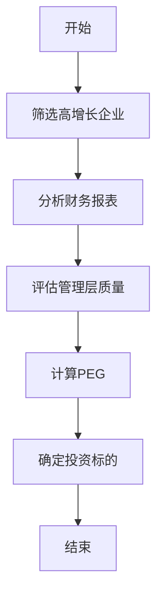
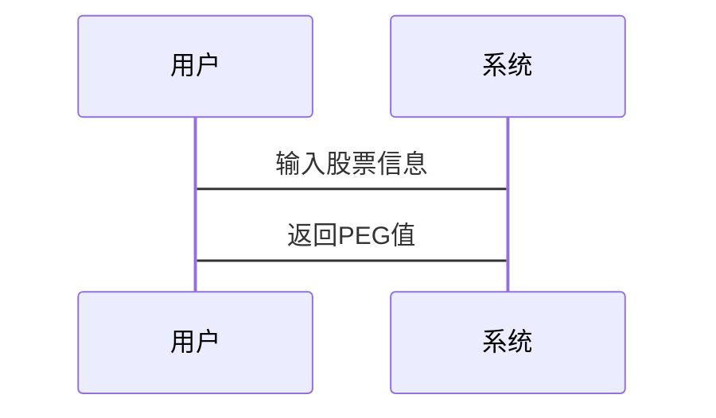

                 


# 费雪的成长型投资案例研究

> 关键词：费雪，成长型投资，投资策略，投资分析，投资案例

> 摘要：本文通过分析费雪的成长型投资理念，结合具体的案例研究，探讨其在投资实践中的应用。文章首先介绍费雪的背景和投资哲学，然后深入解析成长型投资的核心概念，接着通过具体的数学模型和算法原理，分析其投资策略的科学性，最后结合实际案例和系统设计，展示成长型投资的实战应用。

---

## 第1章: 费雪及其投资理念概述

### 1.1 费雪的生平与投资历程

#### 1.1.1 费雪的早年经历与职业发展
菲利普·费雪（Philip Fisher）是20世纪著名的投资家，被誉为“成长型投资之父”。他出生于1907年，早年在华尔街工作，后来成为投资管理公司合伙人。他的投资生涯跨越了数十年，期间积累了丰富的投资经验。

#### 1.1.2 费雪的投资哲学与核心理念
费雪的投资理念以“成长型投资”为核心，主张投资那些具备持续增长潜力的公司。他认为，投资的目的是找到那些能够不断增长的企业，并长期持有它们的股票。

#### 1.1.3 费雪对投资界的影响与贡献
费雪的贡献不仅在于他的投资成果，更在于他提出的一系列投资理论，如“护城河”、“管理层质量”等概念，为后来的价值投资理论奠定了基础。

---

### 1.2 成长型投资的定义与特点

#### 1.2.1 成长型投资的定义
成长型投资是指投资于那些具有持续增长潜力的公司，这些公司通常处于成长期，具有较高的盈利能力和发展空间。

#### 1.2.2 成长型投资的核心特点
- **高增长率**：公司收入和利润持续增长。
- **竞争优势**：公司在行业内具有竞争优势。
- **长期潜力**：公司未来有较大的发展空间。

#### 1.2.3 成长型投资与价值投资的区别与联系
- **区别**：价值投资关注低估的股票，而成长型投资关注高增长的股票。
- **联系**：两者都注重基本面分析，但侧重点不同。

---

## 第2章: 成长型投资的核心概念与理论框架

### 2.1 成长型投资的核心概念

#### 2.1.1 成长型投资的定义与属性
成长型投资的核心在于寻找那些能够持续增长的企业，这些企业通常具有较高的市盈率和市净率。

#### 2.1.2 成长型投资的关键特征对比
| 特征       | 成长型投资 | 价值投资 |
|------------|------------|-----------|
| 侧重点     | 高增长     | 低估值   |
| 投资期限   | 长期       | 中短期   |

#### 2.1.3 成长型投资的ER实体关系图
```mermaid
erDiagram
    customer[投资者] {
        int id
        string name
    }
    stock[股票] {
        int id
        string company_name
        decimal price
    }
    transaction[交易] {
        int id
        date transaction_date
        decimal amount
    }
    customer -> transaction : 进行交易
    stock -> transaction : 相关股票
```

---

### 2.2 成长型投资的数学模型与公式

#### 2.2.1 成长型投资的估值模型
成长型投资常用的估值模型包括PEG（市盈率相对盈利增长比率）和DCF（现金流折现法）。

##### PEG公式：
$$ PEG = \frac{市盈率}{年增长率} $$

##### DCF公式：
$$ V = \sum_{t=1}^{n} \frac{CF_t}{(1 + r)^t} + \frac{TV}{(1 + r)^n} $$

其中，$CF_t$为第$t$年的现金流，$r$为贴现率，$TV$为终值。

#### 2.2.2 成长型投资的收益计算公式
$$ 收益 = （卖出价 - 买入价）/ 买入价 \times 100\% $$

#### 2.2.3 成长型投资的风险评估公式
$$ 风险 = 标准差 \times 投资期限 $$

---

## 第3章: 成长型投资的算法原理与实战应用

### 3.1 成长型投资的算法原理

#### 3.1.1 成长型投资的算法流程图


#### 3.1.2 成长型投资的数学模型与公式
$$ PEG = \frac{市盈率}{年增长率} $$

#### 3.1.3 成长型投资的算法实现代码
```python
def calculate_pe(stock):
    return stock.price / stock.eps

def calculate_growth(stock):
    return (stock.revenue_growth + stock.net_income_growth) / 2

def calculate_peg(stock):
    return calculate_pe(stock) / calculate_growth(stock)

# 示例
class Stock:
    def __init__(self, name, price, eps, revenue_growth, net_income_growth):
        self.name = name
        self.price = price
        self.eps = eps
        self.revenue_growth = revenue_growth
        self.net_income_growth = net_income_growth

stock = Stock("科技公司", 100, 10, 20, 15)
peg = calculate_peg(stock)
print(f"{stock.name}的PEG为：{peg}")
```

---

### 3.2 成长型投资的系统分析与架构设计

#### 3.2.1 系统功能设计
- 用户输入股票信息
- 计算PEG值
- 展示结果

#### 3.2.2 系统架构设计


#### 3.2.3 系统接口设计
- 输入接口：股票名称、股价、EPS、收入增长率、净利润增长率
- 输出接口：PEG值

#### 3.2.4 系统交互设计


---

## 第4章: 成长型投资的经典案例分析

### 4.1 费雪的经典投资案例

#### 4.1.1 苹果公司案例分析
费雪曾投资于苹果公司，在其高速发展阶段，苹果表现出强大的增长潜力。

#### 4.1.2 微软公司案例分析
微软作为科技行业的巨头，符合费雪的成长型投资标准。

#### 4.1.3 亚马逊公司案例分析
亚马逊的持续增长证明了成长型投资的可行性。

---

### 4.2 成长型投资的实战经验总结

#### 4.2.1 投资策略的优化与调整
定期评估投资组合，根据市场变化调整投资标的。

#### 4.2.2 投资组合的管理与风险控制
分散投资，避免过度集中于单一行业或公司。

#### 4.2.3 成长型投资的未来发展趋势
科技、医疗等高增长行业将是未来成长型投资的重点。

---

## 第5章: 成长型投资的系统实现与项目实战

### 5.1 项目实战

#### 5.1.1 环境安装
- Python 3.8+
- Jupyter Notebook

#### 5.1.2 核心代码实现
```python
class InvestmentAnalyzer:
    def __init__(self):
        self.stocks = []

    def add_stock(self, stock):
        self.stocks.append(stock)

    def calculate_peg(self, stock):
        pe = stock.price / stock.eps
        growth = (stock.revenue_growth + stock.net_income_growth) / 2
        return pe / growth

# 示例
if __name__ == "__main__":
    analyzer = InvestmentAnalyzer()
    stock = Stock("科技公司", 100, 10, 20, 15)
    analyzer.add_stock(stock)
    peg = analyzer.calculate_peg(stock)
    print(f"{stock.name}的PEG为：{peg}")
```

#### 5.1.3 代码解读与分析
- `InvestmentAnalyzer`类用于管理股票和计算PEG值。
- `Stock`类封装了股票的基本信息和财务数据。

#### 5.1.4 案例分析
分析某科技公司的PEG值，判断其是否符合成长型投资的标准。

---

## 第6章: 总结与展望

### 6.1 总结
成长型投资是一种长期有效的投资策略，关键在于找到具有持续增长潜力的公司，并长期持有它们的股票。

### 6.2 未来展望
随着科技的发展和行业的变迁，成长型投资将继续演变，投资者需要不断学习和适应市场变化。

### 6.3 投资策略建议
- 选择具有强大竞争优势的公司。
- 长期持有优质资产，避免频繁交易。
- 定期评估投资组合，及时调整。

---

作者：AI天才研究院 & 禅与计算机程序设计艺术

---

通过以上内容，我们详细分析了费雪的成长型投资理念，并结合实际案例和系统设计，展示了其在投资实践中的应用。希望本文能为读者提供有价值的投资思路和方法。

