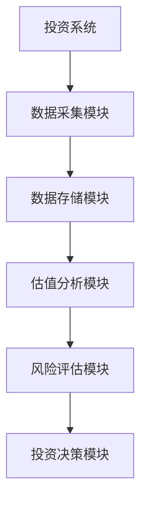

                 


# 费雪的成长型投资陷阱：避免高估值陷阱

---

## 关键词

- 成长型投资
- 费雪投资理论
- 高估值陷阱
- 投资策略
- 投资风险管理

---

## 摘要

本文深入探讨了成长型投资中的高估值陷阱，结合费雪的投资理论，分析了如何识别和避免这些陷阱。通过系统的方法和实际案例，文章为投资者提供了实用的策略和工具，帮助他们在投资过程中做出更明智的决策。

---

## 第一部分：引言

### 第1章：成长型投资与高估值陷阱概述

#### 1.1 成长型投资的基本概念

成长型投资是一种以公司未来增长潜力为核心的投资策略。投资者通过投资于具有持续增长能力的公司，期望获得资本增值。这种策略强调公司基本面的分析，包括收入增长、利润扩张和市场份额的增加。

#### 1.2 高估值陷阱的背景与问题

高估值陷阱是指投资者在追求成长型投资时，由于市场过度炒作或公司基本面变化，导致投资标的估值远高于其内在价值，最终引发投资损失的现象。高估值陷阱的出现通常与市场情绪、信息不对称和投资者的非理性行为有关。

---

## 第二部分：费雪的成长型投资理论

### 第2章：费雪的成长型投资理念

#### 2.1 费雪的投资哲学

菲利普·费雪（Philip Fisher）是成长型投资的鼻祖，他提出了“成长股投资”的概念。费雪的投资哲学可以总结为以下几点：

1. **投资三要素**：
   - **价格**：合理的买入价格，避免支付过高的溢价。
   - **价值**：公司具有持续的增长潜力和内在价值。
   - **成长**：公司具备稳定的收入和利润增长能力。

2. **选股标准**：
   - 公司应具备强大的管理团队和竞争优势。
   - 公司应处于成长行业，并具备广阔的市场前景。

---

## 第三部分：高估值陷阱的识别与分析

### 第3章：高估值陷阱的识别方法

#### 3.1 高估值陷阱的常见表现

高估值陷阱通常表现为以下几种形式：

1. **市盈率过高**：市盈率（P/E）是衡量股票估值的重要指标。当市盈率远高于行业平均水平时，可能意味着公司估值过高。
2. **市净率过高**：市净率（P/B）是股价与每股净资产的比率。高市净率可能表明资产被高估。
3. **PEG比率失衡**：PEG（价格/收益比率）是市盈率与公司盈利增长率的比率。当PEG大于1时，可能表明公司估值过高。

#### 3.2 高估值陷阱的数学模型

以下是用于识别高估值陷阱的数学模型：

1. **市盈率（P/E）计算公式**：
   $$ P/E = \frac{股票价格}{每股净利润} $$

2. **市净率（P/B）计算公式**：
   $$ P/B = \frac{股票价格}{每股净资产} $$

3. **PEG比率计算公式**：
   $$ PEG = \frac{P/E}{净利润增长率} $$

---

## 第四部分：避免高估值陷阱的策略

### 第4章：避免高估值陷阱的策略与工具

#### 4.1 投资组合分散化

通过分散投资，降低单一资产的风险。投资者可以将资金分配到不同行业、不同地区的资产中，以降低整体投资组合的波动性。

#### 4.2 安全边际的设定

在买入股票时，设定一个安全边际，即以低于内在价值的价格买入。例如，以内在价值的80%作为买入价格。

---

## 第五部分：系统分析与架构设计

### 第5章：投资系统架构设计

#### 5.1 系统功能设计

1. **数据采集**：收集市场数据，包括股价、市盈率、市净率等。
2. **估值分析**：计算股票的市盈率、市净率等指标，并与行业平均水平进行比较。
3. **风险评估**：通过数学模型识别高估值陷阱。
4. **投资决策**：根据分析结果，制定买入或卖出决策。

#### 5.2 系统架构设计

以下是一个简化的系统架构图：



---

## 第六部分：项目实战

### 第6章：高估值陷阱识别的项目实战

#### 6.1 环境安装

- **工具**：Python编程语言、数据分析库（如Pandas、NumPy）。
- **数据源**：股票数据（如Yahoo Finance）。

#### 6.2 核心代码实现

以下是一个Python代码示例，用于计算市盈率和市净率：

```python
import pandas as pd
import requests

# 下载股票数据
def get_stock_data(ticker):
    url = f"https://query1.finance.yahoo.com/finance/quote/{ticker}"
    response = requests.get(url)
    data = response.json()
    return data

# 计算市盈率和市净率
def calculate_valuation_ratios(data):
    price = data['price']
    eps = data['eps']
    book_value = data['book_value']
    
    pe_ratio = price / eps
    pb_ratio = price / book_value
    
    return pe_ratio, pb_ratio

# 示例
ticker = "AAPL"
data = get_stock_data(ticker)
pe, pb = calculate_valuation_ratios(data)
print(f"市盈率：{pe}, 市净率：{pb}")
```

---

## 第七部分：总结与展望

### 第7章：总结与投资展望

#### 7.1 投资总结

高估值陷阱是成长型投资中不可忽视的风险。通过深入分析公司基本面、合理估值和分散投资，投资者可以有效降低风险，提高投资收益。

#### 7.2 未来展望

随着市场的发展，投资者需要不断学习和适应新的投资策略。未来，人工智能和大数据分析将在投资决策中发挥越来越重要的作用。

---

## 作者：AI天才研究院/AI Genius Institute & 禅与计算机程序设计艺术 /Zen And The Art of Computer Programming

