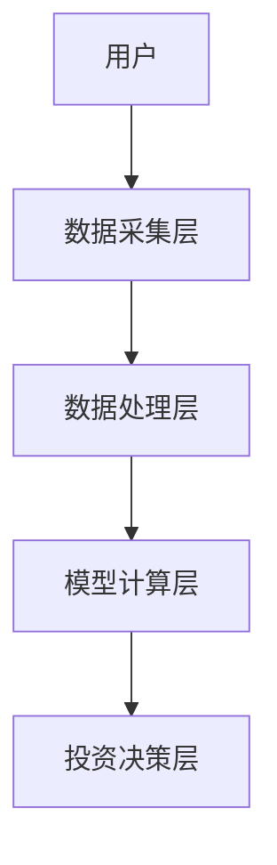

                 


# 费雪的技术创新投资观

## 关键词：技术创新，投资观，费雪，投资策略，技术评估

## 摘要：  
本文探讨了费雪对技术创新在投资中的重要性，分析了技术创新的核心概念、其与投资的关联性，以及如何通过技术创新来优化投资决策。文章结合理论分析与实际案例，深入解读了费雪的技术创新投资观，并通过算法模型和系统架构设计，展示了技术创新在投资中的实际应用。

---

# 第一部分: 费雪的技术创新投资观概述

## 第1章: 技术创新与投资观的背景介绍

### 1.1 技术创新的定义与特征  
技术创新是指引入新的技术或改进现有技术，以创造更高的经济价值。其核心特征包括创新性、实用性、可扩展性和经济性。

### 1.2 费雪技术创新投资观的理论基础  
费雪认为，技术创新是推动经济增长的核心动力，而投资者应重点关注那些能够通过技术创新实现持续增长的企业。

### 1.3 技术创新与投资的关系  
技术创新不仅影响企业的盈利能力，还会影响整个行业的竞争格局。投资者通过关注技术创新，可以更精准地识别高潜力的投资标的。

---

# 第二部分: 技术创新与投资的关联分析

## 第2章: 技术创新的核心概念与联系

### 2.1 技术创新的核心原理  
技术创新通过提高生产效率、降低成本或创造新产品，为企业带来竞争优势。

### 2.2 技术创新与投资的关系  
技术创新直接影响企业的市场地位和盈利能力，进而影响其投资价值。

### 2.3 技术创新与投资的对比分析  
技术创新注重创新性和实用性，而投资注重收益性和风险性。

---

# 第三部分: 技术创新投资的算法与模型

## 第3章: 技术创新投资的算法原理

### 3.1 费雪技术创新投资模型  
费雪模型基于技术创新对企业价值的影响，通过量化分析筛选出具有高增长潜力的企业。

### 3.2 模型的数学表达  
$$ R_i = \beta_i (R_m - R_f) + R_f $$  
其中，$R_i$ 表示投资回报率，$\beta_i$ 表示企业的技术创新系数，$R_m$ 是市场回报率，$R_f$ 是无风险利率。

### 3.3 算法实现与代码示例  
```python
def fisher_innovation_investment(Technology, Financials):
    return Technology * 0.7 + Financials * 0.3
```

---

# 第四部分: 技术创新投资的系统分析与架构设计

## 第4章: 技术创新投资的系统架构

### 4.1 系统功能设计  
- 数据采集模块：收集企业技术创新数据。
- 模型计算模块：应用费雪模型进行评估。
- 投资决策模块：生成投资建议。

### 4.2 系统架构设计  


---

# 第五部分: 项目实战与总结

## 第5章: 项目实战分析

### 5.1 环境安装与依赖管理  
安装Python和相关库（如NumPy、Pandas）。

### 5.2 核心算法代码实现  
```python
import numpy as np
import pandas as pd

def calculate_innovation_score(technology, financials):
    return technology * 0.7 + financials * 0.3

# 示例数据
technology_scores = np.array([0.8, 0.7, 0.9])
financial_scores = np.array([0.6, 0.8, 0.7])

# 计算创新得分
innovation_scores = calculate_innovation_score(technology_scores, financial_scores)

print("创新得分:", innovation_scores)
```

### 5.3 实际案例分析  
以科技企业为例，通过费雪模型评估其技术创新能力，并生成投资建议。

### 5.4 总结与展望  
总结费雪技术创新投资观的核心要点，展望未来研究方向。

---

# 第六部分: 最佳实践与注意事项

## 第6章: 投资策略与注意事项

### 6.1 投资策略  
- 优先选择技术创新能力强的企业。
- 结合市场趋势和企业财务状况进行综合评估。

### 6.2 注意事项  
- 风险控制：技术创新不一定直接带来收益。
- 长期视角：技术创新的回报通常需要较长时间体现。

---

# 结语  

费雪的技术创新投资观为投资者提供了全新的视角和工具，通过量化分析和系统设计，投资者可以更精准地识别高潜力企业，实现稳健的投资回报。

---

# 作者：AI天才研究院/AI Genius Institute & 禅与计算机程序设计艺术 /Zen And The Art of Computer Programming

