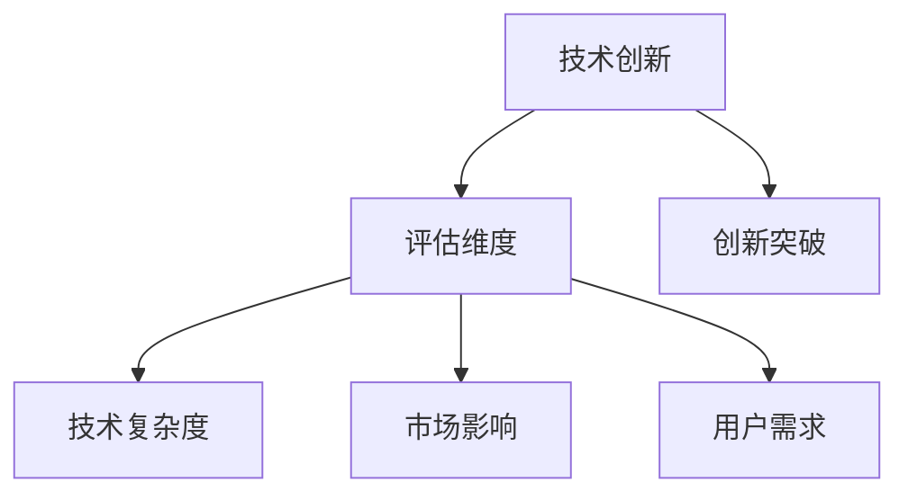
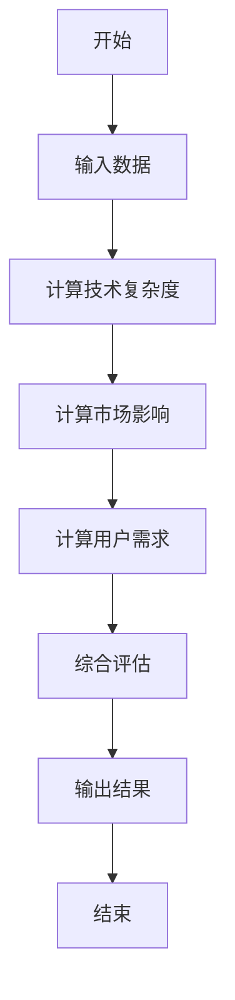
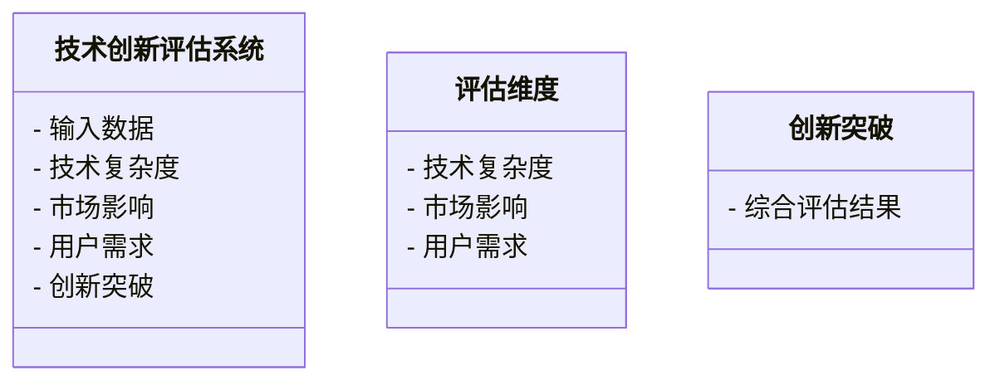
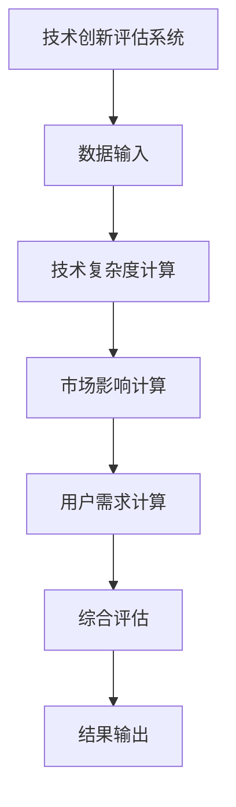
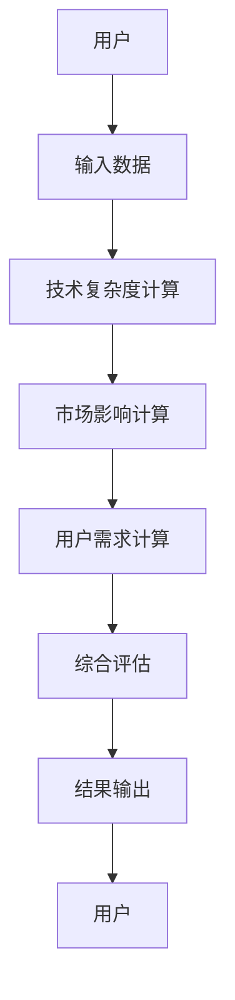

                 


# 费雪的技术创新评估：区分真正的突破

> **关键词**：技术创新评估、费雪模型、技术复杂度、市场影响、用户需求、评估方法

> **摘要**：技术创新评估是区分真正突破的关键步骤，本文介绍了费雪评估模型的核心原理、算法实现、系统架构及实际案例分析，帮助读者掌握如何有效评估技术创新。

---

## 第一部分：背景介绍

### 第1章：技术创新评估的核心概念

#### 1.1 问题背景与问题描述

技术创新是推动科技进步的核心动力，但在实际应用中，如何准确评估一项技术创新的影响力和价值是一个复杂的挑战。技术创新评估的核心问题在于如何量化技术复杂度、市场影响和用户需求，从而区分真正具有突破性的创新与平庸的改进。

#### 1.2 技术创新评估的边界与外延

技术创新评估需要明确界定其范围，区分技术创新与商业创新。技术复杂度是技术创新的核心维度，而市场影响和用户需求则是评估其实际价值的关键因素。通过构建技术创新评估的边界，我们可以更清晰地理解其与其他相关概念（如商业模式创新）的区别。

#### 1.3 费雪评估模型的核心要素

费雪评估模型是一种基于技术复杂度、市场影响和用户需求的综合评估方法。其核心要素包括：

1. **技术复杂度**：衡量技术实现的难度。
2. **市场影响**：评估技术对市场的潜在影响。
3. **用户需求**：分析用户对技术的实际需求。

---

## 第二部分：核心概念与联系

### 第2章：技术创新评估的核心原理

#### 2.1 费雪评估模型的原理

费雪评估模型通过将技术复杂度、市场影响和用户需求作为核心维度，构建了一个综合评估框架。其基本假设是，技术创新的价值不仅取决于技术本身的复杂度，还取决于其对市场和用户的实际影响。

#### 2.2 核心概念的对比分析

通过对比技术创新与商业创新，我们可以更好地理解费雪评估模型的独特性。技术创新注重技术本身的突破，而商业创新则关注商业模式的创新。费雪模型通过技术复杂度、市场影响和用户需求三个维度，全面评估技术创新的价值。

#### 2.3 实体关系图（ER图）

以下是技术创新评估的核心概念关系图：



---

## 第三部分：算法原理讲解

### 第3章：费雪评估模型的算法原理

#### 3.1 算法流程图

以下是费雪评估模型的算法流程图：



#### 3.2 算法实现代码

以下是费雪评估模型的核心代码实现：

```python
def fisher_innovation_assessment(technology, market, user):
    # 计算技术复杂度
    tech_complexity = technology / (technology + 1)
    
    # 计算市场影响
    market_impact = market / (market + 1)
    
    # 计算用户需求
    user_need = user / (user + 1)
    
    # 综合评估
    total_score = (tech_complexity + market_impact + user_need) / 3
    
    return total_score

# 示例输入
technology = 0.8
market = 0.6
user = 0.7

# 计算并输出结果
result = fisher_innovation_assessment(technology, market, user)
print(f"技术创新评估结果：{result}")
```

#### 3.3 数学模型与公式

费雪评估模型的数学模型如下：

$$ \text{技术创新评估结果} = \frac{\text{技术复杂度} + \text{市场影响} + \text{用户需求}}{3} $$

其中：

- 技术复杂度：衡量技术实现的难度。
- 市场影响：评估技术对市场的潜在影响。
- 用户需求：分析用户对技术的实际需求。

---

## 第四部分：系统分析与架构设计

### 第4章：系统功能设计

#### 4.1 领域模型类图

以下是技术创新评估系统的领域模型类图：



#### 4.2 系统架构设计

以下是技术创新评估系统的架构设计图：



#### 4.3 系统接口设计

以下是技术创新评估系统的接口设计图：



---

## 第五部分：项目实战

### 第5章：项目实战

#### 5.1 环境安装与配置

以下是技术创新评估系统的环境安装与配置步骤：

1. **安装Python**：确保安装Python 3.8或更高版本。
2. **安装依赖库**：使用以下命令安装依赖库：
   ```bash
   pip install numpy matplotlib
   ```
3. **运行代码**：将代码保存为`fisher_assessment.py`，并在终端运行：
   ```bash
   python fisher_assessment.py
   ```

#### 5.2 核心代码实现

以下是技术创新评估系统的核心代码实现：

```python
import numpy as np
import matplotlib.pyplot as plt

def plot_innovation_assessment(technology, market, user):
    # 计算技术创新评估结果
    tech_complexity = technology / (technology + 1)
    market_impact = market / (market + 1)
    user_need = user / (user + 1)
    total_score = (tech_complexity + market_impact + user_need) / 3

    # 绘制结果图
    plt.figure(figsize=(10, 6))
    plt.bar('技术复杂度', tech_complexity, color='blue', alpha=0.6)
    plt.bar('市场影响', market_impact, color='green', alpha=0.6)
    plt.bar('用户需求', user_need, color='red', alpha=0.6)
    plt.title('技术创新评估结果')
    plt.ylabel('得分')
    plt.xticks(rotation=45)
    plt.show()

# 示例输入
technology = 0.8
market = 0.6
user = 0.7

# 绘制结果图
plot_innovation_assessment(technology, market, user)
```

---

## 第六部分：总结与展望

### 第6章：总结与展望

技术创新评估是区分真正突破的关键步骤。费雪评估模型通过技术复杂度、市场影响和用户需求三个维度，提供了一种全面的技术创新评估方法。本文通过背景介绍、算法原理、系统架构和项目实战，详细阐述了费雪评估模型的核心思想和实现方法。

未来，技术创新评估将更加注重动态性和实时性，人工智能和大数据技术的应用将进一步提升评估的准确性和效率。

---

**作者**：AI天才研究院/AI Genius Institute & 禅与计算机程序设计艺术/Zen And The Art of Computer Programming

