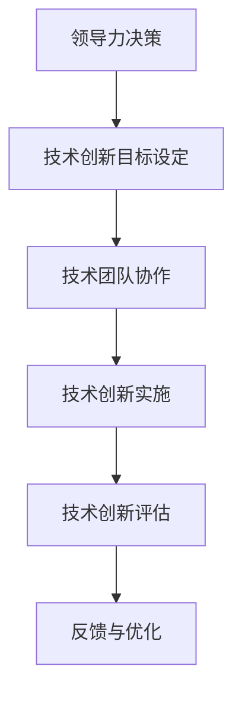

                 


# 费雪的技术创新评估：未来领导者的特征

## 关键词：技术创新评估，未来领导者，领导力，技术评估模型，系统架构

## 摘要：  
费雪的技术创新评估是一种系统化的方法，用于评估技术创新的潜力、可行性和对企业的影响力。本文深入分析了技术创新评估的核心概念、模型和方法，并探讨了未来领导者在技术创新评估中的关键特征。通过结合理论与实践，本文提出了技术创新评估的系统架构和具体实施步骤，同时结合实际案例，总结了未来领导者在技术创新评估中的角色和能力要求。  

---

## 第一部分：技术创新评估的背景与核心概念

### 第1章：技术创新评估的背景与意义

#### 1.1 技术创新的定义与特征
- **技术创新的定义**：技术创新是指引入新的技术或改进现有技术，以提高产品或服务的性能、质量或竞争力。  
- **技术创新的核心特征**：
  - 创新性：与现有技术相比具有显著改进或突破。
  - 实用性：能够解决实际问题或满足市场需求。
  - 可行性：技术实现的可能性和可行性。
- **技术创新与企业发展的关系**：技术创新是企业保持竞争力和持续发展的核心驱动力。

#### 1.2 费雪技术创新评估理论
- **提出背景**：随着技术的快速发展，企业需要更系统化的方法来评估技术创新的潜力和价值。费雪的技术创新评估理论应运而生，旨在为企业提供科学的评估框架。
- **核心思想**：技术创新评估不仅是技术问题，更是一个涉及战略、管理和领导力的系统工程。
- **理论框架**：费雪技术创新评估框架包括技术创新的目标、资源分配、风险评估和利益相关者分析。

---

### 第2章：未来领导者的特征与技术创新

#### 2.1 领导力在技术创新中的作用
- **领导力的核心要素**：
  - 战略思维：制定技术创新的长期目标和战略。
  - 激励团队：激发团队的创新热情和动力。
  - 协调资源：整合技术和人力资源，推动技术创新的实施。
- **领导力在技术创新中的具体表现**：
  - 作为变革推动者，领导者需要打破固有思维，鼓励尝试新方法。
  - 作为决策者，领导者需要在技术创新的关键节点做出果断决策。
  - 作为导师，领导者需要培养团队的技术素养和创新能力。

#### 2.2 未来领导者的特征分析
- **未来领导者的角色定位**：
  - 既是战略家，也是执行者。
  - 既是技术专家，也是商业领袖。
- **未来领导者的技能要求**：
  - 技术敏锐度：理解新技术的发展趋势和潜在价值。
  - 战略思维：制定技术创新战略并协调各方资源。
  - 沟通能力：与技术团队和商业团队高效沟通。
- **未来领导者的创新能力培养**：
  - 鼓励领导者参与技术创新项目，积累实践经验。
  - 提供培训和学习机会，提升技术素养和创新能力。

---

## 第二部分：技术创新评估的核心模型与方法

### 第3章：技术创新评估的核心模型

#### 3.1 费雪技术创新评估模型
- **模型的构成与功能**：
  - 输入：技术创新的目标、技术实现路径、资源分配方案。
  - 输出：技术创新的可行性评估、潜在风险分析、经济效益预测。
- **模型的输入与输出**：
  - 输入：技术创新方案、市场数据、技术团队能力。
  - 输出：技术创新的综合评估结果，包括技术可行性、经济可行性和社会影响。
- **模型的适用范围**：适用于企业内部的技术创新项目评估，尤其适合中高层管理者决策参考。

#### 3.2 技术创新评估的数学模型
- **技术创新潜力的数学表达**：
  $$ P = \sum_{i=1}^{n} (w_i \cdot f_i) $$
  其中，$w_i$ 是第 $i$ 个因素的权重，$f_i$ 是第 $i$ 个因素的评分。
- **技术成熟度的评估公式**：
  $$ M = \frac{\sum_{j=1}^{m} (s_j \cdot t_j)}{\sum_{j=1}^{m} s_j} $$
  其中，$s_j$ 是第 $j$ 项技术的成熟度评分，$t_j$ 是权重系数。
- **技术经济性分析的数学模型**：
  $$ E = \frac{\text{技术创新的净收益}}{\text{技术创新的总成本}} $$

---

### 第4章：技术创新评估的指标体系

#### 4.1 技术创新评估的关键指标
- **技术创新的可行性指标**：
  - 技术实现的难度。
  - 技术的可扩展性和可维护性。
- **技术创新的经济性指标**：
  - 投资回报率（ROI）。
  - 技术的生命周期成本。
- **技术创新的社会影响指标**：
  - 对环境的影响。
  - 对社会就业的带动效应。

#### 4.2 技术创新评估指标的权重分配
- **指标权重的确定方法**：
  - 层次分析法（AHP）：通过专家评分确定各指标的权重。
  - 熵值法：基于数据的离散程度自动计算权重。
- **指标权重的计算与验证**：
  - 通过实际案例验证权重的合理性和准确性。
  - 根据实际情况动态调整权重。

---

## 第三部分：领导力在技术创新评估中的系统架构

### 第5章：领导力的系统分析与架构设计

#### 5.1 领导力在技术创新中的系统模型
- **领导力系统的基本构成**：
  - 战略层：技术创新的目标设定。
  - 执行层：技术创新的具体实施。
  - 监控层：技术创新的监控与反馈。
- **领导力系统的功能模块**：
  - 信息收集与分析：获取技术创新的相关数据。
  - 战略制定：基于数据制定技术创新战略。
  - 资源分配：协调技术、资金和人力资源。
  - 风险管理：识别和应对技术创新中的风险。

#### 5.2 技术创新评估的领导力架构图


---

## 第四部分：技术创新评估的项目实战

### 第6章：技术创新评估的项目实现

#### 6.1 项目环境与工具安装
- **开发环境的配置**：安装必要的编程语言和开发工具（如Python、Java）。
- **评估工具的安装与使用**：选择适合的评估工具（如AHP工具、层次分析法软件）。
- **数据集的准备与预处理**：收集技术创新相关的数据，进行清洗和标准化处理。

#### 6.2 技术创新评估的代码实现
- **代码框架**：
  ```python
  def fisher_technology_assessment(technologies):
      # 输入：技术列表
      # 输出：技术创新评估结果
      pass
  
  def calculate_weights(factors):
      # 输入：影响因素列表
      # 输出：各因素的权重
      pass
  ```

---

## 第五部分：案例分析与总结

### 第7章：案例分析与总结

#### 7.1 案例分析
- **案例背景**：某企业计划引入人工智能技术，提升产品智能化水平。
- **技术创新评估过程**：
  - 评估目标：人工智能技术的可行性。
  - 评估指标：技术成熟度、经济可行性、社会影响。
  - 评估结果：技术成熟度较高，经济可行性良好，社会影响正面。

#### 7.2 总结与展望
- **总结**：技术创新评估是企业制定技术战略的重要工具，未来领导者在这一过程中扮演着关键角色。
- **展望**：随着技术的快速发展，技术创新评估的方法和工具也将不断进步，领导者需要持续学习和提升自己的技术素养和创新能力。

---

## 作者：AI天才研究院/AI Genius Institute & 禅与计算机程序设计艺术 /Zen And The Art of Computer Programming

