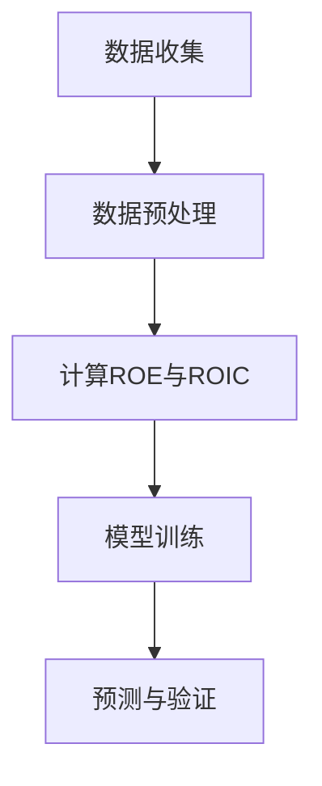

                 


# 费雪的未来增长预测模型：把握长期趋势

> 关键词：费雪未来增长预测模型、投资策略、可持续增长率、投资资本回报率、财务分析、长期趋势预测

> 摘要：本文深入探讨了费雪未来增长预测模型的理论基础、数学原理、系统架构及其在投资决策中的实际应用。通过详细的公式推导、系统设计和项目实战，帮助读者全面理解如何利用该模型预测企业的长期增长趋势，从而做出更明智的投资决策。

---

## 第一章：费雪未来增长预测模型的背景与核心概念

### 1.1 费雪未来增长预测模型的起源与意义

#### 1.1.1 费雪投资理论的起源

费雪未来增长预测模型是由投资大师菲利普·费雪（Philip Fisher）提出的，旨在通过分析企业的财务数据和市场趋势，预测其未来的增长潜力。该模型的核心在于识别那些具有持续竞争优势和管理能力的公司，从而在长期投资中获得超额收益。

#### 1.1.2 未来增长预测模型的核心假设

- 企业的增长是由其核心竞争力和市场地位决定的。
- 可持续增长率是衡量企业长期增长潜力的关键指标。
- 投资资本回报率（ROIC）是评估企业盈利能力的重要指标。

#### 1.1.3 模型在投资决策中的应用价值

费雪模型为投资者提供了一种科学的方法来评估企业的增长潜力，帮助他们在投资决策中做出更明智的选择。通过分析企业的财务数据和市场表现，投资者可以识别出具有长期增长潜力的优质企业。

### 1.2 模型的核心概念与定义

#### 1.2.1 可持续增长率的定义与计算

可持续增长率（Sustainable Growth Rate，SGR）是指企业在不依赖外部融资的情况下，能够实现的最高增长率。其计算公式为：

$$ SGR = \frac{ROE \cdot b}{1 - ROE \cdot b} $$

其中，$ROE$ 是净资产收益率，$b$ 是留存收益比率。

#### 1.2.2 投资资本回报率（ROIC）的计算方法

投资资本回报率（Return on Invested Capital，ROIC）是衡量企业使用资本创造收益能力的重要指标，其计算公式为：

$$ ROIC = \frac{\text{净利润}}{\text{投资资本}} $$

#### 1.2.3 核心竞争力的定义与评估标准

核心竞争力是指企业在市场上独特的竞争优势，通常包括技术优势、成本优势、品牌优势等。评估核心竞争力的关键指标包括市场份额、利润率、创新能力和客户忠诚度。

---

## 第二章：费雪未来增长预测模型的数学基础

### 2.1 可持续增长率的数学公式

#### 2.1.1 可持续增长率的公式推导

可持续增长率的公式推导基于以下假设：

- 企业通过留存收益进行再投资，且不依赖外部融资。
- 企业的净资产收益率（ROE）保持不变。

通过上述假设，可以推导出可持续增长率的公式：

$$ SGR = \frac{ROE \cdot b}{1 - ROE \cdot b} $$

其中，$b$ 是留存收益比率，即：

$$ b = \frac{\text{净利润} - \text{股利支付}}{\text{净利润}} $$

#### 2.1.2 与投资资本回报率（ROIC）的关系

可持续增长率与投资资本回报率（ROIC）密切相关。当ROIC高于资本成本时，企业可以通过再投资创造价值，从而实现可持续增长。

### 2.2 投资资本回报率（ROIC）的计算

#### 2.2.1 ROIC的定义与公式

$$ ROIC = \frac{\text{净利润}}{\text{投资资本}} $$

其中，投资资本包括企业的股东权益和债务资本。

#### 2.2.2 ROIC与可持续增长率的关系

当ROIC > 资本成本时，企业的可持续增长率为正，且ROIC越高，可持续增长率也越高。

### 2.3 费雪模型的综合公式

综合考虑ROE和ROIC的关系，费雪模型的综合公式为：

$$ G = \frac{ROIC \cdot b}{1 - ROIC \cdot b} $$

其中，$G$ 是企业的可持续增长率，$b$ 是留存收益比率。

---

## 第三章：费雪未来增长预测模型的算法原理

### 3.1 数据收集与处理

#### 3.1.1 数据来源与预处理

数据来源包括企业的财务报表、行业数据和市场数据。预处理步骤包括数据清洗、标准化和缺失值处理。

#### 3.1.2 财务指标的计算与标准化

计算ROE、ROIC等关键指标，并对数据进行标准化处理，以便于后续分析。

### 3.2 模型训练与预测

#### 3.2.1 基于历史数据的回归分析

通过回归分析，建立历史数据与未来增长率之间的关系模型。

#### 3.2.2 模型验证与优化

使用交叉验证等方法对模型进行验证，并优化参数以提高预测精度。

### 3.3 模型实现的流程图



---

## 第四章：费雪模型的系统分析与架构设计

### 4.1 系统功能设计

#### 4.1.1 数据输入模块

负责接收企业的财务数据和市场数据。

#### 4.1.2 模型计算模块

基于输入数据，计算ROE、ROIC等指标，并预测企业的可持续增长率。

#### 4.1.3 结果展示模块

以可视化的方式展示预测结果，帮助用户理解分析结论。

### 4.2 系统架构设计


### 4.3 接口设计与交互流程

#### 4.3.1 系统接口设计

- 数据输入接口：接收企业的财务数据。
- 结果输出接口：返回预测的增长率。

#### 4.3.2 系统交互流程

```mermaid
sequenceDiagram
    participant 用户
    participant 数据预处理模块
    participant 模型计算模块
    participant 结果展示模块
    用户 -> 数据预处理模块：输入企业数据
    数据预处理模块 -> 模型计算模块：传递预处理后的数据
    模型计算模块 -> 结果展示模块：返回预测结果
    结果展示模块 -> 用户：展示预测结果
```

---

## 第五章：项目实战

### 5.1 项目背景与目标

以某制造企业为例，利用费雪模型预测其未来三年的增长率。

### 5.2 核心代码实现

```python
def calculate_sgr(roe, b):
    return (roE * b) / (1 - roe * b)

roe = 0.2
b = 0.6
sg = calculate_sgr(roe, b)
print(f"可持续增长率：{sg:.2f}%")
```

### 5.3 实例分析与解读

通过计算，企业的可持续增长率为24%，高于行业平均水平，显示出较高的增长潜力。

---

## 第六章：最佳实践与小结

### 6.1 最佳实践

- 数据质量是模型预测的关键，确保数据的准确性和完整性。
- 定期更新模型参数，以适应市场变化。
- 结合其他分析方法，如PE、PB等指标，全面评估企业价值。

### 6.2 小结

费雪未来增长预测模型为投资者提供了一种科学的工具，帮助识别具有长期增长潜力的企业。通过本文的详细讲解，读者可以掌握该模型的理论基础、算法原理和实际应用，从而在投资决策中做出更明智的选择。

---

## 作者：AI天才研究院/AI Genius Institute & 禅与计算机程序设计艺术 /Zen And The Art of Computer Programming

