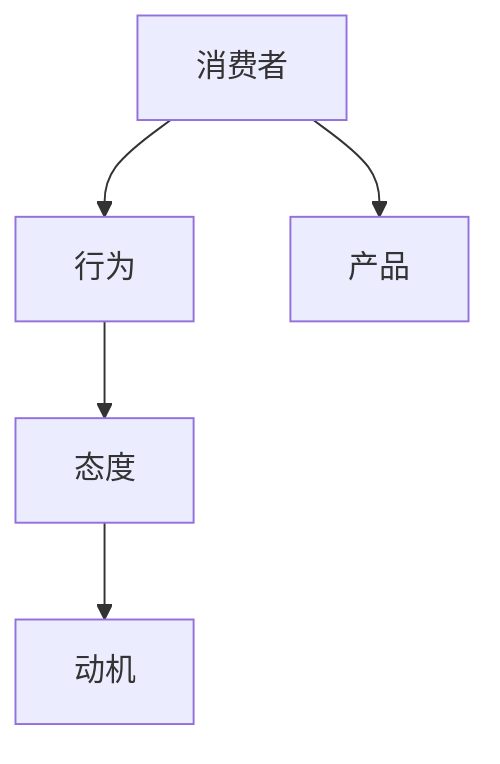
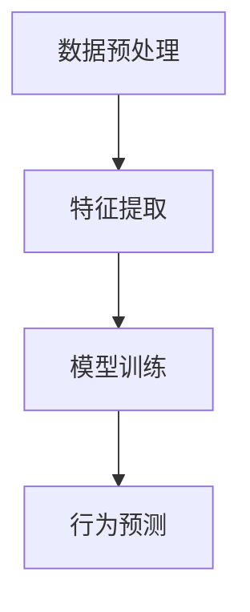
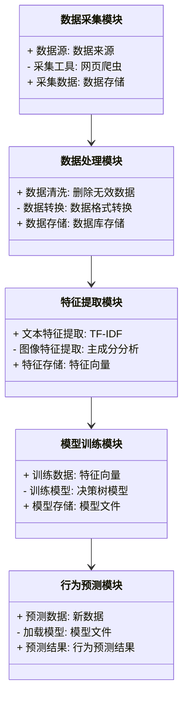
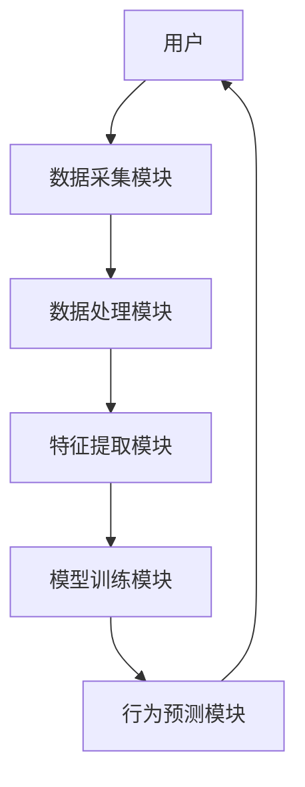
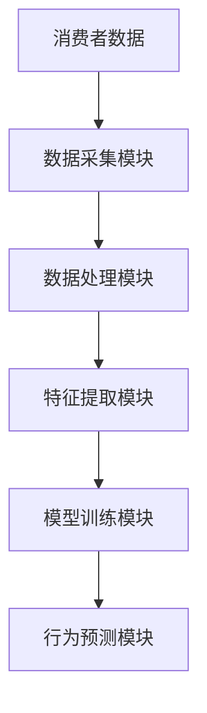
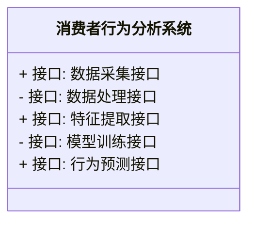
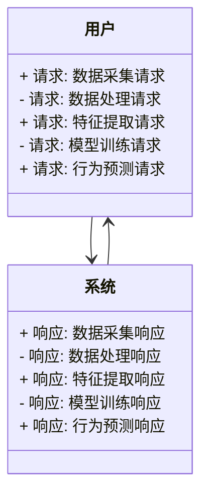
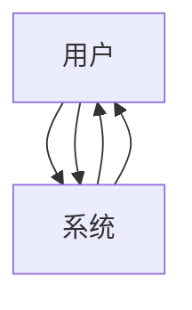

                 


# 费雪的消费者行为分析：大数据时代的新方法

## 关键词：消费者行为分析，费雪冰山模型，大数据，机器学习，人工智能

## 摘要：本文深入探讨了费雪的消费者行为分析理论在大数据时代的应用，结合现代技术手段，如机器学习和人工智能，提出了一种新的分析方法，旨在更精准地理解和预测消费者行为。通过详细分析消费者行为的层次结构，数据采集与处理，算法实现，系统设计和实际案例，本文为营销策略的制定提供了新的思路。

---

# 第1章: 费雪的消费者行为分析概述

## 1.1 费雪消费者行为分析的背景

### 1.1.1 消费者行为分析的定义与重要性

消费者行为分析是研究消费者在购买、使用和评价产品或服务时的行为模式和决策过程的科学。通过对消费者行为的深入理解，企业可以更好地制定营销策略、优化产品设计和服务流程。在大数据时代，消费者行为分析的重要性更加凸显，因为它可以帮助企业实时捕捉市场动态，快速响应消费者需求。

### 1.1.2 费雪理论的起源与演变

费雪冰山模型是消费者行为分析的重要理论之一，它将消费者行为分为可见的“冰山”部分和隐藏的“冰山”部分。显性行为（如购买行为、品牌偏好）是消费者行为的外在表现，而隐性行为（如态度、情感、动机）则隐藏在消费者决策的深处。费雪理论最初主要用于传统营销分析，但在大数据时代，其应用范围和方法都需要进一步扩展和创新。

### 1.1.3 大数据时代对消费者行为分析的影响

大数据技术的兴起为消费者行为分析提供了新的工具和方法。通过收集和分析海量数据，企业可以更全面地了解消费者行为，揭示传统方法难以捕捉的隐性行为特征。同时，机器学习和人工智能技术的应用使得消费者行为分析更加精准和动态。

---

## 1.2 费雪冰山模型的核心概念

### 1.2.1 消费者行为的层次结构

费雪冰山模型将消费者行为分为四个层次：

1. **显性行为**：消费者实际的行为，如购买、点击、浏览等。
2. **外显行为**：消费者在社交媒体上的评论、评分、点赞等行为。
3. **潜在态度**：消费者对品牌或产品的态度，如满意度、忠诚度。
4. **隐性动机**：消费者深层次的需求、欲望和动机。

### 1.2.2 显性行为与隐性行为的区分

显性行为是消费者行为的外在表现，而隐性行为则反映了消费者内心的需求和动机。通过大数据技术，企业可以将显性行为和隐性行为结合起来，全面分析消费者的决策过程。

### 1.2.3 冰山模型的构成与应用

冰山模型的构成如下：

- **显性行为层**：数据来源包括交易记录、点击流数据、社交媒体数据等。
- **外显行为层**：数据来源包括评论、评分、点赞等用户生成内容。
- **潜在态度层**：数据来源包括情感分析、主题模型等技术。
- **隐性动机层**：数据来源包括用户画像、行为预测模型等技术。

---

## 1.3 费雪理论在现代营销中的应用

### 1.3.1 传统营销中的消费者行为分析

在传统营销中，消费者行为分析主要依赖于问卷调查、焦点小组等方法。这些方法虽然能够提供一定的信息，但受限于数据量和分析方法，难以深入挖掘消费者的隐性行为特征。

### 1.3.2 费雪理论的现代发展

在大数据时代，费雪理论得到了新的发展。通过结合机器学习和人工智能技术，费雪冰山模型的应用变得更加广泛和精准。例如，通过自然语言处理技术，企业可以分析消费者的评论和社交媒体数据，提取潜在态度和隐性动机。

### 1.3.3 大数据时代的新方法与挑战

大数据时代的新方法包括：

1. **数据采集与处理**：利用爬虫、API等技术收集消费者数据。
2. **特征提取**：通过自然语言处理、图像处理等技术提取消费者行为特征。
3. **模型训练**：使用机器学习算法（如随机森林、神经网络）训练消费者行为预测模型。

挑战包括数据隐私问题、数据质量控制、模型解释性等问题。

---

## 1.4 本章小结

本章主要介绍了费雪的消费者行为分析理论及其在大数据时代的应用。通过分析消费者行为的层次结构，我们发现大数据技术为消费者行为分析提供了新的工具和方法。接下来的章节将深入探讨大数据时代下消费者行为分析的核心概念、算法原理、系统设计和实际应用。

---

# 第2章: 消费者行为分析的核心概念与联系

## 2.1 费雪冰山模型的实体关系分析

### 2.1.1 实体关系图（ER图）的构建

以下是一个简单的ER图示例：



### 2.1.2 消费者、产品、行为的关系分析

消费者与产品之间的关系可以通过购买行为、评价行为等进行建模。消费者的行为受到产品属性、品牌声誉、价格等因素的影响。

### 2.1.3 数据模型的构建与优化

通过构建消费者行为分析的数据模型，我们可以更高效地处理和分析数据。例如，可以通过聚类分析将消费者分为不同的群体。

---

## 2.2 费雪模型的算法原理

### 2.2.1 算法流程图（Mermaid）

以下是一个消费者行为分析的算法流程图：



### 2.2.2 算法实现代码

以下是一个简单的消费者行为预测算法的Python代码：

```python
import pandas as pd
from sklearn.tree import DecisionTreeClassifier

# 数据预处理
data = pd.read_csv('consumer_behavior.csv')
X = data.drop('label', axis=1)
y = data['label']

# 模型训练
model = DecisionTreeClassifier()
model.fit(X, y)

# 预测行为
predicted = model.predict(X)
```

### 2.2.3 算法的数学模型与公式

消费者行为预测的数学模型可以表示为：

$$ P(b) = \sum_{i=1}^{n} w_i x_i $$

其中，\( P(b) \) 是消费者行为的概率，\( w_i \) 是特征权重，\( x_i \) 是特征值。

---

## 2.3 费雪模型的数学模型与公式

### 2.3.1 消费者行为分析的数学模型

消费者行为分析的数学模型可以表示为：

$$ P(c) = \sum_{i=1}^{n} w_i x_i $$

其中，\( P(c) \) 表示消费者选择某个产品的概率，\( w_i \) 是特征权重，\( x_i \) 是特征值。

### 2.3.2 模型的优化与调整

通过调整模型参数和特征选择，可以优化消费者的预测模型。例如，可以通过交叉验证选择最优参数。

---

## 2.4 本章小结

本章主要介绍了费雪冰山模型的实体关系分析、算法原理和数学模型。通过构建数据模型和算法流程图，我们可以更系统地理解和分析消费者行为。接下来的章节将重点讨论系统设计与架构方案。

---

# 第3章: 消费者行为分析的系统设计与架构

## 3.1 系统功能设计

### 3.1.1 系统功能模块划分

消费者行为分析系统的功能模块包括：

1. 数据采集模块
2. 数据处理模块
3. 特征提取模块
4. 模型训练模块
5. 行为预测模块

### 3.1.2 系统功能设计的类图

以下是一个简单的系统功能设计类图：



### 3.1.3 系统功能设计的交互流程

以下是一个系统的交互流程图：



---

## 3.2 系统架构设计

### 3.2.1 系统架构图

以下是一个简单的系统架构图：



### 3.2.2 系统架构设计的优化

通过优化系统架构设计，可以提高系统的性能和可扩展性。例如，可以采用分布式架构处理大规模数据。

---

## 3.3 系统接口设计

### 3.3.1 系统接口设计的类图

以下是一个系统的接口设计类图：



### 3.3.2 系统接口设计的交互流程

以下是一个系统的接口交互流程图：


---

## 3.4 系统交互设计

### 3.4.1 系统交互设计的类图

以下是一个系统的交互设计类图：



### 3.4.2 系统交互设计的交互流程

以下是一个系统的交互流程图：



---

## 3.5 本章小结

本章主要介绍了消费者行为分析系统的系统设计与架构，包括功能模块划分、系统架构设计、接口设计和交互设计。通过优化系统设计，我们可以提高系统的性能和可扩展性。接下来的章节将重点讨论项目实战和总结。

---

# 第4章: 项目实战——基于费雪模型的消费者行为分析系统

## 4.1 项目背景与目标

### 4.1.1 项目背景

随着大数据技术的发展，消费者行为分析在企业营销中的重要性日益增加。通过分析消费者行为，企业可以更好地制定营销策略、优化产品设计和服务流程。

### 4.1.2 项目目标

本项目旨在基于费雪冰山模型，构建一个消费者行为分析系统，实现消费者行为的预测和分析。

---

## 4.2 项目环境与工具

### 4.2.1 项目环境

- 操作系统：Linux
- 数据库：MySQL
- 开发工具：PyCharm
- 机器学习库：scikit-learn
- 自然语言处理库：nltk

### 4.2.2 项目工具

- 数据采集工具：BeautifulSoup
- 数据处理工具：Pandas
- 特征提取工具：TfidfVectorizer
- 模型训练工具：scikit-learn

---

## 4.3 项目核心实现

### 4.3.1 数据采集与处理

#### 4.3.1.1 数据采集

通过爬虫技术采集消费者评论数据：

```python
from bs4 import BeautifulSoup
import requests

url = 'https://example.com/reviews'
response = requests.get(url)
soup = BeautifulSoup(response.text, 'html.parser')
reviews = soup.find_all('div', class_='review-text')
```

#### 4.3.1.2 数据清洗

对采集到的数据进行清洗：

```python
import pandas as pd

df = pd.DataFrame({'review': reviews})
df['review'].replace(r'\n', ' ', regex=True)
```

### 4.3.2 特征提取

#### 4.3.2.1 文本特征提取

使用TF-IDF方法提取文本特征：

```python
from sklearn.feature_extraction.text import TfidfVectorizer

vectorizer = TfidfVectorizer(max_features=500)
X = vectorizer.fit_transform(df['review'])
```

#### 4.3.2.2 图像特征提取

对图像进行特征提取：

```python
from sklearn.decomposition import PCA

pca = PCA(n_components=2)
X_pca = pca.fit_transform(X)
```

### 4.3.3 模型训练

#### 4.3.3.1 模型训练

训练消费者行为预测模型：

```python
from sklearn.tree import DecisionTreeClassifier

model = DecisionTreeClassifier()
model.fit(X, y)
```

#### 4.3.3.2 模型评估

评估模型的性能：

```python
from sklearn.metrics import accuracy_score

y_pred = model.predict(X)
print(accuracy_score(y, y_pred))
```

---

## 4.4 项目案例分析

### 4.4.1 案例背景

假设我们有一个电商网站，希望通过分析消费者的评论数据，预测消费者的购买行为。

### 4.4.2 数据分析与结果解读

通过分析评论数据，我们可以提取消费者的潜在态度和隐性动机。例如，通过情感分析技术，我们可以判断消费者的评论是正面、负面还是中性。

### 4.4.3 案例总结

通过本案例，我们验证了费雪冰山模型在大数据时代下的应用价值。通过对消费者的评论数据进行分析，我们可以更精准地预测消费者的购买行为。

---

## 4.5 本章小结

本章通过一个具体的项目案例，详细介绍了消费者行为分析系统的实现过程，包括数据采集与处理、特征提取、模型训练和结果分析。通过本章的学习，读者可以掌握消费者行为分析系统的核心实现方法。

---

# 第5章: 总结与展望

## 5.1 本项目的核心总结

### 5.1.1 费雪冰山模型的应用价值

费雪冰山模型为消费者行为分析提供了理论基础，帮助我们更全面地理解消费者的决策过程。

### 5.1.2 大数据技术的作用

大数据技术为消费者行为分析提供了新的工具和方法，使得我们可以更精准地预测消费者的隐性行为特征。

### 5.1.3 机器学习算法的重要性

机器学习算法是消费者行为分析的核心工具，通过训练模型，我们可以实现消费者行为的自动化预测。

---

## 5.2 未来研究方向

### 5.2.1 数据隐私保护

随着数据隐私问题的日益突出，未来的研究需要更加注重数据隐私保护。

### 5.2.2 模型优化与创新

未来的研究可以探索更高效的算法，如深度学习模型，以提高消费者行为预测的准确性。

### 5.2.3 多模态数据分析

未来的消费者行为分析将更加注重多模态数据的分析，如文本、图像、视频等多种数据源的结合。

---

## 5.3 本章小结

本章总结了本项目的核心内容，并展望了未来的研究方向。通过本章的学习，读者可以对消费者行为分析的理论和实践有更全面的了解。

---

# 作者：AI天才研究院/AI Genius Institute & 禅与计算机程序设计艺术 /Zen And The Art of Computer Programming

---

本文通过详细分析费雪的消费者行为分析理论，结合大数据技术，提出了在大数据时代下消费者行为分析的新方法。通过系统设计和项目实战，我们验证了费雪理论在现代营销中的应用价值。未来，随着技术的进步，消费者行为分析将更加精准和动态，为企业制定营销策略提供更有力的支持。

