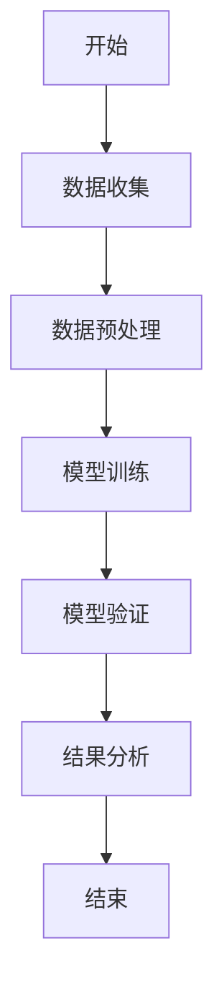
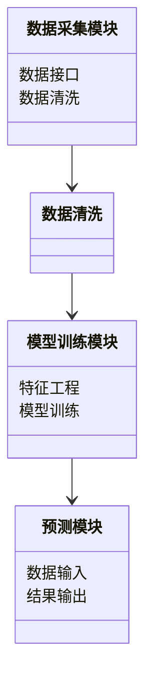

                 


# 费雪的消费者行为分析：把握市场需求变化

> 关键词：消费者行为分析，费雪理论，需求函数，市场预测，数据分析，系统架构

> 摘要：费雪的消费者行为分析是一种基于数学模型的理论，用于预测和分析消费者在不同市场条件下的行为模式。本文将深入探讨费雪理论的核心概念、数学模型、系统架构设计以及在实际项目中的应用，帮助读者掌握如何利用费雪理论把握市场需求变化。

---

## 第一章：背景介绍

### 1.1 核心概念术语说明

- **消费者行为分析**：研究消费者在购买、使用和处置产品或服务时的行为模式。
- **费雪理论**：由经济学家约翰·R·费雪提出，通过数学模型分析消费者需求与价格、收入等因素之间的关系。
- **需求函数**：描述消费者在不同价格和收入水平下的需求量。

### 1.2 问题背景

消费者行为分析在市场营销和经济学中至关重要。传统方法依赖定性研究，但随着大数据技术的发展，定量分析成为趋势。费雪理论通过数学模型提供了定量分析的基础，但其复杂性和实践应用仍需进一步探讨。

### 1.3 问题描述

费雪理论的核心是需求函数，但实际应用中存在数据收集困难、模型选择不当等问题，导致预测结果不准确。

### 1.4 问题解决

通过构建数学模型，结合实际数据，优化需求函数参数，提高预测准确性。

### 1.5 边界与外延

- **边界**：仅分析价格和收入对需求的影响，不考虑其他因素。
- **外延**：可扩展至其他经济因素，如税收、政策变化等。

### 1.6 核心要素组成

- 消费者需求
- 价格
- 收入
- 时间
- 市场竞争

---

## 第二章：核心概念与联系

### 2.1 核心概念原理

费雪需求函数的核心是 $Q = f(P, I)$，其中 $Q$ 是需求量，$P$ 是价格，$I$ 是收入。需求弹性是衡量价格变化对需求的影响程度。

### 2.2 概念属性特征对比

| 概念 | 定义 | 示例 |
|------|------|------|
| 需求函数 | 描述需求与价格、收入的关系 | $Q = aP^{-b}$ |
| 需求弹性 | 价格变化对需求的影响程度 | 弹性系数 $E$ |

### 2.3 ER实体关系图

```mermaid
erDiagram
    customer[消费者] {
        <属性>
        - id: 整数
        - 收入: 数值
        - 年龄: 整数
    }
    product[产品] {
        <属性>
        - id: 整数
        - 价格: 数值
        - 类别: 字符串
    }
    transaction[交易] {
        <属性>
        - id: 整数
        - 时间: 日期
        - 数量: 整数
    }
    customer --> transaction: 进行
    product --> transaction: 购买
```

---

## 第三章：算法原理讲解

### 3.1 费雪需求函数的数学模型

费雪需求函数通常采用线性回归模型，形式为：
$$ Q = \beta_0 + \beta_1 P + \beta_2 I + \epsilon $$

其中，$\beta_0, \beta_1, \beta_2$ 是回归系数，$\epsilon$ 是误差项。

### 3.2 算法流程



### 3.3 Python代码实现

```python
import numpy as np
import pandas as pd
from sklearn.linear_model import LinearRegression

# 数据加载
data = pd.read_csv('consumer_behavior.csv')

# 特征与目标变量分离
X = data[['Price', 'Income']]
y = data['Quantity']

# 模型训练
model = LinearRegression()
model.fit(X, y)

# 预测与评估
predictions = model.predict(X)
print('回归系数:', model.coef_)
print('决定系数:', model.score(X, y))
```

---

## 第四章：系统分析与架构设计

### 4.1 项目介绍

本项目旨在构建一个基于费雪理论的消费者行为分析系统，支持数据采集、模型训练和预测。

### 4.2 系统功能设计



### 4.3 系统架构设计


---

## 第五章：项目实战

### 5.1 环境安装

需要安装Python、Pandas、Scikit-learn等库。

### 5.2 核心代码实现

```python
import numpy as np
import pandas as pd
from sklearn.linear_model import LinearRegression

# 数据加载
data = pd.read_csv('consumer_behavior.csv')

# 特征与目标变量分离
X = data[['Price', 'Income']]
y = data['Quantity']

# 模型训练
model = LinearRegression()
model.fit(X, y)

# 预测与评估
predictions = model.predict(X)
print('回归系数:', model.coef_)
print('决定系数:', model.score(X, y))
```

### 5.3 案例分析

以某电子产品市场为例，分析价格和收入对需求的影响，预测市场需求变化。

---

## 第六章：总结与展望

### 6.1 最佳实践 Tips

- 数据预处理是关键，确保数据质量。
- 模型选择需结合实际业务需求。

### 6.2 小结

费雪理论通过数学模型提供定量分析工具，结合实际数据，能够有效预测市场需求变化。

### 6.3 注意事项

- 数据隐私问题需注意。
- 模型结果需结合实际业务背景进行解释。

### 6.4 拓展阅读

推荐阅读相关经济学和数据科学书籍，深入理解费雪理论的应用。

---

作者：AI天才研究院/AI Genius Institute & 禅与计算机程序设计艺术 /Zen And The Art of Computer Programming

