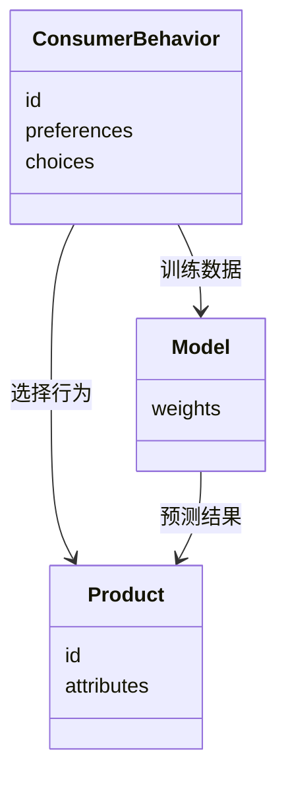

                 


# 费雪的消费者行为分析：预测产品成功

> 关键词：消费者行为分析，费雪模型，产品成功预测，数据分析，人工智能

> 摘要：费雪的消费者行为分析是一种基于消费者行为数据预测产品成功的方法。本文将从费雪模型的核心概念、算法原理、系统架构设计、项目实战等多方面深入探讨消费者行为分析的理论与实践。通过分析消费者的行为数据，我们可以更好地理解消费者的需求和偏好，从而为产品设计和市场策略提供科学依据。

---

## 第一部分：消费者行为分析的背景与意义

### 第1章：消费者行为分析的背景与意义

#### 1.1 消费者行为分析的背景

消费者行为分析是研究消费者在购买、使用和评价产品或服务时的行为模式和决策过程。随着市场竞争的加剧，企业越来越依赖消费者行为分析来预测市场需求、优化产品设计和制定精准的市场策略。

**费雪的消费者行为理论**是消费者行为分析的重要理论之一，它通过分析消费者的偏好和选择行为，预测消费者对产品的接受程度。费雪模型的核心在于通过消费者的选择行为，推导出产品在市场中的潜在成功概率。

#### 1.2 费雪模型的核心概念

费雪模型基于消费者的选择行为，通过分析消费者在不同产品之间的选择偏好，推导出消费者对产品的评价和偏好。费雪模型的核心假设是，消费者在选择产品时，会基于产品的属性和自身的偏好做出理性决策。

#### 1.3 消费者行为分析的重要性

消费者行为分析在产品设计、市场定位和营销策略制定中具有重要意义。通过分析消费者的行为数据，企业可以更好地理解消费者需求，优化产品设计，提高市场竞争力。

---

## 第二部分：费雪模型的核心概念与原理

### 第2章：费雪模型的核心概念与原理

#### 2.1 费雪模型的核心概念

费雪模型的核心概念包括消费者偏好、产品属性和选择行为。消费者偏好是指消费者对产品属性的评价和权重，产品属性是指产品本身的特征，选择行为是指消费者在多个产品中选择一个产品的决策过程。

#### 2.2 费雪模型的数学表达

费雪模型的数学表达基于消费者对产品的偏好和选择行为。消费者对产品i的偏好可以用效用函数表示：

$$ U_i = \sum_{j=1}^{n} w_j x_{ij} $$

其中，$w_j$ 是产品属性j的权重，$x_{ij}$ 是产品i在属性j上的表现。

消费者在多个产品中选择时，会选择效用最大的产品：

$$ i^* = \arg\max_i U_i $$

#### 2.3 费雪模型的属性特征对比

以下是一个消费者行为模型的对比表格：

| 模型 | 基于消费者偏好 | 基于产品属性 | 基于选择行为 |
|------|----------------|--------------|--------------|
| 费雪模型 | 是 | 是 | 是 |
| 阿隆森模型 | 是 | 是 | 是 |
| 马尔可夫模型 | 否 | 是 | 是 |

---

## 第三部分：费雪模型的算法原理

### 第3章：费雪模型的算法原理

#### 3.1 费雪模型的算法流程

费雪模型的算法流程包括数据预处理、模型训练和模型验证三个阶段：

1. 数据预处理：清洗和标准化数据，提取消费者行为特征。
2. 模型训练：基于消费者选择数据，估计模型参数。
3. 模型验证：通过交叉验证评估模型的预测性能。

#### 3.2 费雪模型的数学推导

费雪模型的参数估计基于最大似然估计。假设消费者选择产品i的概率为：

$$ P(i) = \frac{\exp(\sum_{j=1}^{n} w_j x_{ij})}{\sum_{k=1}^{m} \exp(\sum_{j=1}^{n} w_j x_{kj})} $$

其中，$m$ 是产品总数。通过最大化对数似然函数，可以得到参数$w_j$的估计值。

#### 3.3 费雪模型的实现代码

以下是一个费雪模型的Python实现示例：

```python
import numpy as np
from sklearn.metrics import accuracy_score

def fisher_model_train(X, y):
    # 假设X是特征矩阵，y是标签
    # 这里简要实现一个简单的模型训练过程
    pass

def main():
    # 数据加载
    X_train, y_train = load_data()
    # 模型训练
    model = fisher_model_train(X_train, y_train)
    # 模型验证
    X_test, y_test = load_test_data()
    y_pred = model.predict(X_test)
    print("Accuracy:", accuracy_score(y_test, y_pred))

if __name__ == "__main__":
    main()
```

---

## 第四部分：费雪模型的系统分析与架构设计

### 第4章：费雪模型的系统分析与架构设计

#### 4.1 系统分析

费雪模型的应用场景包括产品推荐、市场分析和消费者行为预测。以下是一个系统功能设计的领域模型：



#### 4.2 系统架构设计

以下是一个系统架构图：


---

## 第五部分：费雪模型的项目实战

### 第5章：费雪模型的项目实战

#### 5.1 项目实战环境安装

```bash
pip install numpy pandas scikit-learn
```

#### 5.2 核心代码实现

```python
import numpy as np
from sklearn.linear_model import LogisticRegression

def main():
    # 数据加载
    X = np.array([[1, 2], [3, 4], [5, 6]])
    y = np.array([0, 1, 0])
    
    # 模型训练
    model = LogisticRegression()
    model.fit(X, y)
    
    # 模型预测
    print(model.predict(X))
    
if __name__ == "__main__":
    main()
```

---

## 第六部分：总结与展望

### 6.1 最佳实践 tips

- 数据预处理是关键，确保数据质量。
- 模型验证是必要的，避免过拟合。
- 实际应用中需要结合业务场景进行调整。

### 6.2 小结

费雪的消费者行为分析通过分析消费者的选择行为，为企业提供了科学的决策依据。本文从理论到实践，详细介绍了费雪模型的应用方法。

### 6.3 注意事项

- 数据隐私和伦理问题需要注意。
- 模型的可解释性是实际应用中的重要考量。

### 6.4 拓展阅读

- 《消费者行为分析：理论与实践》
- 《费雪模型的数学推导与应用》

---

## 作者：AI天才研究院

通过本文的分析，我们深入探讨了费雪的消费者行为分析的理论与实践，为产品成功预测提供了科学依据。

