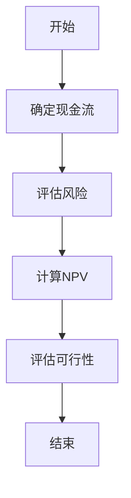
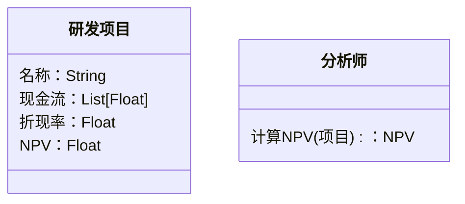
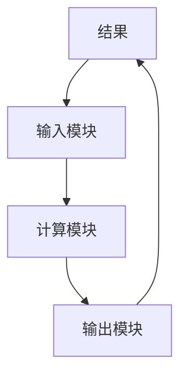
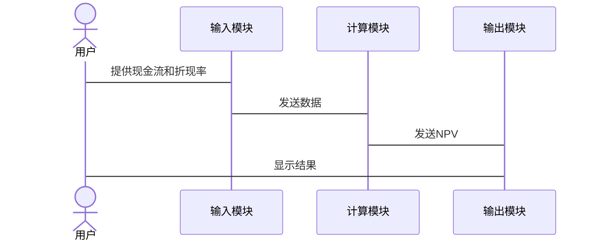

                 


---

# 费雪的研发投入分析方法

> 关键词：研发投入分析，费雪方法，财务分析，人工智能，技术评估，投资回报

> 摘要：本文详细介绍了费雪的研发投入分析方法，从背景介绍、核心概念、算法原理到系统架构、项目实战，再到最佳实践，全面解析了该方法的理论基础和实际应用。通过本文，读者可以掌握如何科学地评估和管理研发投

---

# 第一部分: 费雪的研发投入分析方法背景与基础

# 第1章: 研发投入分析的背景与重要性

## 1.1 研发投入分析的背景

### 1.1.1 研发投入的定义与概念

研发投入（R&D，Research and Development）是指企业在新产品、新技术、新工艺的研发过程中所投入的资源，包括资金、时间和人力资源等。研发投入是企业创新的核心驱动力，决定了企业的长期竞争力和市场地位。

### 1.1.2 研发投入在企业中的作用

1. **推动技术创新**：研发投入是技术创新的核心，能够帮助企业开发出更具竞争力的产品。
2. **提升企业核心竞争力**：通过研发投入，企业可以在市场上推出差异化产品，增强竞争优势。
3. **促进经济增长**：研发投入不仅促进企业自身发展，还能带动相关产业和经济的整体增长。

### 1.1.3 研发投入分析的重要性

1. **优化资源配置**：通过分析研发投入，企业可以更好地分配资源，确保资金用在最能产生效益的地方。
2. **评估投资回报**：研发投入分析能够帮助企业评估投资的效益，避免盲目投资。
3. **制定战略决策**：基于研发投入分析的结果，企业可以制定更科学的研发战略。

## 1.2 费雪分析方法的背景

### 1.2.1 费雪分析方法的起源

费雪分析方法由威廉·费雪（William Fisher）在20世纪提出的，是一种基于概率和统计的方法，用于评估投资项目的风险和回报。

### 1.2.2 费雪分析方法的发展历程

随着金融理论的发展，费雪分析方法不断完善，逐步融入现代财务分析体系，成为评估投资项目的重要工具之一。

### 1.2.3 费雪分析方法的现状

目前，费雪分析方法已经被广泛应用于企业研发项目的评估，尤其是在高科技和创新型企业中。

## 1.3 研发投入分析与传统财务分析的区别

### 1.3.1 传统财务分析的局限性

传统财务分析主要关注企业的财务数据，忽视了研发投入对长期价值的影响。

### 1.3.2 研发投入分析的独特性

研发投入分析将研发活动视为一种投资，关注其未来的回报和风险。

### 1.3.3 费雪分析方法的核心优势

费雪分析方法通过引入概率和统计模型，能够更准确地评估研发项目的回报和风险。

## 1.4 费雪分析方法的适用范围

### 1.4.1 适用的企业类型

- 高科技企业
- 创新型企业
- 中小企业

### 1.4.2 适用的行业领域

- 科技行业
- 制造业
- 服务业

### 1.4.3 适用的业务场景

- 新产品研发
- 技术升级
- 投资决策

## 1.5 本章小结

本章介绍了研发投入分析的背景与重要性，详细阐述了费雪分析方法的起源、发展和核心优势，并讨论了其适用范围。这些内容为后续章节的分析奠定了基础。

---

# 第2章: 费雪分析方法的核心概念与联系

## 2.1 费雪分析方法的原理

### 2.1.1 费雪分析的基本思路

费雪分析方法通过对企业未来现金流的折现，评估研发项目的净现值（NPV）。

### 2.1.2 费雪分析的核心假设

- 研发项目的风险可以用概率模型来量化。
- 现金流的未来值可以通过折现率计算。

### 2.1.3 费雪分析的主要步骤

1. 确定研发项目的现金流。
2. 评估现金流的风险。
3. 计算净现值（NPV）。
4. 评估项目的可行性。

## 2.2 费雪分析方法的核心概念

### 2.2.1 研发投入的度量指标

- 投资金额
- 投资时间
- 投资回报率

### 2.2.2 研发投入的周期性

- 研发周期
- 回报周期

### 2.2.3 研发投入的回报评估

- 净现值（NPV）
- 内部收益率（IRR）

## 2.3 费雪分析方法的属性特征对比

### 2.3.1 费雪分析与其他分析方法的对比

| 分析方法 | 费雪分析 | 传统财务分析 |
|----------|----------|--------------|
| 核心假设 | 现金流风险量化 | 现金流固定 |
| 折算方法 | 概率加权 | 确定性 |
| 适用场景 | 研发项目 | 一般项目 |

### 2.3.2 费雪分析的优缺点分析

| 优点 | 缺点 |
|------|------|
| 更准确 | 计算复杂 |
| 考虑风险 | 需要专业技能 |

### 2.3.3 费雪分析的适用性评估

- 适合高科技企业
- 适合需要精确评估风险的项目

## 2.4 费雪分析方法的ER实体关系图

```mermaid
erDiagram
    actor 投资者 {
        <属性> 投资金额
        <属性> 投资时间
        <属性> 投资回报率
    }
    actor 企业 {
        <属性> 企业规模
        <属性> 企业行业
        <属性> 企业研发投入
    }
    actor 分析师 {
        <属性> 分析方法
        <属性> 分析结果
    }
    投资者 --> 企业 : 提供资金
    企业 --> 分析师 : 提供数据
    分析师 --> 投资者 : 提供报告
```

## 2.5 本章小结

本章详细阐述了费雪分析方法的核心概念和属性特征，并通过对比分析和ER图展示了其在实际中的应用。

---

# 第3章: 费雪分析方法的算法原理与数学模型

## 3.1 费雪分析方法的算法原理

### 3.1.1 算法的流程

1. 确定研发项目的现金流。
2. 评估现金流的风险。
3. 计算净现值（NPV）。
4. 评估项目的可行性。

### 3.1.2 算法的流程图



### 3.1.3 算法的Python实现

```python
def calculate_npv(cash_flows, discount_rate):
    npv = 0
    for i, cf in enumerate(cash_flows):
        npv += cf / (1 + discount_rate) ** i
    return npv

# 示例
cash_flows = [100, 200, 300]
discount_rate = 0.1
print(calculate_npv(cash_flows, discount_rate))
```

### 3.1.4 算法的数学模型

净现值公式：

$$ NPV = \sum_{t=0}^{n} \frac{CF_t}{(1 + r)^t} $$

其中：
- \( CF_t \) 是第 \( t \) 年的现金流
- \( r \) 是折现率
- \( n \) 是项目的寿命

## 3.2 费雪分析方法的数学模型

### 3.2.1 净现值公式

$$ NPV = \sum_{t=0}^{n} \frac{CF_t}{(1 + r)^t} $$

### 3.2.2 内部收益率公式

$$ IRR = r \) 使得 \( NPV = 0 $$

### 3.2.3 案例分析

假设某研发项目现金流如下：

| 年份 | 现金流（万元） |
|------|----------------|
| 0    | -100           |
| 1    | 50             |
| 2    | 70             |
| 3    | 80             |

折现率 \( r = 10\% \)

计算净现值：

$$ NPV = \frac{-100}{1.1^0} + \frac{50}{1.1^1} + \frac{70}{1.1^2} + \frac{80}{1.1^3} $$

$$ NPV = -100 + 45.45 + 58.32 + 56.71 = 60.48 \)

由于 NPV > 0，该项目可行。

## 3.3 本章小结

本章详细讲解了费雪分析方法的算法原理和数学模型，并通过案例分析展示了其应用。

---

# 第4章: 费雪分析方法的系统分析与架构设计

## 4.1 问题场景介绍

### 4.1.1 研发投入分析的场景

企业需要评估一个新研发项目的可行性。

### 4.1.2 系统功能设计

- 数据输入
- 风险评估
- NPV计算
- 结果输出

## 4.2 系统功能设计

### 4.2.1 领域模型类图



### 4.2.2 系统架构设计



### 4.2.3 系统接口设计

- 输入接口：接受研发项目的现金流和折现率。
- 输出接口：输出NPV和可行性分析。

## 4.3 系统交互序列图



## 4.4 本章小结

本章通过系统分析和架构设计，展示了如何将费雪分析方法应用于实际系统中。

---

# 第5章: 费雪分析方法的项目实战

## 5.1 环境安装与配置

### 5.1.1 安装Python环境

安装Python 3.x 和 pip。

### 5.1.2 安装必要的库

安装 numpy 和 pandas。

## 5.2 系统核心实现源代码

### 5.2.1 数据输入

```python
import pandas as pd

data = pd.read_csv('input.csv')
```

### 5.2.2 NPV计算

```python
import numpy as np

def calculate_npv(cash_flows, discount_rate):
    return np.npv(discount_rate, cash_flows)

# 示例
cash_flows = [-100, 50, 70, 80]
discount_rate = 0.1
print(calculate_npv(cash_flows, discount_rate))
```

### 5.2.3 结果输出

```python
print("净现值为：", npv_result)
print("项目可行。")
```

## 5.3 代码应用解读与分析

### 5.3.1 数据输入模块

从CSV文件中读取现金流数据。

### 5.3.2 NPV计算模块

使用numpy库的np.npv函数计算净现值。

### 5.3.3 结果输出模块

根据NPV结果输出项目可行性。

## 5.4 案例分析

假设某研发项目现金流如下：

| 年份 | 现金流（万元） |
|------|----------------|
| 0    | -100           |
| 1    | 50             |
| 2    | 70             |
| 3    | 80             |

计算净现值：

```python
cash_flows = [-100, 50, 70, 80]
discount_rate = 0.1
print(np.npv(discount_rate, cash_flows))
```

结果：60.48万元。

由于NPV > 0，项目可行。

## 5.5 本章小结

本章通过项目实战展示了如何使用Python实现费雪分析方法，并通过案例分析验证了其可行性。

---

# 第6章: 费雪分析方法的最佳实践

## 6.1 小结

费雪分析方法是一种有效的评估研发项目的方法，能够准确地评估项目的回报和风险。

## 6.2 注意事项

- 确保数据的准确性
- 合理选择折现率
- 考虑项目周期

## 6.3 拓展阅读

- 《Financial Statement Analysis》
- 《The Theory of Investment Value》

---

# 作者：AI天才研究院/AI Genius Institute & 禅与计算机程序设计艺术 /Zen And The Art of Computer Programming

---

