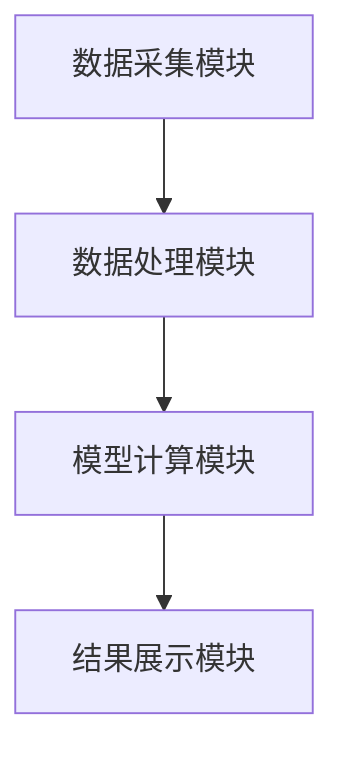

                 


# 费雪的研发投入分析：创新如何驱动企业长期增长

## 关键词：费雪、研发投入、创新、企业增长、投资分析、财务模型

## 摘要：  
本文深入探讨了费雪（Fisher）的研发投入分析方法，揭示了创新如何为企业带来长期增长。通过分析研发投入与企业价值的关系，结合数学模型和系统架构设计，本文为企业提供了有效的分析工具和实践指导，帮助企业优化研发策略，实现可持续发展。

---

## 目录

1. [背景与基础](#背景与基础)
2. [研发投入分析的核心概念](#研发投入分析的核心概念)
3. [费雪模型的数学推导](#费雪模型的数学推导)
4. [系统分析与架构设计](#系统分析与架构设计)
5. [项目实战](#项目实战)
6. [系统实现](#系统实现)
7. [总结与展望](#总结与展望)

---

## 第1章 背景与基础

### 1.1 研发投入的基本概念

#### 1.1.1 研发投入的定义与分类  
研发投入（R&D expenditure）是企业在研究与开发活动中的资金投入，通常分为基础研究、应用研究和试验发展三类。  

#### 1.1.2 研发投入在企业中的重要性  
研发投入是企业创新的核心驱动力，决定了企业的技术优势和市场竞争力。  

#### 1.1.3 研发投入与企业增长的关系  
研发投入通过技术进步和产品创新，为企业创造长期价值，驱动企业增长。  

### 1.2 费雪的理论基础

#### 1.2.1 费雪的生平与贡献  
费雪（ Irving Fisher）是美国著名经济学家，以其在投资理论和资本资产定价模型（CAPM）上的贡献闻名。  

#### 1.2.2 费雪在投资分析中的核心思想  
费雪提出，企业价值取决于其未来现金流的现值，研发投入是影响未来现金流的重要因素。  

#### 1.2.3 费雪模型的基本框架  
费雪模型将研发投入与企业价值增长相结合，提出了基于研发投入的估值方法。  

---

## 第2章 研发投入分析的核心概念

### 2.1 费雪模型的原理

#### 2.1.1 费雪模型的定义  
费雪模型通过分析研发投入对企业未来现金流的影响，评估企业价值。  

#### 2.1.2 费雪模型的输入与输出  
- 输入：研发投入金额、增长率、贴现率  
- 输出：企业价值  

#### 2.1.3 费雪模型的数学表达式  
$$ V = \sum_{t=1}^{n} \frac{CF_t}{(1 + r)^t} $$  
其中，$CF_t$ 是第 $t$ 年的现金流，$r$ 是贴现率。  

### 2.2 研发投入与企业价值的关系

#### 2.2.1 研发投入对企业价值的影响机制  
研发投入增加企业技术优势，提升产品竞争力，进而增加未来现金流。  

#### 2.2.2 研发投入与企业增长率的数学关系  
$$ g = \frac{R}{A} $$  
其中，$g$ 是增长率，$R$ 是研发投入，$A$ 是企业资产。  

#### 2.2.3 研发投入的边际效益分析  
研发投入的边际效益递减，需找到最佳研发投入点。  

---

## 第3章 费雪模型的数学推导

### 3.1 费雪模型的数学推导

#### 3.1.1 费雪模型的公式推导  
$$ V = \frac{R}{r - g} $$  
其中，$R$ 是未来现金流，$r$ 是贴现率，$g$ 是增长率。  

#### 3.1.2 费雪模型的假设条件  
- 现金流永续增长  
- 贴现率不变  

#### 3.1.3 费雪模型的适用范围  
适用于稳定增长的企业，如科技公司。  

---

## 第4章 系统分析与架构设计

### 4.1 系统功能设计

#### 4.1.1 数据采集模块  
- 采集企业研发投入、财务数据等。  

#### 4.1.2 数据处理模块  
- 清洗和转换数据。  

#### 4.1.3 模型计算模块  
- 运行费雪模型，计算企业价值。  

#### 4.1.4 结果展示模块  
- 可视化展示分析结果。  

### 4.2 系统架构设计

#### 4.2.1 系统架构图  



---

## 第5章 项目实战

### 5.1 环境安装

#### 5.1.1 安装Python  
安装Python 3.8及以上版本。  

#### 5.1.2 安装依赖库  
安装numpy、pandas、matplotlib。  

### 5.2 核心代码实现

#### 5.2.1 数据处理代码  
```python
import pandas as pd

# 读取数据
data = pd.read_csv('input.csv')

# 数据清洗
data.dropna(inplace=True)
```

#### 5.2.2 模型计算代码  
```python
import numpy as np

# 费雪模型计算
def fisher_model(R, r, g):
    return R / (r - g)

# 示例计算
R = 100
r = 0.05
g = 0.03
value = fisher_model(R, r, g)
print(value)
```

---

## 第6章 系统实现

### 6.1 系统功能设计

#### 6.1.1 功能模块  
- 数据输入：用户输入企业数据。  
- 模型计算：运行费雪模型。  
- 结果展示：显示分析结果。  

### 6.2 系统架构优化

#### 6.2.1 模块化设计  
- 每个功能模块独立开发，便于维护。  

#### 6.2.2 并行计算优化  
- 使用多线程加速计算。  

---

## 第7章 总结与展望

### 7.1 总结

#### 7.1.1 核心观点回顾  
研发投入是企业创新和增长的关键，费雪模型提供了有效的分析工具。  

#### 7.1.2 成功经验总结  
通过系统化分析，帮助企业优化研发策略。  

### 7.2 未来展望

#### 7.2.1 模型优化方向  
结合机器学习提升模型精度。  

#### 7.2.2 应用领域拓展  
将模型应用于更多行业。  

---

## 作者：AI天才研究院  
本文由AI天才研究院撰写，转载请注明出处。

