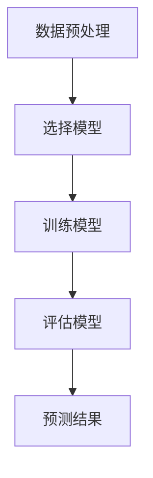
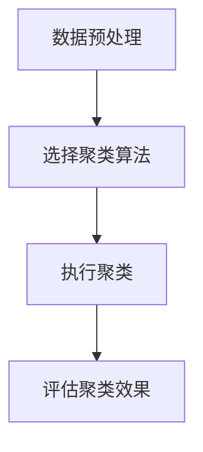
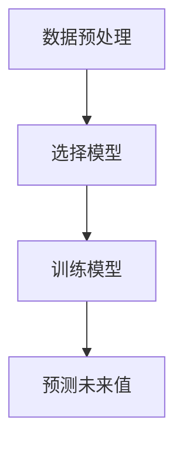
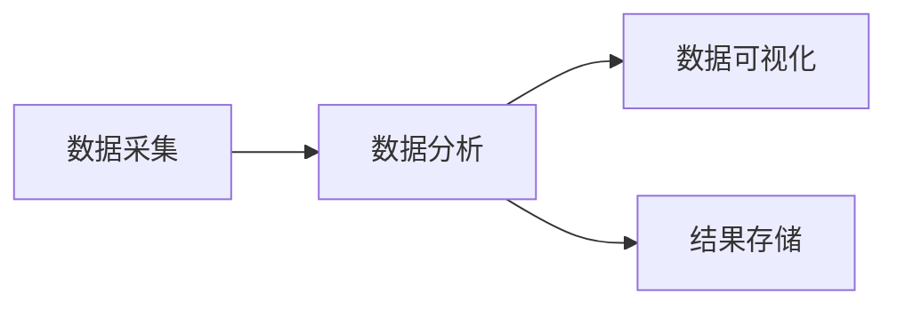
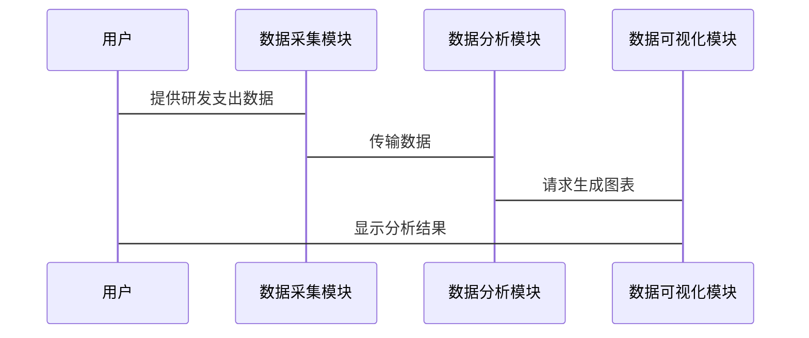

                 


# 费雪的研发投入分析：未来增长的关键

> 关键词：研发投入分析，费雪模型，企业增长，数据分析，投资决策

> 摘要：本文详细探讨了费雪在研发投入分析中的应用，揭示了如何通过科学的方法评估和预测企业的研发投资对未来的增长潜力。结合实际案例，分析了不同行业的研发投入策略，提出了优化投资决策的有效方法。

---

## 第一章: 费雪的研发投入分析背景与重要性

### 1.1 研发投入分析的定义与核心概念

#### 1.1.1 研发投入的定义
研发投入（R&D）是指企业在研究与开发活动上的支出，旨在通过创新提升竞争力。这些支出通常包括材料、设备、人员工资及相关费用。

#### 1.1.2 研发投入分析的核心要素
- **时间跨度**：短期与长期投入的平衡。
- **行业特性**：不同行业研发投入的侧重点不同。
- **财务数据**：包括直接与间接的研发支出。

#### 1.1.3 研发投入与企业增长的关系
研发投入是推动企业创新和增长的关键因素，通过优化研发支出结构，企业可以实现可持续发展。

### 1.2 研发投入分析的重要性

#### 1.2.1 研发投入对企业竞争力的影响
- 提升产品差异化能力。
- 增强技术壁垒。

#### 1.2.2 研发投入与创新的关系
- 创新是企业持续发展的动力。
- 研发投入是创新的基础。

#### 1.2.3 研发投入对长期增长的驱动作用
- 长期研发投入带来技术和市场的先发优势。

### 1.3 研发投入分析的方法与工具

#### 1.3.1 传统财务分析方法
- 比率分析法：如研发支出占收入的比例。
- 趋势分析法：观察研发投入的历史趋势。

#### 1.3.2 现代数据分析工具
- 数据挖掘：发现隐藏的模式。
- 预测模型：预测未来研发投入效果。

#### 1.3.3 费雪模型的引入
- 费雪模型将研发投入与市场回报相结合，提供更全面的评估方法。

### 1.4 研发投入分析的边界与外延

#### 1.4.1 研发投入的边界
- 确定哪些支出属于研发范畴。

#### 1.4.2 研发投入分析的外延
- 包括研发效率和成果转化的分析。

#### 1.4.3 研发投入与其他财务指标的关系
- 研发投入与收入、利润的关系。

---

## 第二章: 研发投入分析的核心概念与联系

### 2.1 核心概念原理

研发投入分析涉及多个概念，包括研发支出、研发效率和研发成果。这些概念相互关联，共同影响企业的增长潜力。

### 2.2 对比分析表格

| 概念         | 定义与计算方式                       |
|--------------|------------------------------------|
| 研发支出     | 企业的研发费用总和                 |
| 研发效率     | 研发支出与成果产出的比率           |
| 研发成果     | 研发项目取得的专利数量和新产品数量 |

### 2.3 ER图架构

```mermaid
erDiagram
    class 研发支出 {
        研发项目ID : int
        支出金额 : float
        时间 : date
    }
    class 研发成果 {
        成果ID : int
        专利数量 : int
        新产品研发 : bool
    }
    class 企业增长 {
        企业ID : int
        收入增长率 : float
        利润增长率 : float
    }
    研发支出 --> 研发成果 : 产生
    研发成果 --> 企业增长 : 驱动
```

---

## 第三章: 研发投入分析的算法原理

### 3.1 线性回归分析

#### 3.1.1 线性回归原理

线性回归用于预测变量之间的关系，假设研发支出与企业收入之间存在线性关系。

#### 3.1.2 算法流程



#### 3.1.3 Python代码实现

```python
import numpy as np
import pandas as pd
from sklearn.linear_model import LinearRegression
from sklearn.metrics import r2_score

# 示例数据
data = {
    '研发支出': [100, 200, 300, 400, 500],
    '收入': [500, 600, 700, 800, 900]
}
df = pd.DataFrame(data)

# 拆分训练集和测试集
X = df[['研发支出']]
y = df['收入']

# 训练模型
model = LinearRegression()
model.fit(X, y)

# 预测
y_pred = model.predict(X)

# 评估
r2 = r2_score(y, y_pred)
print(f"R²: {r2}")
```

#### 3.1.4 数学公式

线性回归模型的数学公式为：
$$y = a + bx + e$$
其中，$y$ 是被解释变量，$x$ 是解释变量，$a$ 是截距，$b$ 是斜率，$e$ 是误差项。

### 3.2 聚类分析

#### 3.2.1 聚类分析原理

聚类分析用于将企业按研发投入水平分成不同的类别。

#### 3.2.2 算法流程



#### 3.2.3 Python代码实现

```python
from sklearn.cluster import KMeans

# 示例数据
X = [[100, 200], [200, 300], [300, 400], [400, 500], [500, 600]]

# 训练模型
model = KMeans(n_clusters=2, random_state=0)
model.fit(X)

# 预测
labels = model.labels_
print(labels)
```

### 3.3 时间序列分析

#### 3.3.1 时间序列分析原理

时间序列分析用于研究研发投入的时间变化趋势。

#### 3.3.2 算法流程



#### 3.3.3 Python代码实现

```python
import statsmodels.api as sm

# 示例数据
data = {'研发支出': [100, 200, 300, 400, 500]}
df = pd.DataFrame(data)

# 添加常数项
X = sm.add_constant(df['研发支出'])

# 训练模型
model = sm.OLS(df['研发支出'], X).fit()

# 输出结果
print(model.summary())
```

---

## 第四章: 系统分析与架构设计

### 4.1 问题场景介绍

企业需要通过分析研发投入数据，预测未来的收入增长。

### 4.2 系统功能设计

- 数据采集模块：收集研发支出数据。
- 数据分析模块：应用费雪模型进行分析。
- 数据可视化模块：展示分析结果。

### 4.3 系统架构图



### 4.4 系统交互序列图



---

## 第五章: 项目实战

### 5.1 环境安装

安装必要的库：
```bash
pip install numpy pandas scikit-learn matplotlib
```

### 5.2 核心实现代码

```python
import matplotlib.pyplot as plt

# 示例数据
data = {
    '研发支出': [100, 200, 300, 400, 500],
    '收入': [500, 600, 700, 800, 900]
}
df = pd.DataFrame(data)

# 绘制散点图
plt.scatter(df['研发支出'], df['收入'])
plt.title('研发支出与收入关系')
plt.xlabel('研发支出')
plt.ylabel('收入')
plt.show()
```

### 5.3 案例分析

以科技公司为例，分析其研发投入与收入增长的关系，得出优化研发策略的建议。

---

## 第六章: 最佳实践

### 6.1 关键点总结

- 数据质量的重要性
- 模型选择的合理性
- 结果的可解释性

### 6.2 小结

通过费雪的研发投入分析，企业可以科学评估研发投入的合理性，优化投资策略，提升未来增长潜力。

### 6.3 注意事项

- 数据清洗的重要性
- 模型选择的多样性
- 结果验证的必要性

### 6.4 拓展阅读

推荐相关书籍和论文，进一步深入学习。

---

## 作者

作者：AI天才研究院 & 禅与计算机程序设计艺术

---

**本文遵循CC BY 4.0 Attribution license**

