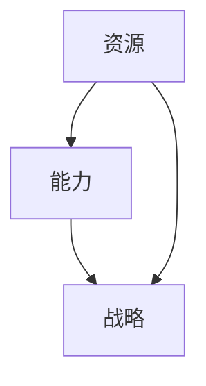
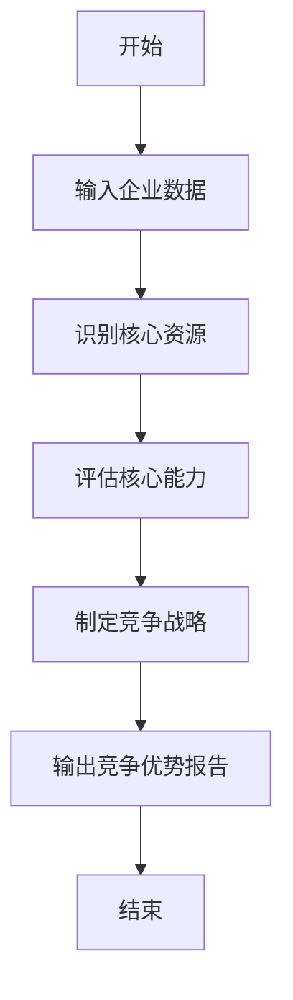
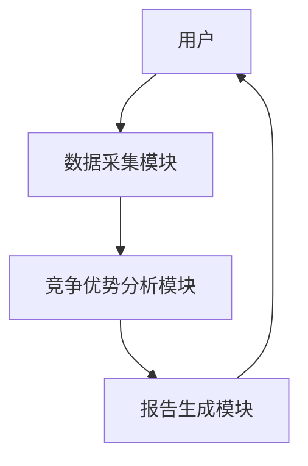

                 


# 费雪的竞争优势分析

**关键词：竞争优势分析、费雪分析法、资源基础观、能力基础观、战略基础观**

**摘要：**  
《费雪的竞争优势分析》一书深入探讨了企业竞争优势的构建与评估方法，结合费雪分析法的核心思想，从理论基础到实际应用进行了系统性分析。本书通过详细阐述竞争优势的核心要素、分析框架以及实际案例，帮助读者掌握如何利用费雪分析法识别和提升企业的竞争优势，适用于企业战略管理、投资分析及学术研究等多个领域。

---

## 目录大纲

### 第一部分: 费雪的竞争优势分析基础

### 第1章: 费雪竞争优势分析概述

#### 1.1 竞争优势的基本概念
- 1.1.1 什么是竞争优势
- 1.1.2 竞争优势的分类
- 1.1.3 竞争优势的重要性

#### 1.2 费雪的竞争优势分析方法
- 1.2.1 费雪分析法的核心思想
- 1.2.2 费雪分析法的适用场景
- 1.2.3 费雪分析法与传统分析法的区别

#### 1.3 费雪分析法的理论基础
- 1.3.1 资源基础观
- 1.3.2 能力基础观
- 1.3.3 战略基础观

#### 1.4 费雪分析法的实践意义
- 1.4.1 企业竞争优势的核心要素
- 1.4.2 费雪分析法对企业战略的指导作用
- 1.4.3 费雪分析法在投资分析中的应用

#### 1.5 本章小结

### 第2章: 费雪竞争优势分析的核心概念与联系

#### 2.1 核心概念原理
- 2.1.1 资源、能力和战略的关系
- 2.1.2 费雪分析法的三要素模型
- 2.1.3 核心竞争力的定义与特征

#### 2.2 核心概念属性对比表
| 要素 | 定义 | 特性 | 示例 |
|------|------|------|------|
| 资源 | 企业拥有的有形和无形资产 | 可测量性、稀缺性、不可模仿性 | 技术专利、品牌、原材料 |
| 能力 | 企业的核心技能和能力 | 可持续性、动态性、可扩展性 | 研发能力、营销能力、生产效率 |
| 战略 | 企业的长期发展规划 | 竞争性、创新性、可执行性 | 市场扩展、产品创新、成本控制 |

#### 2.3 ER实体关系图


### 第3章: 费雪竞争优势分析的算法原理

#### 3.1 算法原理概述
- 3.1.1 费雪分析法的步骤
- 3.1.2 算法的输入与输出
- 3.1.3 算法的数学模型

#### 3.2 算法流程图


#### 3.3 算法的数学模型
$$ 竞争优势指数 = \sum_{i=1}^{n} (资源_i \times 能力_i \times 战略_i) $$

#### 3.4 算法实现示例
```python
def fisher_competitive Advantage(enterprise_data):
    resources = enterprise_data['resources']
    capabilities = enterprise_data['capabilities']
    strategies = enterprise_data['strategies']
    
    competitive_index = 0
    for i in range(len(resources)):
        competitive_index += resources[i] * capabilities[i] * strategies[i]
    return competitive_index

# 示例数据
enterprise_data = {
    'resources': [0.8, 0.6, 0.7],
    'capabilities': [0.9, 0.8, 0.6],
    'strategies': [0.7, 0.8, 0.9]
}

# 计算竞争优势指数
result = fisher_competitive Advantage(enterprise_data)
print("竞争优势指数:", result)
```

### 第4章: 费雪竞争优势分析的系统分析与架构设计

#### 4.1 系统分析
- 4.1.1 问题场景介绍
- 4.1.2 项目介绍
- 4.1.3 系统功能设计
  - 数据采集模块
  - 竞争优势分析模块
  - 报告生成模块

#### 4.2 系统架构设计


#### 4.3 系统接口设计
- 数据接口：从数据库中提取企业数据
- 分析接口：计算竞争优势指数
- 报告接口：生成分析报告

#### 4.4 系统交互流程


### 第5章: 费雪竞争优势分析的项目实战

#### 5.1 环境安装
- 安装Python和必要的库（如Pandas、NumPy）

#### 5.2 系统核心实现源代码
```python
import pandas as pd
import numpy as np

def fisher_analysis(data_frame):
    # 计算资源评分
    resources_score = data_frame['resources'].mean()
    # 计算能力评分
    capabilities_score = data_frame['capabilities'].mean()
    # 计算战略评分
    strategies_score = data_frame['strategies'].mean()
    # 竞争优势指数
    competitive_index = resources_score * capabilities_score * strategies_score
    return competitive_index

# 示例数据
data = {
    'resources': [0.8, 0.6, 0.7],
    'capabilities': [0.9, 0.8, 0.6],
    'strategies': [0.7, 0.8, 0.9]
}
df = pd.DataFrame(data)

# 调用分析函数
result = fisher_analysis(df)
print("竞争优势指数:", result)
```

#### 5.3 代码应用解读与分析
- 数据预处理：确保数据的完整性和准确性
- 分析过程：计算各要素的评分并综合得出竞争优势指数
- 结果解读：根据指数判断企业的竞争优势强弱

#### 5.4 实际案例分析
- 案例背景：某科技公司竞争优势分析
- 数据收集：收集资源、能力和战略的评分数据
- 分析过程：计算竞争优势指数并提出改进建议
- 结果展示：生成分析报告并可视化展示

#### 5.5 项目小结

### 第6章: 费雪竞争优势分析的最佳实践

#### 6.1 总结与反思
- 本书的核心内容回顾
- 学习过程中的收获与不足

#### 6.2 小结
- 费雪分析法的优势与局限性
- 如何在实际中灵活运用费雪分析法

#### 6.3 注意事项
- 数据的准确性和完整性
- 分析过程中的主观判断
- 竞争环境的变化对分析结果的影响

#### 6.4 拓展阅读
- 推荐书籍和文献
- 在线资源和工具

---

**作者：AI天才研究院/AI Genius Institute & 禅与计算机程序设计艺术 /Zen And The Art of Computer Programming**

---

**注：** 以上目录大纲是一个高度概括的版本，实际撰写时需要进一步细化每个章节的内容，确保逻辑清晰、内容详实。

