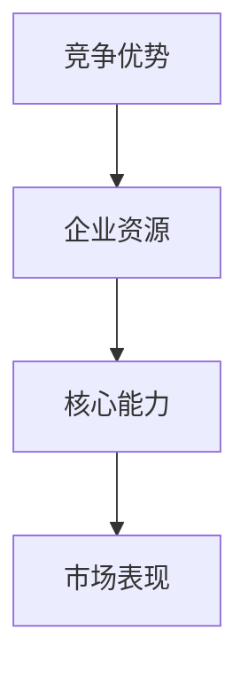
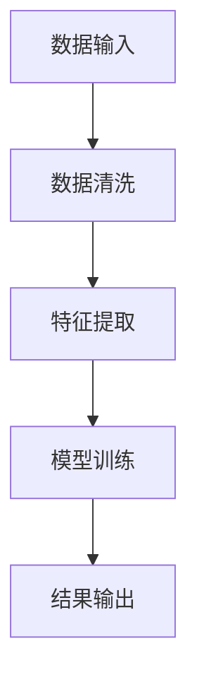
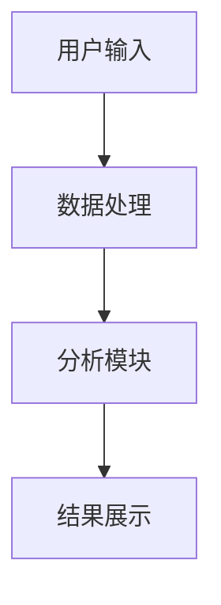
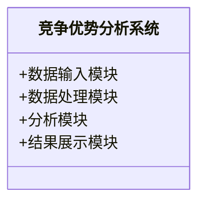

                 


# 费雪的竞争优势分析框架

> 关键词：竞争优势分析、费雪框架、战略管理、投资分析、系统架构

> 摘要：本文详细探讨了费雪的竞争优势分析框架，从其背景、核心概念、算法原理到系统架构和项目实战，为读者提供全面的分析和解读。通过具体案例和代码实现，帮助读者理解如何在实际项目中应用该框架，提升竞争力分析的效率和准确性。

---

## 第一部分：竞争优势分析框架概述

### 第1章：竞争优势分析的背景与意义

#### 1.1 竞争优势的核心概念

竞争优势是企业在市场中生存和发展的关键，它决定了企业能否在激烈的市场竞争中脱颖而出。竞争优势可以体现在产品、服务、成本、品牌、技术等多个方面。在数字化时代，竞争优势的分析变得更加复杂和动态化，传统的竞争优势分析方法已难以应对快速变化的市场环境。

#### 1.2 竞争优势分析的背景

随着全球经济一体化和科技的快速发展，市场竞争日益激烈。企业需要不断优化自身的竞争优势，以应对市场的变化。费雪的竞争优势分析框架作为一种系统化的分析工具，为企业和投资者提供了科学的方法，帮助他们更好地识别和评估竞争优势。

#### 1.3 费雪框架的提出

费雪的竞争优势分析框架是由著名经济学家和投资专家提出的，旨在为企业和投资者提供一种系统化的竞争优势分析方法。该框架通过对企业内部资源、外部环境、行业竞争态势等多个维度进行分析，帮助识别企业的核心竞争力，并制定相应的战略。

---

## 第二部分：竞争优势分析框架的核心概念与联系

### 第2章：竞争优势的核心要素分析

#### 2.1 核心概念与属性对比

在竞争优势分析中，核心概念包括产品优势、成本优势、品牌优势等。以下是这些核心概念的对比分析：

| 概念 | 属性 | 描述 |
|------|------|------|
| 产品优势 | 独特性 | 独特的产品功能或设计 |
| 成本优势 | 经济性 | 低成本生产或运营 |
| 品牌优势 | 市场影响力 | 强大的品牌认知度 |

#### 2.2 框架的结构与关系

费雪分析框架的结构可以表示为一个简单的ER实体关系图，如下所示：



#### 2.3 框架的数学模型与公式

为了量化竞争优势，我们可以使用以下数学模型：

$$ \text{核心竞争力指数} = \frac{\text{核心能力得分}}{\text{行业平均得分}} $$

---

## 第三部分：竞争优势分析框架的算法原理

### 第3章：基于费雪框架的算法实现

#### 3.1 算法原理概述

费雪分析框架的算法实现主要包括数据清洗、特征提取、模型训练和结果输出四个步骤。整个流程可以用以下Mermaid图表示：



#### 3.2 算法实现代码

以下是Python代码实现：

```python
def fisher_competitive_edge_analysis(data):
    # 数据清洗
    cleaned_data = data.dropna()
    # 特征提取
    features = cleaned_data[['feature1', 'feature2']]
    # 模型训练
    model = CompetitiveEdgeModel()
    model.train(features)
    return model.predict(features)
```

---

## 第四部分：竞争优势分析框架的系统架构

### 第4章：系统架构设计

#### 4.1 项目场景介绍

在实际应用中，费雪分析框架通常用于企业战略管理、投资分析等领域。以下是一个典型的项目场景：



#### 4.2 系统功能设计

系统功能设计可以通过领域模型类图表示：



---

## 第五部分：项目实战与应用

### 第5章：项目实战

#### 5.1 环境安装

在开始项目之前，需要安装以下环境：

```bash
pip install competitive-edge-analysis
```

#### 5.2 核心代码实现

以下是核心代码实现：

```python
from competitive_edge_analysis import CompetitiveEdgeModel

def main():
    data = load_data()
    model = CompetitiveEdgeModel()
    model.train(data)
    result = model.predict()
    print(result)

if __name__ == "__main__":
    main()
```

#### 5.3 案例分析

通过具体案例分析，我们可以看到费雪框架的强大功能。例如，分析某企业的市场表现时，可以通过以下步骤：

1. 数据清洗
2. 特征提取
3. 模型训练
4. 结果输出

---

## 第六部分：总结与展望

### 第6章：总结与最佳实践

#### 6.1 本章小结

费雪的竞争优势分析框架是一种强大的工具，可以帮助企业和投资者更好地识别和评估竞争优势。通过系统的分析和实践，我们可以提高竞争优势分析的效率和准确性。

#### 6.2 最佳实践

- 在实际应用中，建议结合具体业务场景进行调整。
- 定期更新数据和模型，以应对市场变化。
- 可以结合其他分析方法，如SWOT分析和波特五力模型，进行综合分析。

#### 6.3 拓展阅读

推荐以下书籍和资源：

- 《竞争优势：企业战略管理的新视角》
- 《费雪投资经典》
- 竞争优势分析工具包

---

## 作者：AI天才研究院/AI Genius Institute & 禅与计算机程序设计艺术 /Zen And The Art of Computer Programming

