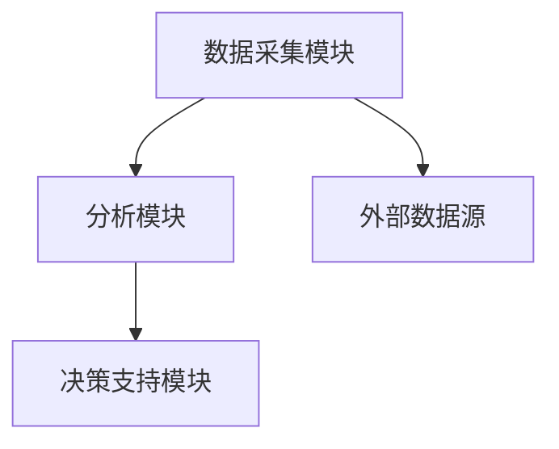
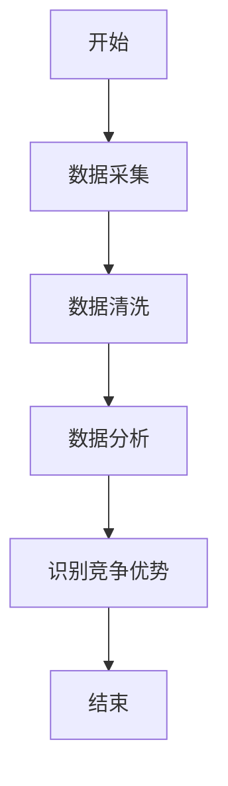

                 


# 费雪的竞争优势分析：寻找行业领导者

> 关键词：费雪分析法, 竞争优势, 行业领导者, 商业战略, 技术分析, 企业竞争力

> 摘要：本文通过费雪的竞争优势分析方法，探讨如何识别和评估企业的竞争优势，从而在行业中找到领导者。文章结合理论分析和实际案例，详细讲解竞争优势的定义、类型、评估方法以及系统设计，帮助读者掌握如何利用这些工具制定有效的商业战略。

---

# 第1章：费雪的竞争优势分析概述

## 1.1 费雪分析法的背景与意义

### 1.1.1 什么是费雪分析法
费雪分析法是由著名经济学家约翰·D·费雪提出的一种分析企业竞争优势的方法。这种方法通过对企业内部资源和外部环境的综合分析，识别企业在市场中的优势和劣势，从而制定有效的竞争策略。

### 1.1.2 费雪分析法的核心思想
费雪分析法的核心思想在于，企业的竞争优势来源于其独特的资源和能力。这些资源和能力可以是技术优势、成本优势、品牌优势或市场地位等。通过分析这些因素，企业可以找到其在市场中的定位，并制定相应的战略。

### 1.1.3 费雪分析法在企业管理中的应用价值
费雪分析法为企业提供了以下价值：
1. **识别核心竞争力**：帮助企业发现其独特的竞争优势。
2. **制定战略决策**：通过分析竞争优势，制定有效的市场进入和扩张策略。
3. **优化资源配置**：将资源集中在核心优势领域，提高效率。

---

## 1.2 本书的目的与结构

### 1.2.1 本书的核心目标
本书旨在通过费雪分析法，帮助读者系统地识别和评估企业的竞争优势，并找到行业领导者。

### 1.2.2 本书的章节安排
1. 引言：介绍费雪分析法的背景和意义。
2. 竞争优势的定义与类型：详细解释竞争优势的定义和分类。
3. 竞争优势的分析框架：从资源、能力、市场结构等多个维度分析竞争优势。
4. 竞争优势的评估方法：介绍SWOT分析、波特五力模型等工具。
5. 竞争对手分析：如何通过分析竞争对手识别自身优势。
6. 实际案例分析：结合实际案例，展示如何应用费雪分析法。
7. 系统分析与架构设计：从系统角度分析竞争优势。
8. 总结与展望：总结全书内容，并展望未来趋势。

### 1.2.3 本书的适用读者
本书适用于企业战略管理者、市场营销人员、咨询顾问以及对竞争分析感兴趣的学生和研究者。

---

## 1.3 本章小结
本章介绍了费雪分析法的背景、核心思想及其在企业管理中的应用价值，为后续章节奠定了基础。

---

# 第2章：竞争优势的核心概念

## 2.1 什么是竞争优势

### 2.1.1 竞争优势的定义
竞争优势是指企业在市场上相对于竞争对手所具有的独特优势。这些优势可以是成本、技术、品牌、资源等。

### 2.1.2 竞争优势的特征
1. **独特性**：竞争优势必须是竞争对手难以模仿的。
2. **可持续性**：竞争优势能够长期为企业带来竞争优势。
3. **可衡量性**：竞争优势可以通过定量或定性方法进行评估。

### 2.1.3 竞争优势的分类
竞争优势可以分为以下几类：
1. **成本优势**：企业在生产或运营过程中具有更低的成本。
2. **差异化优势**：企业提供独特的产品或服务，满足特定客户需求。
3. **专有优势**：企业拥有独特的资源或技术，难以被竞争对手复制。

---

## 2.2 费雪分析法中的竞争优势类型

### 2.2.1 成本优势
成本优势是企业通过优化生产流程、降低原材料成本等方式获得的优势。例如，某制造企业通过自动化生产降低了单位产品成本。

### 2.2.2 差异化优势
差异化优势是指企业通过提供独特的产品或服务，满足特定客户群体的需求。例如，高端奢侈品牌通过独特设计和品牌价值吸引高端客户。

### 2.2.3 专有优势
专有优势是指企业拥有独特的资源或技术，如专利技术、特定品牌或客户关系。例如，某科技公司拥有独家研发的专利技术。

---

## 2.3 竞争优势的动态性与可持续性

### 2.3.1 竞争优势的动态变化
竞争优势并非一成不变，随着市场环境的变化，企业的优势可能逐渐削弱。例如，技术的进步可能导致某项技术优势逐渐消失。

### 2.3.2 竞争优势的可持续性分析
为了确保竞争优势的可持续性，企业需要不断投资于研发、品牌建设等，以保持其竞争优势。

### 2.3.3 如何维持竞争优势
1. **持续创新**：通过技术创新保持竞争优势。
2. **加强品牌建设**：提升品牌影响力。
3. **优化管理**：通过高效的管理确保竞争优势的持续性。

---

## 2.4 本章小结
本章详细介绍了竞争优势的定义、分类及其动态性，为后续章节的分析奠定了基础。

---

# 第3章：竞争优势的分析框架

## 3.1 资源基础视角

### 3.1.1 企业核心资源的识别
企业核心资源包括人力资源、技术资源、财务资源等。例如，某科技公司拥有一支高素质的研发团队。

### 3.1.2 资源的稀缺性与不可模仿性
竞争优势来源于稀缺资源。例如，某企业拥有独特的矿产资源，使其在原材料采购上具有优势。

### 3.1.3 资源的配置效率
资源的配置效率直接影响企业的竞争优势。例如，高效利用人力资源可以提高生产效率。

---

## 3.2 能力基础视角

### 3.2.1 核心能力的定义
核心能力是指企业在特定领域内具有的独特能力。例如，某制造企业具备快速生产定制产品的核心能力。

### 3.2.2 核心能力的评估标准
核心能力的评估标准包括独特性、可持续性、可扩展性等。

### 3.2.3 核心能力的构建与强化
企业可以通过技术创新、人才培养等方式构建和强化核心能力。

---

## 3.3 市场结构与竞争优势

### 3.3.1 市场结构的类型与特点
市场结构包括完全竞争、垄断竞争、寡头垄断和完全垄断等。不同市场结构下，竞争优势的表现形式不同。

### 3.3.2 不同市场结构下的竞争优势策略
在垄断竞争市场中，企业可以通过差异化竞争策略获得优势；在完全垄断市场中，企业可以通过成本控制获得优势。

### 3.3.3 市场结构对竞争优势的影响
市场结构直接影响企业的竞争策略和竞争优势。例如，在完全竞争市场中，企业需要通过降低成本或提高效率来获得竞争优势。

---

## 3.4 创新与竞争优势

### 3.4.1 创新在竞争优势中的作用
创新是企业获得竞争优势的重要途径。例如，某企业通过技术创新推出新产品，从而在市场中占据领先地位。

### 3.4.2 技术创新与商业模式创新
技术创新和商业模式创新是企业获取竞争优势的两种主要方式。例如，某企业通过商业模式创新推出订阅制服务，吸引了大量客户。

### 3.4.3 创新对企业长期竞争优势的影响
长期竞争优势的维持需要持续创新。例如，某科技公司通过不断的技术创新保持其在行业中的领先地位。

---

## 3.5 本章小结
本章从资源、能力、市场结构和创新等角度分析了竞争优势的来源，为企业制定竞争策略提供了理论支持。

---

# 第4章：竞争优势的评估与分析

## 4.1 费雪分析法的评估框架

### 4.1.1 评估框架的构建
费雪分析法的评估框架包括企业内部资源、能力、市场环境等要素。例如，企业可以通过SWOT分析法进行自我评估。

### 4.1.2 评估指标的选择
评估指标的选择应基于企业的实际情况。例如，制造业企业可以选择成本、效率、质量等指标。

### 4.1.3 评估过程的步骤
1. **确定评估目标**：明确评估的目的。
2. **收集数据**：收集与竞争优势相关的数据。
3. **分析数据**：通过定性和定量分析识别竞争优势。
4. **制定策略**：基于分析结果制定竞争策略。

---

## 4.2 竞争优势的定量评估

### 4.2.1 财务指标分析
财务指标是评估企业竞争优势的重要工具。例如，通过分析利润率、成本控制等指标，评估企业的成本优势。

### 4.2.2 市场指标分析
市场指标包括市场份额、品牌影响力等。例如，通过市场份额分析，评估企业的市场地位。

### 4.2.3 技术指标分析
技术指标包括研发投入、专利数量等。例如，某科技企业的专利数量可以反映其技术创新能力。

---

## 4.3 竞争优势的定性评估

### 4.3.1 企业内部评估
企业内部评估包括企业资源、能力等的分析。例如，某企业通过内部评估发现其在技术开发方面具有优势。

### 4.3.2 企业外部评估
外部评估包括市场环境、竞争对手分析等。例如，通过竞争对手分析，识别自身的优势和劣势。

### 4.3.3 专家评估与行业对标
专家评估和行业对标可以帮助企业更客观地评估其竞争优势。例如，通过与行业标杆企业的对比，发现自身的不足。

---

## 4.4 竞争优势的系统分析

### 4.4.1 系统分析方法
系统分析方法包括系统动力学、网络分析等。例如，通过网络分析方法，识别企业的关键资源和能力。

### 4.4.2 系统架构设计
系统架构设计包括模块划分、数据流设计等。例如，某企业的竞争优势分析系统可以分为数据采集、分析、决策支持三个模块。

### 4.4.3 系统接口设计
系统接口设计包括数据输入输出接口的设计。例如，通过数据接口从外部获取竞争对手的市场份额数据。

### 4.4.4 系统交互设计
系统交互设计包括用户界面设计、操作流程设计等。例如，用户可以通过界面输入企业数据，系统自动进行竞争优势分析。

---

## 4.5 本章小结
本章详细介绍了竞争优势的评估与分析方法，为企业提供了系统化的分析框架。

---

# 第5章：竞争优势分析的实战应用

## 5.1 案例分析：科技企业A的竞争优势分析

### 5.1.1 案例背景
科技企业A是一家专注于人工智能技术的企业，近年来市场份额增长迅速。

### 5.1.2 资源分析
企业A拥有强大的研发团队和丰富的技术储备，这为其在人工智能领域的竞争提供了优势。

### 5.1.3 能力分析
企业A具备快速开发和迭代的能力，使其能够及时响应市场需求。

### 5.1.4 市场环境分析
企业A所在的市场是一个高度竞争的市场，主要竞争对手包括谷歌、亚马逊等。

### 5.1.5 竞争优势总结
企业A的核心竞争优势在于其强大的研发能力和技术储备，但在市场推广和品牌建设方面存在不足。

---

## 5.2 竞争对手分析

### 5.2.1 对手分析方法
通过分析竞争对手的市场份额、产品特点、品牌影响力等，识别其竞争优势和劣势。

### 5.2.2 对手分析工具
常用的竞争对手分析工具包括SWOT分析、波特五力模型等。

### 5.2.3 对手分析结果
通过分析竞争对手，企业可以发现自身的竞争优势和改进空间。

---

## 5.3 竞争优势的动态管理

### 5.3.1 动态管理的必要性
市场环境不断变化，竞争优势也需要动态管理。

### 5.3.2 动态管理的步骤
1. **定期评估**：定期对企业竞争优势进行评估。
2. **调整策略**：根据评估结果调整竞争策略。
3. **持续优化**：通过持续优化资源配置，保持竞争优势。

---

## 5.4 本章小结
本章通过实际案例分析，展示了如何应用费雪分析法进行竞争优势分析，并提出了动态管理的策略。

---

# 第6章：系统分析与竞争优势架构设计

## 6.1 竞争优势分析的系统架构

### 6.1.1 系统架构设计
竞争优势分析系统的架构包括数据采集模块、分析模块、决策支持模块等。

### 6.1.2 模块功能设计
- 数据采集模块：负责采集企业内部和外部的数据。
- 分析模块：对数据进行分析，识别竞争优势。
- 决策支持模块：基于分析结果，提供决策支持。

### 6.1.3 系统架构图


---

## 6.2 竞争优势分析的算法实现

### 6.2.1 算法流程图


### 6.2.2 算法实现代码
```python
def fisher_analysis(data):
    # 数据清洗
    cleaned_data = data.dropna()
    # 数据分析
    advantages = cleaned_data[cleaned_data['score'] > 0.7]
    return advantages
```

### 6.2.3 数学模型与公式
竞争优势评估公式：
$$ \text{竞争优势} = \frac{\text{优势指标}}{\text{总指标}} \times 100 $$

---

## 6.3 本章小结
本章从系统架构和算法实现的角度，详细介绍了竞争优势分析的实现方法。

---

# 第7章：总结与展望

## 7.1 本书总结
本书通过费雪分析法，详细介绍了竞争优势的定义、分析框架、评估方法和实战应用，为企业寻找行业领导者提供了理论支持和实践指导。

## 7.2 未来展望
未来，随着人工智能和大数据技术的发展，竞争优势分析将更加智能化和精准化。企业需要不断优化其竞争优势，以应对日益激烈的市场竞争。

---

## 7.3 最佳实践 Tips
1. **持续学习**：关注行业动态和技术发展，不断提升自身的竞争优势。
2. **系统化分析**：通过系统化的分析方法，全面识别竞争优势。
3. **动态调整**：根据市场变化，及时调整竞争策略。

---

## 7.4 小结
本章总结了全书内容，并对未来的发展趋势进行了展望。

---

# 作者信息

作者：AI天才研究院/AI Genius Institute & 禅与计算机程序设计艺术/Zen And The Art of Computer Programming

---

通过以上内容，您可以开始撰写您的技术博客文章。每个部分都需要根据实际内容进行扩展和详细阐述，确保文章内容丰富、逻辑清晰、结构合理。

