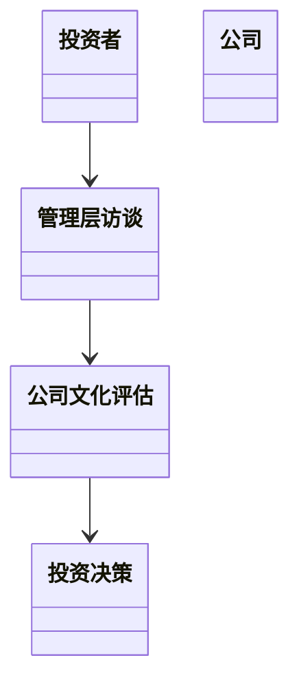
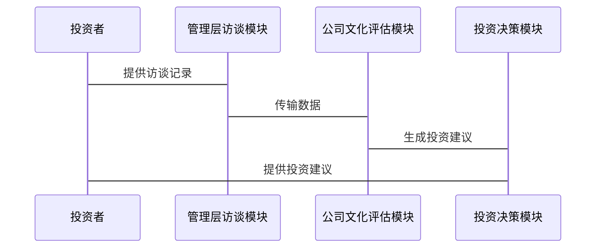

                 

# 费雪的管理层访谈技巧：洞察公司文化

## 关键词：管理层访谈，公司文化，投资决策，费雪，投资技巧

## 摘要：本文深入探讨了费雪通过管理层访谈来评估公司文化的方法，分析了其在投资决策中的作用，并详细介绍了相关的访谈技巧和评估模型。文章结合理论与实践，为投资者提供了实用的指导。

---

## 第一部分：背景介绍

### 第1章：费雪与管理层访谈的背景

#### 1.1 费雪的投资理念与方法

##### 1.1.1 费雪的投资哲学
费雪是价值投资的先驱，主张通过深入研究和分析来选择具有长期增长潜力的公司。他的投资哲学强调买入优秀公司的股票并长期持有，而非频繁交易。

##### 1.1.2 费雪对管理层访谈的重视
费雪认为，了解公司管理层的思维方式、决策风格和文化是评估公司潜力的关键。通过与管理层的直接交流，他能够更准确地判断公司的未来发展前景。

##### 1.1.3 费雪投资成功的关键因素
费雪的成功不仅在于他的投资策略，还在于他对管理层的深刻理解。他通过访谈揭示公司的内在价值，从而做出明智的投资决策。

#### 1.2 公司文化的重要性

##### 1.2.1 公司文化的定义与内涵
公司文化是指企业在经营活动中形成的价值观、信念、行为准则和习惯的总和。它影响着公司的战略制定、员工行为和整体表现。

##### 1.2.2 公司文化对投资决策的影响
一个积极健康的公司文化能够提升公司的凝聚力和竞争力，从而为股东创造更大的价值。相反，负面的文化可能导致公司内部矛盾和低效。

##### 1.2.3 公司文化评估的维度
公司文化的评估可以从领导风格、团队协作、创新精神、风险管理等多个维度进行。这些维度共同决定了公司的长期发展潜力。

#### 1.3 管理层访谈的作用

##### 1.3.1 管理层访谈的目的
通过访谈，投资者可以深入了解公司的战略方向、管理层的思维方式以及公司的文化氛围。这些信息有助于评估公司的潜在价值。

##### 1.3.2 管理层访谈与公司文化的关系
管理层的言行直接反映了公司的文化。通过访谈，投资者能够观察管理层的决策风格、沟通方式以及对员工的关怀程度，从而判断公司文化的优劣。

##### 1.3.3 管理层访谈的优势与局限性
优势：提供第一手的信息，帮助投资者做出更准确的判断。  
局限性：访谈结果可能受到管理层个人风格的影响，具有一定的主观性。

---

## 第二部分：核心概念与技巧

### 第2章：管理层访谈的核心技巧

#### 2.1 访谈前的准备工作

##### 2.1.1 明确访谈目标
在进行管理层访谈之前，投资者需要明确访谈的目标，例如评估公司的战略规划或了解管理层的决策风格。

##### 2.1.2 制定访谈提纲
根据访谈目标，制定详细的提纲，包括主要问题和可能的追问。这有助于访谈过程的顺利进行。

##### 2.1.3 背景资料的收集与分析
在访谈前，投资者应收集公司的财务数据、行业分析和竞争对手情况，以便在访谈中提出有针对性的问题。

#### 2.2 访谈中的沟通技巧

##### 2.2.1 建立信任关系
通过友好和专业的交流，建立与管理层的信任关系，这有助于获取更真实和有价值的信息。

##### 2.2.2 提问技巧与倾听艺术
投资者应设计开放性问题，鼓励管理层分享观点，并通过倾听理解其真实意图。

##### 2.2.3 应对突发情况的技巧
在访谈中，可能会遇到意外的问题或情况，投资者需要灵活应对，确保访谈顺利进行。

#### 2.3 访谈后的分析与总结

##### 2.3.1 分析管理层的回答
通过对管理层回答的分析，投资者可以评估公司的战略一致性、管理层的决策能力和企业文化。

##### 2.3.2 评估公司文化
根据访谈结果，评估公司的文化是否健康，是否与公司的长期战略目标一致。

##### 2.3.3 形成投资决策建议
结合访谈结果和其他分析，形成最终的投资决策建议，包括买入、持有或卖出的建议。

---

## 第三部分：公司文化评估模型

### 第3章：公司文化评估模型

#### 3.1 公司文化评估的维度

##### 3.1.1 领导风格
领导风格包括命令型、指导型和参与型等。不同的领导风格会影响公司的文化和员工的积极性。

##### 3.1.2 团队协作
团队协作反映了公司内部的沟通和合作程度，良好的团队协作有助于提高公司的整体效率。

##### 3.1.3 创新精神
创新精神是公司适应市场变化和持续发展的关键因素，创新能力强的公司更具竞争力。

##### 3.1.4 风险管理
公司对风险的管理和应对能力是评估公司文化的重要指标，反映了公司的稳健性和抗风险能力。

#### 3.2 公司文化评估模型

##### 3.2.1 模型构建
公司文化评估模型可以通过多个维度进行综合评估，每个维度赋予不同的权重。例如：

$$ \text{文化评分} = w_1 \times \text{领导风格} + w_2 \times \text{团队协作} + w_3 \times \text{创新精神} + w_4 \times \text{风险管理} $$

其中，$w_1, w_2, w_3, w_4$ 是各维度的权重，根据具体情况进行调整。

##### 3.2.2 模型应用
通过访谈结果，为每个维度打分，然后计算综合文化评分。评分越高，公司文化越健康，投资价值越大。

---

## 第四部分：系统分析与架构设计

### 第4章：系统分析与架构设计

#### 4.1 问题场景介绍
为了将管理层访谈技巧应用于投资决策，需要构建一个系统，整合访谈数据和其他分析结果，生成投资建议。

#### 4.2 系统功能设计

##### 4.2.1 领域模型

##### 4.2.2 系统架构设计

#### 4.3 系统接口设计

##### 4.3.1 系统接口
系统接口包括数据输入（访谈记录）、数据处理（文化评估）和结果输出（投资建议）。

#### 4.4 系统交互

##### 4.4.1 交互流程

---

## 第五部分：项目实战

### 第5章：项目实战

#### 5.1 环境安装
需要安装Python、Pandas、Matplotlib等工具，用于数据处理和可视化。

#### 5.2 核心实现

##### 5.2.1 访谈数据分析
对管理层访谈记录进行文本分析，提取关键信息。

##### 5.2.2 文化评估模型
使用Python代码实现文化评估模型，计算文化评分。

##### 5.2.3 投资决策模块
根据文化评分和其他分析结果，生成投资建议。

#### 5.3 实际案例分析
以具体公司为例，展示如何通过访谈评估公司文化，并据此做出投资决策。

---

## 第六部分：总结与最佳实践

### 第6章：总结与最佳实践

#### 6.1 总结
费雪的管理层访谈技巧为投资者提供了一种有效的方法，通过深入分析公司文化，做出更明智的投资决策。

#### 6.2 最佳实践 tips
- 提前做好充分的准备工作。
- 建立信任关系，提高访谈效果。
- 结合其他分析方法，全面评估公司价值。

#### 6.3 小结
通过本文的介绍，读者可以掌握费雪的管理层访谈技巧，并将其应用于实际投资中。

#### 6.4 注意事项
- 访谈结果需结合其他数据进行综合分析。
- 注意管理层个人风格可能影响结果的客观性。

#### 6.5 拓展阅读
建议进一步阅读费雪的著作《聪明的投资者》，深入理解其投资理念。

---

## 作者：AI天才研究院/AI Genius Institute & 禅与计算机程序设计艺术 /Zen And The Art of Computer Programming

---

以上是《费雪的管理层访谈技巧：洞察公司文化》的技术博客文章的详细目录和内容框架，确保文章结构完整、内容丰富，帮助投资者通过管理层访谈评估公司文化，做出明智的投资决策。

