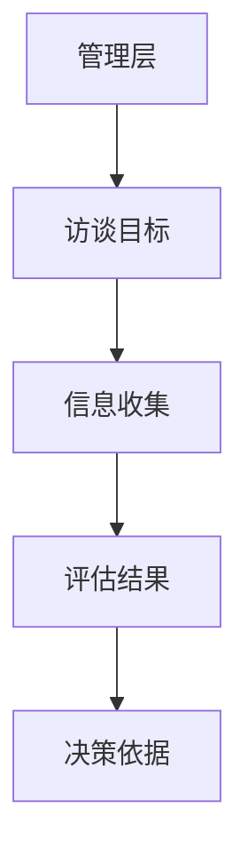
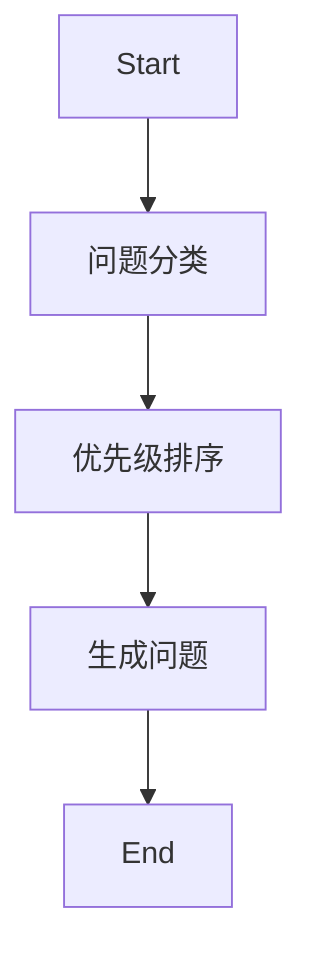
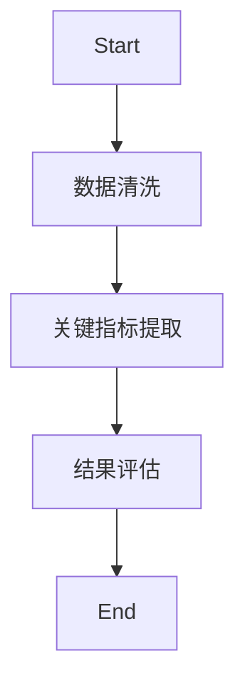
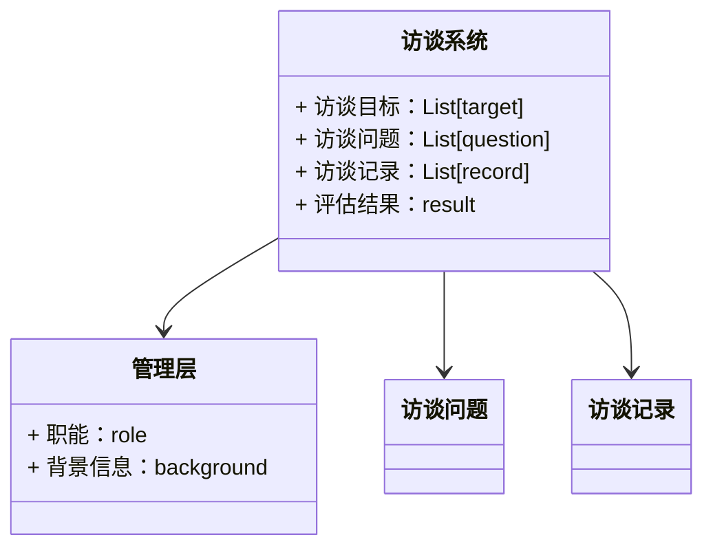
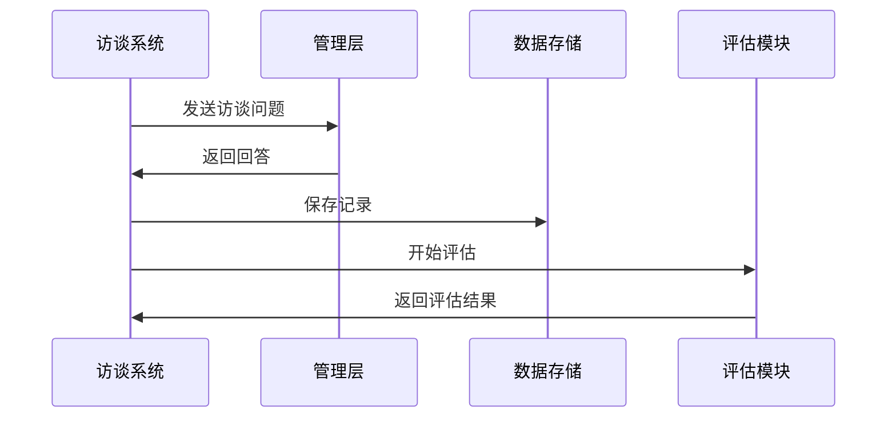

                 


# 费雪的管理层访谈技巧：远程尽职调查的新方法

> 关键词：费雪访谈技巧、远程尽职调查、管理层访谈、结构化访谈、尽职调查方法

> 摘要：本文深入探讨了费雪的管理层访谈技巧及其在远程尽职调查中的应用。通过分析传统访谈方法的局限性，提出了结合现代技术手段的创新方法，详细阐述了访谈目标设定、问题生成算法、结果分析模型以及系统架构设计。结合实际案例，本文展示了如何利用费雪技巧提升远程尽职调查的效率和准确性，为读者提供了实用的指导和最佳实践。

---

# 第一部分: 费雪的管理层访谈技巧概述

## 第1章: 费雪的管理层访谈技巧背景介绍

### 1.1 管理层访谈技巧的核心概念

#### 1.1.1 管理层访谈的定义与背景
管理层访谈是一种通过与企业高层管理人员进行深入交流，获取关键信息以评估企业战略、管理能力、市场定位等重要维度的方法。传统的访谈技巧强调面对面交流，依赖于访谈者的经验和直觉，但在现代远程工作环境下，这种方法面临着诸多挑战，如时空限制、信息获取不完整等问题。

#### 1.1.2 费雪访谈技巧的独特性
费雪的管理层访谈技巧是一种系统化、结构化的访谈方法，注重在有限时间内提取关键信息。其独特性体现在以下几个方面：
1. **目标导向**：访谈目标明确，问题设计围绕核心议题展开。
2. **结构化框架**：采用标准化的访谈流程和问题分类，确保信息收集的全面性和一致性。
3. **数据驱动**：通过记录和分析访谈数据，生成可量化的评估结果。

#### 1.1.3 远程尽职调查的背景与需求
随着全球化的加剧和远程工作的普及，企业并购、投资评估等场景中，远程尽职调查的需求日益增加。传统的现场访谈方式难以满足快速、高效的要求，因此亟需一种适应远程环境的访谈方法。

---

### 1.2 费雪访谈技巧的基本原理

#### 1.2.1 访谈目标的设定
费雪技巧强调在访谈前明确目标，通常包括以下几个方面：
1. **战略评估**：了解企业的战略目标和实施计划。
2. **管理能力评估**：评估管理层的决策能力和团队协作能力。
3. **风险识别**：识别潜在的管理风险和问题。

#### 1.2.2 访谈结构与流程
费雪技巧的访谈流程通常包括以下几个阶段：
1. **准备阶段**：明确目标、设计问题、制定时间表。
2. **执行阶段**：通过视频会议等方式进行访谈，实时记录关键信息。
3. **分析阶段**：整理访谈数据，生成评估报告。

#### 1.2.3 访谈中的关键要素
- **问题设计**：问题需具有开放性和针对性，避免模糊性。
- **时间管理**：严格控制访谈时间，确保效率。
- **记录方式**：采用录音、笔记等多种方式记录访谈内容。

---

### 1.3 费雪访谈技巧与传统方法的对比

#### 1.3.1 传统访谈方法的局限性
1. **时间成本高**：面对面访谈需要协调双方的时间，耗时较长。
2. **信息偏差**：依赖访谈者的主观判断，可能导致信息偏差。
3. **可扩展性差**：难以同时对多个企业进行访谈。

#### 1.3.2 费雪技巧的创新点
1. **结构化设计**：采用标准化的访谈流程，确保信息收集的全面性。
2. **远程适应性**：支持视频会议等远程方式，节省时间和成本。
3. **数据驱动**：通过记录和分析访谈数据，生成客观的评估结果。

#### 1.3.3 方法适用场景的对比分析
| 方法 | 传统访谈 | 费雪技巧 |
|------|-----------|-----------|
| 适用场景 | 线下评估、单次访谈 | 远程评估、批量处理 |
| 信息获取 | 主观判断为主 | 数据驱动为主 |
| 优势 | 深度交流、直观感受 | 高效、客观、可扩展 |

---

### 1.4 本章小结
本章从背景、核心概念和对比分析三个方面，详细介绍了费雪的管理层访谈技巧及其在远程环境下的应用价值。通过对比传统方法，突出了费雪技巧的创新性和实用性。

---

## 第2章: 远程尽职调查的核心概念与联系

### 2.1 远程尽职调查的定义与特点

#### 2.1.1 远程尽职调查的定义
远程尽职调查是指通过远程手段（如视频会议、电子文档传输等），对企业或项目的资质、风险等进行评估的过程。其核心在于利用现代信息技术，突破时空限制，实现高效评估。

#### 2.1.2 远程尽职调查的核心特点
1. **高效性**：节省时间和成本，提高评估效率。
2. **便捷性**：不受地理位置限制，支持全球化评估。
3. **数据化**：通过记录和分析访谈数据，生成客观评估结果。

### 2.2 费雪访谈技巧与远程尽职调查的关系

#### 2.2.1 费雪技巧在远程尽职调查中的应用
1. **问题设计**：针对远程环境的特点，设计更精准的问题。
2. **访谈流程**：优化远程访谈的流程，确保效率和效果。
3. **数据管理**：建立数据化管理流程，便于后续分析。

#### 2.2.2 远程技术对访谈技巧的影响
1. **工具支持**：视频会议软件、录音工具等为访谈提供了技术支持。
2. **数据隐私**：远程环境下的数据安全问题需要特别关注。
3. **互动效果**：远程访谈可能影响互动深度，需通过技巧弥补。

#### 2.2.3 两者结合的优势与挑战
优势：
- 提高评估效率
- 降低评估成本
- 支持全球化评估
挑战：
- 数据隐私和安全问题
- 远程互动效果的不确定性
- 技术依赖性增强

### 2.3 核心概念对比表格

| 概念 | 费雪访谈技巧 | 远程尽职调查 |
|------|--------------|--------------|
| 核心目标 | 获取关键信息 | 评估目标主体 |
| 实施方式 | 结构化访谈 | 综合评估 |
| 依赖工具 | 笔记、录音 | 视频会议、数据分析工具 |

---

### 2.4 ER实体关系图（Mermaid）



---

### 2.5 本章小结
本章通过对比分析，阐述了费雪访谈技巧与远程尽职调查之间的关系，强调了两者结合的优势与挑战。通过对比表格和ER图，进一步明确了核心概念和联系。

---

## 第3章: 费雪访谈技巧的算法原理讲解

### 3.1 访谈问题生成算法

#### 3.1.1 问题分类与优先级排序
1. **问题分类**：根据访谈目标，将问题分为战略、管理、风险等类别。
2. **优先级排序**：根据问题的重要性，确定访谈的顺序和时间分配。

#### 3.1.2 基于上下文的问题生成
问题生成算法需要考虑以下因素：
1. **访谈目标**：问题需围绕核心目标展开。
2. **受访者背景**：根据管理层的背景和职责，调整问题内容。
3. **时间限制**：确保问题数量和时间匹配。

#### 3.1.3 算法流程图（Mermaid）


#### 3.1.4 Python代码实现
```python
def generate_questions(targets):
    questions = []
    for target in targets:
        if target == '战略':
            questions.append('请介绍贵公司的战略目标？')
        elif target == '管理':
            questions.append('如何评估您的管理团队能力？')
        elif target == '风险':
            questions.append('主要面临哪些管理风险？')
    return questions

targets = ['战略', '管理', '风险']
questions = generate_questions(targets)
print(questions)
```

---

### 3.2 访谈结果分析算法

#### 3.2.1 数据清洗与预处理
1. **数据收集**：将访谈录音、笔记等数据转化为结构化数据。
2. **数据清洗**：去除无关信息，提取关键内容。

#### 3.2.2 关键指标提取
根据访谈内容，提取关键指标，如：
- 战略一致性
- 管理能力评分
- 风险识别能力

#### 3.2.3 结果评估模型（数学公
式）
评估模型可以通过加权平均的方式计算总体评分：
$$
\text{总体评分} = \sum (\text{指标权重} \times \text{指标评分})
$$

#### 3.2.4 算法流程图（Mermaid）


---

## 4章: 系统分析与架构设计方案

### 4.1 问题场景介绍
远程尽职调查中，企业需要对多个目标企业进行快速评估，传统的访谈方法难以满足需求。因此，设计一个高效的远程访谈系统至关重要。

### 4.2 项目介绍
本项目旨在开发一个基于费雪访谈技巧的远程尽职调查系统，利用现代信息技术提升访谈效率和评估准确性。

### 4.3 系统功能设计
#### 4.3.1 领域模型（Mermaid类图）


### 4.4 系统架构设计（Mermaid架构图）


### 4.5 系统接口设计
1. **问题生成接口**：接收访谈目标，返回生成的问题列表。
2. **记录存储接口**：支持录音、笔记等多种记录方式的存储和检索。
3. **评估结果接口**：提供评估结果的查询和导出功能。

### 4.6 系统交互设计（Mermaid序列图）


---

## 5章: 项目实战

### 5.1 环境安装
1. **视频会议工具**：Zoom、Teams等。
2. **录音工具**：Otter.ai、Descript等。
3. **数据分析工具**：Python、Excel等。

### 5.2 系统核心实现源代码
```python
import numpy as np
import pandas as pd

def analyze_interviews(records):
    # 数据清洗
    cleaned_data = pd.DataFrame(records)
    # 关键指标提取
    targets = ['战略一致性', '管理能力', '风险识别']
    weighted_scores = {}
    for target in targets:
        # 假设指标权重为0.3、0.4、0.3
        score = cleaned_data[target].mean()
        weighted_scores[target] = score * 0.3 if target == '战略一致性' else (score * 0.4 if target == '管理能力' else score * 0.3)
    # 总体评分
    total_score = sum(weighted_scores.values())
    return total_score

records = [
    {'战略一致性': 0.8, '管理能力': 0.7, '风险识别': 0.6},
    {'战略一致性': 0.7, '管理能力': 0.8, '风险识别': 0.5}
]
result = analyze_interviews(records)
print(result)
```

### 5.3 代码应用解读与分析
上述代码展示了如何通过Python进行访谈数据的分析，包括数据清洗、指标提取和评分计算。实际应用中，可根据具体需求调整权重和指标。

### 5.4 实际案例分析
以一家科技公司为例，通过远程访谈评估其管理能力。访谈问题包括：
1. 请介绍公司的战略目标。
2. 如何评估您的管理团队能力？
3. 主要面临哪些管理风险？

通过分析访谈记录，生成评估报告，为企业决策提供依据。

### 5.5 项目小结
本项目通过实际案例展示了费雪访谈技巧在远程尽职调查中的应用，验证了方法的有效性和可操作性。

---

## 6章: 最佳实践与小结

### 6.1 最佳实践Tips
1. **明确访谈目标**：确保问题设计围绕核心目标展开。
2. **选择合适的工具**：根据需求选择合适的视频会议和录音工具。
3. **数据安全第一**：注意保护访谈数据的隐私和安全。
4. **持续优化**：根据实际效果不断改进访谈流程和方法。

### 6.2 小结
本文通过理论分析和实践案例，详细探讨了费雪的管理层访谈技巧在远程尽职调查中的应用。通过系统设计和算法优化，提升了访谈的效率和准确性。

### 6.3 注意事项
1. **时间管理**：严格控制访谈时间，避免超时。
2. **互动技巧**：增强远程环境下的互动效果，确保信息传递的有效性。
3. **数据记录**：确保访谈数据的完整性和准确性。

### 6.4 拓展阅读
1. 《Effective Communication in Remote Work》
2. 《Data-Driven Decision Making》
3. 《The Art of Structured Interviews》

---

# 作者信息

作者：AI天才研究院/AI Genius Institute & 禅与计算机程序设计艺术 /Zen And The Art of Computer Programming

---

以上是《费雪的管理层访谈技巧：远程尽职调查的新方法》的技术博客文章，涵盖了从背景介绍、核心概念、算法原理到系统设计和项目实战的各个方面，结合理论与实践，为读者提供了全面的指导和实用的建议。

