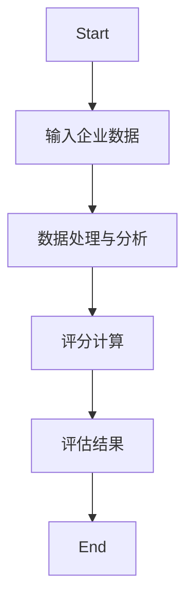

                 


# 费雪的管理层评估标准

> 关键词：费雪，管理层评估，投资标准，战略思维，财务表现，创新能力

> 摘要：本文深入探讨了费雪提出的管理层评估标准，分析其核心概念、算法原理、系统架构及实际应用。通过详细的技术分析和实例说明，揭示了如何科学地评估企业管理层的能力与表现，为投资决策提供有力支持。

---

## 第一部分：费雪的背景与投资理念

### 第1章：费雪的生平与投资哲学

#### 1.1 费雪的生平简介
菲利普·费雪（Philip Fisher）是20世纪著名的价值投资理论家，被誉为“成长股投资之父”。他于1907年出生于美国加利福尼亚州，早年就读于哈佛大学，后转学到加州大学伯克利分校，获得化学工程学士学位。费雪的职业生涯始于1930年代，他通过研究成长股的投资策略，逐渐形成了一套独特的投资理论。

#### 1.2 费雪的投资哲学与理念
费雪的核心理念是：投资的最终目标是寻找那些具有持续增长潜力的公司，并通过长期持有这些公司的股票来实现财富增值。他认为，投资者应该关注企业的管理层能力、行业地位、财务健康状况以及创新能力等关键因素。

#### 1.3 费雪对现代投资学的贡献
费雪的贡献主要体现在以下几个方面：
1. **成长股投资**：他提出了“成长股”概念，即那些收入和利润能够持续增长的公司。
2. **管理层评估**：他强调管理层的质量和能力是企业长期成功的关键因素。
3. **投资组合管理**：他提倡通过分散投资来降低风险，并注重长期持有优质资产。

---

## 第二部分：管理层评估标准的核心概念

### 第2章：管理层评估标准的背景与意义

#### 2.1 投资领域中的管理层评估问题
在投资决策中，管理层的能力和表现直接影响企业的长期发展和股价表现。因此，如何科学地评估管理层的能力是投资者面临的首要问题。

#### 2.2 费雪提出标准的时代背景
在20世纪中叶，美国股市经历了多次波动，投资者意识到仅仅关注财务数据是不够的，还需要深入分析企业的管理团队是否具备战略眼光和执行能力。

#### 2.3 标准的实践意义
费雪的管理层评估标准为投资者提供了一套系统化的分析框架，帮助他们在选择投资标的时更加注重管理层的素质和能力。

---

## 第三部分：管理层评估标准的核心要素

### 第3章：核心概念原理

#### 3.1 标准的定义与目标
费雪提出的管理层评估标准旨在通过分析企业的管理团队，判断其是否具备以下关键能力：
- **战略思维**：管理层是否能够制定出合理的战略规划。
- **执行力**：管理层是否能够高效地执行战略。
- **创新能力**：管理层是否能够推动企业创新，适应市场变化。
- **财务纪律**：管理层是否能够合理分配和使用企业资源。

#### 3.2 标准的系统性与动态性
费雪的评估标准是一个动态的系统，需要根据企业的实际情况和市场环境的变化进行调整。例如，面对经济危机或行业变革，管理层的应对能力是评估的重要指标。

#### 3.3 标准与企业绩效的关系
通过分析管理层的决策能力和执行效果，投资者可以更好地预测企业的未来绩效，从而做出更明智的投资决策。

---

## 第四部分：管理层评估标准的算法与实现

### 第4章：算法原理与实现

#### 4.1 算法原理概述
费雪的管理层评估标准可以转化为一个评分系统。通过对企业管理层的多维度分析，计算出一个综合评分，从而判断管理层的能力。

#### 4.2 算法流程图


#### 4.3 Python实现代码
```python
def fisher_management_score(enterprise_data):
    # 数据预处理
    processed_data = preprocess(enterprise_data)
    # 评分计算
    scores = calculate_scores(processed_data)
    return scores
```

---

## 第五部分：系统架构与实现

### 第5章：系统架构设计

#### 5.1 系统功能设计
- **数据采集**：收集企业的财务数据、管理层信息等。
- **数据处理**：对数据进行清洗和转换，以便后续分析。
- **评分计算**：根据费雪的标准，计算管理层的综合评分。
- **结果分析**：输出评估结果，并提供投资建议。

#### 5.2 系统架构图
```mermaid
class
    +管理层评估系统
        +数据采集模块
        +数据处理模块
        +评分计算模块
        +结果分析模块
```

---

## 第六部分：项目实战与案例分析

### 第6章：项目实战

#### 6.1 环境安装
- 安装Python和必要的库（如Pandas、NumPy等）。

#### 6.2 核心代码实现
```python
def preprocess(enterprise_data):
    # 数据清洗和转换
    processed_data = enterprise_data.dropna().astype(float)
    return processed_data

def calculate_scores(processed_data):
    # 计算管理层评分
    scores = processed_data.mean(axis=0)
    return scores
```

#### 6.3 实例分析
以一家科技公司为例，通过数据处理和评分计算，得出管理层的综合评分，并分析其投资价值。

---

## 第七部分：总结与最佳实践

### 第7章：总结与最佳实践

#### 7.1 小结
费雪的管理层评估标准为投资者提供了一套科学的分析框架，帮助他们更好地判断企业的管理层能力。

#### 7.2 注意事项
在实际应用中，投资者需要结合企业的具体情况，灵活调整评估标准。

#### 7.3 拓展阅读
建议进一步阅读费雪的《成长股投资策略》及相关投资理论书籍。

---

## 作者

作者：AI天才研究院/AI Genius Institute & 禅与计算机程序设计艺术/Zen And The Art of Computer Programming

