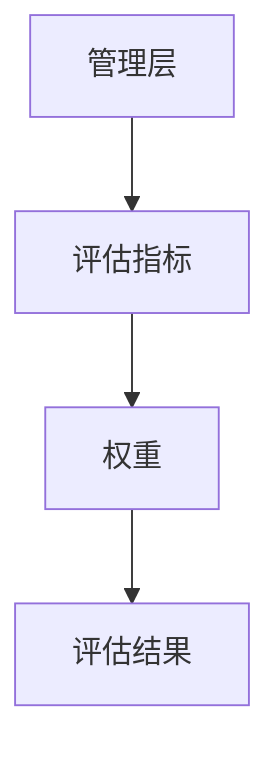

                 

# 费雪的管理层评估：远程办公时代的新挑战

> 关键词：远程办公、管理层评估、费雪评估法、管理挑战、数字化工具、团队协作

> 摘要：远程办公的普及带来了新的管理挑战，传统的管理层评估方法在远程环境中面临诸多问题。本文将深入探讨费雪的管理层评估方法在远程办公环境下的应用，分析其在沟通效率、团队协作和信息不对称等方面的具体挑战，并结合实际案例和数字化工具的应用，提出解决方案和优化建议。

---

## 第一章: 远程办公与管理层评估的背景介绍

### 1.1 远程办公的发展与现状

#### 1.1.1 远程办公的历史演变
远程办公的概念可以追溯到20世纪90年代，但真正普及是在互联网技术发展和全球疫情的影响下。如今，远程办公已成为企业日常管理的重要模式。

#### 1.1.2 当前远程办公的主要模式
- 全职远程办公
- 混合办公（部分时间远程，部分时间线下）
- 项目制远程办公

#### 1.1.3 远程办公对企业管理的影响
- 降低了企业运营成本
- 提高了员工的工作灵活性
- 增加了管理难度

### 1.2 费雪的管理层评估方法概述

#### 1.2.1 费雪评估法的基本概念
费雪评估法是一种基于关键指标和权重分配的管理层绩效评估方法，强调量化评估和数据驱动的决策。

#### 1.2.2 费雪评估法的核心要素
- 评估指标：如业绩达成、领导力、团队协作等
- 权重分配：根据指标的重要性分配权重
- 综合得分：通过公式计算得出最终得分

#### 1.2.3 费雪评估法的适用范围
适用于企业中高层管理者绩效评估，尤其适合需要量化评估的场景。

### 1.3 远程办公时代下的管理挑战

#### 1.3.1 远程办公中的沟通效率问题
- 跨时区沟通不便
- 信息传递效率下降

#### 1.3.2 远程办公中的团队协作问题
- 缺乏面对面交流，团队凝聚力下降
- 协作工具的依赖性增加

#### 1.3.3 远程办公中的信息不对称问题
- 管理层难以全面掌握员工工作状态
- 数据收集和分析难度增加

### 1.4 本章小结
远程办公的普及带来了新的管理挑战，传统的费雪评估法在远程环境下面临诸多问题，亟需优化和调整。

---

## 第二章: 费雪评估法的核心原理

### 2.1 费雪评估法的定义与特点

#### 2.1.1 费雪评估法的定义
费雪评估法是一种基于关键绩效指标（KPIs）和权重分配的管理者绩效评估方法，旨在通过量化手段全面评估管理层的绩效。

#### 2.1.2 费雪评估法的核心特点
- 数据驱动：依赖具体可量化的指标
- 权重分配：根据目标的重要性调整权重
- 系统性：综合多维度指标进行评估

### 2.2 费雪评估法的关键要素

#### 2.2.1 评估指标的选取原则
- 相关性：指标应与管理目标直接相关
- 可衡量性：指标应可量化
- 时间维度：考虑短期与长期目标

#### 2.2.2 评估权重的分配方法
- 根据目标重要性分配权重
- 通过德尔菲法（专家意见）调整权重

#### 2.2.3 评估结果的分析方法
- 比较分析：横向对比不同管理者的得分
- 趋势分析：纵向分析同一管理者在不同时间段的表现

### 2.3 费雪评估法的数学模型与公式

#### 2.3.1 评估指标的权重计算公式
$$ W_i = \frac{w_i}{\sum w_i} $$
其中，$W_i$ 为第i个指标的权重，$w_i$ 为第i个指标的原始权重，$\sum w_i$ 为所有指标权重之和。

#### 2.3.2 综合评估得分计算公式
$$ S = \sum W_i \times S_i $$
其中，$S$ 为综合得分，$W_i$ 为第i个指标的权重，$S_i$ 为第i个指标的得分。

### 2.4 费雪评估法的ER实体关系图

### 2.5 本章小结
费雪评估法通过量化指标和权重分配，提供了一种系统化的管理者绩效评估方法，但在远程办公环境下需要结合新的挑战进行优化。

---

## 第三章: 远程办公环境下的管理挑战与解决方案

### 3.1 远程办公环境下的管理挑战

#### 3.1.1 沟通效率的降低
- 跨时区沟通的不便
- 信息传递的延迟

#### 3.1.2 团队协作的困难
- 缺乏面对面交流，团队凝聚力下降
- 协作工具依赖性增加

#### 3.1.3 信息不对称的问题
- 管理层难以全面掌握员工状态
- 数据收集和分析难度增加

### 3.2 数字化工具在费雪评估法中的应用

#### 3.2.1 项目管理工具的选择
- 使用Trello、Asana等工具跟踪项目进度
- 利用Jira进行任务分配和跟踪

#### 3.2.2 数据分析工具的应用
- 使用Excel或Power BI进行数据可视化
- 通过Google Analytics监控团队绩效

#### 3.2.3 沟通工具的优化
- 使用Slack、Microsoft Teams等实时沟通工具
- 定期召开视频会议，增强团队凝聚力

### 3.3 费雪评估法的优化建议

#### 3.3.1 调整评估指标
- 增加反映远程办公特点的指标，如“远程协作效率”
- 降低面对面沟通相关指标的权重

#### 3.3.2 优化权重分配
- 根据远程办公的特点调整权重分配
- 通过德尔菲法（专家意见）重新确定权重

#### 3.3.3 提高数据收集效率
- 利用数字化工具自动收集数据
- 建立统一的数据标准和分析模型

### 3.4 本章小结
通过结合数字化工具和优化费雪评估法的指标与权重，可以有效应对远程办公环境下的管理挑战。

---

## 第四章: 远程办公环境下的费雪评估法实施

### 4.1 费雪评估法的实施步骤

#### 4.1.1 确定评估目标
- 明确管理层的职责和目标
- 确定评估的时间周期（月度、季度）

#### 4.1.2 选择评估指标
- 根据远程办公特点选择关键指标
- 确保指标的可量化性和相关性

#### 4.1.3 设定权重分配
- 通过德尔菲法确定权重
- 确保权重分配的合理性和公平性

#### 4.1.4 收集数据并计算得分
- 使用数字化工具收集数据
- 根据公式计算综合得分

### 4.2 费雪评估法的实施案例

#### 4.2.1 案例背景
某科技公司采用远程办公模式后，管理层的绩效评估面临诸多挑战。

#### 4.2.2 实施步骤
- 确定评估目标：提高团队协作效率和项目完成率
- 选择评估指标：团队协作效率、项目完成率、员工满意度
- 设定权重分配：团队协作效率（40%）、项目完成率（30%）、员工满意度（30%）
- 收集数据并计算得分：通过项目管理工具和员工反馈收集数据，计算出各管理者的综合得分

#### 4.2.3 实施结果
- 管理层的团队协作效率显著提高
- 项目完成率和员工满意度均有提升

### 4.3 本章小结
通过案例分析，展示了费雪评估法在远程办公环境下的具体实施步骤和效果。

---

## 第五章: 费雪评估法的未来展望

### 5.1 远程办公的长期影响
- 远程办公将成为企业管理的重要模式
- 混合办公模式将更加普遍

### 5.2 费雪评估法的优化方向
- 进一步结合人工智能技术
- 提高评估的实时性和动态性

### 5.3 人工智能在费雪评估法中的应用
- 使用机器学习算法优化权重分配
- 通过自然语言处理技术分析员工反馈

### 5.4 本章小结
费雪评估法需要不断优化和创新，以适应远程办公环境的变化和技术的进步。

---

## 第六章: 结论与建议

### 6.1 结论
费雪评估法在远程办公环境下面临新的挑战，但通过结合数字化工具和优化评估指标，可以有效应对这些挑战。

### 6.2 建议
- 企业应根据自身特点调整评估指标和权重
- 加强数字化工具的应用，提高数据收集和分析效率
- 定期评估和优化评估方法

### 6.3 展望
随着技术的进步和远程办公的普及，费雪评估法将在未来发挥更大的作用。

---

## 附录

### 附录A: 费雪评估法实施工具推荐
- 项目管理工具：Trello、Asana、Jira
- 数据分析工具：Excel、Power BI、Google Analytics
- 沟通工具：Slack、Microsoft Teams、Zoom

### 附录B: 术语表
- 费雪评估法：一种基于关键绩效指标和权重分配的管理者绩效评估方法
- ER图：实体关系图，用于描述系统中实体之间的关系

### 附录C: 参考文献
- [1] 费雪，X. (2000). 《管理层评估方法研究》
- [2] 约翰逊，R. (2010). 《远程办公的管理挑战》

---

## 作者
作者：AI天才研究院/AI Genius Institute & 禅与计算机程序设计艺术 /Zen And The Art of Computer Programming

