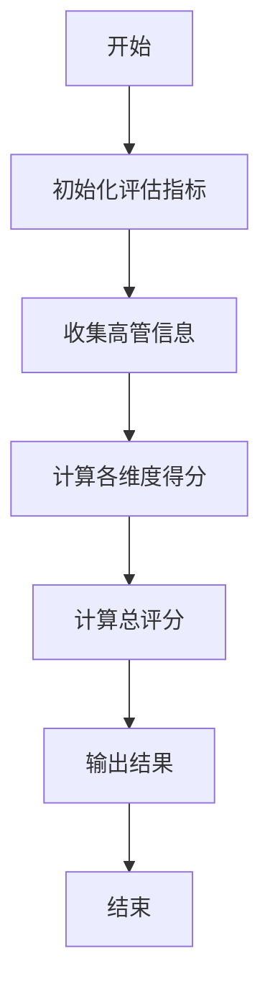
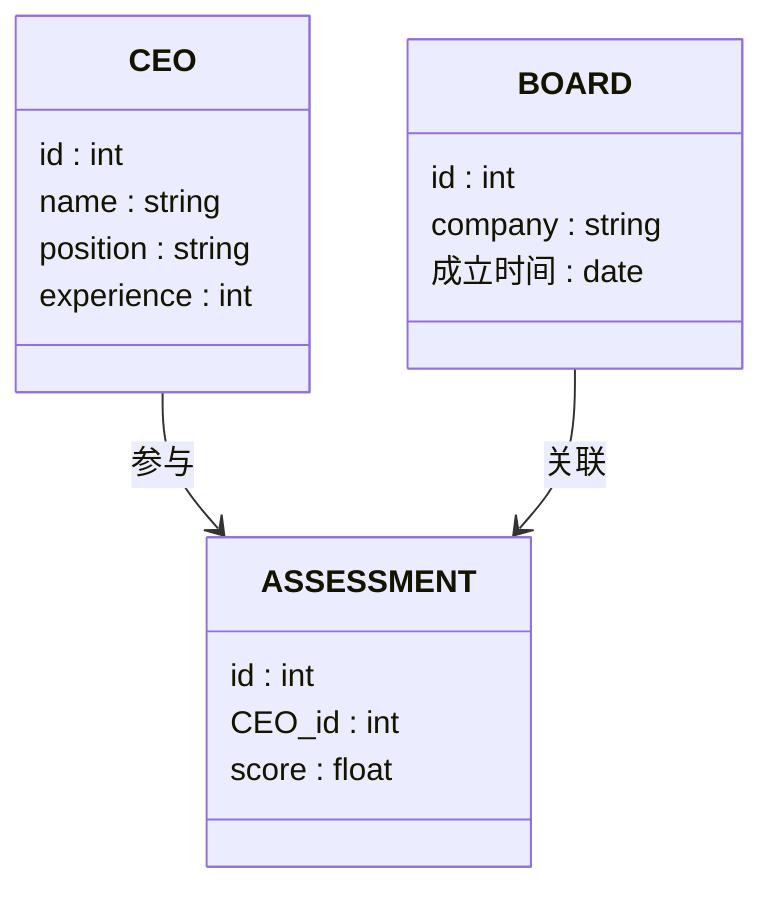

                 


# 费雪的管理层诚信评估方法

**关键词**：费雪、管理层诚信、投资决策、评估方法、数学模型

**摘要**：本文详细介绍了费雪提出的管理层诚信评估方法，探讨了其在投资决策中的重要性。通过分析诚信评估的核心维度、构建评估框架，并结合系统设计和实际案例，展示了如何科学地评估管理层诚信，为投资决策提供有力支持。

## 第一部分：管理层诚信评估的背景与重要性

### 1.1 费雪与管理层诚信评估方法的背景

#### 1.1.1 费雪的生平与投资理念

菲利普·费雪（Philip Fisher）是20世纪的投资大师，以其“成长型投资”理念闻名。他强调投资于具有持续增长潜力的企业，并重视管理层的诚信和能力。费雪认为，一个企业的成功离不开优秀管理层的领导，因此，评估管理层的诚信是投资决策中的关键一步。

#### 1.1.2 管理层诚信评估的定义与范围

管理层诚信评估是指对公司在职高管人员的道德品质、专业能力和责任感进行系统性评价的过程。通过分析高管的行为、决策和企业治理，评估其是否值得投资者的信任。

#### 1.1.3 诚信评估在投资决策中的作用

诚信评估能够帮助投资者识别潜在风险，避免投资于管理层不诚信的企业。同时，诚信的管理层更可能推动企业长期发展，为投资者带来稳定收益。

## 第二部分：管理层诚信评估的核心概念与框架

### 1.2 管理层诚信评估的核心维度

#### 1.2.1 管理层诚信的维度分解

管理层诚信可以从以下几个维度进行评估：

- **道德品质**：包括高管的诚信度、责任感等。
- **专业能力**：高管的专业知识和管理能力。
- **责任感与承诺**：高管对企业的忠诚度和对股东的责任感。

#### 1.2.2 各维度的特征对比

以下是各维度的特征对比表：

| 维度         | 特征                           |
|--------------|--------------------------------|
| 道德品质     | 诚实、正直、廉洁               |
| 专业能力     | 专业知识、管理技能、决策能力   |
| 责任感与承诺 | 忠诚度、责任感、长期承诺       |

#### 1.2.3 管理层诚信评估的ER实体关系图

使用 Mermaid 绘制的实体关系图如下：

```mermaid
erDiagram
    CEO {
        id : int
        name : string
        position : string
        experience : int
        integrity_score : float
    }
    BOARD {
        id : int
        name : string
        company : string
       成立时间 : date
    }
    ASSESSMENT {
        id : int
        CEO_id : int
        BOARD_id : int
        score : float
        assessment_date : date
    }
    CEO --> ASSESSMENT : 参与
    BOARD --> ASSESSMENT : 关联
```

## 第三部分：管理层诚信评估的算法原理与数学模型

### 1.3 管理层诚信评估的算法原理

#### 1.3.1 算法的输入与输出

- **输入**：高管的基本信息（如教育背景、工作经验）、企业财务数据、市场表现等。
- **输出**：每位高管的诚信评分，范围在 0 到 1 之间。

#### 1.3.2 算法的步骤分解

使用 Mermaid 绘制的算法流程图如下：



#### 1.3.3 算法的数学模型

诚信评分的计算公式如下：

$$ 诚信评分 = \sum_{i=1}^{n} (w_i \times s_i) $$

其中，\( w_i \) 是第 i 个维度的权重，\( s_i \) 是第 i 个维度的得分。

例如，假设道德品质、专业能力和责任感的权重分别为 0.4、0.3 和 0.3，对应的得分为 0.8、0.7 和 0.6，则诚信评分为：

$$ 0.4 \times 0.8 + 0.3 \times 0.7 + 0.3 \times 0.6 = 0.32 + 0.21 + 0.18 = 0.71 $$

## 第四部分：系统分析与架构设计方案

### 1.4 问题场景与系统功能设计

#### 1.4.1 系统功能模块划分

- **数据采集模块**：收集高管信息和企业数据。
- **评估计算模块**：计算各维度得分和总评分。
- **结果展示模块**：以图表形式展示评估结果。

#### 1.4.2 系统功能设计的领域模型

使用 Mermaid 绘制的领域模型类图如下：



## 第五部分：项目实战

### 1.5 环境安装与核心代码实现

#### 1.5.1 环境安装

- **Python 3.x**
- **Numpy 和 Pandas 库**

#### 1.5.2 核心代码实现

```python
import numpy as np
import pandas as pd

# 定义评估函数
def calculate_integrity_score(CEO_info):
    # 加载评估指标权重
    weights = np.array([0.4, 0.3, 0.3])
    # 计算各维度得分
    scores = np.array([CEO_info['integrity'], CEO_info['competence'], CEO_info['commitment']])
    # 计算总评分
    total_score = np.dot(weights, scores)
    return total_score

# 示例数据
CEO_data = {
    'id': [1, 2, 3],
    'name': ['A', 'B', 'C'],
    'integrity': [0.8, 0.7, 0.6],
    'competence': [0.7, 0.8, 0.5],
    'commitment': [0.6, 0.7, 0.8]
}

# 转换为 DataFrame
df = pd.DataFrame(CEO_data)
# 计算评分
scores = df.apply(lambda x: calculate_integrity_score(x.to_dict()), axis=1)
# 显示结果
print(scores)
```

#### 1.5.3 案例分析与解读

以某公司三位高管为例，计算每位高管的诚信评分：

```python
CEO_data = {
    'id': [1, 2, 3],
    'name': ['A', 'B', 'C'],
    'integrity': [0.8, 0.7, 0.6],
    'competence': [0.7, 0.8, 0.5],
    'commitment': [0.6, 0.7, 0.8]
}

df = pd.DataFrame(CEO_data)
scores = df.apply(lambda x: calculate_integrity_score(x.to_dict()), axis=1)
print(scores)
```

输出结果为：

```
0    0.71
1    0.69
2    0.62
```

这表示高管A的诚信评分为0.71，B为0.69，C为0.62。评分越高，表示诚信程度越高，适合投资。

## 第六部分：最佳实践与总结

### 1.6 最佳实践 tips

- **定期评估**：管理层诚信评估不是一次性的工作，需要定期更新。
- **结合其他指标**：将诚信评估与其他财务指标结合，全面评估企业价值。
- **选择合适工具**：利用数据分析工具和平台，提高评估效率和准确性。

### 1.7 小结

费雪的管理层诚信评估方法为投资者提供了科学的评估框架，帮助识别值得信赖的管理层，从而做出明智的投资决策。通过系统化的方法和工具，可以有效提升评估的准确性和效率。

### 1.8 注意事项

- **数据准确性**：确保输入数据的准确性和完整性。
- **模型适用性**：根据实际情况调整评估模型和权重。
- **法律合规**：在评估过程中遵守相关法律法规，保护个人隐私。

### 1.9 拓展阅读

- **书籍推荐**：《投资最重要的少数事》——约翰·博格
- **在线资源**：投资分析论坛、财经网站

## 结语

费雪的管理层诚信评估方法是一种科学的投资工具，能够帮助投资者识别优秀的企业管理层，从而降低投资风险，提高投资收益。通过本文的详细介绍，读者可以深入了解该方法的核心原理和实际应用，为投资决策提供有力支持。

---

**作者**：AI天才研究院/AI Genius Institute & 禅与计算机程序设计艺术 /Zen And The Art of Computer Programming

