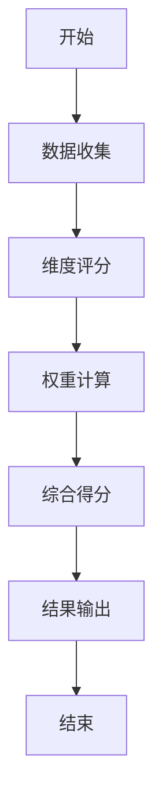

                 


# 费雪的管理层质量评估方法

## 关键词：管理层质量评估，费雪方法，投资决策，企业管理，价值投资

## 摘要：  
本文深入分析了费雪的管理层质量评估方法，从背景介绍、核心概念、算法原理到系统架构，结合实际案例，详细讲解了如何通过多维度评估企业管理层的质量，从而辅助投资决策。文章旨在帮助读者理解并掌握这一方法的实际应用，提升企业在投资和管理中的价值。

---

# 第一部分：费雪的管理层质量评估方法概述

## 第1章：费雪的管理层质量评估方法背景介绍

### 1.1 管理层质量评估的重要性  
在企业投资和管理中，管理层的质量是决定企业价值的关键因素之一。管理层的决策能力和执行能力直接影响企业的成长和发展。通过对管理层质量的评估，投资者可以更准确地判断企业的潜在价值和风险。

#### 1.1.1 投资决策中的管理层角色  
管理层是企业战略的制定者和执行者，其能力直接影响企业的经营绩效。投资者在评估企业时，必须关注管理层的道德品质、决策能力和执行能力。

#### 1.1.2 管理层质量对企业价值的影响  
管理层的质量直接影响企业的市场地位、盈利能力和发展潜力。优秀的管理层能够带领企业应对市场挑战，创造更大的价值。

#### 1.1.3 费雪方法的背景与起源  
菲利普·费雪（Philip Fisher）是价值投资的先驱之一，他提出了成长股投资策略，并强调管理层质量在企业投资中的重要性。费雪方法的核心在于通过多维度评估管理层的质量，从而选择具有长期成长潜力的企业。

### 1.2 费雪方法的核心概念  
费雪方法将管理层质量评估分解为多个维度，包括道德品质、智力才能、决策能力和执行能力等。

#### 1.2.1 管理层质量评估的定义  
管理层质量评估是指通过对管理层的多个维度进行分析，评估其能力和潜力的过程。费雪方法强调全面性、客观性和可操作性。

#### 1.2.2 费雪方法的核心要素  
费雪方法的核心要素包括道德品质、智力才能、决策能力和执行能力。这些要素共同构成了管理层质量评估的框架。

#### 1.2.3 评估方法的目标与边界  
费雪方法的目标是通过评估管理层的质量，选择具有长期成长潜力的企业。其边界在于关注管理层的能力，而非企业的财务表现。

### 1.3 费雪方法的评估维度  
费雪方法将管理层质量评估分解为多个维度，包括道德品质、智力才能、决策能力、执行能力等。

#### 1.3.1 道德品质  
道德品质是管理层评估的重要维度之一。费雪认为，管理层的道德品质直接影响企业的长期发展。通过评估管理层的道德品质，可以判断其是否具备诚信和责任感。

#### 1.3.2 智力才能  
智力才能是管理层评估的关键维度之一。费雪认为，管理层的智力才能直接影响企业的创新能力和发展潜力。通过评估管理层的智力才能，可以判断其是否具备应对市场挑战的能力。

#### 1.3.3 决策能力  
决策能力是管理层评估的核心维度之一。费雪认为，管理层的决策能力直接影响企业的经营绩效。通过评估管理层的决策能力，可以判断其是否具备科学决策的能力。

#### 1.3.4 执行能力  
执行能力是管理层评估的重要维度之一。费雪认为，管理层的执行能力直接影响企业的执行力。通过评估管理层的执行能力，可以判断其是否具备将战略转化为实际的能力。

---

## 第2章：费雪方法的核心概念与联系

### 2.1 核心概念原理  
费雪方法的核心概念是通过多维度评估管理层的质量，从而选择具有长期成长潜力的企业。这些维度包括道德品质、智力才能、决策能力和执行能力。

#### 2.1.1 管理层质量的多维度评估  
费雪方法强调对管理层的多维度评估，包括道德品质、智力才能、决策能力和执行能力。这些维度相互关联，共同构成了管理层质量评估的框架。

#### 2.1.2 费雪方法的逻辑框架  
费雪方法的逻辑框架是：通过评估管理层的道德品质、智力才能、决策能力和执行能力，判断其是否具备长期成长潜力。

#### 2.1.3 各维度之间的关系  
道德品质、智力才能、决策能力和执行能力是相互关联的。道德品质是基础，智力才能是核心，决策能力是关键，执行能力是保障。

### 2.2 概念属性特征对比表  
以下是费雪方法中各评估维度的对比表：

| 维度 | 定义 | 重要性 | 评估指标 |
|------|------|--------|----------|
| 道德品质 | 管理层的诚信和责任感 | 高 | 企业声誉、高管团队稳定性 |
| 智力才能 | 管理层的创新能力 | 高 | 学历背景、行业经验 |
| 决策能力 | 管理层的决策能力 | 高 | 战略规划、决策效率 |
| 执行能力 | 管理层的执行力 | 中 | 组织能力、项目完成率 |

### 2.3 ER实体关系图  
以下是费雪方法的ER实体关系图：

```mermaid
er
  actor 管理层评估维度 {
    <---+--- 管理层质量评估
  }
```

---

## 第3章：费雪方法的算法原理讲解

### 3.1 算法原理概述  
费雪方法的算法原理是通过多维度评估管理层的质量，综合计算其得分，从而判断其是否具备长期成长潜力。

#### 3.1.1 费雪方法的评分系统  
费雪方法的评分系统包括道德品质、智力才能、决策能力和执行能力四个维度，每个维度的权重不同。通过计算各维度的得分，得出综合得分。

#### 3.1.2 多维度权重分配  
费雪方法的多维度权重分配是：道德品质占20%，智力才能占30%，决策能力占30%，执行能力占20%。

#### 3.1.3 综合评分计算  
综合评分计算公式为：综合得分 = Σ（各维度得分 × 权重）

### 3.2 算法流程图  
以下是费雪方法的算法流程图：



### 3.3 Python核心代码实现  
以下是费雪方法的Python代码实现：

```python
def fisher_management_score(management_profile):
    # 定义评估维度和权重
    dimensions = {
        'morality': 0.2,
        'intelligence': 0.3,
        'decision_making': 0.3,
        'execution': 0.2
    }
    
    # 计算各维度得分
    morality_score = management_profile['morality']
    intelligence_score = management_profile['intelligence']
    decision_making_score = management_profile['decision_making']
    execution_score = management_profile['execution']
    
    # 计算综合得分
    total_score = (moral

