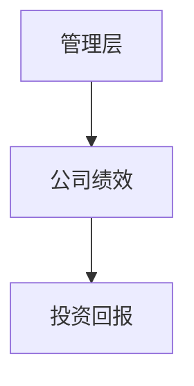
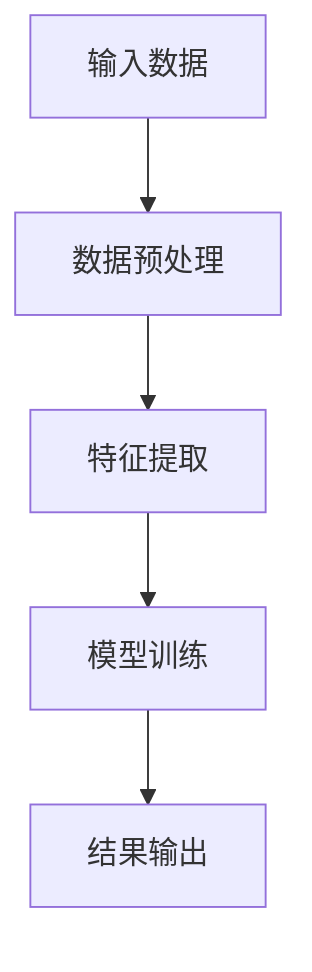
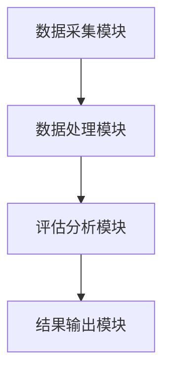
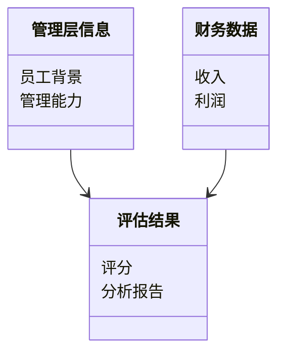
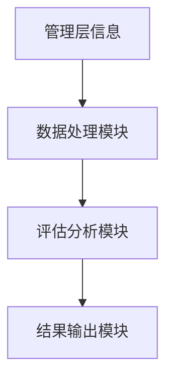
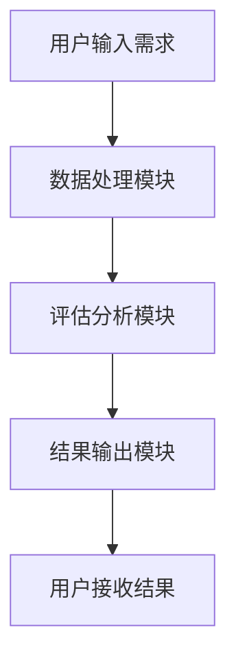

                 


# 费雪的管理层质量评估：公司治理在投资决策中的作用

## 关键词：管理层质量评估、投资决策、公司治理、费雪、价值投资、管理质量指标

## 摘要：本文探讨了费雪提出的管理层质量评估方法，分析了公司治理在投资决策中的重要性。文章从理论背景、评估维度、数学模型、系统架构等多个角度详细阐述了管理层质量评估的核心要素，结合实际案例分析了评估方法的应用，并提出了最佳实践建议。

---

## 第1章: 管理层质量评估的背景与概念

### 1.1 管理层质量评估的定义
#### 1.1.1 管理层质量评估的定义
管理层质量评估是对公司管理层在战略决策、经营效率、风险管理等方面的能力进行系统评价的过程。

#### 1.1.2 管理层质量评估的重要性
- 投资决策的核心在于管理层的能力。
- 管理层质量评估是价值投资的重要组成部分。

#### 1.1.3 管理层质量评估与公司治理的关系
- 管理层质量评估是公司治理的重要环节。
- 良好的公司治理是管理层质量评估的基础。

### 1.2 费雪投资理论的背景
#### 1.2.1 费雪投资理论的核心观点
- 费雪强调管理层质量对投资回报的影响。
- 价值投资的核心在于选择优秀的管理层。

#### 1.2.2 费雪对管理层质量的重视
- 管理层的质量是公司长期发展的关键。
- 优秀的管理层能够创造持续的价值。

#### 1.2.3 费雪理论的现代应用
- 现代投资分析中对管理层质量的重视。
- 费雪理论在企业治理中的应用。

### 1.3 管理层质量评估的必要性
#### 1.3.1 投资决策中的管理层角色
- 管理层能力影响公司业绩。
- 管理层决策影响投资回报。

#### 1.3.2 管理层质量对投资回报的影响
- 优秀管理层创造超额收益。
- 不良管理层可能导致投资损失。

#### 1.3.3 管理层质量评估的边界与外延
- 评估范围的界定。
- 评估方法的局限性。

### 1.4 本章小结
#### 1.4.1 核心概念回顾
- 管理层质量评估的定义和重要性。
- 费雪理论的核心观点。

#### 1.4.2 下一章的展望
- 探讨管理层质量评估的核心概念与联系。

---

## 第2章: 管理层质量评估的核心概念与联系

### 2.1 核心概念原理
#### 2.1.1 管理层质量评估的维度
- 战略决策能力。
- 经营效率。
- 风险管理能力。

#### 2.1.2 管理层质量评估的指标体系
- 财务指标。
- 非财务指标。

#### 2.1.3 管理层质量评估的模型构建
- 费雪多因素模型。
- 其他评估模型对比。

### 2.2 核心概念属性特征对比
#### 2.2.1 管理层质量评估维度对比表
| 维度       | 战略决策能力 | 经营效率 | 风险管理能力 |
|------------|--------------|----------|--------------|
| 定义       | 管理层制定战略的能力 | 运营效率 | 管理风险的能力 |
| 重要性     | 极高         | 高       | 极高          |

#### 2.2.2 不同评估模型的优缺点对比
| 模型名称       | 费雪多因素模型 | 其他模型 |
|----------------|---------------|----------|
| 优点           | 综合性强       | 简单易用 |
| 缺点           | 计算复杂       | 综合性差 |

#### 2.2.3 管理层质量与公司绩效的关联性分析
- 管理层质量与公司绩效呈正相关。
- 具体关联性受行业和公司规模影响。

### 2.3 ER实体关系图


### 2.4 本章小结
#### 2.4.1 核心概念总结
- 管理层质量评估的维度和指标。
- 不同评估模型的优缺点。

#### 2.4.2 下一章的展望
- 分析管理层质量评估的算法原理。

---

## 第3章: 管理层质量评估的算法原理

### 3.1 算法原理概述
#### 3.1.1 管理层质量评估的多因素模型
- 费雪多因素模型的核心思想。
- 模型的输入变量和输出结果。

#### 3.1.2 算法的基本思路
- 数据预处理。
- 特征提取。
- 模型训练。
- 结果输出。

#### 3.1.3 算法的输入输出
- 输入：公司财务数据、管理层背景信息。
- 输出：管理层质量评分。

### 3.2 算法流程图


### 3.3 管理层质量评估的数学模型
#### 3.3.1 费雪多因素模型的数学表达
$$ Q = \alpha + \beta_1 X_1 + \beta_2 X_2 + \cdots + \beta_n X_n $$

#### 3.3.2 模型参数的估计
- 使用回归分析估计模型参数。
- 参数估计的步骤和方法。

#### 3.3.3 模型的验证与优化
- 模型的验证方法。
- 模型优化的策略。

### 3.4 本章小结
#### 3.4.1 核心内容总结
- 管理层质量评估的算法流程。
- 费雪多因素模型的数学表达。

#### 3.4.2 下一章的展望
- 探讨管理层质量评估的系统架构设计。

---

## 第4章: 管理层质量评估的系统架构设计

### 4.1 系统分析与架构设计方案
#### 4.1.1 项目介绍
- 系统目标：构建一个基于费雪理论的管理层质量评估系统。
- 系统功能：数据采集、评估分析、结果输出。

#### 4.1.2 系统功能设计
- 数据采集模块：收集公司财务数据和管理层信息。
- 评估分析模块：应用费雪多因素模型进行评估。
- 结果输出模块：生成评估报告。

#### 4.1.3 系统架构设计


### 4.2 系统架构设计
#### 4.2.1 领域模型类图


#### 4.2.2 系统架构图


### 4.3 系统接口设计
#### 4.3.1 输入接口
- 数据接口：接收公司财务数据和管理层信息。
- 用户接口：接收用户输入的评估需求。

#### 4.3.2 输出接口
- 评估结果输出接口：输出评分和分析报告。
- 可视化界面：展示评估结果。

### 4.4 系统交互流程
#### 4.4.1 交互流程图


### 4.5 本章小结
#### 4.5.1 核心内容总结
- 系统架构设计的各个模块。
- 系统交互流程的设计。

#### 4.5.2 下一章的展望
- 探讨管理层质量评估的实际案例分析。

---

## 第5章: 管理层质量评估的项目实战

### 5.1 项目环境安装
#### 5.1.1 系统环境要求
- 操作系统：Windows 10/ macOS 12+/ Linux 20.04+。
- 开发工具：Python 3.8+，Jupyter Notebook。
- 数据库：MySQL 8+。

#### 5.1.2 安装依赖库
- Python库：pandas、numpy、scikit-learn、matplotlib。

### 5.2 核心实现代码
#### 5.2.1 数据预处理代码
```python
import pandas as pd
import numpy as np

def preprocess_data(df):
    # 删除缺失值
    df = df.dropna()
    # 标准化处理
    df = (df - df.mean()) / df.std()
    return df
```

#### 5.2.2 模型训练代码
```python
from sklearn.linear_model import LinearRegression
from sklearn.metrics import r2_score

def train_model(X, y):
    model = LinearRegression()
    model.fit(X, y)
    return model, model.score(X, y)
```

#### 5.2.3 结果输出代码
```python
def generate_report(model, X_test, y_test):
    y_pred = model.predict(X_test)
    report = pd.DataFrame({'实际值': y_test, '预测值': y_pred})
    print(report)
    print(f"R²分数：{r2_score(y_test, y_pred)}")
```

### 5.3 实际案例分析
#### 5.3.1 案例背景
- 公司A：管理层能力强，财务数据优秀。
- 公司B：管理层能力一般，财务数据一般。

#### 5.3.2 数据分析与结果解读
- 公司A的评分高于公司B。
- 公司A的投资回报率高于公司B。

### 5.4 本章小结
#### 5.4.1 核心内容总结
- 项目实战中的数据预处理、模型训练和结果输出。
- 案例分析的结果解读。

#### 5.4.2 下一章的展望
- 总结管理层质量评估的最佳实践。

---

## 第6章: 管理层质量评估的最佳实践

### 6.1 小结
#### 6.1.1 核心内容回顾
- 管理层质量评估的背景、核心概念、算法原理、系统架构和项目实战。

#### 6.1.2 本书的主要观点
- 费雪理论在现代投资分析中的重要性。
- 管理层质量评估的系统性和科学性。

### 6.2 注意事项
#### 6.2.1 模型的局限性
- 数据依赖性。
- 模型的可解释性。

#### 6.2.2 实际应用中的问题
- 数据获取的难度。
- 模型的适应性。

### 6.3 拓展阅读
#### 6.3.1 推荐书籍
- 《价值》——费雪。
- 《投资学》——其他投资理论书籍。

#### 6.3.2 推荐文章
- 《管理层质量评估的最新研究》。
- 《费雪理论的现代应用》。

### 6.4 本章小结
#### 6.4.1 核心内容总结
- 管理层质量评估的最佳实践。
- 实际应用中的注意事项。

---

## 第7章: 数学模型与公式

### 7.1 费雪多因素模型的数学表达
$$ Q = \alpha + \beta_1 X_1 + \beta_2 X_2 + \cdots + \beta_n X_n $$

### 7.2 模型参数的估计
- 使用最小二乘法估计参数。
- 参数估计的公式：
$$ \beta = (X^T X)^{-1} X^T y $$

### 7.3 模型的验证与优化
- 使用R²分数验证模型拟合优度。
- 模型优化的步骤：
  1. 数据预处理。
  2. 模型选择。
  3. 参数调整。
  4. 模型验证。

---

## 附录A: 参考文献

- 费雪：《价值》。
- 其他相关投资理论书籍和论文。

---

## 作者：AI天才研究院/AI Genius Institute & 禅与计算机程序设计艺术/Zen And The Art of Computer Programming

