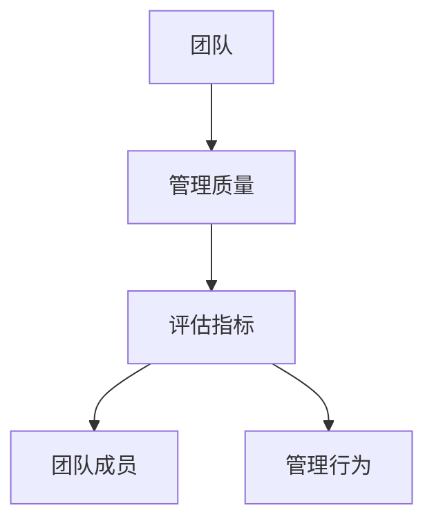
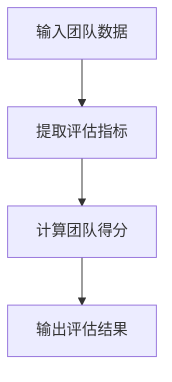
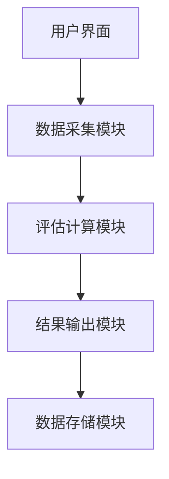
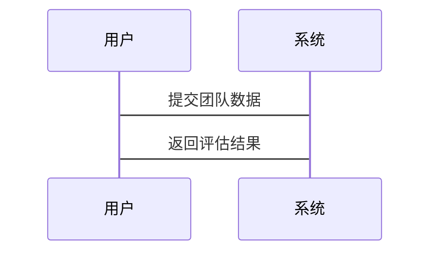

                 


# 费雪的管理质量评估：优秀团队的重要性

## 关键词：团队管理、管理质量评估、费雪评估方法、团队优化、管理效率

## 摘要：  
本文详细探讨了费雪的管理质量评估方法，强调了优秀团队在现代管理中的重要性。通过系统化的分析和实践案例，本文揭示了如何通过科学的评估体系优化团队管理，提升整体管理效率和组织绩效。文章结合理论与实践，为管理者提供了实用的工具和方法，帮助他们在复杂的现代商业环境中构建高效、和谐的团队。

---

## 目录大纲

### 第一部分：管理质量评估的背景与核心概念

#### 第1章：管理质量评估的背景与问题背景

##### 1.1 管理质量评估的背景
- 1.1.1 管理质量评估的定义与核心概念
  - 管理质量评估的定义
  - 核心概念：团队管理、评估指标、管理行为
- 1.1.2 管理质量评估的现状与发展趋势
  - 现代管理中的挑战
  - 评估方法的演变
- 1.1.3 费雪评估方法的提出
  - 费雪方法的背景与核心思想

##### 1.2 管理质量评估的问题背景
- 1.2.1 现代团队管理中的挑战
  - 团队协作中的常见问题
  - 管理效率低下与资源浪费
- 1.2.2 管理质量评估的必要性
  - 评估在团队优化中的作用
  - 评估与组织绩效的关系
- 1.2.3 费雪评估方法的应用场景
  - 适用于哪些类型的团队和组织

##### 1.3 管理质量评估的核心要素
- 1.3.1 团队管理的核心要素
  - 团队目标、团队结构、团队文化
- 1.3.2 管理质量评估的关键指标
  - 工作效率、员工满意度、目标达成率
- 1.3.3 费雪评估方法的核心框架
  - 综合评估模型与实施步骤

---

### 第二部分：管理质量评估的核心概念与联系

#### 第2章：管理质量评估的核心概念与联系

##### 2.1 管理质量评估的核心概念
- 2.1.1 管理质量的定义与属性
  - 管理质量的多维度属性
  - 从“结果”到“过程”的转变
- 2.1.2 费雪评估方法的原理
  - 费雪方法的理论基础
  - 核心指标的选择与权重分配
- 2.1.3 管理质量评估的维度与层次
  - 宏观视角与微观视角的结合

##### 2.2 核心概念的属性对比
- 2.2.1 管理质量评估的属性特征对比表
  | 指标 | 定义 | 权重 | 示例 |
  |------|------|------|------|
  | 效率 | 工作产出与时间的关系 | 0.4 | 项目完成时间提前10% |
  | 满意度 | 员工对管理的主观评价 | 0.3 | 员工满意度提升20% |
  | 创新性 | 团队在解决问题中的创新能力 | 0.3 | 提出创新解决方案的数量增加 |
- 2.2.2 费雪评估方法与其他评估方法的对比
  - 传统评估方法的局限性
  - 费雪方法的独特优势

##### 2.3 管理质量评估的ER实体关系图


---

### 第三部分：管理质量评估的算法原理

#### 第3章：管理质量评估的算法原理

##### 3.1 费雪评估方法的算法流程


##### 3.2 算法原理的数学模型
- 3.2.1 管理质量评估的数学公式
  $$ Q = \sum_{i=1}^{n} w_i \cdot x_i $$
  其中，$Q$ 表示管理质量，$w_i$ 表示第 $i$ 个指标的权重，$x_i$ 表示第 $i$ 个指标的得分。
- 3.2.2 举例说明
  假设一个团队有三个评估指标，权重分别为 $w_1=0.4$，$w_2=0.3$，$w_3=0.3$，得分分别为 $x_1=0.8$，$x_2=0.7$，$x_3=0.9$。则管理质量 $Q$ 为：
  $$ Q = 0.4 \times 0.8 + 0.3 \times 0.7 + 0.3 \times 0.9 = 0.32 + 0.21 + 0.27 = 0.80 $$

##### 3.3 算法实现步骤
- 收集团队数据
- 确定评估指标与权重
- 计算各指标得分
- 综合计算管理质量得分
- 输出评估结果

---

### 第四部分：系统分析与架构设计

#### 第4章：系统分析与架构设计

##### 4.1 系统分析
- 问题场景介绍
  - 现代企业管理中的团队评估需求
  - 费雪评估方法的应用场景
- 项目介绍
  - 系统目标：实现团队管理质量的自动化评估
  - 项目范围：涵盖团队数据采集、评估计算、结果输出
  - 项目目标：提高管理效率，优化团队协作

##### 4.2 系统功能设计
- 领域模型设计
  ```mermaid
  classDiagram
      class 团队 {
          团队ID
          团队名称
          团队成员
      }
      class 评估指标 {
          指标ID
          指标名称
          权重
      }
      class 管理行为 {
          行为ID
          行为描述
          行为得分
      }
      团队 --> 评估指标
      团队 --> 管理行为
  ```

##### 4.3 系统架构设计


##### 4.4 系统接口设计
- 输入接口：团队数据输入
- 输出接口：评估结果输出
- 交互接口：用户与系统交互

##### 4.5 系统交互流程


---

### 第五部分：项目实战

#### 第5章：项目实战

##### 5.1 环境安装
- 安装Python
- 安装相关库（如pandas、numpy）

##### 5.2 核心代码实现
```python
def fisher_management_assessment(team_data, weights):
    # 输入：team_data (列表，每个元素为指标得分)，weights (权重列表)
    # 输出：管理质量得分 Q
    Q = sum(w * x for w, x in zip(weights, team_data))
    return Q

# 示例数据
team_data = [0.8, 0.7, 0.9]
weights = [0.4, 0.3, 0.3]
Q = fisher_management_assessment(team_data, weights)
print("管理质量得分 Q =", Q)
```

##### 5.3 代码应用解读与分析
- 代码解读：实现费雪评估方法的核心算法
- 应用分析：如何根据实际需求调整权重和指标

##### 5.4 实际案例分析
- 案例背景：某公司团队的管理质量评估
- 数据输入：团队成员满意度、项目完成率、创新性得分
- 权重分配：满意度0.5，完成率0.3，创新性0.2
- 评估结果：计算出的管理质量得分
- 案例小结：如何根据评估结果优化团队管理

##### 5.5 项目小结
- 项目总结
- 成果展示
- 经验与教训

---

### 第六部分：最佳实践与总结

#### 第6章：最佳实践与总结

##### 6.1 最佳实践 tips
- 评估指标的选择与权重分配的关键性
- 数据采集的准确性与完整性
- 定期评估与持续优化的重要性

##### 6.2 小结
- 费雪评估方法的核心价值
- 优秀团队管理对组织绩效的影响
- 未来研究与实践方向

##### 6.3 注意事项
- 数据隐私与安全
- 评估结果的客观性与公正性
- 管理质量评估的动态调整

##### 6.4 拓展阅读
- 费雪管理理论的深入研究
- 其他团队评估方法的对比分析
- 管理质量评估在不同行业中的应用案例

---

## 作者：AI天才研究院/AI Genius Institute & 禅与计算机程序设计艺术 /Zen And The Art of Computer Programming

