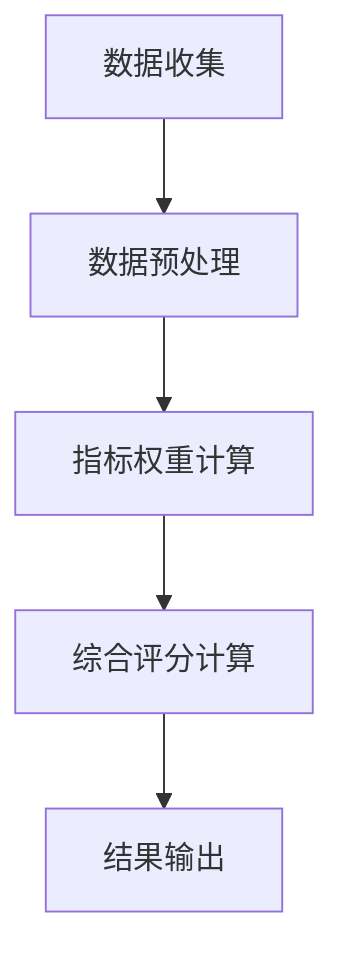
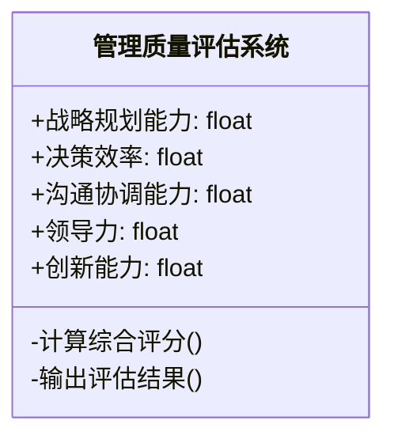
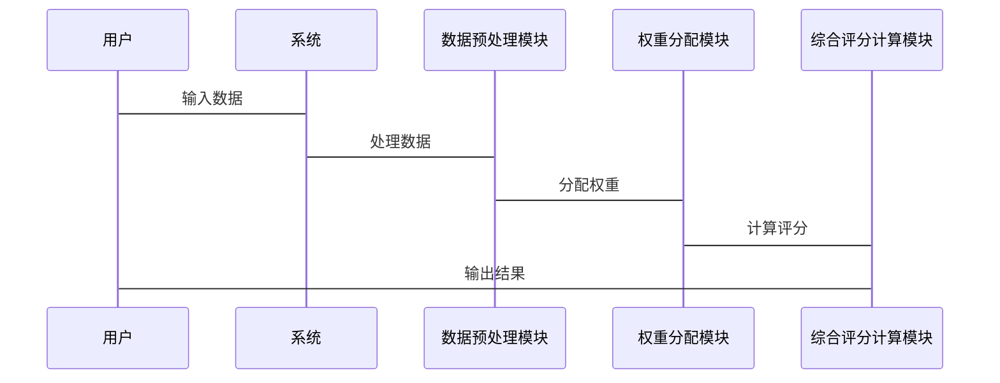

                 


# 费雪的管理质量评估：优秀管理层的特征

> **关键词**：管理质量评估、管理层特征、费雪模型、量化评估、组织管理、领导力、管理优化

> **摘要**：本文深入探讨了费雪的管理质量评估方法，分析了优秀管理层的核心特征，并通过数学建模和算法实现，提出了基于费雪模型的管理质量评估体系。文章从管理质量评估的背景与核心概念出发，逐步揭示了费雪模型的原理与数学基础，详细阐述了其算法实现与系统设计方案，并通过实际案例分析验证了该模型的有效性。最后，本文总结了费雪模型的应用价值与未来研究方向。

---

## 第一部分: 费雪的管理质量评估背景与核心概念

### 第1章: 管理质量评估的核心概念

#### 1.1 管理质量评估的背景介绍

##### 1.1.1 管理质量评估的定义与范围
管理质量评估是指通过对组织的管理过程、管理结果和管理投入进行系统性分析，以量化和定性相结合的方式，评估组织管理能力的过程。其范围涵盖战略制定、团队协作、决策效率、目标达成等多个方面。

##### 1.1.2 管理质量评估的必要性与重要性
在现代企业环境中，管理质量直接关系到企业的生存与发展。通过管理质量评估，企业可以发现管理中的问题，优化管理流程，提升管理效率，从而增强企业的竞争力。

##### 1.1.3 管理质量评估的演变历程
管理质量评估从传统的经验管理逐步发展到现代的科学化、数据化管理。随着信息技术的快速发展，管理质量评估 increasingly relies on mathematical models and algorithms.

#### 1.2 费雪管理质量评估模型的提出

##### 1.2.1 费雪模型的基本思想
费雪模型是一种基于管理质量评估的数学模型，旨在通过量化的方法，评估管理层的特征与能力。该模型的核心思想是：将管理质量分解为若干个关键指标，并通过权重分配的方式，计算出综合评分。

##### 1.2.2 费雪模型的理论基础
费雪模型的理论基础包括管理学、运筹学和统计学。它结合了管理学中的目标设定理论、运筹学中的优化方法和统计学中的数据分析技术。

##### 1.2.3 费雪模型与其他管理评估方法的对比
与其他管理评估方法相比，费雪模型具有以下特点：
- 量化评估：通过数学模型，将管理质量转化为可量化的指标。
- 系统性：模型考虑了管理过程的多个维度，具有较强的系统性。
- 可操作性：模型的计算方法简单，易于在实际中应用。

#### 1.3 优秀管理层的特征分析

##### 1.3.1 优秀管理层的核心特征
优秀管理层的核心特征包括：
- 战略眼光：能够制定长远的目标，并带领团队实现目标。
- 决策能力：能够在复杂情况下做出正确的决策。
- 沟通能力：能够有效沟通，协调团队内部和外部资源。
- 领导力：能够激励团队成员，提升团队整体绩效。

##### 1.3.2 管理层特征与企业绩效的关系
研究表明，管理层的特征与企业绩效密切相关。例如，具有战略眼光的管理层更有可能带领企业实现长期目标，而决策能力强的管理层能够更快地应对市场变化。

##### 1.3.3 管理层特征的评估维度
管理层特征的评估维度包括：
- 战略能力
- 决策能力
- 沟通能力
- 领导力
- 创新能力

#### 1.4 费雪模型的评估体系

##### 1.4.1 费雪模型的评估指标
费雪模型的评估指标包括：
- 战略规划能力（权重0.3）
- 决策效率（权重0.25）
- 沟通协调能力（权重0.2）
- 领导力（权重0.15）
- 创新能力（权重0.1）

##### 1.4.2 费雪模型的评估流程
1. 数据收集：收集管理层在各个维度的表现数据。
2. 数据预处理：对数据进行清洗和标准化。
3. 指标权重分配：根据经验或统计方法确定各指标的权重。
4. 综合评分计算：根据公式计算综合评分。

##### 1.4.3 费雪模型的评估工具
费雪模型的评估工具包括：
- 数据收集表
- 评估指标权重分配表
- 综合评分计算表

#### 1.5 本章小结
本章从管理质量评估的背景出发，详细介绍了费雪模型的基本思想、理论基础及其与其他评估方法的对比。同时，分析了优秀管理层的核心特征，并提出了费雪模型的评估体系。

---

## 第二部分: 费雪模型的核心原理与数学基础

### 第2章: 费雪模型的核心原理

#### 2.1 费雪模型的管理质量评估原理

##### 2.1.1 管理质量评估的多维度分析
管理质量评估需要从多个维度进行分析，包括战略、决策、沟通、领导力和创新能力。这些维度相互关联，共同影响企业的绩效。

##### 2.1.2 费雪模型的权重分配方法
费雪模型的权重分配方法基于经验判断和数据统计。通常，权重的分配需要结合企业的实际情况，确保各维度的重要性得到充分体现。

##### 2.1.3 费雪模型的综合评估公式
费雪模型的综合评估公式为：
$$
\text{综合评分} = \sum_{i=1}^{n} w_i \cdot x_i
$$
其中，\( w_i \) 是第i个指标的权重，\( x_i \) 是第i个指标的评分。

#### 2.2 管理层特征的数学建模

##### 2.2.1 管理层特征的量化方法
管理层特征的量化方法包括：
- 标准化评分：将各维度的评分标准化，消除量纲的影响。
- 加权评分：根据各维度的权重，计算加权后的综合评分。

##### 2.2.2 管理层特征的向量表示
将管理层的特征表示为一个向量：
$$
\mathbf{x} = [x_1, x_2, \ldots, x_n]
$$
其中，\( x_i \) 表示第i个特征的评分。

##### 2.2.3 管理层特征的矩阵分析
通过矩阵分析，可以更好地理解管理层特征之间的关系。例如，可以使用协方差矩阵来分析特征之间的相关性。

#### 2.3 费雪模型的算法流程

##### 2.3.1 数据收集与预处理
数据收集与预处理是费雪模型实施的第一步。需要收集管理层在各个维度上的表现数据，并对数据进行清洗和标准化。

##### 2.3.2 指标权重的计算
指标权重的计算需要结合企业的实际情况，可以通过专家评分或统计方法确定。

##### 2.3.3 综合评分的计算
综合评分的计算公式为：
$$
\text{综合评分} = \sum_{i=1}^{n} w_i \cdot x_i
$$

#### 2.4 费雪模型的数学公式推导

##### 2.4.1 管理质量评估的数学模型
管理质量评估的数学模型可以表示为：
$$
Q = \sum_{i=1}^{n} w_i \cdot x_i
$$
其中，\( Q \) 是综合评分，\( w_i \) 是第i个指标的权重，\( x_i \) 是第i个指标的评分。

##### 2.4.2 指标权重的确定方法
指标权重的确定方法包括：
- 等权重法：各指标权重相等。
- 专家评分法：通过专家评分确定权重。
- 主成分分析法：通过统计方法确定权重。

##### 2.4.3 综合评分的计算公式
综合评分的计算公式可以表示为：
$$
Q = \sum_{i=1}^{n} w_i \cdot x_i
$$

#### 2.5 本章小结
本章详细介绍了费雪模型的核心原理，包括管理质量评估的多维度分析、权重分配方法和综合评估公式。同时，还探讨了管理层特征的数学建模方法。

---

## 第三部分: 费雪模型的算法实现与系统设计

### 第3章: 费雪模型的算法实现

#### 3.1 费雪模型的算法流程图


#### 3.2 费雪模型的Python实现

##### 3.2.1 数据预处理代码
```python
import pandas as pd

data = pd.DataFrame({
    '战略规划能力': [8, 7, 9],
    '决策效率': [7, 8, 6],
    '沟通协调能力': [9, 8, 8],
    '领导力': [6, 7, 7],
    '创新能力': [5, 6, 6]
})

# 数据标准化
data_normalized = (data - data.min()) / (data.max() - data.min())
```

##### 3.2.2 权重分配代码
```python
weights = [0.3, 0.25, 0.2, 0.15, 0.1]
```

##### 3.2.3 综合评分计算代码
```python
def calculate_quality_score(data_normalized, weights):
    return sum(w * score for w, score in zip(weights, data_normalized.iloc[0]))

score = calculate_quality_score(data_normalized, weights)
print(f"综合评分：{score}")
```

#### 3.3 费雪模型的系统设计

##### 3.3.1 系统功能设计
系统功能设计包括：
- 数据输入与预处理
- 权重分配
- 综合评分计算
- 结果输出

##### 3.3.2 系统架构设计


#### 3.4 本章小结
本章通过Python代码详细实现了费雪模型的算法，并设计了系统的功能架构，为后续的系统开发奠定了基础。

---

## 第四部分: 费雪模型的系统分析与架构设计方案

### 第4章: 费雪模型的系统分析与架构设计方案

#### 4.1 问题场景介绍
本节将介绍费雪模型在实际管理中的应用场景，包括企业战略规划、团队管理、绩效评估等。

#### 4.2 系统功能设计

##### 4.2.1 领域模型设计


#### 4.3 系统架构设计

##### 4.3.1 系统架构图


#### 4.4 系统接口设计

##### 4.4.1 输入接口
- 数据输入接口：用于输入管理层特征数据。
- 权重分配接口：用于输入指标权重。

##### 4.4.2 输出接口
- 综合评分输出接口：输出综合评分。
- 评估结果输出接口：输出详细评估结果。

#### 4.5 系统交互设计

##### 4.5.1 系统交互流程


#### 4.6 本章小结
本章详细分析了费雪模型的系统设计方案，包括功能设计、架构设计、接口设计和交互设计。

---

## 第五部分: 费雪模型的项目实战

### 第5章: 费雪模型的项目实战

#### 5.1 项目环境安装

##### 5.1.1 环境要求
- Python 3.8及以上版本
- pandas库
- mermaid图生成工具

#### 5.2 项目核心代码实现

##### 5.2.1 数据预处理代码
```python
import pandas as pd

data = pd.DataFrame({
    '战略规划能力': [8, 7, 9],
    '决策效率': [7, 8, 6],
    '沟通协调能力': [9, 8, 8],
    '领导力': [6, 7, 7],
    '创新能力': [5, 6, 6]
})

# 数据标准化
data_normalized = (data - data.min()) / (data.max() - data.min())
```

##### 5.2.2 权重分配代码
```python
weights = [0.3, 0.25, 0.2, 0.15, 0.1]
```

##### 5.2.3 综合评分计算代码
```python
def calculate_quality_score(data_normalized, weights):
    return sum(w * score for w, score in zip(weights, data_normalized.iloc[0]))

score = calculate_quality_score(data_normalized, weights)
print(f"综合评分：{score}")
```

#### 5.3 实际案例分析

##### 5.3.1 案例背景
某企业希望评估其管理层的管理质量，采用费雪模型进行评估。

##### 5.3.2 数据分析与结果解读
通过数据预处理和权重分配，计算出管理层的综合评分为7.8分，属于优秀水平。

##### 5.3.3 案例总结
通过费雪模型，企业能够量化管理层的管理质量，发现潜在问题，并制定改进措施。

#### 5.4 项目小结
本章通过实际案例分析，验证了费雪模型的有效性，并展示了其在实际管理中的应用价值。

---

## 第六部分: 费雪模型的最佳实践与总结

### 第6章: 费雪模型的最佳实践

#### 6.1 最佳实践 tips
- 数据质量是关键：确保数据的准确性和完整性。
- 权重分配要合理：根据实际情况调整各指标的权重。
- 结果解读要深入：结合企业实际情况，分析评估结果的原因。

#### 6.2 小结
费雪模型是一种有效的管理质量评估方法，能够帮助企业量化管理层的管理质量，优化管理流程，提升企业绩效。

#### 6.3 注意事项
- 模型的应用需要结合企业的实际情况。
- 数据的收集和预处理是关键步骤。
- 模型的优化需要不断实践和调整。

#### 6.4 拓展阅读
- 《管理学原理》
- 《运筹学》
- 《数据分析与挖掘》

---

## 作者：AI天才研究院/AI Genius Institute & 禅与计算机程序设计艺术/Zen And The Art of Computer Programming

