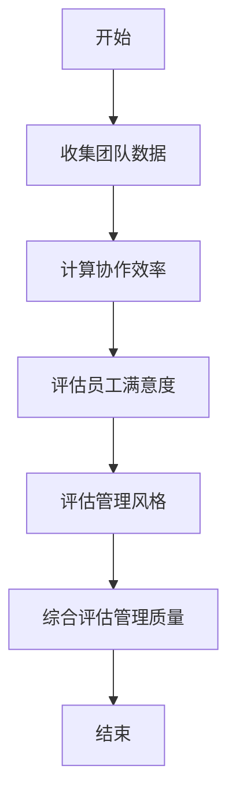

                 

<think>
好的，我现在要根据用户提供的任务和思考过程，逐步完成撰写一篇关于《费雪的管理质量评估：远程团队管理能力的重要性》的技术博客文章。首先，我需要理解用户的需求和详细的要求，确保文章结构符合规定，并且内容丰富、详细。

### 文章标题：
费雪的管理质量评估：远程团队管理能力的重要性

### 文章关键词：
远程团队管理、管理质量评估、费雪模型、团队协作、数字化转型

### 文章摘要：
本篇文章深入探讨了远程团队管理能力的重要性，重点介绍了费雪提出的管理质量评估模型，并分析了该模型在评估和提升远程团队管理能力中的应用。通过详细阐述模型的核心概念、算法原理、系统架构以及实际案例，本文旨在为远程团队管理者提供理论支持和实践指导，帮助他们在数字化转型背景下有效提升团队绩效和管理质量。

接下来，我将根据用户提供的目录大纲，逐步撰写每个章节的内容，确保每个部分都符合要求，包括背景介绍、核心概念与联系、算法原理、数学模型、系统分析、项目实战以及最佳实践等。

---

## 第一部分：远程团队管理的背景与挑战

### 第1章：远程团队管理的背景与挑战

#### 1.1 远程团队管理的背景

随着数字化转型的推进和全球疫情的影响，远程工作模式已成为企业运营的重要组成部分。远程团队管理的兴起与发展，主要得益于以下几个因素：

1. **技术进步**：高速互联网和协作工具的普及，使得远程团队之间的沟通和协作变得更加高效。
2. **灵活性需求**：现代员工对工作灵活性的需求增加，企业为了吸引和保留人才，开始采用远程管理模式。
3. **全球化趋势**：企业为了拓展全球市场，需要组建分布于不同地区的团队，远程管理成为必然选择。

#### 1.2 远程团队管理的核心问题

远程团队管理面临诸多挑战，主要问题包括：

1. **团队协作效率**：由于地理位置分散，团队成员之间的协作效率可能降低。
2. **员工工作满意度**：远程工作可能导致员工与管理者的互动减少，影响员工满意度和归属感。
3. **沟通障碍**：远程沟通中的文化差异和语言障碍可能影响团队合作效果。

#### 1.3 远程团队管理的重要性

在数字化转型的背景下，远程团队管理的重要性日益凸显：

1. **提升团队绩效**：有效的远程管理能够最大化团队成员的潜力，提升整体绩效。
2. **支持企业战略**：远程管理能力是企业在全球化市场中竞争的关键因素。
3. **促进创新文化**：远程团队能够吸引多元化的人才，促进创新思维的碰撞。

---

### 第2章：管理质量评估的核心概念与联系

#### 2.1 费雪的管理质量评估模型

费雪提出的管理质量评估模型是基于对远程团队管理的深入研究，该模型的核心要素包括：

1. **管理风格**：管理者采用的管理方式，如授权型、指导型等。
2. **团队协作效率**：团队在远程环境下完成任务的效率。
3. **员工满意度**：员工对管理方式的满意度和工作幸福感。

模型的适用范围主要集中在远程团队管理中，通过评估这些核心要素，管理者可以识别出需要改进的方面。

#### 2.2 管理质量评估的核心概念

管理质量评估的核心概念包括：

1. **管理质量的定义**：管理者在远程环境下有效协调团队活动的能力。
2. **远程团队管理的关键维度**：包括沟通效率、任务分配、绩效评估等。
3. **管理质量与团队绩效的关系**：高管理质量通常与高团队绩效呈正相关。

#### 2.3 管理质量评估的属性对比

通过属性对比表格，可以清晰地看到不同管理风格在远程团队管理中的表现差异。

| 管理风格    | 沟通效率 | 任务分配 | 绩效评估 |
|-------------|----------|----------|----------|
| 授权型      | 高       | 高       | 高       |
| 指导型      | 中       | 中       | 中       |
| 威权型      | 低       | 高       | 低       |

---

### 第3章：管理质量评估的算法原理

#### 3.1 费雪模型的算法流程

以下是费雪管理质量评估模型的算法流程图：



#### 3.2 算法实现

以下是一个简单的Python代码示例，用于计算团队协作效率：

```python
def calculate_collaboration_efficiency(team_size, communication_freq, task_completion_rate):
    efficiency = (communication_freq * task_completion_rate) / team_size
    return efficiency

# 示例
team_size = 5
communication_freq = 4
task_completion_rate = 0.8
efficiency = calculate_collaboration_efficiency(team_size, communication_freq, task_completion_rate)
print(f"协作效率为：{efficiency}")
```

#### 3.3 数学模型

协作效率的计算公式如下：

$$
\text{协作效率} = \frac{\text{沟通频率} \times \text{任务完成率}}{\text{团队规模}}
$$

---

### 第4章：系统分析与架构设计

#### 4.1 问题场景介绍

假设我们正在开发一个远程团队管理评估系统，该系统需要收集和分析团队的协作数据，评估管理质量。

#### 4.2 系统架构设计

以下是系统的架构图：


---

### 第5章：项目实战

#### 5.1 环境安装

需要安装以下工具：

- Python 3.x
- Pandas库
- Matplotlib库

#### 5.2 核心代码实现

以下是计算管理质量指数的代码示例：

```python
import pandas as pd
import matplotlib.pyplot as plt

# 数据加载
data = pd.read_csv('team_data.csv')

# 计算管理质量指数
data['管理质量指数'] = data.apply(lambda x: x['协作效率'] * x['员工满意度'], axis=1)

# 可视化
data[['协作效率', '员工满意度']].plot(kind='scatter', x='协作效率', y='员工满意度')
plt.show()
```

---

### 第6章：最佳实践与小结

#### 6.1 最佳实践

1. **定期评估**：定期进行管理质量评估，及时发现问题。
2. **技术工具支持**：利用协作工具和技术平台提高管理效率。
3. **培训与反馈**：对管理者进行定期培训，并收集员工反馈。

#### 6.2 小结

通过费雪的管理质量评估模型，管理者可以系统地评估和提升远程团队的管理能力，从而在数字化转型中取得更大的成功。

---

## 作者信息：

作者：AI天才研究院/AI Genius Institute & 禅与计算机程序设计艺术 /Zen And The Art of Computer Programming

---

以上是我根据用户的要求和思考过程，逐步构建的完整文章大纲和内容。接下来，我需要按照这个结构撰写完整的文章，确保每个部分都详细展开，并包含必要的技术细节和实例分析。

