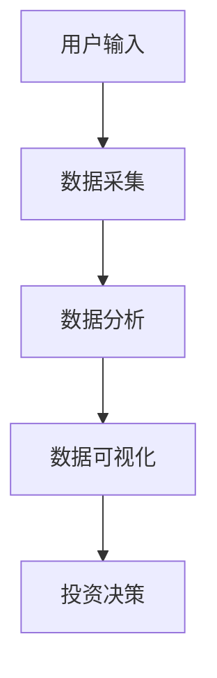
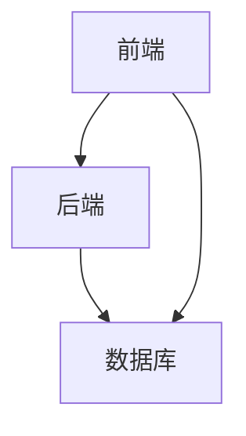

                 


# 费雪的行业分析方法

> 关键词：行业分析，费雪投资，竞争优势，基本面分析，投资策略

> 摘要：费雪的行业分析方法是一种系统化的投资分析策略，强调通过深入分析行业和企业的基本面，识别具有持续竞争优势的企业进行投资。本文将详细阐述费雪的行业分析方法，包括其核心概念、数学模型、系统设计、实战应用以及最佳实践。

---

# 第一部分: 费雪的行业分析方法概述

## 第1章: 行业分析的基本概念与重要性

### 1.1 行业分析的定义与背景

行业分析是投资决策中的关键步骤，旨在通过研究行业内的市场结构、竞争格局、增长潜力和财务表现，评估企业的投资价值。费雪的行业分析方法以其独特的优势模型而闻名，强调从行业和企业两个维度进行综合评估。

#### 1.1.1 行业分析的定义
行业分析是对特定行业内的市场结构、竞争态势、增长潜力和财务状况进行系统性研究的过程。它帮助投资者识别行业中的优势企业，制定有效的投资策略。

#### 1.1.2 行业分析在投资中的重要性
行业分析是投资决策的基础，它能够帮助投资者避免选择处于衰退期的行业，同时抓住具有增长潜力的行业。通过行业分析，投资者可以更好地评估企业的竞争优势，预测其未来的财务表现。

#### 1.1.3 费雪行业分析方法的核心理念
费雪的行业分析方法强调长期投资和价值挖掘，核心理念是通过分析企业的竞争优势和行业前景，选择具有持续增长潜力的企业进行投资。

### 1.2 费雪投资方法的基本框架

#### 1.2.1 费雪的投资理念概述
费雪的投资理念基于基本面分析，强调长期持有优质股票。他认为，投资者应选择那些具有强大竞争优势和增长潜力的企业，而非短期市场波动。

#### 1.2.2 费雪行业分析的核心步骤
1. **行业生命周期分析**：确定行业所处的生命周期阶段，判断其增长潜力和风险。
2. **行业竞争结构分析**：评估行业的竞争格局，识别行业内的优势企业。
3. **企业竞争优势评估**：分析企业的竞争优势，如成本优势、技术优势等。

#### 1.2.3 行业分析与企业竞争优势的关系
行业分析是评估企业竞争优势的基础，只有在深入分析行业的基础上，才能准确判断企业的竞争优势和投资价值。

---

## 第2章: 行业分析的核心要素与框架

### 2.1 行业分析的关键要素

#### 2.1.1 行业生命周期分析
行业生命周期包括初创期、成长期、成熟期和衰退期。不同阶段的行业具有不同的增长潜力和投资价值。

| 阶段 | 特点 | 投资策略 |
|------|------|----------|
| 初创期 | 市场需求增长迅速，行业风险高 | 寻找具有创新优势的企业 |
| 成长期 | 市场需求稳定增长，行业风险适中 | 选择具有竞争优势的龙头企业 |
| 成熟期 | 市场需求稳定，行业风险低 | 投资具有稳定收益的企业 |
| 衰退期 | 市场需求下降，行业风险高 | 避免投资 |

#### 2.1.2 行业竞争结构分析
行业竞争结构分析包括市场份额、竞争对手分析、市场进入壁垒等内容。费雪强调选择具有强大竞争优势的企业，如具有成本优势、技术优势或品牌优势的企业。

#### 2.1.3 行业财务指标分析
行业财务指标分析包括行业平均ROE（净资产收益率）、ROA（资产回报率）和毛利率等指标。这些指标可以帮助投资者评估行业的整体盈利能力。

### 2.2 费雪行业分析框架

#### 2.2.1 行业分析的逻辑框架
费雪的行业分析框架包括以下几个步骤：
1. **行业生命周期分析**：判断行业的增长潜力。
2. **行业竞争结构分析**：评估行业的竞争格局。
3. **企业竞争优势评估**：分析企业的竞争优势。

#### 2.2.2 行业分析的步骤与流程
1. **确定行业**：选择具有增长潜力的行业。
2. **分析行业生命周期**：判断行业所处阶段。
3. **评估行业竞争结构**：识别行业内的优势企业。
4. **分析企业竞争优势**：选择具有持续竞争优势的企业。

#### 2.2.3 行业分析的工具与方法
常用的工具包括SWOT分析、波特五力模型等。这些工具可以帮助投资者全面评估行业的竞争优势和劣势。

---

## 第3章: 费雪的行业分析方法与竞争优势评估

### 3.1 费雪的行业分析方法

#### 3.1.1 费雪的“三重检验法”
费雪的“三重检验法”包括：
1. **企业盈利性检验**：评估企业的盈利能力。
2. **企业成长性检验**：评估企业的成长潜力。
3. **企业竞争优势检验**：评估企业的竞争优势。

#### 3.1.2 费雪的“五个关键因素”分析
费雪的“五个关键因素”分析包括：
1. **行业地位**：企业是否是行业内的领导者。
2. **财务状况**：企业的财务状况是否健康。
3. **管理团队**：企业的管理团队是否具有经验和能力。
4. **市场前景**：行业的市场前景是否广阔。
5. **竞争优势**：企业是否具有独特的竞争优势。

#### 3.1.3 行业分析与企业估值
费雪的行业分析方法不仅关注行业的基本面，还关注企业的估值。他强调选择那些具有持续竞争优势且估值合理的企业进行投资。

### 3.2 企业竞争优势的评估

#### 3.2.1 企业竞争优势的定义与分类
企业竞争优势包括成本优势、技术优势、品牌优势和市场优势等。这些优势能够帮助企业获得更高的市场份额和利润。

#### 3.2.2 企业竞争优势的评估指标
常用的评估指标包括市场份额、利润率、研发投入、品牌价值等。这些指标能够帮助投资者全面评估企业的竞争优势。

#### 3.2.3 费雪竞争优势评估模型
费雪的竞争优势评估模型包括以下几个步骤：
1. **评估企业的竞争优势**：分析企业的竞争优势。
2. **评估行业的竞争结构**：判断行业内的竞争格局。
3. **评估企业的财务状况**：分析企业的财务健康状况。

---

## 第4章: 行业分析的数学模型与算法原理

### 4.1 行业分析的数学模型

#### 4.1.1 行业增长模型
行业增长模型用于预测行业的未来增长率。常用的模型包括复合年均增长率（CAGR）和几何平均增长率。

##### 例子：
假设某行业过去5年的收入分别为100、120、150、180和200万元。计算CAGR：
$$
CAGR = \left(\frac{200}{100}\right)^{1/4} - 1 = 10\%
$$

#### 4.1.2 行业估值模型
行业估值模型用于评估行业的整体估值水平。常用的模型包括市盈率（P/E）和市净率（P/B）。

##### 例子：
假设某行业的平均市盈率为15，平均市净率为2。评估某企业的市盈率和市净率是否合理。

#### 4.1.3 行业风险评估模型
行业风险评估模型用于评估行业的整体风险水平。常用的模型包括行业波动率和行业贝塔系数。

### 4.2 竞争优势评估的算法原理

#### 4.2.1 竞争优势评估的指标权重分配
竞争优势评估的指标权重分配可以通过层次分析法（AHP）实现。

##### 例子：
假设竞争优势评估的指标包括市场份额（40%）、利润率（30%）、研发投入（20%）和品牌价值（10%）。计算企业的竞争优势指数：
$$
竞争优势指数 = 0.4 \times A + 0.3 \times B + 0.2 \times C + 0.1 \times D
$$

#### 4.2.2 竞争优势评估的数学公式
竞争优势评估的数学公式可以通过加权平均实现。

##### 例子：
假设某企业的市场份额为80%，利润率10%，研发投入20%，品牌价值80分。计算竞争优势指数：
$$
竞争优势指数 = 0.4 \times 80 + 0.3 \times 10 + 0.2 \times 20 + 0.1 \times 80 = 42
$$

#### 4.2.3 竞争优势评估的算法实现
竞争优势评估的算法实现可以通过Python代码实现。

##### 例子：
```python
def competitive_advantage_index(enterprise):
    # 参数：enterprise 是包含市场份额、利润率、研发投入、品牌价值的企业数据
    market_share = enterprise['market_share']
    profit_margin = enterprise['profit_margin']
    r_d = enterprise['r_d']
    brand_value = enterprise['brand_value']
    # 权重分配
    weight_market_share = 0.4
    weight_profit_margin = 0.3
    weight_r_d = 0.2
    weight_brand_value = 0.1
    # 计算竞争优势指数
   cai = (weight_market_share * market_share) + \
          (weight_profit_margin * profit_margin) + \
          (weight_r_d * r_d) + \
          (weight_brand_value * brand_value)
    return cai
```

---

## 第5章: 行业分析的系统设计与实现

### 5.1 行业分析系统的功能设计

#### 5.1.1 系统功能模块划分
行业分析系统主要包括数据采集、数据分析、数据可视化和投资决策四大模块。

#### 5.1.2 系统功能流程图
使用Mermaid绘制系统功能流程图：



#### 5.1.3 系统功能需求文档
系统功能需求文档包括功能需求、性能需求和用户需求三部分。

### 5.2 行业分析系统的架构设计

#### 5.2.1 系统架构设计概述
行业分析系统的架构设计包括前端、后端和数据库三部分。

#### 5.2.2 系统架构设计图
使用Mermaid绘制系统架构设计图：



#### 5.2.3 系统架构实现细节
系统架构实现细节包括前端框架选择、后端语言选择和数据库设计。

---

## 第6章: 费雪行业分析方法的实战应用

### 6.1 实战案例分析

#### 6.1.1 案例背景介绍
以科技行业为例，分析某科技企业的行业地位和竞争优势。

#### 6.1.2 行业分析过程
1. **行业生命周期分析**：科技行业处于成长期。
2. **行业竞争结构分析**：行业内竞争激烈，龙头企业具有成本和技术优势。
3. **企业竞争优势评估**：企业具有强大的技术优势和市场份额。

#### 6.1.3 投资决策与结果分析
基于行业分析结果，选择具有持续竞争优势的企业进行投资。

### 6.2 项目实战与代码实现

#### 6.2.1 环境安装与配置
安装Python和必要的数据分析库（如Pandas、NumPy等）。

#### 6.2.2 核心代码实现
实现竞争优势指数的计算函数。

##### 例子：
```python
import pandas as pd
import numpy as np

def calculate_ca_index(data, weights):
    # data 是包含企业数据的DataFrame
    # weights 是权重列表
    ca_index = []
    for index, row in data.iterrows():
        ca = 0
        for i in range(len(weights)):
            ca += row[i] * weights[i]
        ca_index.append(ca)
    return ca_index

# 示例数据
data = pd.DataFrame({
    '市场份额': [80, 70, 60],
    '利润率': [10, 15, 20],
    '研发投入': [20, 25, 30],
    '品牌价值': [80, 70, 60]
})

# 权重分配
weights = [0.4, 0.3, 0.2, 0.1]

# 计算竞争优势指数
ca_index = calculate_ca_index(data, weights)
print(ca_index)
```

#### 6.2.3 代码运行与结果解读
运行代码，输出竞争优势指数，帮助投资者选择具有竞争优势的企业。

---

## 第7章: 费雪行业分析方法的最佳实践与小结

### 7.1 最佳实践 tips

#### 7.1.1 行业分析的关键注意事项
1. **数据来源**：确保数据的准确性和可靠性。
2. **行业周期**：关注行业所处的生命周期阶段。
3. **竞争优势**：重点分析企业的竞争优势。
4. **投资策略**：制定合理的投资策略，分散投资风险。

#### 7.1.2 费雪方法的实际应用技巧
1. **长期投资**：选择具有持续竞争优势的企业进行长期投资。
2. **风险管理**：合理分散投资，降低投资风险。
3. **持续学习**：不断学习和更新行业分析方法。

#### 7.1.3 行业分析的常见误区与解决方案
1. **忽略行业周期**：忽视行业生命周期的分析。
2. **过度关注短期数据**：过于关注短期财务数据，忽视长期竞争优势。
3. **缺乏竞争优势分析**：仅关注行业整体情况，忽视企业的竞争优势。

### 7.2 项目总结与展望

#### 7.2.1 项目总结
通过本文的分析，我们深入探讨了费雪的行业分析方法，包括行业分析的核心要素、数学模型、系统设计和实战应用。

#### 7.2.2 项目小结
费雪的行业分析方法是一种系统化的投资分析策略，能够帮助投资者识别具有持续竞争优势的企业，制定有效的投资策略。

#### 7.2.3 未来展望与改进方向
未来，随着大数据和人工智能技术的发展，行业分析方法将更加智能化和精准化。投资者可以利用新技术，进一步提升行业分析的效率和准确性。

---

# 第八章: 费雪行业分析方法的拓展阅读

为了进一步深入学习费雪的行业分析方法，读者可以参考以下书籍和资源：

1. **《投资学原理》**：介绍投资学的基本原理和行业分析方法。
2. **《费雪投资经典》**：深入探讨费雪的投资理念和分析方法。
3. **《行业分析与投资策略》**：详细讲解行业分析的实践应用和投资策略。

---

作者：AI天才研究院/AI Genius Institute & 禅与计算机程序设计艺术 /Zen And The Art of Computer Programming

---

以上就是《费雪的行业分析方法》的完整目录和内容大纲。希望对您有所帮助！

