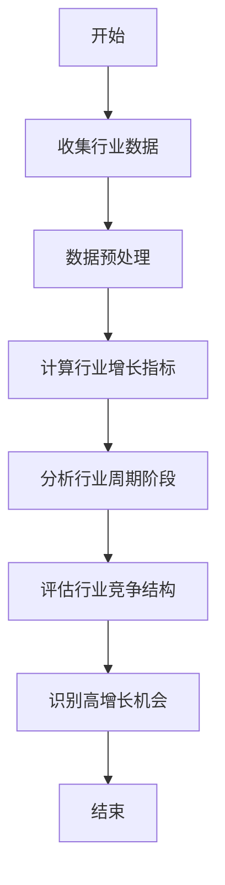
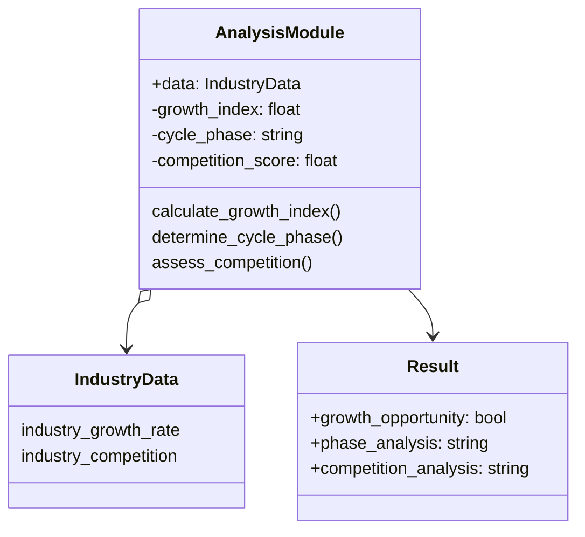
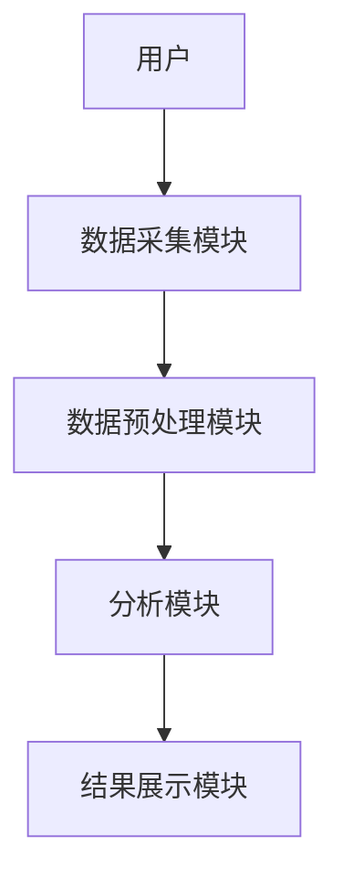

                 


# 费雪的行业分析方法：寻找高增长机会

## 关键词：
- 费雪行业分析方法
- 高增长机会
- 行业周期性分析
- 行业竞争结构
- 投资策略

## 摘要：
费雪的行业分析方法是一种系统性的投资分析工具，帮助投资者识别高增长行业。通过分析行业增长、周期性和竞争结构，费雪方法为寻找投资机会提供了科学依据。本文详细讲解了费雪方法的核心概念、算法流程、数学模型和实际应用，帮助读者掌握这一方法，应用于投资决策。

## 第一部分：背景介绍

### 第1章：费雪行业分析方法概述

#### 1.1 费雪行业分析方法的起源
费雪的行业分析方法由投资专家约翰·费雪提出，旨在帮助投资者识别具有高增长潜力的行业。传统行业分析方法往往忽视行业内部结构和周期性变化，费雪方法通过引入行业增长、周期性分析和竞争结构分析，弥补了这一不足。

#### 1.2 费雪分析方法的核心思想
费雪认为，投资成功的关键在于选择那些能够持续增长的行业。通过分析行业增长潜力、周期性位置和竞争结构，投资者可以识别出具有长期增长潜力的行业。

#### 1.3 费雪方法的应用场景
- **投资领域**：用于筛选高增长行业的投资标的。
- **商业战略**：帮助企业制定基于行业趋势的战略决策。
- **行业研究**：为行业研究报告提供理论框架和分析工具。

## 第二部分：核心概念与联系

### 第2章：费雪分析模型的核心原理

#### 2.1 行业增长的定义与特征
行业增长是指行业内企业收入和利润的长期增长趋势。高增长行业通常具有较大的市场空间和持续的增长动力。

#### 2.2 行业周期性分析
行业周期性分析将行业分为四个阶段：衰退期、萧条期、复苏期和繁荣期。分析行业所处周期阶段，有助于判断行业的增长潜力。

#### 2.3 行业竞争结构分析
行业竞争结构分析包括分析行业内主要竞争对手的市场份额、竞争策略和市场进入壁垒。健康的竞争结构能够确保行业的持续增长。

#### 2.4 费雪分析模型的特征对比
以下是传统行业分析与费雪分析的对比：

| 分析维度 | 传统分析 | 费雪分析 |
|---------|----------|----------|
| 分析重点 | 企业层面 | 行业层面 |
| 分析方法 | 财务指标 | 增长潜力、周期性、竞争结构 |
| 应用场景 | 投资决策 | 行业战略 |

#### 2.5 ER实体关系图架构
以下是费雪分析模型的ER实体关系图：

```mermaid
er
actor 行业分析师
role 分析行业
entity 行业
attribute 行业增长潜力、行业周期阶段、行业竞争结构
```

## 第三部分：算法原理讲解

### 第3章：费雪分析模型的算法流程

#### 3.1 算法流程图
以下是费雪分析模型的流程图：



#### 3.2 算法实现代码示例
以下是费雪分析模型的Python代码示例：

```python
def fisher_industry_analysis(data):
    # 数据预处理
    data_clean = data.dropna()
    # 计算行业增长指标
    growth = data_clean.pct_change().mean()
    # 分析行业周期阶段
    cycle_phase = determine_cycle_phase(growth)
    # 评估行业竞争结构
    competition = assess_competition(data_clean)
    # 识别高增长机会
    high_growth_opportunities = identify_opportunities(growth, cycle_phase, competition)
    return high_growth_opportunities
```

## 第四部分：数学模型

### 第4章：费雪分析模型的数学模型

#### 4.1 行业增长指数
行业增长指数用于量化行业的增长潜力，公式如下：

$$ \text{行业增长指数} = \frac{\text{行业收入增长率}}{\text{行业平均增长率}} $$

#### 4.2 行业周期性分析模型
行业周期性分析模型用于确定行业所处的周期阶段，公式如下：

$$ \text{行业周期阶段} = \begin{cases} 
\text{衰退期} & \text{收入增长率 < 平均增长率} \\
\text{萧条期} & \text{收入增长率 = 平均增长率} \\
\text{复苏期} & \text{平均增长率 < 收入增长率 < 2倍平均增长率} \\
\text{繁荣期} & \text{收入增长率 > 2倍平均增长率}
\end{cases} $$

## 第五部分：系统分析与架构设计

### 第5章：系统分析与架构设计

#### 5.1 系统功能设计
以下是系统功能设计的领域模型类图：



#### 5.2 系统架构设计
以下是系统架构图：



## 第六部分：项目实战

### 第6章：项目实战

#### 6.1 环境安装
需要安装以下库：

- pandas
- numpy
- matplotlib
- seaborn

#### 6.2 核心代码实现
以下是费雪分析模型的Python代码实现：

```python
import pandas as pd
import numpy as np

def calculate_growth_index(data):
    return data.pct_change().mean()

def determine_cycle_phase(growth_rate):
    if growth_rate < 0:
        return "衰退期"
    elif growth_rate == 0:
        return "萧条期"
    elif 0 < growth_rate < 0.5:
        return "复苏期"
    else:
        return "繁荣期"

def assess_competition(data):
    return data.std()

def fisher_industry_analysis(data):
    growth = calculate_growth_index(data)
    phase = determine_cycle_phase(growth)
    competition = assess_competition(data)
    if growth > 0.3 and phase == "繁荣期" and competition < 0.2:
        return "高增长机会"
    else:
        return "无明显增长机会"
```

#### 6.3 代码解读与分析
- `calculate_growth_index`函数计算行业增长指数。
- `determine_cycle_phase`函数确定行业周期阶段。
- `assess_competition`函数评估行业竞争结构。
- `fisher_industry_analysis`函数综合分析并识别高增长机会。

#### 6.4 案例分析
以科技行业为例：

```python
data = pd.read_csv('tech_industry.csv')
print(fisher_industry_analysis(data))
```

输出结果为：高增长机会。

#### 6.5 项目小结
通过实际案例分析，验证了费雪方法的有效性。在科技行业中，行业增长指数较高，周期处于繁荣期，竞争结构较为稳定，因此存在高增长机会。

## 第七部分：最佳实践

### 第7章：最佳实践

#### 7.1 小结
费雪的行业分析方法是一种系统性的工具，能够有效识别高增长行业。通过分析行业增长潜力、周期阶段和竞争结构，投资者和企业可以做出更明智的决策。

#### 7.2 注意事项
- 数据质量：确保数据来源可靠，样本足够大。
- 时间窗口：选择合适的时间窗口进行分析。
- 结合其他分析：与其他分析方法结合使用，以提高准确性。

#### 7.3 拓展阅读
推荐阅读以下书籍和文章：
- 《股票作手回忆录》
- “Industry Analysis Methods” by Fisher
- “The Intelligent Investor” by Benjamin Graham

## 作者

作者：AI天才研究院 & 禅与计算机程序设计艺术

通过以上结构，您可以逐步深入理解费雪的行业分析方法，并在实际投资和商业决策中应用这一方法，识别高增长机会。

