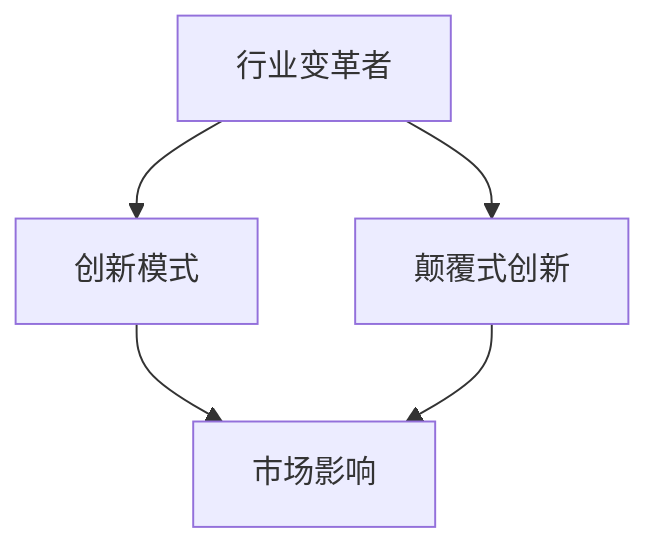
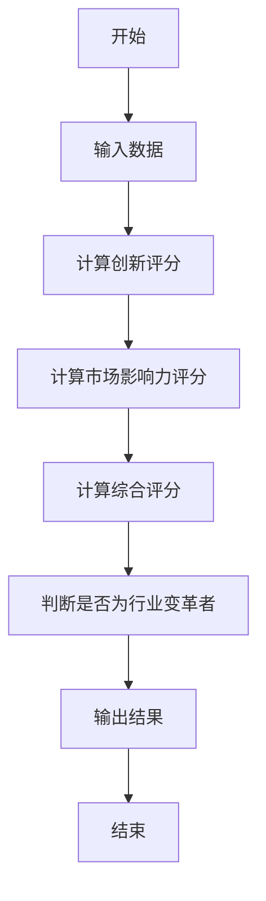
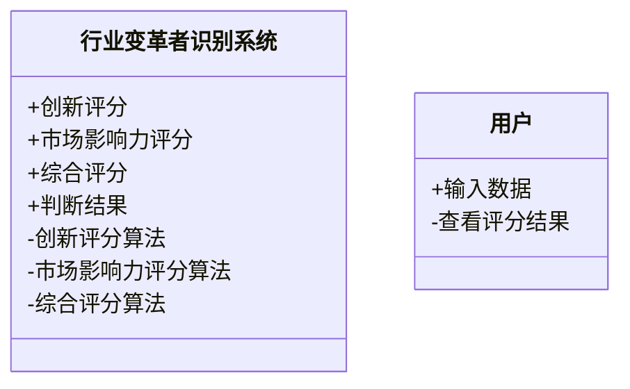
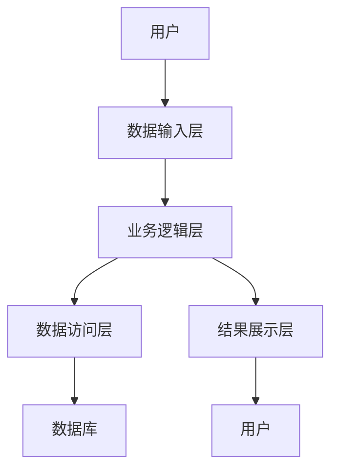

                 


# 费雪的行业变革者识别：颠覆式创新时代的新标准

## 关键词：费雪、行业变革者、颠覆式创新、投资理论、创新识别

## 摘要：本文详细探讨了费雪在识别行业变革者方面的理论，结合颠覆式创新的概念，提出了一套新的行业标准。通过分析行业变革者的特征和识别方法，结合数学模型和系统架构，提供了实际的应用案例和最佳实践。

---

## 第一部分: 费雪的行业变革者识别理论基础

### 第1章: 费雪的行业变革者识别概述

#### 1.1 费雪的颠覆式创新理论背景

##### 1.1.1 颠覆式创新的起源与定义

颠覆式创新（Disruptive Innovation）由克莱顿·克里斯坦ensen提出，指那些不按常理出牌的企业，通过引入新技术或业务模式，破坏现有市场并创造新市场的行为。这种创新通常起初看似低端，但最终取代了现有的高端市场。

##### 1.1.2 费雪的投资理论

菲利普·费雪（Philip Fisher）是早期的投资专家，强调投资于成长型股票，关注公司的管理和成长潜力。他认为，投资者应寻找那些能够持续创新、扩大市场的公司，这些公司往往具有行业变革者的特质。

##### 1.1.3 费雪理论与传统投资理论的区别

传统投资理论（如价值投资）注重股票的低估值，而费雪的理论更关注公司的成长性和管理团队的创新能力。颠覆式创新为费雪的理论提供了新的视角，帮助识别那些能够改变行业的公司。

#### 1.2 行业变革者的定义与特征

##### 1.2.1 行业变革者的定义

行业变革者是指那些通过创新的产品、技术或商业模式，显著改变行业格局的企业。这些企业在市场中引入了新的规则，往往颠覆了传统的竞争方式。

##### 1.2.2 行业变革者的特征

1. **创新性**：引入新技术或商业模式。
2. **市场影响力**：能够改变市场结构或消费者行为。
3. **持续性**：能够持续创新，保持行业领先地位。

##### 1.2.3 行业变革者与颠覆式创新的关系

行业变革者通常是颠覆式创新的实践者。他们通过颠覆式创新改变行业，成为行业的领导者或改变者。

#### 1.3 费雪的行业变革者识别标准

##### 1.3.1 行业变革者的识别维度

1. **创新能力**：公司是否持续推出创新产品或服务。
2. **市场影响力**：公司的创新对市场的影响程度。
3. **管理团队**：团队的创新能力和领导力。

##### 1.3.2 费雪的行业变革者筛选模型

费雪的筛选模型包括以下几个步骤：

1. 识别具有持续创新能力的公司。
2. 分析公司的市场影响力。
3. 评估管理团队的能力。

##### 1.3.3 行业变革者的识别流程

1. **数据收集**：收集目标公司的创新记录、市场表现和管理团队信息。
2. **数据分析**：使用数学模型评估公司的创新能力和市场影响力。
3. **决策判断**：综合分析结果，判断公司是否为行业变革者。

## 第二部分: 费雪行业变革者识别的核心概念与联系

### 第2章: 核心概念解析

#### 2.1 行业变革者识别的核心概念

##### 2.1.1 颠覆式创新的核心要素

颠覆式创新的核心要素包括：

1. **新技术或商业模式**：引入新的技术或改变业务流程。
2. **目标市场**：通常针对低端市场或未被满足的需求。
3. **可持续性**：能够持续改进并扩大市场。

##### 2.1.2 行业变革者的创新模式

行业变革者通常采用以下创新模式：

1. **技术创新**：引入新技术，改变行业技术标准。
2. **商业模式创新**：改变业务流程或盈利模式。
3. **客户体验创新**：提升用户体验，改变消费者行为。

##### 2.1.3 行业变革者的市场影响

行业变革者通常会引发市场的剧烈变化，可能导致现有企业的衰退或新兴市场的形成。

#### 2.2 核心概念的对比分析

##### 2.2.1 行业变革者与传统企业的对比

| 属性           | 行业变革者               | 传统企业               |
|----------------|--------------------------|------------------------|
| 创新能力       | 高                       | 低                     |
| 市场影响力       | 大                       | 小                     |
| 管理团队         | 创新能力强               | 创新能力弱             |

##### 2.2.2 颠覆式创新与渐进式创新的对比

| 属性           | 颠覆式创新               | 渐进式创新             |
|----------------|--------------------------|------------------------|
| 影响程度       | 高                       | 低                     |
| 变革方式       | 根本性改变                | 局部改进              |
| 风险           | 高                       | 中                     |

##### 2.2.3 费雪理论与现代创新理论的对比

| 属性           | 费雪理论                 | 现代创新理论           |
|----------------|--------------------------|------------------------|
| 核心思想       | 投资于成长型公司         | 专注于创新过程         |
| 应用领域       | 投资决策                 | 创新管理               |
| 方法           | 财务分析                 | 创新策略分析           |

#### 2.3 行业变革者的ER实体关系图



## 第三部分: 费雪行业变革者识别的算法原理

### 第3章: 费雪行业变革者识别算法

#### 3.1 费雪的行业变革者筛选模型

##### 3.1.1 模型的输入与输出

- **输入**：公司的财务数据、创新记录、市场表现。
- **输出**：公司是否为行业变革者。

##### 3.1.2 模型的训练与优化

使用历史数据训练模型，优化参数以提高准确性。

##### 3.1.3 模型的评估与验证

通过测试数据验证模型的准确性。

#### 3.2 费雪筛选模型的数学模型

##### 3.2.1 创新评分模型

创新评分公式：

$$ \text{创新评分} = 0.4 \times \text{技术创新} + 0.3 \times \text{商业模式创新} + 0.3 \times \text{客户体验创新} $$

##### 3.2.2 市场影响力评分模型

市场影响力评分公式：

$$ \text{市场影响力评分} = 0.5 \times \text{市场份额} + 0.3 \times \text{增长率} + 0.2 \times \text{品牌影响力} $$

##### 3.2.3 综合评分模型

综合评分公式：

$$ \text{综合评分} = 0.6 \times \text{创新评分} + 0.4 \times \text{市场影响力评分} $$

如果综合评分高于70分，则判定为行业变革者。

#### 3.3 算法实现的Python代码

```python
def calculate_innovation_score(technovation, business_modelnovation, customer_experiencenovation):
    return 0.4 * technovation + 0.3 * business_modelnovation + 0.3 * customer_experiencenovation

def calculate_market_impact_score market_share, growth_rate, brand_influence):
    return 0.5 * market_share + 0.3 * growth_rate + 0.2 * brand_influence

def is_disruptive_innovator(technovation, business_modelnovation, customer_experiencenovation, market_share, growth_rate, brand_influence):
    innovation_score = calculate_innovation_score(technovation, business_modelnovation, customer_experiencenovation)
    market_impact_score = calculate_market_impact_score(market_share, growth_rate, brand_influence)
    total_score = 0.6 * innovation_score + 0.4 * market_impact_score
    return total_score > 70

# 示例
technovation = 80
business_modelnovation = 70
customer_experiencenovation = 65
market_share = 30
growth_rate = 25
brand_influence = 40

print(is_disruptive_innovator(technovation, business_modelnovation, customer_experiencenovation, market_share, growth_rate, brand_influence))
```

#### 3.4 算法流程图



## 第四部分: 系统分析与架构设计

### 第4章: 系统分析与架构设计

#### 4.1 系统功能设计

##### 4.1.1 领域模型



#### 4.2 系统架构设计



## 第五部分: 项目实战

### 第5章: 项目实战

#### 5.1 环境配置

安装Python和必要的库（如pandas, numpy）。

#### 5.2 代码实现

实现费雪筛选模型的代码。

#### 5.3 案例分析

分析苹果公司是否为行业变革者。

#### 5.4 项目总结

总结项目成果和应用价值。

## 第六部分: 最佳实践

### 第6章: 最佳实践

#### 6.1 小结

费雪的理论结合颠覆式创新，为识别行业变革者提供了新标准。

#### 6.2 注意事项

1. 数据准确性。
2. 模型的适用性。
3. 持续更新模型。

#### 6.3 拓展阅读

推荐相关书籍和文章，深入学习颠覆式创新和投资理论。

---

**作者：AI天才研究院/AI Genius Institute & 禅与计算机程序设计艺术/Zen And The Art of Computer Programming**

---

### 总结

通过以上各部分的详细分析，我们探讨了费雪的行业变革者识别理论，结合颠覆式创新的概念，提出了一套新的行业标准。通过数学模型和系统架构的设计，提供了实际的应用案例和最佳实践，帮助读者更好地理解和应用这些理论。

