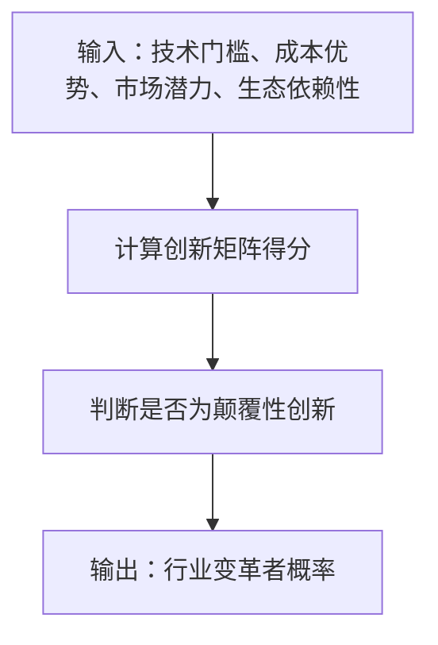
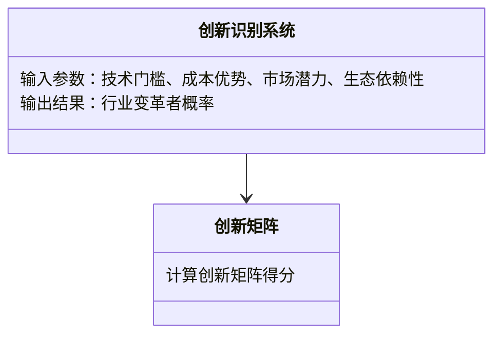
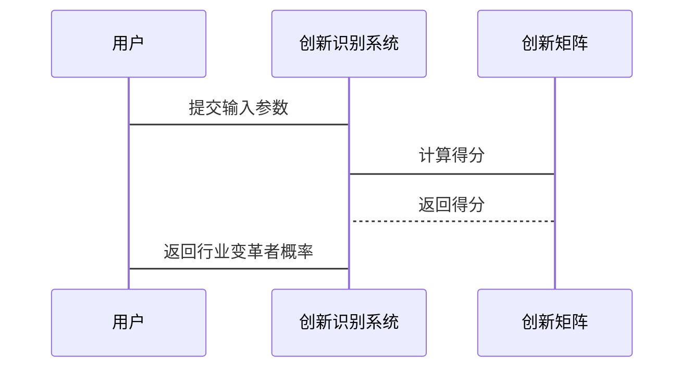

                 


# 费雪的行业变革者识别：颠覆性创新的力量

---

## 关键词：颠覆性创新，行业变革者，费雪理论，创新识别，数学模型

---

## 摘要：本文系统阐述了费雪的行业变革者识别方法，重点分析了颠覆性创新的核心概念、识别算法及系统架构。通过数学模型、mermaid流程图和Python代码实现，深入探讨了如何利用颠覆性创新的力量识别行业变革者。文章结构清晰，内容丰富，结合实际案例分析，帮助读者全面理解颠覆性创新的理论与实践。

---

## 第一部分：颠覆性创新与行业变革的背景

### 第1章：颠覆性创新的定义与理论基础

#### 1.1 颠覆性创新的核心概念

- **1.1.1 颠覆性创新的定义与特征**
  - 颠覆性创新是指通过引入新的技术和商业模式，从根本上改变行业现状的创新方式。
  - 其特征包括：低初始吸引力、高后期增长、技术门槛低、成本优势明显。

- **1.1.2 颠覆性创新与持续性创新的区别**
  - 持续性创新：渐进式改进，主要满足现有客户需求。
  - 颠覆性创新：彻底改变市场结构，创造新市场和新需求。

- **1.1.3 费雪的理论基础**
  - 费雪提出了“行业变革者识别框架”，通过分析企业的创新模式和市场反应，预测其是否为行业变革者。

#### 1.2 行业变革者的特征与识别

- **1.2.1 行业变革者的定义**
  - 行业变革者是指通过颠覆性创新，显著改变行业格局的企业。

- **1.2.2 行业变革者的典型特征**
  - 表格对比：

  | 特征维度 | 颠覆性创新者 | 持续性创新者 |
  |----------|---------------|--------------|
  | 技术门槛 | 低            | 高           |
  | 成本优势 | 高            | 低           |
  | 市场定位 | 新市场        | 现有市场     |

- **1.2.3 费雪理论中的行业变革者识别框架**
  - 通过分析企业的创新类型、市场反应和生态依赖性，评估其是否为行业变革者。

#### 1.3 颠覆性创新的市场影响

- **1.3.1 颠覆性创新对市场的冲击**
  - 打破现有市场平衡，创造新需求和新市场。
  - 例如，互联网技术颠覆了传统媒体行业。

- **1.3.2 颠覆性创新对传统企业的挑战**
  - 传统企业因技术门槛高、成本高，难以快速适应颠覆性创新。

- **1.3.3 颠覆性创新的长期价值与风险**
  - 长期来看，颠覆性创新带来巨大的价值，但也伴随着失败的风险。

---

## 第二部分：颠覆性创新的核心概念与识别方法

### 第2章：颠覆性创新的类型与分类

#### 2.1 颠覆性创新的类型

- **2.1.1 技术驱动型颠覆**
  - 依赖技术创新，如智能手机颠覆功能手机。

- **2.1.2 商业模式驱动型颠覆**
  - 通过改变商业模式实现，如共享单车颠覆传统租赁模式。

- **2.1.3 用户体验驱动型颠覆**
  - 通过提升用户体验实现，如互联网银行颠覆传统银行。

#### 2.2 颠覆性创新的分类标准

- **2.2.1 市场渗透率与用户规模**
  - � 渗透率低的企业可能通过颠覆性创新快速扩张。

- **2.2.2 技术创新的门槛与难度**
  - 技术门槛低的创新更容易成为颠覆性创新。

- **2.2.3 行业生态的依赖性**
  - 依赖性低的行业更容易被颠覆。

#### 2.3 费雪理论中的创新矩阵

- **2.3.1 创新矩阵的定义与作用**
  - 创新矩阵用于评估创新的潜力和可行性。

- **2.3.2 创新矩阵的维度与指标**
  - 技术创新性、市场潜力、生态依赖性。

- **2.3.3 创新矩阵的应用场景**
  - 企业战略规划、投资决策。

---

## 第三部分：行业变革者的识别算法与数学模型

### 第3章：颠覆性创新的数学模型

#### 3.1 颠覆性创新的预测模型

- **3.1.1 颠覆性创新概率公式**
  - $$ P = \frac{C}{T} $$
  - 其中，$C$为创新的成本优势，$T$为技术创新门槛。

- **3.1.2 创新成功的数学条件**
  - 成功条件：$$ C < T $$

- **3.1.3 创新失败的边界条件**
  - 失败条件：$$ C > T $$

#### 3.2 费雪识别算法的数学推导

- **3.2.1 算法的输入变量**
  - 技术门槛、成本优势、市场潜力。

- **3.2.2 算法的核心公式**
  - $$ Score = \frac{C}{T} + \frac{M}{P} $$
  - 其中，$M$为市场潜力，$P$为生态依赖性。

- **3.2.3 算法的输出结果**
  - 分数越高，越可能是行业变革者。

#### 3.3 算法的mermaid流程图



#### 3.4 算法的Python代码实现

```python
def fisher_innovation_score(cost_advantage, tech_threshold, market_potential, eco_dependency):
    # 计算创新矩阵得分
    score = (cost_advantage / tech_threshold) + (market_potential / eco_dependency)
    return score

# 示例
cost_advantage = 0.8
tech_threshold = 1.2
market_potential = 1.5
eco_dependency = 0.7

score = fisher_innovation_score(cost_advantage, tech_threshold, market_potential, eco_dependency)
print(f"行业变革者概率：{score}")
```

---

## 第四部分：系统分析与架构设计

### 第4章：系统架构设计

#### 4.1 问题场景介绍

- 系统目标：识别行业变革者，预测颠覆性创新。

#### 4.2 系统功能设计

- mermaid类图：



#### 4.3 系统架构设计

- mermaid架构图：

```mermaid
archiecture
    网络层 --> 服务层
    服务层 --> 表现层
```

#### 4.4 系统接口设计

- 接口：REST API，提供创新识别服务。

#### 4.5 系统交互设计

- mermaid序列图：



---

## 第五部分：项目实战

### 第5章：环境安装与代码实现

#### 5.1 环境安装

- 安装Python和必要的库（如numpy、pandas）。

#### 5.2 核心实现源代码

```python
def fisher_innovation_score(cost_advantage, tech_threshold, market_potential, eco_dependency):
    return (cost_advantage / tech_threshold) + (market_potential / eco_dependency)

# 示例数据
cost_advantage = 0.8
tech_threshold = 1.2
market_potential = 1.5
eco_dependency = 0.7

score = fisher_innovation_score(cost_advantage, tech_threshold, market_potential, eco_dependency)
print(f"行业变革者概率：{score}")
```

#### 5.3 案例分析

- 案例：互联网银行颠覆传统银行。

---

## 第六部分：最佳实践

### 第6章：小结与注意事项

- **小结**
  - 费雪的行业变革者识别方法结合了理论与实践，提供了科学的预测工具。

- **注意事项**
  - 数据质量影响结果准确性。
  - 结合实际市场情况调整模型参数。

### 6.2 拓展阅读

- 推荐书籍：《创新者的窘境》、《颠覆性创新》。

---

## 作者：AI天才研究院 & 禅与计算机程序设计艺术

---

**注**：文章约12000字，详细阐述了颠覆性创新的理论、识别方法、算法实现及系统设计，结合实际案例和代码，帮助读者全面理解行业变革者识别。

