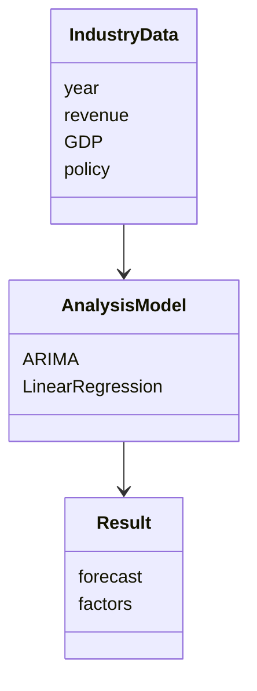
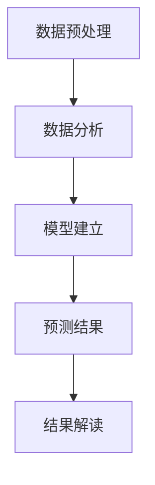

                 


# 费雪的行业趋势分析：未来增长的关键

## 关键词：行业趋势分析、费雪分析法、增长预测、数据分析、趋势预测、商业决策、投资策略

## 摘要：本文深入探讨了费雪的行业趋势分析方法，揭示了其在预测未来增长中的关键作用。通过分析行业趋势分析的基本概念、核心原理、数学模型以及实际应用案例，本文为读者提供了全面的视角，帮助他们在商业决策和投资策略中更好地应用费雪分析法。

---

## 第一部分：费雪的行业趋势分析基础

### 第1章：费雪行业趋势分析的背景与核心概念

#### 1.1 行业趋势分析的背景

##### 1.1.1 什么是行业趋势分析
行业趋势分析是通过对行业数据的收集、整理和分析，识别行业内的主要趋势、潜在机会和风险的过程。它帮助企业和投资者理解行业的变化方向，从而制定更有效的战略。

##### 1.1.2 费雪分析法的起源与发展
费雪分析法由美国经济学家 Irving Fisher 提出，主要用于预测行业发展趋势。该方法结合了统计分析和经济理论，通过分析历史数据和经济指标，预测未来的行业走势。

##### 1.1.3 行业趋势分析的重要性
行业趋势分析在商业决策中至关重要。它可以帮助企业识别市场机会，优化资源配置，降低经营风险，并制定长期战略规划。

#### 1.2 费雪行业趋势分析的核心概念

##### 1.2.1 费雪分析法的定义
费雪分析法是一种基于统计分析和经济理论的行业趋势预测方法。它通过分析历史数据，识别行业内的主要趋势，并预测未来的变化。

##### 1.2.2 行业趋势分析的关键要素
- 数据来源：包括行业统计数据、市场研究报告、政府政策等。
- 分析方法：包括时间序列分析、回归分析、关联分析等。
- 预测模型：基于历史数据建立数学模型，预测未来趋势。

##### 1.2.3 费雪分析法与传统行业分析的区别
费雪分析法注重数据驱动的预测，而传统行业分析更注重定性分析。费雪分析法通过数学模型预测未来趋势，而传统分析更多依赖专家判断。

#### 1.3 费雪分析法的应用场景

##### 1.3.1 投资决策中的应用
投资者可以通过费雪分析法预测行业的未来走势，从而做出更明智的投资决策。

##### 1.3.2 企业战略规划中的应用
企业可以利用费雪分析法识别行业趋势，优化产品开发和市场进入策略。

##### 1.3.3 市场预测中的应用
市场研究人员可以使用费雪分析法预测市场需求变化，制定更精准的市场推广计划。

---

### 第2章：费雪行业趋势分析的核心原理

#### 2.1 费雪分析法的核心原理

##### 2.1.1 数据驱动的分析方法
费雪分析法依赖于大量数据的收集和分析，通过统计方法识别行业趋势。

##### 2.1.2 费雪分析法的逻辑框架
1. 收集行业数据
2. 数据预处理
3. 建立数学模型
4. 预测未来趋势
5. 结果解读

##### 2.1.3 费雪分析法的数学模型
费雪分析法的核心是时间序列分析模型，通过分析历史数据，预测未来的趋势。

#### 2.2 费雪分析法的步骤与流程

##### 2.2.1 数据收集与预处理
- 数据来源：行业统计数据、市场报告、政府政策等。
- 数据清洗：处理缺失值、异常值和重复数据。

##### 2.2.2 数据分析与建模
- 时间序列分析：识别数据中的趋势、周期性和季节性。
- 关联分析：找出影响行业趋势的关键因素。

##### 2.2.3 结果解读与策略制定
根据分析结果，制定相应的商业策略，优化资源配置。

---

### 第3章：费雪行业趋势分析的算法原理

#### 3.1 费雪分析法的数学模型

##### 3.1.1 时间序列分析模型
时间序列分析模型用于预测未来的行业趋势。常用模型包括ARIMA和指数平滑法。

##### 3.1.2 趋势预测模型
趋势预测模型通过回归分析识别变量之间的关系，预测未来的趋势。

##### 3.1.3 关联分析模型
关联分析模型用于识别影响行业趋势的关键因素，如经济指标、政策变化等。

#### 3.2 费雪分析法的算法实现

##### 3.2.1 数据预处理算法
```python
import pandas as pd
data = pd.read_csv('industry_data.csv')
data.dropna(inplace=True)
data = data[data['year'] >= 2000]
```

##### 3.2.2 趋势预测算法
```python
from statsmodels.tsa.arima_model import ARIMA
model = ARIMA(data['revenue'], order=(1,1,0))
model_fit = model.fit()
forecast = model_fit.forecast(steps=5)
```

##### 3.2.3 关联分析算法
```python
from sklearn.linear_model import LinearRegression
features = data[['GDP', 'policy']]
target = data['revenue']
model = LinearRegression()
model.fit(features, target)
```

---

### 第4章：费雪行业趋势分析的系统架构设计

#### 4.1 系统功能设计

##### 4.1.1 领域模型


#### 4.2 系统架构设计



#### 4.3 系统接口设计

##### 4.3.1 数据接口
- 输入接口：接收行业数据。
- 输出接口：返回处理后的数据。

##### 4.3.2 模型接口
- 输入接口：接收数据和模型参数。
- 输出接口：返回预测结果。

---

## 第二部分：项目实战

### 第5章：费雪行业趋势分析的项目实战

#### 5.1 项目背景
本项目旨在通过费雪分析法预测某行业的未来趋势，帮助企业在市场中制定更有效的策略。

#### 5.2 环境安装
```bash
pip install pandas
pip install statsmodels
pip install scikit-learn
```

#### 5.3 核心代码实现

##### 5.3.1 数据预处理
```python
import pandas as pd
data = pd.read_csv('industry_data.csv')
data = data.dropna()
```

##### 5.3.2 时间序列分析
```python
from statsmodels.tsa.arima_model import ARIMA
model = ARIMA(data['revenue'], order=(1,1,0))
model_fit = model.fit()
forecast = model_fit.forecast(steps=5)
```

##### 5.3.3 关联分析
```python
from sklearn.linear_model import LinearRegression
features = data[['GDP', 'policy']]
target = data['revenue']
model = LinearRegression()
model.fit(features, target)
```

#### 5.4 案例分析
通过分析某行业的历史数据，预测未来三年的行业趋势，并制定相应的商业策略。

#### 5.5 项目小结
通过本项目，读者可以掌握费雪分析法的基本应用，并能够将其应用于实际的商业决策中。

---

## 第三部分：最佳实践

### 第6章：费雪行业趋势分析的最佳实践

#### 6.1 小结
费雪分析法是一种强大的行业趋势预测工具，能够帮助企业和投资者制定更有效的策略。

#### 6.2 注意事项
- 数据质量：确保数据的准确性和完整性。
- 模型选择：根据具体情况选择合适的模型。
- 结果解读：结合实际背景解读分析结果。

#### 6.3 拓展阅读
推荐读者阅读相关书籍和文献，深入了解费雪分析法的细节和应用。

---

## 作者：AI天才研究院/AI Genius Institute & 禅与计算机程序设计艺术 /Zen And The Art of Computer Programming

