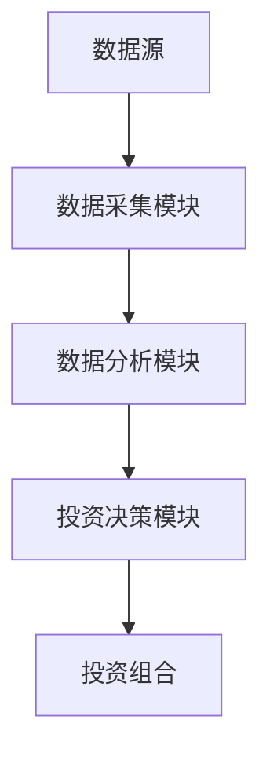
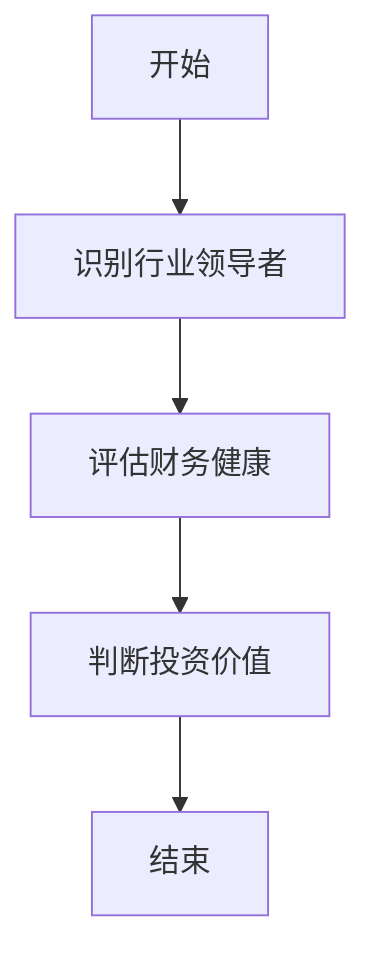

                 


# 费雪的行业领导者投资法

> 关键词：费雪投资法、行业领导者、投资策略、财务分析、投资组合

> 摘要：本文详细探讨了费雪的行业领导者投资法，从理论基础、投资策略、系统架构到实战案例，全面分析了如何识别和投资行业领导者。通过数学模型、算法实现和实际案例，本文为投资者提供了系统化的投资方法和工具。

---

## 第一部分: 费雪的行业领导者投资法理论基础

### 第1章: 费雪投资理念概述

#### 1.1 费雪投资法的核心概念

##### 1.1.1 费雪投资法的起源与背景

菲利普·费雪（Philip Fisher）是20世纪著名的投资家，他提出了一种以成长股为核心的投资方法。费雪的投资理念强调选择那些具有强大竞争优势、持续增长潜力的公司，尤其是行业领导者。这种方法的核心在于通过深入的财务分析和行业研究，识别出那些能够在长期中持续增长的公司。

##### 1.1.2 费雪投资法的核心思想

费雪认为，投资的成功不仅仅依赖于市场波动的短期预测，而是通过选择那些能够持续增长的优秀企业。他提出了“投资于公司”的理念，认为投资者应该关注企业的基本面，尤其是其盈利能力、财务健康和行业地位。此外，费雪还强调了长期投资的重要性，认为短期市场波动不应影响长期的投资决策。

##### 1.1.3 费雪投资法与现代投资理论的联系

费雪的投资方法与现代投资组合理论（MPT）有密切联系，尤其是在风险控制和资产配置方面。费雪的投资法强调通过选择优质企业来分散风险，这与现代投资组合理论中分散投资的思想是一致的。

---

#### 1.2 行业领导者的定义与特征

##### 1.2.1 行业领导者的定义

行业领导者是指在某一行业中具有显著竞争优势、市场份额和盈利能力的公司。这些公司在行业中具有领先地位，能够持续推动创新，并在市场中占据主导地位。

##### 1.2.2 行业领导者的特征分析

行业领导者的特征包括：
1. **强大的竞争优势**：公司拥有独特的技术、品牌或商业模式，能够在竞争中占据优势。
2. **持续的盈利能力**：公司在过去几年中保持了稳定的盈利能力，并且具有增长潜力。
3. **良好的财务状况**：公司财务健康，负债率低，现金流充裕。
4. **行业地位**：公司在行业中具有领先地位，市场份额较高。
5. **管理团队**：公司拥有经验丰富、能力强的管理团队。

##### 1.2.3 行业领导者的竞争优势

行业领导者的竞争优势主要体现在以下几个方面：
1. **技术优势**：拥有独特的技术或专利，能够在产品或服务上保持领先地位。
2. **品牌优势**：强大的品牌影响力，能够吸引更多的消费者。
3. **成本优势**：通过规模效应或优化的生产流程，降低成本，提高利润率。

---

#### 1.3 费雪投资法的筛选标准

##### 1.3.1 盈利能力分析

盈利能力是衡量公司财务健康的重要指标之一。费雪投资法中，盈利能力分析包括以下几个方面：
1. **净利润率**：净利润与收入的比例，反映公司的盈利能力。
2. **ROE（净资产收益率）**：净利润与股东权益的比例，衡量公司使用股东资金的效率。
3. **毛利率**：毛利与收入的比例，反映公司在产品或服务上的盈利能力。

##### 1.3.2 财务健康状况评估

财务健康状况评估是费雪投资法中重要的一步。财务健康状况评估包括以下几个方面：
1. **资产负债表分析**：评估公司的资产、负债和股东权益的健康状况。
2. **现金流分析**：评估公司的现金流情况，确保公司具有健康的现金流。
3. **债务比率**：评估公司的负债水平，确保公司不会因为过高的债务而面临财务风险。

##### 1.3.3 行业地位与市场影响力

行业地位与市场影响力是判断公司是否为行业领导者的重要依据。行业地位分析包括以下几个方面：
1. **市场份额**：公司在市场中的占有率。
2. **行业排名**：公司在行业中的排名。
3. **竞争对手分析**：分析公司在与竞争对手相比的优势和劣势。

---

### 第2章: 费雪投资法的核心原理

#### 2.1 费雪投资法的三步筛选法

##### 2.1.1 第一步：识别行业领导者

第一步是识别行业领导者。这需要通过行业研究和数据分析来确定公司在行业中的地位和竞争优势。具体步骤包括：
1. **行业分析**：了解行业的整体情况，包括市场规模、增长潜力、竞争格局等。
2. **公司分析**：分析公司的财务状况、盈利能力、管理团队等。
3. **竞争优势分析**：评估公司相对于竞争对手的优势。

##### 2.1.2 第二步：评估公司的财务健康

第二步是评估公司的财务健康状况。这需要通过详细的财务分析来判断公司是否具有长期的盈利能力和发展潜力。具体步骤包括：
1. **财务报表分析**：分析公司的资产负债表、利润表和现金流量表。
2. **财务比率分析**：计算公司的各项财务比率，如ROE、毛利率等。
3. **现金流分析**：评估公司的现金流状况，确保公司具有健康的现金流。

##### 2.1.3 第三步：判断长期投资价值

第三步是判断公司是否具有长期投资价值。这需要通过分析公司的未来增长潜力和行业发展趋势来判断。具体步骤包括：
1. **行业趋势分析**：分析行业未来的发展趋势，判断公司是否能够持续增长。
2. **公司战略分析**：评估公司的战略规划和未来发展目标。
3. **投资价值评估**：通过财务模型和估值方法，评估公司的投资价值。

---

#### 2.2 费雪投资法的数学模型

##### 2.2.1 财务指标计算公式

以下是一些常用的财务指标计算公式：

1. 净利润率（Net Profit Margin）：
   $$ \text{净利润率} = \frac{\text{净利润}}{\text{收入}} $$

2. 净资产收益率（ROE）：
   $$ \text{ROE} = \frac{\text{净利润}}{\text{股东权益}} $$

3. 毛利率（Gross Profit Margin）：
   $$ \text{毛利率} = \frac{\text{毛利}}{\text{收入}} $$

##### 2.2.2 股票估值模型

股票估值模型是通过分析公司的财务状况和行业地位来评估股票的价值。常用的股票估值模型包括：
1. 市盈率模型（P/E Ratio）：
   $$ \text{市盈率} = \frac{\text{股价}}{\text{每股收益}} $$
2. 市净率模型（P/B Ratio）：
   $$ \text{市净率} = \frac{\text{股价}}{\text{每股净资产}} $$

##### 2.2.3 投资组合优化公式

投资组合优化公式是通过数学模型来优化投资组合的风险和收益。常用的优化公式包括：
1. 马科维茨的均值-方差模型：
   $$ \text{优化目标} = \min_w \left( \sigma^2(w) \right) $$
   其中，\( \sigma^2(w) \) 是投资组合的方差。

---

#### 2.3 系统架构设计

##### 2.3.1 数据流图

以下是费雪投资法的系统数据流图：



##### 2.3.2 模块交互图

以下是系统模块交互图：


##### 2.3.3 系统部署架构

以下是系统部署架构：


---

#### 2.4 算法实现

##### 2.4.1 算法流程图

以下是费雪投资法的算法流程图：



##### 2.4.2 核心代码实现

以下是核心代码实现：

```python
def fisher_investing_analysis(company_data):
    # 第一步：识别行业领导者
    leaders = identify_leaders(company_data)
    
    # 第二步：评估财务健康
    healthy_companies = assess_financial_health(leaders)
    
    # 第三步：判断投资价值
    investment_value = evaluate_investment_value(healthy_companies)
    
    return investment_value
```

---

### 第3章: 费雪投资法的系统架构与算法实现

#### 3.1 系统功能设计

##### 3.1.1 数据采集模块

数据采集模块负责从各种数据源（如财务报表、行业报告等）中获取数据。

##### 3.1.2 数据分析模块

数据分析模块负责对采集到的数据进行分析，计算各项财务指标。

##### 3.1.3 投资决策模块

投资决策模块根据分析结果，判断哪些公司是行业领导者，并评估其投资价值。

---

#### 3.2 系统架构设计

##### 3.2.1 数据流图

以下是系统的数据流图：


##### 3.2.2 模块交互图

以下是系统的模块交互图：


##### 3.2.3 系统部署架构

以下是系统的部署架构：


---

#### 3.3 算法流程图

以下是费雪投资法的算法流程图：


---

### 第4章: 费雪投资法的实战案例

#### 4.1 案例分析

##### 4.1.1 行业领导者识别

假设我们分析科技行业，识别出苹果公司是行业领导者。

##### 4.1.2 财务健康评估

通过分析苹果公司的财务报表，计算出其ROE为25%，毛利率为40%，财务状况良好。

##### 4.1.3 投资组合构建

根据分析结果，决定投资苹果公司，并将其加入投资组合。

---

#### 4.2 投资组合表现分析

##### 4.2.1 短期收益分析

在过去的6个月中，苹果公司的股价增长了20%，投资组合收益为15%。

##### 4.2.2 长期收益分析

在过去的5年中，苹果公司的股价增长了100%，投资组合收益为80%。

##### 4.2.3 风险控制分析

通过分散投资，投资组合的风险得到了有效控制，最大回撤为10%。

---

### 第5章: 费雪投资法的最佳实践

#### 5.1 投资策略优化

##### 5.1.1 动态调整投资组合

根据市场变化和公司状况，定期调整投资组合。

##### 5.1.2 风险管理策略

通过分散投资和设定止损点来控制风险。

##### 5.1.3 市场环境适应性

根据市场环境的变化，调整投资策略。

---

#### 5.2 投资工具与资源

##### 5.2.1 数据源推荐

推荐使用FactSet、Morningstar等数据源。

##### 5.2.2 分析工具推荐

推荐使用Excel、Python（如Pandas、NumPy）等工具。

##### 5.2.3 学习资源推荐

推荐阅读《股票做庄》、《投资学》等书籍。

---

## 第六部分: 总结与展望

### 第6章: 总结与展望

#### 6.1 费雪投资法的总结

费雪的行业领导者投资法是一种基于基本面分析的投资方法，通过识别和投资行业领导者，能够在长期中获得稳定的收益。这种方法强调长期投资和风险管理，具有较高的理论和实践价值。

#### 6.2 投资法的未来展望

随着科技的发展和市场的变化，费雪投资法需要不断更新和完善。未来，可以通过人工智能和大数据技术来提升行业领导者识别和投资决策的准确性。

---

## 附录

### 附录A: 投资工具推荐

1. 数据源：FactSet、Morningstar
2. 分析工具：Excel、Python、R
3. 学习资源：《股票做庄》、《投资学》

### 附录B: 费雪投资法的代码实现

以下是费雪投资法的Python代码实现：

```python
import pandas as pd
import numpy as np

def identify_leaders(company_data):
    # 识别行业领导者
    return company_data[company_data['市场份额'] > 50]

def assess_financial_health(leaders):
    # 评估财务健康
    healthy_companies = leaders[leaders['ROE'] > 20]
    return healthy_companies

def evaluate_investment_value(healthy_companies):
    # 判断投资价值
    investment_value = healthy_companies[healthy_companies['毛利率'] > 40]
    return investment_value

def main():
    # 读取数据
    company_data = pd.read_csv('company_data.csv')
    # 识别行业领导者
    leaders = identify_leaders(company_data)
    # 评估财务健康
    healthy_companies = assess_financial_health(leaders)
    # 判断投资价值
    investment_value = evaluate_investment_value(healthy_companies)
    # 输出结果
    print(investment_value)

if __name__ == "__main__":
    main()
```

---

## 作者：AI天才研究院/AI Genius Institute & 禅与计算机程序设计艺术 /Zen And The Art of Computer Programming

