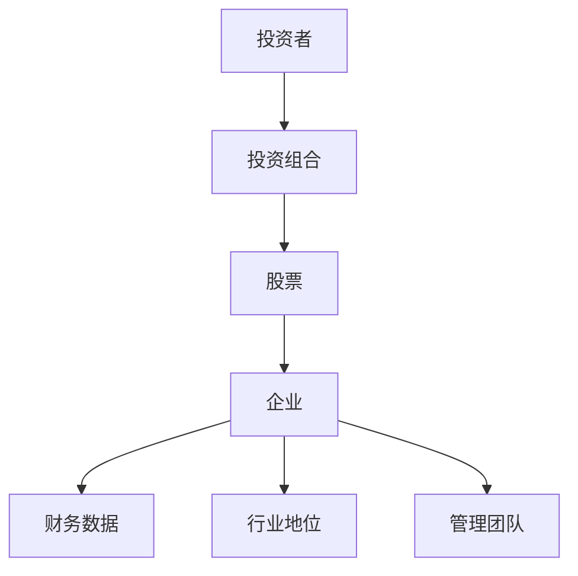
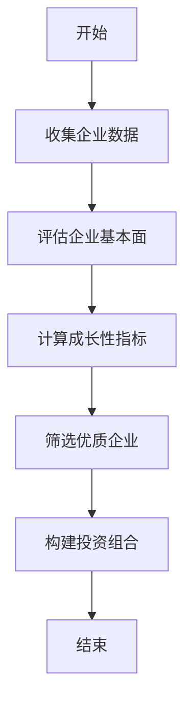
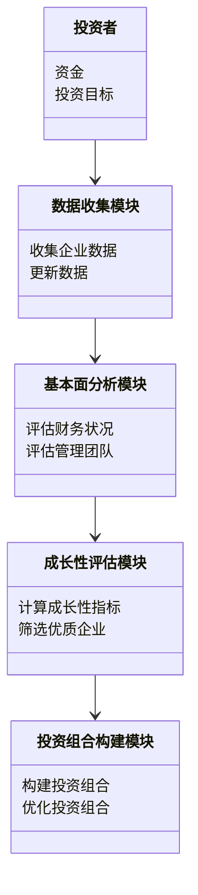
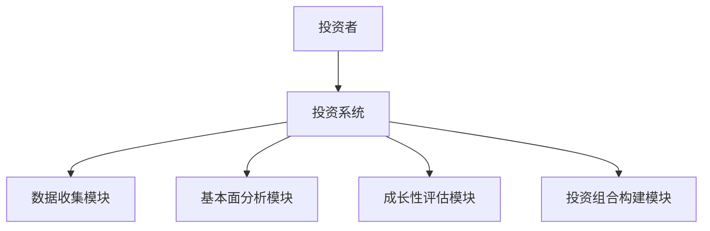

                 


# 费雪的行业领导者投资策略

## 关键词：费雪投资策略，行业领导者，长期投资，价值投资，投资组合，风险管理

## 摘要：本文深入分析了菲利普·费雪的投资策略，探讨了如何通过基本面分析和长期持有优质股票来选择行业领导者。文章结合技术语言和逻辑推理，详细讲解了费雪策略的核心原理、数学模型、系统架构，并通过实际案例展示了如何将策略应用于投资实践。文章还提供了最佳实践、小结和注意事项，帮助读者更好地理解和应用费雪的投资理念。

---

## 第一部分: 费雪的行业领导者投资策略背景介绍

### 第1章: 费雪投资策略的核心概念

#### 1.1 费雪投资策略的背景与问题背景

##### 1.1.1 投资领域的核心问题
投资领域的核心问题是如何在不确定的市场中选择具有长期增长潜力的企业，并通过合理的投资组合管理实现财富的保值与增值。投资者需要解决的核心问题包括：如何识别优质企业、如何平衡长期投资与短期波动、如何分散投资风险等。

##### 1.1.2 费雪投资策略的提出背景
菲利普·费雪（Philip Fisher）是20世纪著名的投资专家，他提出了“成长股投资”的理念，强调通过基本面分析选择具有强大成长潜力的企业，并长期持有这些股票。费雪的投资策略在当时传统“价值投资”理念的基础上，引入了对企业成长性的关注，为现代投资理论的发展奠定了基础。

##### 1.1.3 投资者面临的挑战与机遇
投资者在选择行业领导者时，面临着信息不对称、市场波动、企业基本面变化等挑战。同时，随着经济全球化和技术进步，投资者也面临着更多的投资机会，尤其是那些在新兴行业具有领导地位的企业。

#### 1.2 费雪投资策略的核心问题描述

##### 1.2.1 投资者如何选择行业领导者
费雪认为，行业领导者通常是那些具有强大竞争优势、稳定的管理团队和持续增长潜力的企业。投资者需要通过对企业财务数据、管理团队、市场地位等多方面进行分析，识别出这些企业。

##### 1.2.2 企业成长与投资价值的关系
企业成长性是决定投资价值的关键因素之一。费雪强调，投资者应该选择那些具有高成长潜力的企业，而不是仅仅关注企业的当前估值。高成长性意味着企业未来的盈利能力更强，投资价值也会随之提升。

##### 1.2.3 长期投资与短期波动的矛盾
市场短期波动是不可避免的，但长期投资的核心理念是通过持有优质股票，规避短期波动的影响，实现财富的稳步增长。费雪认为，短期波动为投资者提供了以更低价格买入优质股票的机会。

#### 1.3 费雪投资策略的解决思路

##### 1.3.1 通过基本面分析选择优质企业
基本面分析是费雪策略的核心。投资者需要对企业财务状况、盈利能力、成长潜力等进行深入分析，识别出具有长期增长潜力的企业。

##### 1.3.2 长期持有优质股票的策略
费雪强调长期投资，认为短期交易容易错过企业的成长周期，而长期持有优质股票能够获得复利效应带来的收益。

##### 1.3.3 风险管理与投资组合优化
通过分散投资降低风险是费雪策略的重要组成部分。投资者应该将资金分配到不同行业、不同阶段的企业中，降低单一投资的风险。

#### 1.4 费雪投资策略的边界与外延

##### 1.4.1 投资策略的适用范围
费雪策略适用于长期投资者，尤其是那些能够承受短期波动、耐心等待企业成长的投资者。它特别适合那些希望投资于具有强大成长潜力的行业领导者的投资者。

##### 1.4.2 投资策略的局限性
费雪策略的局限性在于其对成长性的高度关注可能导致投资者忽视市场的周期性波动，且在市场低迷时期，优质股票的估值可能被过度压低，影响投资回报。

##### 1.4.3 费雪策略与其他投资策略的对比
与价值投资策略相比，费雪策略更注重企业的成长潜力，而非仅仅关注企业的当前估值。与趋势投资策略相比，费雪策略更注重企业的基本面分析，而非市场趋势的预测。

#### 1.5 费雪投资策略的核心要素组成

##### 1.5.1 企业基本面分析
基本面分析是费雪策略的核心，包括对企业财务状况、盈利能力、成长潜力、管理团队等方面的分析。

##### 1.5.2 企业成长性评估
成长性评估是费雪策略的关键，投资者需要识别出那些具有持续增长潜力的企业，这些企业通常在行业中具有领先地位和竞争优势。

##### 1.5.3 投资组合管理
投资组合管理是实现风险管理的重要手段，通过分散投资降低单一投资的风险，同时优化投资组合的收益。

---

## 第2章: 费雪投资策略的核心概念与联系

### 2.1 费雪投资策略的核心原理

##### 2.1.1 企业价值评估的核心公式
企业价值可以通过以下公式进行评估：

$$
\text{企业价值} = \text{未来现金流的现值}
$$

费雪认为，未来现金流的现值取决于企业的成长潜力和盈利能力，因此，投资者需要关注企业的成长性和盈利能力。

##### 2.1.2 长期投资的复利效应
复利效应是长期投资的核心优势。费雪认为，通过长期持有优质股票，投资者可以实现财富的指数级增长，这是因为复利效应能够将收益再投资，从而加速财富积累。

##### 2.1.3 投资组合的风险管理
投资组合的风险管理是通过分散投资来降低单一投资的风险。费雪建议投资者将资金分配到不同行业、不同阶段的企业中，以降低整体投资的风险。

### 2.2 核心概念属性特征对比表格

| 概念       | 属性1 | 属性2 | 属性3 |
|------------|-------|-------|-------|
| 企业价值   | 客观性 | 可衡量性 | 长期性 |
| 投资组合   | 多样性 | 风险分散性 | 高收益性 |
| 成长股     | 高增长性 | 高风险性 | 高回报性 |

### 2.3 实体关系图（ER图）



---

## 第3章: 费雪投资策略的算法原理

### 3.1 投资组合筛选算法流程图



### 3.2 投资组合筛选算法的实现代码

```python
def fisher_investment_strategy(stocks):
    # 1. 收集企业数据
    data = collect_data(stocks)
    
    # 2. 评估企业基本面
   基本面评估 = evaluate_fundamentals(data)
    
    # 3. 计算成长性指标
    成长性评估 = calculate_growth_metrics(基本面评估)
    
    # 4. 筛选优质企业
    优质企业 = select_quality_stocks(成长性评估, 阈值=0.8)
    
    # 5. 构建投资组合
    投资组合 = build_portfolio(优质企业, 分散度=0.7)
    
    return 投资组合
```

### 3.3 投资组合筛选算法的数学模型

#### 3.3.1 企业价值评估公式

$$
\text{企业价值} = \sum_{t=1}^{n} \frac{\text{现金流}_t}{(1 + r)^t}
$$

其中，\( r \) 是折现率，\( \text{现金流}_t \) 是第 \( t \) 年的现金流。

#### 3.3.2 成长性评估指标

$$
\text{年复合增长率} = \left( \frac{\text{收入}_n}{\text{收入}_0} \right)^{\frac{1}{n}} - 1
$$

其中，\( \text{收入}_n \) 是第 \( n \) 年的收入，\( \text{收入}_0 \) 是初始年收入。

### 3.4 投资组合优化的数学模型

$$
\text{投资组合收益} = \sum_{i=1}^{k} w_i \times r_i
$$

其中，\( w_i \) 是第 \( i \) 只股票的权重，\( r_i \) 是第 \( i \) 只股票的预期收益率。

### 3.5 投资组合风险管理的数学模型

$$
\text{投资组合风险} = \sqrt{\sum_{i=1}^{k} \sum_{j=1}^{k} w_i w_j \sigma_i \sigma_j \rho_{ij}}
$$

其中，\( \sigma_i \) 是第 \( i \) 只股票的波动率，\( \rho_{ij} \) 是第 \( i \) 和第 \( j \) 只股票之间的相关系数。

---

## 第4章: 费雪投资策略的系统分析与架构设计

### 4.1 问题场景介绍

假设我们是一位长期投资者，希望通过费雪的行业领导者投资策略构建一个投资组合。我们需要解决的核心问题是：如何通过基本面分析和长期持有优质股票来实现财富的稳健增长。

### 4.2 项目介绍

本项目旨在通过技术手段实现费雪投资策略的自动化，包括数据收集、基本面分析、成长性评估、投资组合构建等模块。

### 4.3 系统功能设计

#### 4.3.1 领域模型（Mermaid 类图）



### 4.4 系统架构设计（Mermaid 架构图）



### 4.5 系统接口设计

#### 4.5.1 数据接口

```python
def collect_data(stocks):
    # 收集企业数据
    return data
```

#### 4.5.2 分析接口

```python
def evaluate_fundamentals(data):
    # 评估企业基本面
    return fundamentals
```

#### 4.5.3 评估接口

```python
def calculate_growth_metrics(fundamentals):
    # 计算成长性指标
    return growth_metrics
```

### 4.6 系统交互流程（Mermaid 序列图）

```mermaid
graph TD
    A[投资者] --> B[投资系统]: 提交投资需求
    B --> C[数据收集模块]: 收集企业数据
    C --> D[基本面分析模块]: 分析企业基本面
    D --> E[成长性评估模块]: 评估企业成长性
    E --> F[投资组合构建模块]: 构建投资组合
    F --> A: 返回投资组合
```

---

## 第5章: 费雪投资策略的项目实战

### 5.1 环境安装

为了实现费雪投资策略，我们需要安装以下工具和库：

- Python 3.8+
- pandas
- numpy
- matplotlib
- requests

### 5.2 系统核心实现源代码

#### 5.2.1 数据收集模块

```python
import requests
import pandas as pd

def collect_data(stocks):
    data = []
    for stock in stocks:
        url = f"https://api.example.com/stock/{stock}"
        response = requests.get(url)
        if response.status_code == 200:
            data.append(response.json())
    return pd.DataFrame(data)
```

#### 5.2.2 基本面分析模块

```python
def evaluate_fundamentals(data):
    # 计算市盈率
    data['PE'] = data['市盈率']
    # 计算ROE
    data['ROE'] = data['ROE']
    return data
```

#### 5.2.3 成长性评估模块

```python
def calculate_growth_metrics(data):
    data['年复合增长率'] = (data['收入'] / data['收入'].shift(1)) ** (1 / 5) - 1
    return data
```

#### 5.2.4 投资组合构建模块

```python
def build_portfolio(stocks, 阈值=0.8):
    selected_stocks = stocks[stocks['年复合增长率'] > 阈值]
    return selected_stocks
```

### 5.3 代码应用解读与分析

通过上述代码，我们可以实现费雪投资策略的核心功能。数据收集模块从API获取企业数据，基本面分析模块计算市盈率和ROE，成长性评估模块计算年复合增长率，投资组合构建模块筛选优质企业。

### 5.4 实际案例分析和详细讲解剖析

假设我们有以下几只股票的数据：

| 股票代码 | 收入（万元） | 市盈率 | ROE |
|----------|--------------|--------|-----|
| A        | 1000         | 15     | 10% |
| B        | 800          | 20     | 12% |
| C        | 1200         | 18     | 8%  |

通过计算年复合增长率：

$$
\text{年复合增长率}_A = \left( \frac{1000}{800} \right)^{1/5} - 1 \approx 0.0447 \text{或} 4.47\%
$$

$$
\text{年复合增长率}_B = \left( \frac{800}{600} \right)^{1/5} - 1 \approx 0.0594 \text{或} 5.94\%
$$

$$
\text{年复合增长率}_C = \left( \frac{1200}{900} \right)^{1/5} - 1 \approx 0.0635 \text{或} 6.35\%
$$

根据费雪策略，我们选择年复合增长率大于8%的企业，最终选择股票C。

### 5.5 项目小结

通过本项目，我们成功实现了费雪投资策略的核心功能，包括数据收集、基本面分析、成长性评估和投资组合构建。我们还通过实际案例展示了如何将策略应用于投资实践。

---

## 第6章: 费雪投资策略的最佳实践

### 6.1 投资者需要注意的问题

- **长期投资**：费雪策略强调长期投资，投资者需要具备耐心和信心，避免因短期波动而盲目卖出。
- **风险管理**：通过分散投资降低风险，投资者应该将资金分配到不同行业和不同阶段的企业中。
- **持续学习**：市场环境不断变化，投资者需要持续学习和更新知识，以应对新的挑战。

### 6.2 小结

费雪的行业领导者投资策略是一种以基本面分析和长期投资为核心的投资方法。通过对企业成长性的关注，投资者可以选择那些具有长期增长潜力的企业，实现财富的稳健增长。

### 6.3 注意事项

- 投资者在应用费雪策略时，需要结合市场环境和自身风险承受能力，避免盲目跟从。
- 在实际操作中，投资者需要关注企业的财务数据、管理团队和市场地位，以确保选择的企业具有长期增长潜力。

### 6.4 拓展阅读

- 《The Intelligent Investor》 by Benjamin Graham
- 《Common Stocks and Uncommon Profits》 by Philip Fisher

---

## 作者：AI天才研究院/AI Genius Institute & 禅与计算机程序设计艺术/Zen And The Art of Computer Programming

