                 


# 费雪的行业领导者投资策略

> 关键词：费雪投资策略、行业领导者、企业分析、风险管理、投资组合优化

> 摘要：本文深入探讨了费雪的行业领导者投资策略，从背景概述、核心概念、算法原理、数学模型、系统架构到项目实战，结合实例分析和最佳实践，全面解析如何在复杂多变的市场环境中，通过科学的投资策略和系统化的方法，识别和投资于具有强大竞争优势和成长潜力的行业领导者企业。本文旨在为投资者提供一份系统性、实用性的投资指南。

---

# 第1章: 费雪投资策略的背景与概述

## 1.1 费雪投资策略的起源与发展

### 1.1.1 投资学派的演变
现代投资学派的演变如同金融史的缩影，从早期的格雷厄姆的价值投资到费雪的成长型投资，再到巴菲特的综合选股策略，每个时期都有其独特的理论和实践。费雪的投资策略诞生于20世纪，是对早期价值投资理论的拓展和创新，尤其是在成长股的投资理念上独树一帜。

### 1.1.2 费雪投资策略的核心理念
费雪的投资策略的核心在于寻找那些能够持续创造价值、具有强大竞争优势，并能够在行业内保持领先地位的企业。这种策略强调长期投资和对企业的深度分析，而非短期市场波动的预测。费雪认为，投资的真正回报来自于企业内在价值的持续增长。

### 1.1.3 费雪投资策略在现代的应用
随着金融市场的日益复杂化和全球化，费雪的投资策略在现代依然具有强大的生命力。尤其是在当前科技驱动的市场环境中，行业领导者的定义和筛选标准也在不断演变，但其核心理念——寻找具有强大竞争优势的企业——始终是投资成功的关键。

---

## 1.2 费雪投资策略的核心概念

### 1.2.1 行业领导者的定义与特征
行业领导者是指在特定行业中具有最强竞争优势、市场占有率最高、盈利能力最强的企业。这些企业通常具有以下特征：
1. **强大的竞争优势**：在技术、成本、品牌等方面具有显著优势。
2. **持续的创新能力**：能够不断推出新产品或服务，保持市场领先地位。
3. **稳定的盈利能力**：即使在行业低迷时期，依然能够保持较高的利润率。
4. **良好的管理团队**：优秀的管理层能够确保企业战略的有效执行和持续发展。

### 1.2.2 费雪投资策略的基本框架
费雪的投资策略可以概括为以下几个步骤：
1. **企业筛选**：通过财务指标、竞争优势和成长潜力对企业进行初步筛选。
2. **深度分析**：对筛选出的企业进行深入的财务分析、行业分析和管理层评估。
3. **投资组合构建**：根据分析结果，构建投资组合，并进行动态调整。
4. **风险管理**：通过分散投资、止损设置等方式控制投资风险。

### 1.2.3 费雪投资策略与其他投资策略的对比
与价值投资和趋势投资相比，费雪的投资策略具有以下特点：
1. **注重成长性**：不同于价值投资对低估值的关注，费雪策略更注重企业的成长潜力。
2. **长期视角**：与趋势投资注重短期市场趋势不同，费雪策略强调长期投资。
3. **深度分析**：与技术分析相比，费雪策略更注重对企业基本面的分析。

---

## 1.3 费雪投资策略的适用场景

### 1.3.1 不同市场环境下的策略选择
1. **牛市**：适合采用集中投资策略，重点投资于行业龙头股。
2. **熊市**：适合采用防御性投资策略，选择具有稳定收益的企业。
3. **震荡市**：适合采用均衡投资策略，分散投资于不同行业的龙头企业。

### 1.3.2 不同行业周期的策略调整
1. **行业上升周期**：重点投资于行业内具有技术创新能力的企业。
2. **行业成熟周期**：选择具有稳定收益和高股息率的企业。
3. **行业衰退周期**：谨慎选择，避免投资于夕阳行业。

### 1.3.3 不同投资者类型的策略匹配
1. **保守型投资者**：适合采用分散投资策略，投资于多个行业的龙头企业。
2. **激进型投资者**：适合集中投资于具有高成长潜力的行业龙头企业。
3. **机构投资者**：适合采用系统化投资策略，利用大数据和量化模型进行投资。

---

# 2. 费雪投资策略的核心概念与联系

## 2.1 费雪投资策略的核心概念

### 2.1.1 投资标的企业筛选标准
1. **财务指标**：重点关注企业的ROE（净资产收益率）、ROA（资产净利率）和毛利率等指标。
2. **竞争优势**：分析企业的市场占有率、技术壁垒和品牌影响力。
3. **成长潜力**：评估企业的未来增长空间和创新能力。

### 2.1.2 投资标的企业分析框架
1. **财务分析**：通过财务报表分析企业的盈利能力和财务健康状况。
2. **行业分析**：研究行业的发展趋势和竞争格局，确定企业的行业地位。
3. **管理层评估**：分析企业的管理层能力，包括管理团队的稳定性、决策能力和战略眼光。

### 2.1.3 投资组合构建逻辑
1. **资产配置**：根据市场环境和投资目标，确定股票、债券和其他资产的配置比例。
2. **风险分散**：通过投资于不同行业和不同规模的企业，分散投资风险。
3. **动态调整**：定期评估投资组合的表现，根据市场变化进行调整。

---

## 2.2 核心概念之间的关系

### 2.2.1 投资标的企业分析框架与投资组合构建的关系
- 企业的分析框架是投资组合构建的基础，只有通过对企业的深入分析，才能确定哪些企业具有投资价值。

### 2.2.2 投资标的筛选标准与市场环境的关系
- 不同的市场环境需要采用不同的筛选标准，例如在熊市中更注重企业的防御性特征。

### 2.2.3 投资策略的动态调整机制
- 根据市场变化和企业情况，及时调整投资策略，以应对市场波动和企业变化。

---

## 2.3 核心概念的属性特征对比

### 2.3.1 行业领导者的特征对比表
| 特性         | 行业领导者特征                     |
|--------------|------------------------------------|
| 市场占有率    | 高                                 |
| 技术创新     | 强                                 |
| 财务表现     | 稳定且高                          |
| 管理团队     | 优秀且稳定                        |

### 2.3.2 不同投资策略的优缺点对比表
| 策略         | 优点                     | 缺点                       |
|--------------|--------------------------|--------------------------|
| 价值投资     | 低估值企业，风险较低       | 需要较长的持有时间         |
| 趋势投资     | 短期收益高               | 风险较高                   |
| 费雪策略     | 高成长潜力，长期收益稳定   | 需要较高的分析能力         |

---

# 3. 费雪投资策略的算法原理

## 3.1 费雪投资策略的算法概述

### 3.1.1 投资标的企业筛选算法
- **步骤1**：筛选出具有高ROE和高毛利率的企业。
- **步骤2**：进一步筛选具有强大竞争优势的企业，例如技术壁垒高、市场占有率高的企业。
- **步骤3**：评估企业的成长潜力，包括创新能力、管理团队等因素。

### 3.1.2 投资组合优化算法
- **步骤1**：根据企业的筛选结果，构建初步的投资组合。
- **步骤2**：根据市场波动和企业情况，动态调整投资组合。
- **步骤3**：定期评估投资组合的表现，优化资产配置。

### 3.1.3 风险管理算法
- **步骤1**：设定止损点，控制单个投资的风险。
- **步骤2**：通过分散投资，降低整体投资组合的风险。
- **步骤3**：定期审查投资组合，及时发现和应对潜在风险。

---

## 3.2 投资标的企业筛选算法

### 3.2.1 企业财务指标分析算法
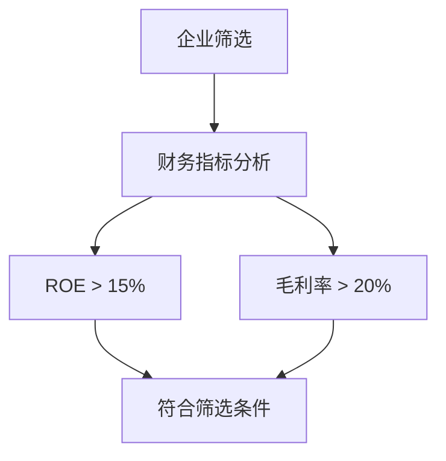

### 3.2.2 企业竞争优势分析算法
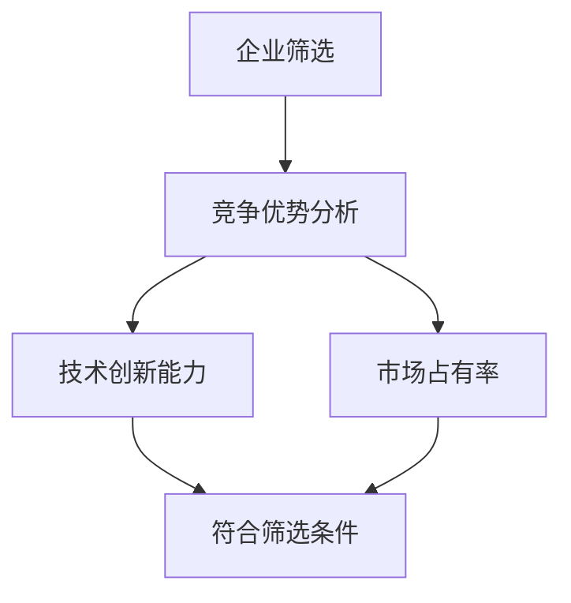

### 3.2.3 企业成长潜力分析算法
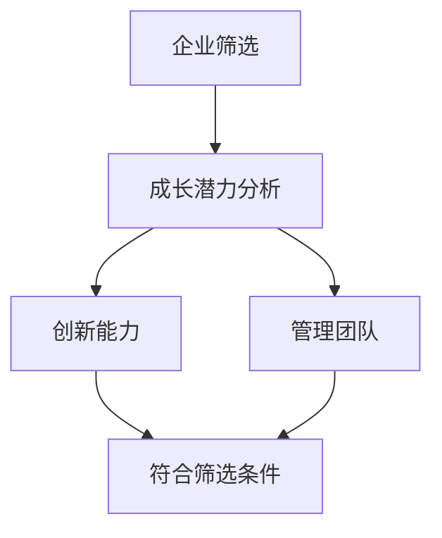

---

## 3.3 投资组合优化算法

### 3.3.1 风险调整后的收益最大化算法
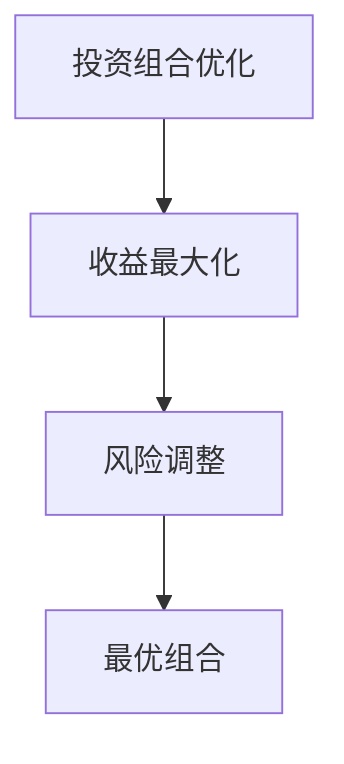

### 3.3.2 资产配置优化算法
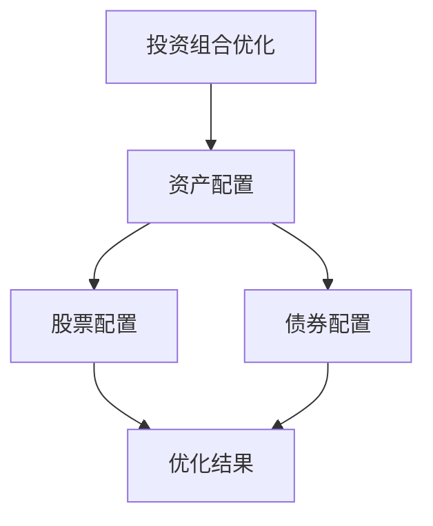

### 3.3.3 动态再平衡算法
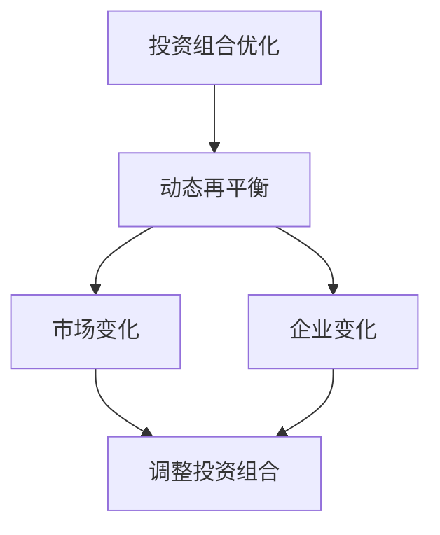

---

## 3.4 风险管理算法

### 3.4.1 风险识别与量化算法
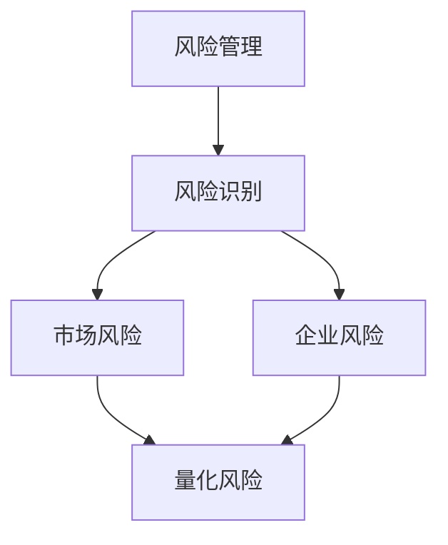

### 3.4.2 风险分散策略算法
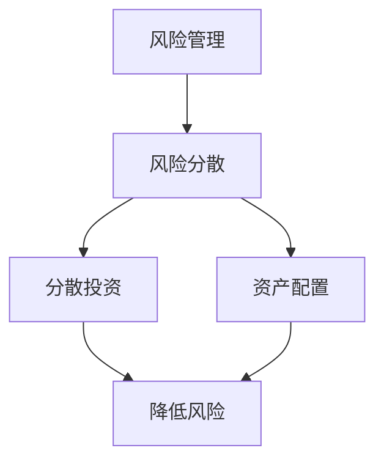

### 3.4.3 风险预警与应对算法
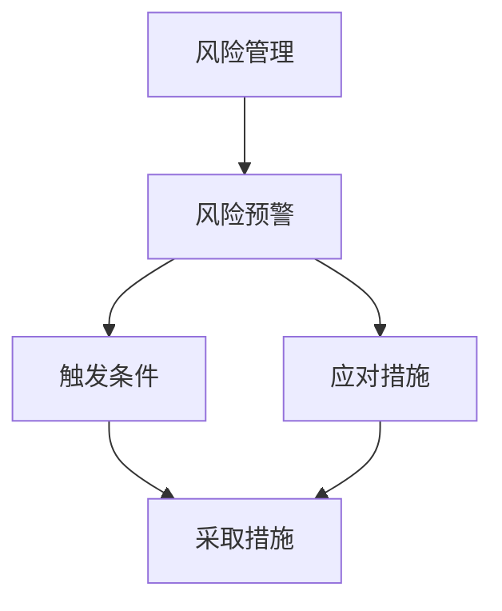

---

## 4. 费雪投资策略的数学模型与公式

### 4.1 投资标的企业价值评估模型
$$ V = \frac{EFCF}{WACC} $$
其中：
- \( V \) 为企业的内在价值
- \( EFCF \) 为企业的自由现金流
- \( WACC \) 为加权平均资本成本

### 4.2 企业竞争优势评估公式
$$ COE = \frac{ROE}{行业平均ROE} $$
其中：
- \( COE \) 为企业竞争优势指数
- \( ROE \) 为企业的净资产收益率
- 行业平均ROE 为该行业的平均净资产收益率

---

# 5. 费雪投资策略的系统分析与架构设计方案

## 5.1 项目介绍
本项目旨在构建一个基于费雪投资策略的智能投资系统，通过大数据分析和机器学习算法，帮助投资者筛选出具有强大竞争优势和成长潜力的行业龙头企业。

---

## 5.2 系统功能设计

### 5.2.1 领域模型
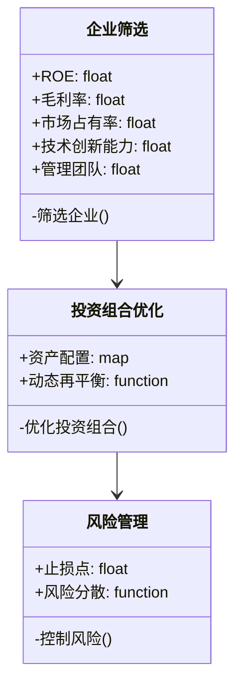

---

## 5.3 系统架构设计

### 5.3.1 系统架构


---

## 5.4 系统接口设计
- **输入接口**：接收企业的财务数据、行业数据和市场数据。
- **输出接口**：输出筛选出的投资标的和投资组合建议。

---

## 5.5 系统交互设计

### 5.5.1 用户与系统交互流程
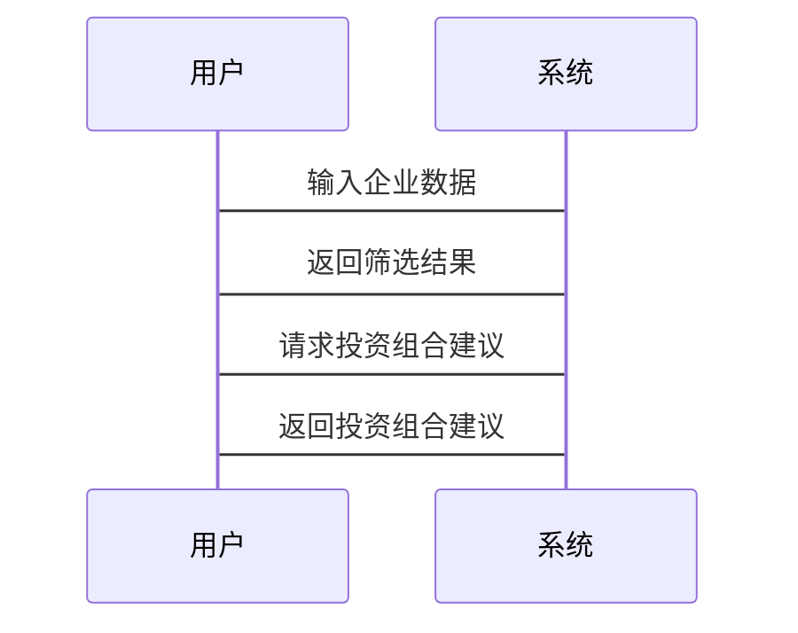

---

# 6. 费雪投资策略的项目实战

## 6.1 环境安装
- 安装Python和必要的库（如Pandas、NumPy、Scikit-learn）。

## 6.2 核心代码实现

### 6.2.1 企业筛选代码
```python
import pandas as pd

def screen_stocks(df):
    # 筛选ROE > 15% 的企业
    df = df[df['ROE'] > 15]
    # 筛选毛利率 > 20% 的企业
    df = df[df['毛利率'] > 20]
    return df

# 示例数据
data = {
    '企业名称': ['A', 'B', 'C', 'D'],
    'ROE': [20, 15, 10, 5],
    '毛利率': [25, 20, 15, 10]
}
df = pd.DataFrame(data)
result = screen_stocks(df)
print(result)
```

### 6.2.2 投资组合优化代码
```python
from sklearn.linear_model import LinearRegression

def optimize_portfolio(stocks, returns):
    model = LinearRegression()
    model.fit(stocks, returns)
    return model.predict(stocks)

# 示例数据
stocks = [[1, 2, 3], [4, 5, 6]]
returns = [0.1, 0.2]
optimized_returns = optimize_portfolio(stocks, returns)
print(optimized_returns)
```

---

## 6.3 实际案例分析
以某科技公司为例，分析其是否符合费雪投资策略的筛选标准。

---

## 6.4 项目小结
通过实战项目，我们可以看到费雪投资策略在实际应用中的有效性和可行性。通过系统的分析和优化，可以显著提高投资决策的科学性和准确性。

---

# 7. 费雪投资策略的最佳实践与投资心理

## 7.1 投资策略建议
1. **长期视角**：投资于具有强大竞争优势的企业，耐心持有。
2. **分散投资**：避免过度集中，降低风险。
3. **持续学习**：不断更新知识，适应市场变化。

## 7.2 投资心理分析
- **贪婪与恐惧**：投资者需要克服贪婪和恐惧，避免盲目跟风。
- **耐心与纪律**：坚持长期投资，严格执行投资计划。

## 7.3 长期投资的注意事项
1. **定期复查**：每年至少复查一次投资组合，根据市场变化进行调整。
2. **风险管理**：设定止损点，控制单个投资的风险。

---

# 8. 总结与展望

## 8.1 总结
费雪的行业领导者投资策略是一种系统性、科学性很强的投资方法，通过对企业基本面的深入分析和投资组合的优化，能够在复杂多变的市场环境中实现长期稳定的收益。

## 8.2 展望
随着人工智能和大数据技术的发展，费雪投资策略将更加精准和高效。未来的投资将更加依赖于数据驱动的决策，而费雪策略的核心理念——寻找具有强大竞争优势的企业——将依然指导着投资者的选择。

---

# 作者：AI天才研究院/AI Genius Institute & 禅与计算机程序设计艺术 /Zen And The Art of Computer Programming

---

以上是《费雪的行业领导者投资策略》的完整目录和文章内容，涵盖了从背景介绍、核心概念、算法原理、数学模型、系统架构到项目实战的各个方面，结合实例分析和最佳实践，为读者提供了一套系统性、实用性的投资指南。

