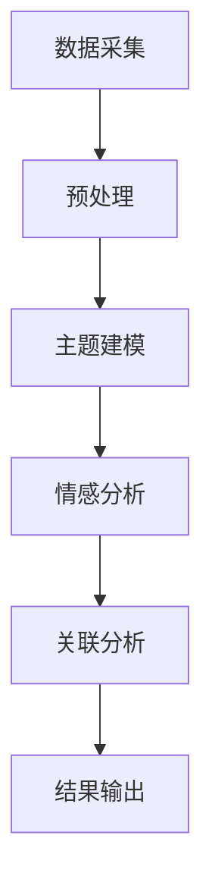
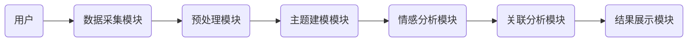

                 


# 费雪的质性分析：超越数字的公司研究方法

> 关键词：质性分析, 公司研究, 数字分析, 费雪分析, 系统架构

> 摘要：费雪的质性分析是一种超越数字的研究方法，旨在通过定性分析深入了解公司治理、战略和文化等核心要素。本文从背景、核心概念、算法原理、系统设计到项目实战，全面解析费雪质性分析的理论与实践。

---

# 第一部分：费雪质性分析的背景与核心概念

## 第1章：费雪质性分析的背景

### 1.1 问题背景
在现代企业研究中，传统的定量分析方法（如财务指标分析）虽然提供了丰富的数据支持，但往往忽略了企业的动态变化、组织文化和管理层决策等关键因素。这些因素难以通过数字量化，却对企业长期价值和风险评估具有重要意义。

### 1.2 费雪质性分析的提出
费雪的质性分析方法作为一种补充性的研究手段，强调从定性角度切入，关注企业的治理结构、战略规划、管理层素质、企业文化等非量化因素，以更全面地评估企业的潜在价值和风险。

### 1.3 解决方案
质性分析通过定性研究方法（如访谈、案例分析、文本挖掘等），结合定量数据，为企业研究提供更全面的视角。这种方法特别适用于需要深入理解企业“软实力”的场景，例如企业并购、战略制定和风险评估。

---

## 第2章：质性分析的核心概念与联系

### 2.1 核心概念
质性分析关注企业的非财务因素，包括：
- **治理结构**：董事会构成、管理层稳定性。
- **战略规划**：企业目标、竞争优势。
- **文化与价值观**：企业文化和员工价值观对企业绩效的影响。
- **管理层决策**：高管的决策风格和历史表现。

### 2.2 质性分析与其他方法的联系
质性分析并非取代定量分析，而是与之互补。通过结合两者，研究者可以构建一个更为完整的公司画像。

### 2.3 概念对比表
| 分析维度 | 定量分析 | 质性分析 |
|---------|----------|----------|
| 数据来源 | 财务报表、统计数据 | 访谈、案例研究、文本分析 |
| 分析目标 | 描述企业财务状况 | 解释企业治理、战略等软性因素 |
| 适用场景 | 短期评估、财务审计 | 长期战略、并购评估 |

### 2.4 ER实体关系图
```mermaid
erd
    entity 公司 {
        id
        名称
        行业
    }
    entity 治理结构 {
        id
        董事会构成
        高管团队
    }
    entity 战略规划 {
        id
        企业目标
        竞争优势
    }
    公司 --N 治理结构: 具有
    公司 --N 战略规划: 制定
```

---

# 第二部分：质性分析的算法原理

## 第3章：质性分析的算法原理

### 3.1 算法概述
质性分析通常涉及文本挖掘和语义分析技术，用于从非结构化数据中提取有用信息。以下是其实现步骤：

1. **数据采集**：收集企业相关的文本数据（如财报、新闻报道、管理层访谈）。
2. **预处理**：去除噪声（如停用词、标点符号）。
3. **主题建模**：使用TF-IDF或LDA模型提取主题。
4. **情感分析**：识别文本中的情感倾向。
5. **关联分析**：将主题与企业绩效相关联。

### 3.2 算法流程图


### 3.3 代码实现
以下是一个简单的主题建模示例（基于Python的`gensim`库）：
```python
from gensim import corpora, models

# 假设text为预处理后的文本数据
dictionary = corpora.Dictionary(text)
corpus = [dictionary.doc2bow(text) for text in text]

# 训练LDA模型
lda = models.LdaModel(corpus, num_topics=5, id2word=dictionary)
```

---

## 第4章：质性分析的数学模型

### 4.1 TF-IDF计算
TF-IDF（Term Frequency-Inverse Document Frequency）用于衡量关键词的重要性：
$$ \text{TF-IDF}(t, d) = \text{TF}(t, d) \times \text{IDF}(t, d) $$
其中：
- $\text{TF}(t, d)$ 表示词 $t$ 在文档 $d$ 中的频率。
- $\text{IDF}(t, d) = \log\left(\frac{N}{\text{count}(t)}\right)$，$N$为总文档数，$\text{count}(t)$为词 $t$ 出现的文档数。

### 4.2 LDA主题建模
LDA（Latent Dirichlet Allocation）是一种常用的无监督主题建模方法，其核心思想是假设每个文档由多个主题混合而成，每个主题由一组词语分布构成。

---

# 第三部分：系统分析与架构设计

## 第5章：系统分析

### 5.1 系统功能设计
以下是质性分析系统的功能模块：
- **数据采集模块**：收集企业相关的文本数据。
- **预处理模块**：对数据进行清洗和分词。
- **主题建模模块**：提取文本主题。
- **情感分析模块**：分析文本情感倾向。
- **关联分析模块**：将主题与企业绩效相关联。

### 5.2 系统架构图


---

## 第6章：项目实战

### 6.1 案例分析
假设我们要分析某家科技公司的质性因素，步骤如下：
1. 采集该公司过去5年的财报、新闻报道和高管访谈。
2. 对文本数据进行预处理。
3. 使用TF-IDF提取关键词。
4. 使用LDA进行主题建模。
5. 分析主题与公司绩效的相关性。

### 6.2 代码实现
以下是主题建模的代码示例：
```python
from gensim import corpora, models

# 假设text为预处理后的文本数据
dictionary = corpora.Dictionary(text)
corpus = [dictionary.doc2bow(text) for text in text]

# 训练LDA模型
lda = models.LdaModel(corpus, num_topics=5, id2word=dictionary)

# 输出主题
for topic in lda.print_topics():
    print(topic)
```

---

## 第7章：最佳实践与注意事项

### 7.1 最佳实践
1. **数据质量**：确保数据来源可靠，避免噪声干扰。
2. **模型选择**：根据具体需求选择合适的主题建模方法。
3. **结果验证**：通过人工验证模型输出的主题是否合理。

### 7.2 注意事项
1. 质性分析依赖于文本数据的质量，需谨慎处理数据偏差。
2. 情感分析结果需结合上下文理解，避免误判。

### 7.3 拓展阅读
- 建议深入学习文本挖掘技术，如BERT模型在情感分析中的应用。
- 关注最新的质性分析工具和技术。

---

# 第四部分：结论与展望

## 第8章：结论
费雪的质性分析通过定性方法补充了传统定量分析的不足，为企业研究提供了更全面的视角。结合文本挖掘和机器学习技术，质性分析在企业并购、战略规划等领域具有广泛的应用前景。

## 第9章：展望
随着AI技术的进步，质性分析将更加智能化和自动化。未来的研究方向可能包括：
- 更高效的文本分析算法。
- 多模态数据的融合分析。
- 实时动态的质性评估系统。

---

作者：AI天才研究院 & 禅与计算机程序设计艺术

