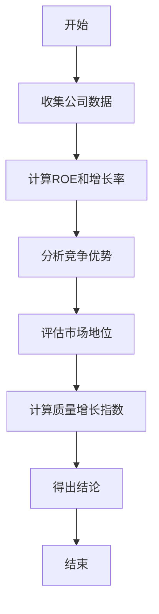

                 


# 费雪的质量增长型公司特征

## 关键词：费雪，质量增长型公司，投资理论，选股模型，财务分析，竞争优势

## 摘要：  
本文深入分析了费雪的质量增长型公司的核心特征，结合投资理论、财务分析和竞争优势等多维度，系统性地阐述了如何识别和评估质量增长型公司。通过数学模型、算法流程图和实际案例分析，本文为投资者提供了实用的选股策略和投资建议。

---

# 第一部分: 质量增长型公司的定义与背景

## 第1章: 质量增长型公司的定义与核心特征

### 1.1 质量增长型公司的定义  
质量增长型公司是指那些在行业中具有持续竞争优势、高盈利能力、稳定的财务表现以及良好市场地位的公司。与传统增长型公司相比，质量增长型公司更注重内在质量和长期可持续的增长能力。

#### 1.1.1 质量增长型公司的基本定义  
质量增长型公司不仅追求增长速度，更注重增长的质量。它们通常具有以下特征：  
- 高ROE（净资产收益率）：ROE ≥ 15%。  
- 可持续的利润增长：年均净利润增长率 ≥ 10%。  
- 强大的竞争优势：市场领先地位或技术壁垒。  

#### 1.1.2 质量增长型公司与传统增长型公司的区别  
| 特性               | 增长型公司 | 质量增长型公司 |
|--------------------|------------|----------------|
| 盈利能力           | 高增长     | 高且可持续    |
| 市场地位           | 快速扩张   | 市场领先       |
| 财务健康性         | 高负债     | 低负债         |
| 产品创新           | 迅速迭代   | 创新能力强     |
| 竞争优势           | 价格优势   | 技术或品牌优势 |

#### 1.1.3 质量增长型公司的背景与现状  
费雪的质量增长型公司理论是投资学中的重要分支，其核心在于通过分析公司的财务表现、市场地位和竞争优势，找到具有长期投资价值的公司。这一理论在全球投资实践中得到了广泛应用，并取得了显著的成果。

---

## 第2章: 质量增长型公司的核心概念与联系  

### 2.1 核心概念的原理  
质量增长型公司的核心在于其财务表现和竞争优势的结合。以下是其关键要素的详细分析：  

#### 2.1.1 质量增长型公司的核心要素  
- **财务健康性**：ROE ≥ 15%，且资产负债率 ≤ 50%。  
- **市场地位**：行业前三名，市场占有率高。  
- **竞争优势**：技术壁垒、品牌优势或成本优势。  

#### 2.1.2 质量增长型公司的关键属性特征  
- **高ROE**：ROE是衡量公司盈利能力的重要指标，质量增长型公司通常ROE较高。  
- **可持续增长**：净利润增长率保持在合理区间，避免过高或过低。  
- **竞争优势**：公司具有独特的竞争优势，能够在市场中持续盈利。  

#### 2.1.3 质量增长型公司的实体关系图  
以下是质量增长型公司与其核心属性的关系图：

```mermaid
er
    %% 质量增长型公司的实体关系图
    竞争优势
    投资价值
    质量增长型公司
    市场地位
    产品创新
    财务表现
    质量增长型公司 <--o-- 竞争优势
    质量增长型公司 <--o-- 投资价值
    质量增长型公司 <--o-- 市场地位
    质量增长型公司 <--o-- 产品创新
    质量增长型公司 <--o-- 财务表现
```

---

## 第3章: 质量增长型公司的识别与评估  

### 3.1 质量增长型公司的识别标准  
识别质量增长型公司需要从多个维度进行分析，包括财务指标、市场表现和竞争优势等。  

#### 3.1.1 财务指标分析  
- **ROE（净资产收益率）**：ROE ≥ 15%。  
- **净利润增长率**：净利润增长率 ≥ 10%。  
- **资产负债率**：资产负债率 ≤ 50%。  

#### 3.1.2 市场表现分析  
- **市盈率（P/E）**：P/E ≤ 15。  
- **市净率（P/B）**：P/B ≤ 2。  
- **市场占有率**：行业前三名。  

#### 3.1.3 竞争优势分析  
- **技术壁垒**：公司拥有核心技术或专利。  
- **品牌优势**：品牌知名度高，客户忠诚度高。  
- **成本优势**：生产成本低，具有价格竞争优势。  

---

## 第4章: 质量增长型公司的评估模型  

### 4.1 质量增长型公司的评估流程  
以下是质量增长型公司的评估流程图：



### 4.2 质量增长指数的数学模型  
质量增长指数的计算公式如下：  
$$ \text{质量增长指数} = \frac{\text{ROE} \times \text{增长率}}{\text{行业平均ROE}} $$  

---

## 第5章: 质量增长型公司的投资策略  

### 5.1 投资策略的核心思想  
质量增长型公司的投资策略以长期价值为导向，注重公司内在质量和可持续增长能力。以下是具体的投资策略：  

#### 5.1.1 筛选公司  
- 根据ROE、净利润增长率和资产负债率等指标筛选公司。  
- 筛选出ROE ≥ 15%，净利润增长率 ≥ 10%，资产负债率 ≤ 50%的公司。  

#### 5.1.2 评估竞争优势  
- 分析公司的技术壁垒、品牌优势和成本优势。  
- 确保公司具有持续的竞争优势。  

#### 5.1.3 投资组合配置  
- 将质量增长型公司与其他类型的公司进行组合投资，分散风险。  
- 根据市场环境调整投资比例，避免过度集中。  

---

## 第6章: 质量增长型公司的实际案例分析  

### 6.1 案例分析：苹果公司  
苹果公司是典型的质量增长型公司，以下是其分析：  

- **ROE**：苹果的ROE长期保持在20%以上。  
- **净利润增长率**：苹果的净利润增长率稳定在10%以上。  
- **竞争优势**：苹果拥有强大的品牌和技术壁垒，市场占有率高。  

### 6.2 案例分析：谷歌（Alphabet）  
谷歌（Alphabet）也是质量增长型公司的典范：  

- **ROE**：Alphabet的ROE保持在25%以上。  
- **净利润增长率**：净利润增长率稳定在15%左右。  
- **竞争优势**：谷歌在搜索引擎和广告市场的领先地位，技术创新能力强。  

---

## 第7章: 质量增长型公司的投资风险与注意事项  

### 7.1 投资风险分析  
- **市场风险**：市场波动可能会影响公司的股价。  
- **公司风险**：公司内部管理或竞争压力可能导致业绩下滑。  
- **财务风险**：财务杠杆过高可能会影响公司的财务健康性。  

### 7.2 投资注意事项  
- **长期持有**：质量增长型公司的投资需要长期持有，避免短期波动。  
- **分散投资**：通过组合投资分散风险，避免过度集中。  
- **持续跟踪**：定期跟踪公司的财务表现和竞争优势变化。  

---

## 第8章: 质量增长型公司的未来发展趋势  

### 8.1 未来发展趋势分析  
- **技术创新**：技术进步将继续推动质量增长型公司的发展。  
- **全球化**：全球化市场为质量增长型公司提供了更大的发展空间。  
- **可持续发展**：可持续发展理念将推动质量增长型公司向绿色经济转型。  

---

## 第9章: 总结与展望  

### 9.1 总结  
质量增长型公司是投资中的优质标的，其核心在于财务表现和竞争优势的结合。通过科学的评估模型和合理的投资策略，投资者可以在市场中找到具有长期投资价值的公司。

### 9.2 展望  
未来，随着全球经济的发展和技术的进步，质量增长型公司将迎来更多的机会和挑战。投资者需要不断学习和适应市场变化，以抓住投资机遇。

---

## 作者：AI天才研究院/AI Genius Institute & 禅与计算机程序设计艺术 /Zen And The Art of Computer Programming

