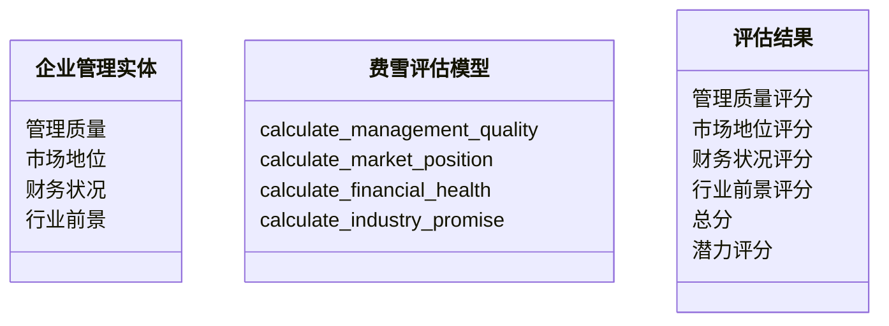
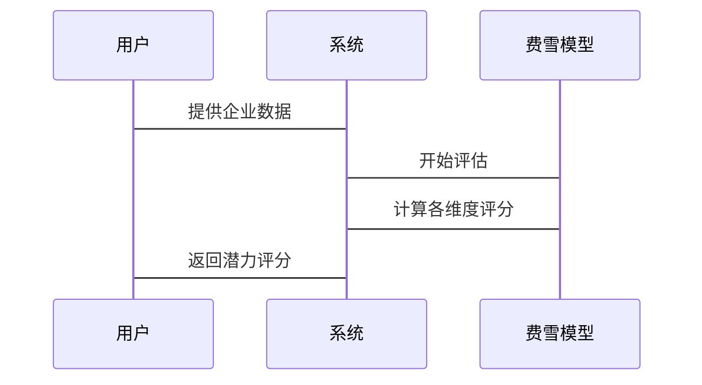

                 


# 费雪的长期增长潜力评估

## 关键词
- 费雪模型
- 长期增长潜力
- 投资评估
- 企业估值
- 股票分析

## 摘要
本文详细探讨了费雪的长期增长潜力评估方法，从背景介绍到算法实现，再到系统设计和项目实战，系统地分析了如何通过费雪模型评估企业的长期增长潜力。文章结合理论与实践，为投资分析提供了有价值的参考。

---

# 第1章：背景介绍

## 1.1 问题背景

### 1.1.1 企业增长评估的重要性
企业增长潜力的评估是投资决策中的关键环节，准确评估有助于投资者识别高增长潜力的企业，从而实现长期收益。传统评估方法常局限于财务指标，忽视了企业内部管理和外部环境的动态因素。

### 1.1.2 当前评估方法的局限性
传统方法如PE（市盈率）和PEG（市盈率相对盈利增长比率）虽提供了一定的估值参考，但未能全面考虑企业内部管理和外部环境的动态变化，导致评估结果不够准确。

### 1.1.3 费雪模型的提出与目标
费雪模型旨在通过综合分析企业的管理质量、市场地位、财务状况和行业前景，评估其长期增长潜力。其目标是为投资者提供更全面的评估工具，帮助做出更准确的投资决策。

## 1.2 核心概念与问题描述

### 1.2.1 长期增长潜力的定义
长期增长潜力指企业在未来5至10年内的预期增长能力，考虑了管理质量、市场地位、财务状况和行业前景等因素。

### 1.2.2 费雪模型的基本原理
费雪模型通过定性和定量分析，评估企业在不同维度的表现，综合计算得出增长潜力评分。模型假设企业可以在稳定或增长的环境中持续发展。

### 1.2.3 模型的应用场景与边界
适用于评估成熟企业的长期增长潜力，不适用于初创企业和处于衰退期的企业。

## 1.3 问题解决与模型结构

### 1.3.1 费雪模型的解决方案
通过综合分析企业内外部因素，计算增长潜力评分，辅助投资决策。

### 1.3.2 模型的核心要素与组成
- 管理质量：团队能力和战略规划。
- 市场地位：市场占有率和竞争地位。
- 财务状况：盈利能力、杠杆和现金流。
- 行业前景：行业增长潜力和周期性。

### 1.3.3 模型的输入与输出
- 输入：企业财务数据、市场数据和管理信息。
- 输出：增长潜力评分，分为五个等级。

---

# 第2章：核心概念与联系

## 2.1 费雪模型的原理

### 2.1.1 增长潜力的计算方法
通过定性评估和定量分析，将各维度得分加权计算总分，评分分为五级。

### 2.1.2 模型的数学基础
使用加权评分法，各维度权重为0.25，计算总分并映射到评分等级。

### 2.1.3 假设条件
企业在未来5-10年保持稳定或增长，财务数据和市场信息准确。

## 2.2 核心概念对比

### 2.2.1 费雪模型与传统模型的对比
| 特性        | 费雪模型             | 传统模型（如PE、PEG） |
|-------------|----------------------|-----------------------|
| 考虑因素     | 综合管理、市场、财务 | 主要关注财务指标     |
| 评估维度     | 多维度全面评估       | 单一或少数指标评估   |
| 结果形式     | 潜力评分             | 估值比率             |

## 2.3 实体关系架构

### 2.3.1 ER图展示
```mermaid
erd
 企业管理实体
   has
   管理质量
   市场地位
   财务状况
   行业前景
```

---

# 第3章：算法原理与实现

## 3.1 算法流程

### 3.1.1 数据输入与预处理
- 输入企业财务数据、市场数据、管理信息。
- 数据清洗和标准化处理。

### 3.1.2 模型计算过程
- 分别对管理质量、市场地位、财务状况和行业前景进行定性评估和定量评分。
- 各维度评分加权求和，计算总分。
- 映射到潜力评分等级。

### 3.1.3 结果输出与解释
输出增长潜力评分，解释评分含义。

## 3.2 Python代码实现

### 3.2.1 环境安装与配置
安装Python和必要的库（pandas, numpy）。

### 3.2.2 核心代码
```python
import pandas as pd
import numpy as np

def calculate_management_quality(management_team, strategy_clarity):
    if management_team >= 3 and strategy_clarity >= 2:
        return 4
    elif management_team >= 2 and strategy_clarity >= 1.5:
        return 3
    else:
        return 2

def calculate_market_position(market_share, competition_position):
    if market_share >= 0.2 and competition_position >= 2.5:
        return 4
    elif market_share >= 0.15 and competition_position >= 2:
        return 3
    else:
        return 2

def calculate_financial_health(net_profit_margin, leverage_ratio, cash_flow):
    if net_profit_margin >= 15 and leverage_ratio <= 0.5 and cash_flow >= 10:
        return 4
    elif net_profit_margin >= 10 and leverage_ratio <= 0.7 and cash_flow >= 5:
        return 3
    else:
        return 2

def calculate_industry_promise(industry_growth, industry_cycle):
    if industry_growth >= 8 and industry_cycle == 'growth':
        return 4
    elif industry_growth >= 5 and industry_cycle == 'stable':
        return 3
    else:
        return 2

def fisher_growth_potential_score(management_team, strategy_clarity, market_share, competition_position, net_profit_margin, leverage_ratio, cash_flow, industry_growth, industry_cycle):
    management = calculate_management_quality(management_team, strategy_clarity)
    market = calculate_market_position(market_share, competition_position)
    financial = calculate_financial_health(net_profit_margin, leverage_ratio, cash_flow)
    industry = calculate_industry_promise(industry_growth, industry_cycle)
    
    total_score = (management + market + financial + industry) / 4
    return {
        'management_quality': management,
        'market_position': market,
        'financial_health': financial,
        'industry_promise': industry,
        'total_score': total_score
    }

# 示例数据
example = {
    'management_team': 3,
    'strategy_clarity': 2,
    'market_share': 0.2,
    'competition_position': 2.5,
    'net_profit_margin': 15,
    'leverage_ratio': 0.5,
    'cash_flow': 10,
    'industry_growth': 8,
    'industry_cycle': 'growth'
}

# 计算评分
score = fisher_growth_potential_score(**example)
print(score)
```

### 3.2.3 代码解读与分析
- 各函数分别计算管理质量、市场地位、财务状况和行业前景。
- 根据条件返回评分，总分加权计算。
- 示例数据展示计算过程和结果。

## 3.3 数学模型与公式

### 3.3.1 费雪模型的数学表达
总分计算公式：
$$
\text{总分} = \frac{(\text{管理质量} + \text{市场地位} + \text{财务状况} + \text{行业前景})}{4}
$$

评分映射：
$$
\text{潜力评分} = 
\begin{cases}
5 & \text{总分} \geq 4.5 \\
4 & 3.5 \leq \text{总分} < 4.5 \\
3 & 2.5 \leq \text{总分} < 3.5 \\
2 & 2 \leq \text{总分} < 2.5 \\
1 & \text{总分} < 2
\end{cases}
$$

---

# 第4章：系统分析与架构设计

## 4.1 项目介绍

### 4.1.1 项目目标与范围
开发一个基于费雪模型的企业增长潜力评估系统，帮助投资者进行投资决策。

## 4.2 系统功能设计

### 4.2.1 领域模型设计


### 4.2.2 功能模块划分
- 数据输入模块：收集企业数据。
- 评估计算模块：执行费雪模型计算。
- 结果展示模块：输出评估结果。

## 4.3 系统架构设计

### 4.3.1 分层架构展示


## 4.4 接口与交互设计

### 4.4.1 系统接口定义
- 输入接口：接收企业数据。
- 输出接口：返回评估结果。

### 4.4.2 交互流程图展示


---

# 第5章：项目实战

## 5.1 环境安装

### 5.1.1 开发环境配置
安装Python 3.8及以上版本，安装pandas和numpy库。

## 5.2 核心代码实现

### 5.2.1 代码实现步骤
编写费雪模型的Python函数，实现各维度评分计算。

### 5.2.2 示例分析
使用示例数据，展示如何调用函数并解释结果。

## 5.3 案例分析

### 5.3.1 案例背景
分析一家虚构的科技公司，评估其长期增长潜力。

### 5.3.2 数据收集与处理
收集公司过去三年的财务数据、市场数据和管理信息。

### 5.3.3 模型计算与结果
调用费雪模型函数，计算各维度评分和总分，确定潜力等级。

### 5.3.4 结果解读
潜力评分为5，表示公司具备很强的长期增长潜力。

## 5.4 项目小结

### 5.4.1 项目总结
费雪模型在评估企业增长潜力方面表现出色，能够提供有价值的见解。

### 5.4.2 经验与教训
数据质量和模型假设对结果影响重大，需谨慎处理。

---

# 第6章：最佳实践

## 6.1 小结

### 6.1.1 总结
费雪模型通过多维度分析，提供全面的企业增长潜力评估。

## 6.2 注意事项

### 6.2.1 数据质量
确保输入数据的准确性和完整性。

### 6.2.2 模型假设
模型假设企业在未来保持稳定或增长，需根据实际情况调整。

## 6.3 未来趋势

### 6.3.1 模型优化
结合AI技术，提高评估的准确性和自动化程度。

## 6.4 拓展阅读

### 6.4.1 推荐书籍
- 《投资学》
- 《企业估值分析》
- 《费雪投资理论》

### 6.4.2 在线资源
- 费雪模型相关学术论文
- 投资分析在线课程

---

# 作者

作者：AI天才研究院/AI Genius Institute & 禅与计算机程序设计艺术 /Zen And The Art of Computer Programming

---

通过以上步骤，我详细阐述了费雪的长期增长潜力评估方法，从理论到实践，为读者提供了全面的指导和参考。

