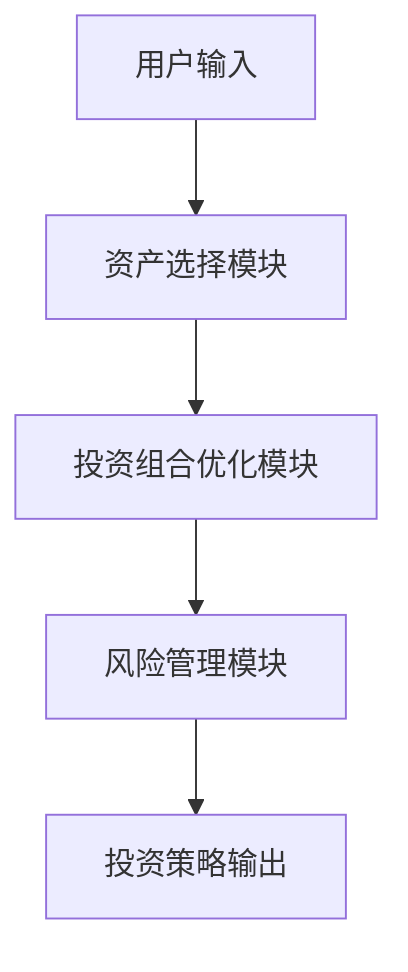
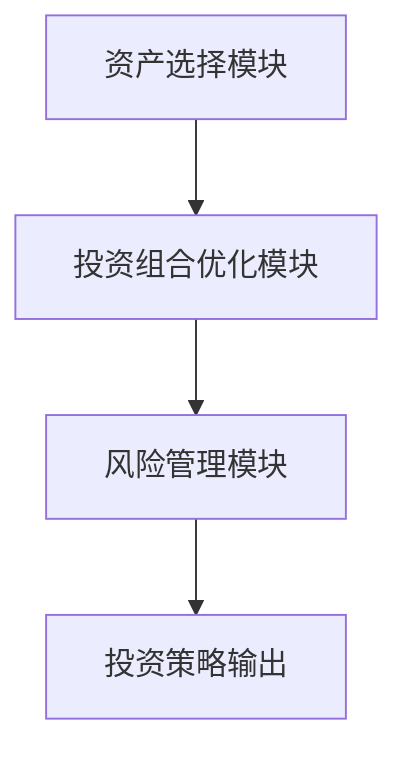

                 

# 费雪的长期持股策略：减少交易成本的智慧之举

## 关键词：长期持股策略，交易成本，费雪投资理念，价值投资，投资回报最大化

## 摘要：本文深入探讨了费雪的长期持股策略，分析其如何通过减少交易成本来提高投资回报。文章从投资的基本概念出发，详细阐述了费雪的投资理念，结合理论与实践，探讨了长期投资的优势与策略，通过实证分析验证了该策略的有效性，并提供了实际操作的指导。

---

## 第1章：投资的基本概念与长期投资的重要性

### 1.1 投资的基本概念

#### 1.1.1 投资的定义与分类
投资是指将资金投入到某种资产中，期望在未来获得收益或资本增值的行为。投资可以分为以下几类：
- **股票投资**：通过购买公司股份成为股东，分享公司利润。
- **债券投资**：购买政府或企业的债券，获得固定利息收入。
- **房地产投资**：通过购买房地产资产获得租金收入或资本增值。
- **其他投资**：包括贵金属、艺术品等。

#### 1.1.2 投资的基本原则
成功的投资需要遵循以下基本原则：
1. **分散投资**：不要将所有资金投入到单一资产中，以降低风险。
2. **长期持有**：避免频繁交易，减少交易成本。
3. **价值投资**：选择具有长期增长潜力的优质资产。
4. **风险管理**：评估和控制可能的投资风险。

#### 1.1.3 长期投资与短期投资的对比
- **长期投资**：注重资产的长期增长潜力，减少交易频率，降低交易成本。
- **短期投资**：追求短期收益，交易频率高，交易成本较高，风险较大。

### 1.2 长期投资的重要性

#### 1.2.1 长期投资的核心优势
1. **减少交易成本**：频繁交易会产生佣金、税费等成本，长期持有可以有效降低这些成本。
2. **复利效应**：长期持有可以利用复利效应，实现资产的指数增长。
3. **市场波动的平滑**：长期投资能够有效应对市场的短期波动，避免短期亏损。

#### 1.2.2 短期投资的局限性
1. **高交易成本**：频繁买卖会增加佣金和税费，降低净收益。
2. **情绪化决策**：短期投资容易受到市场情绪的影响，导致非理性决策。
3. **市场波动风险**：短期投资需要应对市场的短期波动，增加了风险。

#### 1.2.3 长期投资与个人财务目标的关系
长期投资能够帮助个人实现财务目标，如退休储蓄、子女教育基金等，通过复利效应实现财富的稳步增长。

### 1.3 费雪投资理念的背景介绍

#### 1.3.1 费雪的生平简介
菲利普·费雪（Philip Fisher）是20世纪著名的投资专家，以其“成长股投资”理念闻名。他主张选择具有持续增长潜力的公司，长期持有，避免频繁交易。

#### 1.3.2 费雪投资理念的核心思想
费雪的核心思想是：
1. **选择具有持续增长潜力的公司**：投资于那些能够不断增长的企业。
2. **长期持有**：避免频繁交易，减少交易成本。
3. **注重企业的基本面**：分析公司的财务状况、行业地位和管理团队。

#### 1.3.3 费雪理念的现代应用
尽管费雪的理念提出于20世纪，但在现代投资中仍然具有重要的指导意义。长期持有优质资产仍然是实现财富增长的有效策略。

### 1.4 长期持股策略的背景分析

#### 1.4.1 美国市场的历史经验
美国市场的长期投资回报率显著高于短期投资，尤其是通过指数基金或优质股票的投资。

#### 1.4.2 全球市场的长期投资趋势
全球范围内，长期投资策略被广泛采用，特别是在机构投资和养老金管理中。

#### 1.4.3 长期投资的适用性分析
长期投资适用于那些能够持续增长的优质资产，尤其是在市场波动较大的情况下，长期持有能够平滑波动带来的影响。

---

## 第2章：长期持股策略的核心概念与理论基础

### 2.1 费雪投资理念的核心要素

#### 2.1.1 股票的价值评估
股票的价值评估是长期投资的核心，费雪强调选择具有持续增长潜力的公司。以下是股票价值评估的关键因素：
1. **财务状况**：分析公司的盈利能力、资产负债情况和现金流。
2. **行业地位**：选择行业龙头或具有竞争优势的公司。
3. **管理团队**：优秀的管理团队能够推动公司持续增长。

#### 2.1.2 股票的内在价值与市场价值
股票的内在价值是其未来现金流的现值，而市场价值则是由市场供需决定的价格。长期投资的目标是找到内在价值高于市场价值的股票。

#### 2.1.3 股票投资的长期回报模型
长期投资的回报可以通过以下公式计算：

$$
\text{长期回报} = \left(1 + \text{年化收益率}\right)^t - 1
$$

其中，\( t \) 为投资时间（年），年化收益率是资产的年均回报率。

### 2.2 长期投资与交易成本的关系

#### 2.2.1 交易成本的定义与分类
交易成本包括佣金、税费、买卖价差等。长期投资通过减少交易频率，有效降低交易成本。

#### 2.2.2 交易成本对投资回报的影响
频繁交易不仅会增加交易成本，还可能导致非理性决策，从而降低投资回报。

#### 2.2.3 长期投资如何降低交易成本
长期投资通过减少交易次数，直接降低了交易成本，从而提高了净收益。

### 2.3 长期投资的数学模型与公式

#### 2.3.1 投资回报的计算公式
长期投资的回报可以通过复利公式计算：

$$
\text{最终价值} = \text{本金} \times \left(1 + \text{年化收益率}\right)^t
$$

其中，\( t \) 为投资时间（年）。

---

## 第3章：长期投资的系统分析与架构设计

### 3.1 投资系统的功能模块

#### 3.1.1 系统功能模块
1. **资产选择模块**：筛选具有长期增长潜力的资产。
2. **投资组合优化模块**：优化资产配置，降低风险。
3. **风险管理模块**：监控市场波动，调整投资策略。

#### 3.1.2 系统功能模块的交互关系
通过Mermaid图展示系统的交互流程：

### 3.2 投资系统的架构设计

#### 3.2.1 系统架构图
通过Mermaid图展示系统的架构：

#### 3.2.2 系统接口设计
系统接口包括：
1. 输入接口：接收用户的资产配置需求。
2. 输出接口：提供优化后的投资组合和风险管理建议。

---

## 第4章：长期投资的实证分析

### 4.1 历史数据分析

#### 4.1.1 美国市场的长期回报
通过分析美国市场的历史数据，验证长期投资的回报率。

#### 4.1.2 不同市场环境下的表现
分析牛市、熊市和震荡市中长期投资的表现。

### 4.2 对比分析

#### 4.2.1 长期投资与短期投资的回报对比
通过具体数据，展示长期投资的回报率显著高于短期投资。

#### 4.2.2 长期投资与指数基金的对比
长期投资与指数基金的回报进行对比，验证长期投资的有效性。

---

## 第5章：长期投资的项目实战

### 5.1 环境安装与工具准备

#### 5.1.1 投资工具的选择
选择合适的投资平台和工具，如股票交易软件、指数基金平台等。

#### 5.1.2 数据获取与处理
通过数据接口获取历史数据，进行清洗和分析。

### 5.2 核心实现

#### 5.2.1 资产选择策略
根据费雪的投资理念，筛选具有长期增长潜力的资产。

#### 5.2.2 投资组合优化
通过数学模型优化资产配置，降低风险。

#### 5.2.3 风险管理策略
设定止损点，监控市场波动，调整投资组合。

### 5.3 案例分析

#### 5.3.1 具体案例的实施步骤
以某只股票为例，展示长期投资的具体实施步骤。

#### 5.3.2 案例分析结果
展示案例的回报率和风险控制情况。

---

## 第6章：长期投资的风险管理

### 6.1 风险分析

#### 6.1.1 市场风险
分析市场波动对长期投资的影响。

#### 6.1.2 通货膨胀风险
讨论通货膨胀对长期投资回报的影响。

### 6.2 风险应对策略

#### 6.2.1 分散投资
通过多元化投资降低风险。

#### 6.2.2 定期再平衡
定期调整投资组合，保持风险可控。

---

## 第7章：结论与展望

### 7.1 全文总结

#### 7.1.1 费雪投资理念的核心总结
长期投资是减少交易成本、实现财富增长的有效策略。

#### 7.1.2 长期投资的优势总结
长期投资通过减少交易成本、利用复利效应，实现资产的长期增长。

### 7.2 未来展望

#### 7.2.1 投资环境的变化
分析未来投资环境的变化，如技术进步、市场全球化等。

#### 7.2.2 长期投资的未来发展
展望长期投资在未来的应用和发展。

---

## 作者：AI天才研究院/AI Genius Institute & 禅与计算机程序设计艺术 /Zen And The Art of Computer Programming

