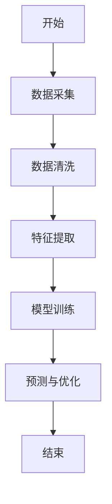
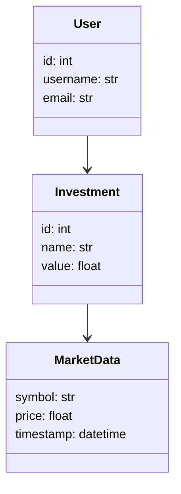
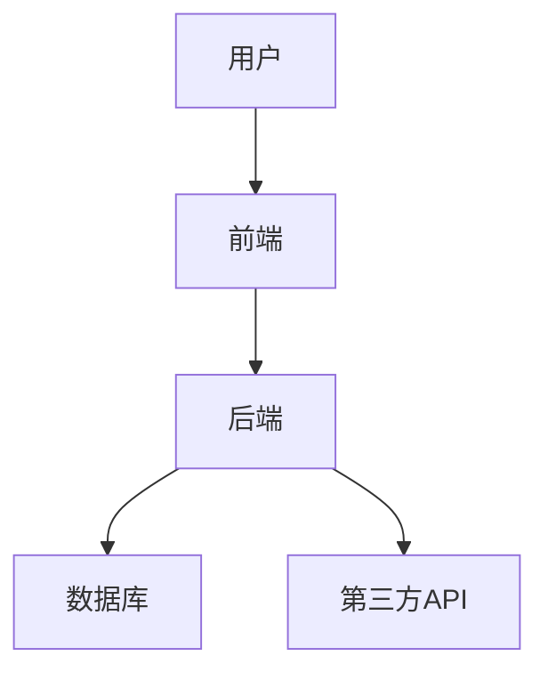
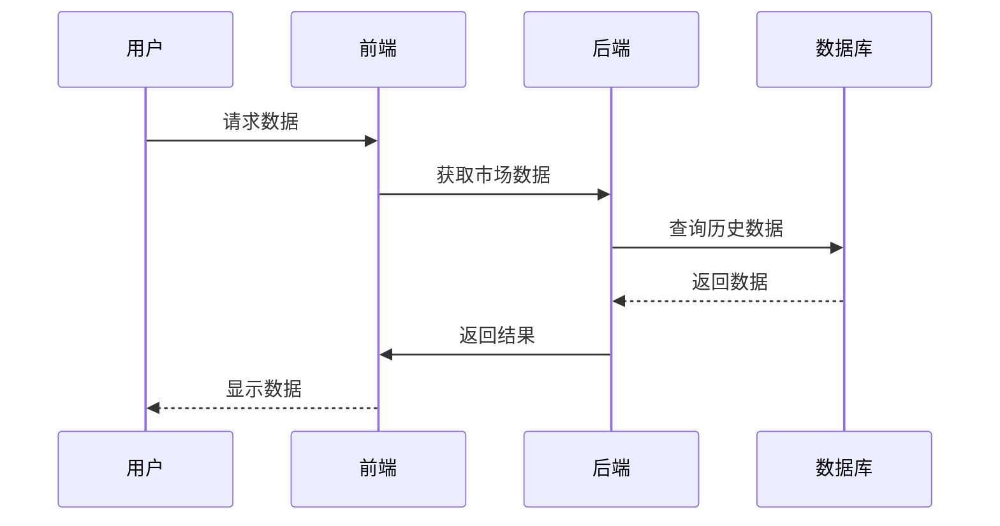

                 


# 跨平台投資理財智能助手的開發技巧

> **关键词**：跨平台开发、投资理财、人工智能、React Native、Flutter、机器学习、智能助手  
> **摘要**：本文探讨跨平台开发技术在投资理财智能助手中的应用，涵盖背景、技术选择、算法设计、系统架构、项目实战和最佳实践。

---

## 第一部分：跨平台投资理财智能助手概述

### 第1章：跨平台投资理财智能助手的背景与目标

#### 1.1 问题背景与目标

- **1.1.1 投资理财领域的痛点分析**  
  随着金融市场的复杂化，投资者需要实时数据分析、个性化建议和多平台访问。传统工具功能单一，难以满足跨平台需求。

- **1.1.2 跨平台开发的必要性**  
  用户希望在不同设备上使用同一工具，降低开发成本，提高效率。

- **1.1.3 智能助手的核心目标**  
  提供实时数据监控、智能投资建议和个性化服务，帮助用户优化投资决策。

#### 1.2 投資理財智能助手的定義與核心要素

- **1.2.1 定義与功能定位**  
  智能助手通过AI技术分析数据，提供投资建议，支持多平台使用。

- **1.2.2 核心要素与模块划分**  
  包括数据采集、分析、建议生成、用户界面和跨平台支持。

- **1.2.3 边界与外延**  
  专注于投资理财，不涉及交易执行。

#### 1.3 目標用戶與市場現狀

- **1.3.1 目標用戶分析**  
  高净值个人、机构投资者和理财新手。

- **1.3.2 市場現狀與发展趋势**  
  金融科技兴起，智能投顾需求增长，移动端使用率高。

#### 1.4 跨平台開發的技术優勢

- **1.4.1 跨平台開發的核心優勢**  
  降低开发成本，提高代码复用性。

- **1.4.2 技術实现的可行性分析**  
  React Native和Flutter适合跨平台开发，支持多种设备。

#### 1.5 開發挑戰與解決方案

- **1.5.1 跨平台开发的主要挑战**  
  性能优化、用户体验一致性和平台兼容性。

- **1.5.2 解決方案概述**  
  使用React Native或Flutter框架，优化代码结构，统一设计规范。

---

## 第二部分：跨平台開發技術與實現

### 第2章：跨平台開發技術概述

#### 2.1 跨平台開發的核心技術

- **2.1.1 React Native與Flutter的对比分析**

| 技术对比 | React Native | Flutter |
|----------|---------------|----------|
| 开发语言 | JavaScript     | Dart      |
| 性能     | 基于React      | 渲染引擎 |
| 社区     | 成熟           | 增长快    |

- **2.1.2 跨平台開發框架的選擇依據**  
  项目需求、团队技能、平台支持和社区活跃度。

#### 2.2 跨平台開發的實現原理

- **2.2.1 跨平台架構的實現機制**  
  使用跨平台框架封装原生组件，实现统一代码库。

- **2.2.2 跨平台组件的復用策略**  
  设计通用组件，适配不同平台。

#### 2.3 跨平台開發的優缺勢分析

- **2.3.1 优势分析**  
  成本降低，开发效率提升。

- **2.3.2 局限性与解决方案**  
  性能优化和用户体验一致性的挑战，通过代码优化和设计规范统一解决。

---

## 第三部分：AI在投資理財中的應用

### 第3章：AI在投資理財中的核心算法與實現

#### 3.1 AI技術在投資理財中的核心算法

- **3.1.1 算法原理**  
  使用机器学习模型分析市场数据，预测趋势，提供投资建议。

- **3.1.2 算法流程**  
  1. 数据采集：实时数据获取。  
  2. 数据清洗：处理异常值。  
  3. 特征提取：选择关键指标。  
  4. 模型训练：使用监督学习算法。  
  5. 预测与优化：生成投资策略。

- **3.1.3 算法實現的mermaid流程圖**



- **3.1.4 Python代码实现**

```python
import pandas as pd
from sklearn.model import LinearRegression

# 数据处理
data = pd.read_csv('data.csv')
X = data[['feature1', 'feature2']]
y = data['target']

# 模型训练
model = LinearRegression()
model.fit(X, y)

# 预测
new_data = pd.DataFrame({'feature1': [value1], 'feature2': [value2]})
prediction = model.predict(new_data)
```

- **3.1.5 数学模型与公式**

$$ y = \beta_0 + \beta_1x_1 + \beta_2x_2 + \epsilon $$

### 第4章：數據處理及風控模型

#### 4.1 資料處理與特征工程

- **4.1.1 資料來源**  
  第三方API和用户输入。

- **4.1.2 数据清洗**  
  去重、处理缺失值、异常值。

- **4.1.3 特征選擇**  
  使用相关性分析和特征重要性评估。

#### 4.2 投資風險評估模型

- **4.2.1 風險評估指標**  
  VaR、波动率、夏普比率。

- **4.2.2 预測模型**

$$ \text{VaR} = \mu + z \cdot \sigma $$

- **4.2.3 模型实现**

```python
import numpy as np
from sklearn.metrics import mean_squared_error

def risk_assessment(y_true, y_pred):
    mse = mean_squared_error(y_true, y_pred)
    rmse = np.sqrt(mse)
    return rmse
```

---

## 第四部分：系統分析與架構設計

### 第5章：系統架構與設計方案

#### 5.1 系統功能設計

- **5.1.1 領域模型mermaid類圖**



#### 5.2 系統架構設計

- **5.2.1 分層架構**



#### 5.3 接口設計與交互流程

- **5.3.1 接口定義**

```json
{
  "type": "object",
  "properties": {
    "symbol": { "type": "string" },
    "price": { "type": "number" }
  }
}
```

- **5.3.2 交互流程mermaid序列圖**



---

## 第五部分：項目實戰

### 第6章：項目實戰與實現細節

#### 6.1 開發環境安裝

- **React Native/Firebase/Python环境搭建**

```bash
# 安装React Native
npm install -g react-native-cli

# 安装Python和相关库
pip install numpy pandas scikit-learn
```

#### 6.2 核心功能實現

- **用户界面开发**

```javascript
// React Native组件
function InvestmentTracker({ marketData }) {
  return (
    <View>
      <Text>当前价格: {marketData.price}</Text>
      <Button onPress={() => /* 分析 */} />
    </View>
  );
}
```

- **后端API开发**

```python
@app.route('/predict', methods=['POST'])
def predict():
    data = request.json
    model = load_model('model.h5')
    prediction = model.predict(data)
    return jsonify({'prediction': prediction.tolist()})
```

#### 6.3 代码实现與分析

- **数据处理代码**

```python
import pandas as pd

data = pd.read_csv('data.csv')
data.dropna(inplace=True)
data.to_csv('cleaned_data.csv', index=False)
```

- **模型训练代码**

```python
from sklearn.linear_model import LinearRegression

model = LinearRegression()
model.fit(X_train, y_train)
```

---

## 第六部分：最佳實踐與優化

### 第7章：最佳實踐與經驗總結

#### 7.1 開發經驗總結

- **性能优化**：优化React Native组件，减少渲染开销。

- **用户体验**：保持界面简洁，提升交互反馈。

#### 7.2 風險提示與注意事項

- **数据安全**：确保用户数据加密传输和存储。

- **法律合规**：遵守金融监管规定，明确责任边界。

#### 7.3 拓展閱讀與進一步學習

- 推荐书籍：《Python机器学习实战》、《React Native权威指南》。
- 在线资源：官方文档、技术博客、开发者社区。

---

## 作者信息

作者：AI天才研究院（AI Genius Institute） & 禅与计算机程序设计艺术（Zen And The Art of Computer Programming）

---

以上是《跨平台投资理财智能助手的开发技巧》的技术博客文章的详细目录和内容结构，涵盖了从背景到实现的各个方面，确保内容全面且专业。

